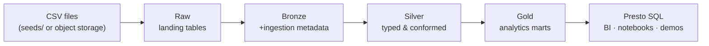
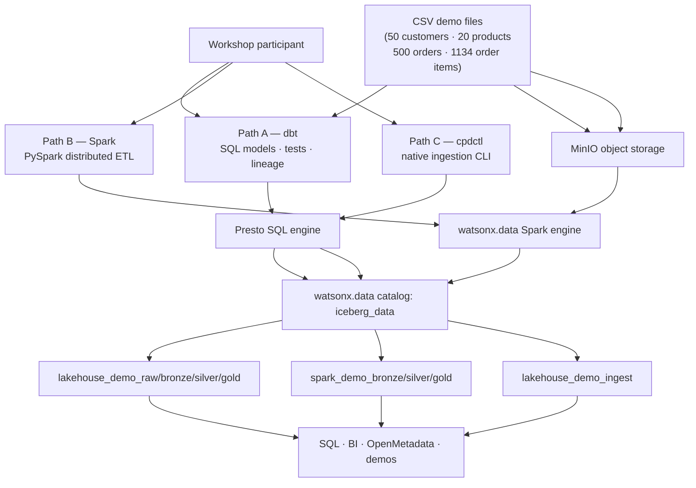

# watsonx.data Ingestion Workshop — dbt · Spark · cpdctl

A hands-on demo showing three ways to load and transform data in an IBM watsonx.data lakehouse.
The same four CSV files (customers, products, orders, order items) flow through the Bronze → Silver → Gold
medallion pattern via dbt, Spark, and cpdctl. No prior watsonx.data experience needed.

---

## Quick Start (5 commands)

```bash
git clone <repo-url> && cd ibmas-watsonxdata-dbt
python3.11 -m venv .venv && source .venv/bin/activate
pip install -r requirements.txt
python scripts/prepare_watsonx_env.py     # reads watsonx_data/instance_details.json
bash scripts/dbt_env.sh run               # runs the full dbt medallion pipeline
```

!!! info "Python version"
    Python 3.11 is required. Python 3.14 currently breaks dbt through a transitive dependency.

---

## What You Will Build

Three independent ingestion paths — all writing to the same `iceberg_data` catalog, all using Iceberg table format and MinIO object storage, all queryable through the Presto SQL engine.

| Path | Tool | Schemas written | Gold objects created |
|------|------|-----------------|----------------------|
| **A — dbt** | dbt + Presto (SQL) | `lakehouse_demo_raw/bronze/silver/gold` | `gold_daily_sales` (table), `gold_category_performance` (view), `gold_customer_360` (view) |
| **B — Spark** | PySpark on watsonx.data Spark engine | `spark_demo_bronze/silver/gold` | `spark_gold_daily_sales` (table), `spark_gold_category_performance` (view), `spark_gold_customer_360` (table) |
| **C — cpdctl** | IBM cpdctl CLI (native ingestion service) | `lakehouse_demo_ingest` | `customers`, `products`, `orders`, `order_items` |

The paths write to separate schemas so you can compare them side by side without one overwriting another.

!!! tip "Which path to lead with?"
    Lead with **dbt** when the story is governed SQL analytics. Use **Spark** when the story includes distributed ingestion or large-scale ETL. Use **cpdctl** when you want to show the built-in ingestion jobs that appear in the watsonx.data console under **Data manager → Ingestion (history)**.

---

## The Medallion Pattern

The medallion pattern organises data by quality — raw CSV arrives first, then each layer refines it further until it is ready for analytics.



| Layer | Plain-language description | Format |
|-------|---------------------------|--------|
| Raw | Original CSV payload, unchanged, for traceability | dbt seeds / direct CSV read |
| Bronze | First managed copy in the lakehouse; adds `_ingested_at`, `_source_file`, `_ingest_batch_id` | Iceberg PARQUET table |
| Silver | Typed, cleaned, conformed entities; validated with dbt tests; orders partitioned by `order_date` | Iceberg PARQUET table |
| Gold | Business-facing aggregates ready for SQL, BI, or demos | Table or view (see path) |

The three paths handle Raw differently:

```text
dbt path:   seeds/ CSV → lakehouse_demo_raw → bronze → silver → gold
Spark path: object storage CSV → spark_demo_bronze → silver → gold
cpdctl:     seeds/ CSV → lakehouse_demo_ingest (single-step, no medallion)
```

---

## Three Paths Compared



| Tool | Language | Best for | Docs |
|------|----------|----------|------|
| dbt | SQL | Governed transformations, tests, lineage, repeatable analytics models | [dbt-watsonx-presto adapter](https://docs.getdbt.com/docs/core/connect-data-platform/watsonx-presto-setup) |
| Spark | Python (PySpark) | Large-scale ingestion, complex ETL, ML feature engineering, file processing | [watsonx.data Spark docs](https://www.ibm.com/docs/en/watsonx/watsonxdata) |
| cpdctl | CLI (YAML/REST) | Built-in ingestion jobs tracked in the watsonx.data UI console | [cpdctl reference](https://github.com/IBM/cpdctl) |

---

## Documentation Site (MkDocs)

After cloning and installing dependencies, serve the full beginner-friendly docs locally.

```bash
mkdocs serve
# -> http://127.0.0.1:8000
```

`mkdocs serve` watches `docs/` and `mkdocs.yml` — edits appear instantly in the browser.
To use a different port: `mkdocs serve -a 127.0.0.1:8123`.

```bash
mkdocs build           # static output in ./site (git-ignored)
mkdocs build --strict  # fail on broken links or warnings — use in CI
```

What the docs site covers:

- **Overview** — watsonx.data, dbt, Spark, Iceberg, and the medallion pattern in plain words
- **Architecture & Lineage** — full medallion design with a column-by-column lineage diagram
- **Setup** — virtual environment, `.env`, certificates, dbt profiles
- **dbt path** — seed, run, test, query gold
- **Spark path** — upload assets, submit job, query Spark gold tables
- **cpdctl / native ingestion** — install, configure, run ingestion jobs
- **SQL demo** — copy-paste Presto queries for every layer
- **OpenMetadata** — lineage UI walkthrough
- **Glossary, File Guide, Troubleshooting**

---

## OpenMetadata (dbt Lineage UI)

OpenMetadata is an open-source data catalog that reads the JSON files dbt produces and draws the Bronze → Silver → Gold lineage graph in a browser UI. No live Presto connection is needed for the catalog UI — it only reads dbt artifact files.

```bash
# Start OpenMetadata in Docker (first run downloads ~3 GB, takes 5-10 min)
mkdir -p openmetadata
curl -fsSL \
  "https://github.com/open-metadata/OpenMetadata/releases/download/1.13.0-release/docker-compose.yml" \
  -o openmetadata/docker-compose.yml
docker compose -f openmetadata/docker-compose.yml up --detach

# Wait until the server is ready (~3-5 min)
until curl -sf http://localhost:8585/api/v1/system/version; do sleep 20; done

# Generate dbt artifacts and run ingestion (re-runnable after every dbt run)
bash scripts/dbt_env.sh docs generate --no-compile
cp target/manifest.json target/catalog.json target/run_results.json openmetadata/dbt-artifacts/
source .venv/bin/activate
bash openmetadata/ingestion/run-ingestion.sh
```

Open **http://localhost:8585** and log in with `admin@open-metadata.org` / `admin`.

Navigate to **Explore → Databases → watsonxdata-presto → iceberg_data → lakehouse_demo_gold → gold_daily_sales → Lineage** to see the full medallion graph.

```bash
# Stop OpenMetadata when done
docker compose -f openmetadata/docker-compose.yml down
```

!!! note "Version"
    This repo is tested against OpenMetadata 1.13.0. The full walkthrough is in `docs/openmetadata.md`.

---

## Prerequisites

Before cloning, confirm you have:

- [ ] **Python 3.11** — `python3.11 --version`
- [ ] **Git** — `git --version`
- [ ] **Docker Desktop** — running (needed for OpenMetadata only)
- [ ] **watsonx.data credentials** — API key, Presto host, instance ID, and the connection JSON exported from the watsonx.data console
- [ ] **OpenShift CLI (`oc`)** — needed for MinIO port-forward (Spark and cpdctl paths)

!!! info "Connection JSON"
    Export the Presto connection JSON from the watsonx.data console and save it as `watsonx_data/instance_details.json`.
    Then run `python scripts/prepare_watsonx_env.py` — it populates `.env` and writes `certs/watsonxdata-ca.pem` automatically.

---

## Security Note

Do not commit watsonx.data API keys. Put credentials in your shell environment or a local `.env` file (which is git-ignored). If an API key was pasted into chat or committed anywhere, rotate it before customer demos.
