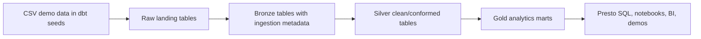

# watsonx.data dbt medallion demo

This repo is a small customer demo for dbt on IBM watsonx.data with a Presto engine and a lakehouse catalog. It loads demo ecommerce data into a raw landing layer, adds ingestion metadata in bronze, transforms it into typed silver tables, and publishes gold marts for analytics.

The default Presto/dbt catalog is `iceberg_data`. Set `WXD_CATALOG=hive_data` if you want to run the same demo against the Hive catalog instead. Gold models are views by default; set `WXD_GOLD_MATERIALIZED=table` if you want physical gold marts for a performance-oriented demo.

## Architecture



Default schemas:

- `lakehouse_demo_raw`
- `lakehouse_demo_bronze`
- `lakehouse_demo_silver`
- `lakehouse_demo_gold`

Set `WXD_SCHEMA` to change the prefix, or set `WXD_BRONZE_SCHEMA`, `WXD_SILVER_SCHEMA`, and `WXD_GOLD_SCHEMA` explicitly.

The demo sets `WXD_SCHEMA_LOCATION_BASE=s3a://iceberg-bucket/lakehouse_demo` for Iceberg schema/table locations. For `hive_data`, change it to `s3a://hive-bucket/lakehouse_demo`. The bootstrap creates layer-specific locations below the base path.

## Security note

Do not commit watsonx.data API keys. Put credentials in your shell environment or a local `.env` file. If an API key was pasted into chat or committed anywhere, rotate it before customer demos.

## Setup

Create a local Python 3.11 virtual environment:

```bash
python3.11 -m venv .venv
source .venv/bin/activate
python -m pip install --upgrade pip
python -m pip install -r requirements.txt
```

Python 3.11 is recommended for this demo. Python 3.14 currently breaks dbt through a transitive dependency during startup.

The `requirements.txt` file installs dbt Core, `dbt-watsonx-presto`, `presto-python-client`, `trino`, and `python-dotenv`.

This project profile uses `type: watsonx_presto`, matching the IBM watsonx.data dbt adapter configuration.

Copy the example profile into your dbt profiles directory:

```bash
mkdir -p ~/.dbt
cp profiles/profiles.example.yml ~/.dbt/profiles.yml
```

Create your local `.env` file:

```bash
cp .env.example .env
```

Then edit `.env` and set `WXD_API_KEY`. The `.env` file is ignored by Git.

For this on-prem watsonx.data connection, `.env.example` also includes `WXD_INSTANCE_ID=1781163689818519`. The Python helpers and dbt profile pass it as the `LhInstanceId` header, which is used by watsonx.data native/on-prem APIs.

The OpenShift ingress certificate chain is stored in `certs/watsonxdata-ca.pem`, and `.env.example` sets:

```bash
WXD_SSL_VERIFY=certs/watsonxdata-ca.pem
```

Both dbt and the Python helpers use that value for TLS verification. For quick local troubleshooting only, you can set `WXD_SSL_VERIFY=false`, but keep certificate verification enabled for demos.

## Run the demo

Activate the virtual environment:

```bash
source .venv/bin/activate
```

Create the medallion schemas:

```bash
python scripts/bootstrap_watsonxdata.py
```

Load bronze seed data:

```bash
scripts/dbt_env.sh seed --full-refresh
```

Build silver and gold:

```bash
scripts/dbt_env.sh run
scripts/dbt_env.sh test
```

Query the gold layer from Python:

```bash
python scripts/query_gold.py
```

Show one gold mart at a time:

```bash
python scripts/query_gold.py daily_sales
python scripts/query_gold.py customer_360
```

Or run a dbt macro for schema creation instead of the Python bootstrap:

```bash
scripts/dbt_env.sh run-operation create_medallion_schemas
```

## Customer demo storyline

1. Show `seeds/` as simple source data arriving from an application or object storage export.
2. Run `dbt seed` to load raw landing tables.
3. Run `dbt run --select tag:bronze` and point out ingestion metadata such as `_ingested_at`, `_ingested_by`, `_source_file`, and `_ingest_batch_id`.
4. Run `dbt run --select tag:silver` to show cleaning, typing, standardization, and relationship checks.
5. Run `dbt run --select tag:gold` to create query-ready marts.
6. Query `gold_daily_sales` and `gold_customer_360` through Presto to show open lakehouse access.

## Optional Spark path

The file `spark/load_medallion_demo.py` demonstrates how a Spark job can write the same CSV demo data into separate Iceberg schemas. It intentionally uses Spark-specific schema names so it does not overlap the dbt demo:

- `spark_demo_bronze`
- `spark_demo_silver`
- `spark_demo_gold`

Run it from a Spark environment that already has access to the watsonx.data Iceberg catalog and MinIO object storage.

For the watsonx.data Spark engine, stage the application and CSV files in object storage first. The default layout is:

- `s3a://iceberg-bucket/spark_demo/app/load_medallion_demo.py`
- `s3a://iceberg-bucket/spark_demo/raw/raw_customers.csv`
- `s3a://iceberg-bucket/spark_demo/raw/raw_products.csv`
- `s3a://iceberg-bucket/spark_demo/raw/raw_orders.csv`
- `s3a://iceberg-bucket/spark_demo/raw/raw_order_items.csv`

If you have S3/MinIO credentials from a place that can reach the object-store endpoint, upload the assets with:

```bash
python scripts/upload_spark_assets.py
```

In this OpenShift environment, the lakehouse MinIO service is internal-only (`ibm-lh-lakehouse-minio-svc` has no external route). From a workstation, log in with `oc`, port-forward the service, and use the lakehouse MinIO secret:

```bash
oc login https://api.watson.ibmas-zocp-techcluster.org:6443
oc -n cpd-instance port-forward svc/ibm-lh-lakehouse-minio-svc 19000:9000
```

In another terminal:

```bash
export WXD_OBJECT_STORE_ENDPOINT=http://127.0.0.1:19000
export WXD_OBJECT_STORE_ACCESS_KEY="$(oc get secret ibm-lh-minio-secret -n cpd-instance -o jsonpath='{.data.LH_S3_ACCESS_KEY}' | base64 --decode)"
export WXD_OBJECT_STORE_SECRET_KEY="$(oc get secret ibm-lh-minio-secret -n cpd-instance -o jsonpath='{.data.LH_S3_SECRET_KEY}' | base64 --decode)"
export WXD_OBJECT_STORE_REGION=us-east-1
export WXD_OBJECT_STORE_SSL_VERIFY=false
python scripts/upload_spark_assets.py
```

If you are already logged in with `oc`, `scripts/upload_spark_assets.py` can also read `ibm-lh-minio-secret` automatically. In that case, only the endpoint/region settings are needed in `.env`; the access key and secret key can stay unset.

The uploader also auto-starts the port-forward when `WXD_OBJECT_STORE_ENDPOINT` points to `127.0.0.1` or `localhost` and `WXD_OBJECT_STORE_AUTO_PORT_FORWARD=true`.

Then submit to the watsonx.data Spark application endpoint. The script prints the payload first and defaults to dry-run:

```bash
python scripts/submit_spark_application.py
```

Set `WXD_SPARK_DRY_RUN=false` to actually submit. For REST authentication, provide one of:

- `WXD_SPARK_BEARER_TOKEN`
- `WXD_ZEN_API_KEY`
- `WXD_CPD_USERNAME` and `WXD_CPD_PASSWORD`, which the script exchanges for a bearer token through `/icp4d-api/v1/authorize`

Local Spark test example:

```bash
WXD_SPARK_INPUT_BASE=seeds spark-submit spark/load_medallion_demo.py
```

The Spark job creates:

- `spark_demo_bronze.bronze_customers`, `bronze_products`, `bronze_orders`, `bronze_order_items`
- `spark_demo_silver.spark_silver_customers`, `spark_silver_products`, `spark_silver_orders`, `spark_silver_order_items`
- `spark_demo_gold.spark_gold_daily_sales`

Use Spark for larger ingestion or ML/ETL jobs, then use dbt to govern the SQL transformation layer.
