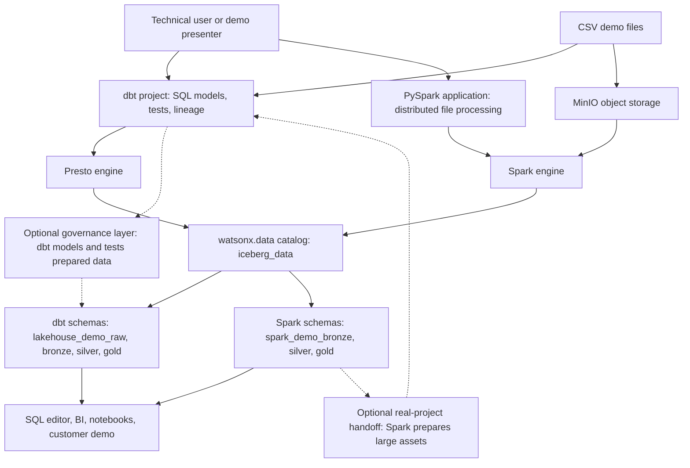
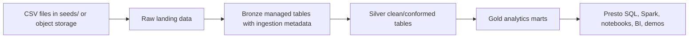

# watsonx.data dbt and Spark medallion demo

This repo is a technical customer demo for IBM watsonx.data with an Iceberg lakehouse catalog. It shows the same ecommerce dataset moving through a medallion pattern: CSV landing data, bronze tables with ingestion metadata, silver tables with typed and conformed data, and gold marts for analytics.

There are two separated demo paths:

- **dbt path:** Uses dbt with the watsonx.data Presto engine to create and test SQL models.
- **Spark path:** Uses the watsonx.data Spark engine to run a PySpark application against the same CSV files.

The two paths intentionally write to different schemas, so you can compare them side by side without one demo overwriting the other.

The default catalog is `iceberg_data`. Set `WXD_CATALOG=hive_data` if you want to run the dbt path against the Hive catalog instead. Gold dbt models are views by default; set `WXD_GOLD_MATERIALIZED=table` if you want physical gold marts for a performance-oriented demo.

## dbt and Spark

dbt is a SQL transformation framework. It is good for turning data already available in the lakehouse into governed, tested, documented models. In this demo, dbt runs through Presto, builds the raw, bronze, silver, and gold layers, and validates relationships and accepted values with dbt tests.

Spark is a distributed data processing engine. It is usually chosen for larger ingestion jobs, heavy ETL, file processing, ML feature engineering, or transformations that need Spark libraries and cluster execution. In this demo, Spark implements the same medallion idea with the same CSV files, but writes to separate `spark_demo_*` schemas.

For customer demos, lead with dbt when the story is governed SQL analytics on watsonx.data. Use Spark as a second path when the story includes distributed ingestion or larger engineering workloads. Both are valid lakehouse approaches; the important point is that both land open tables in watsonx.data that can be queried through the lakehouse catalog.

## How They Fit Together



In this repo, dbt and Spark are separated on purpose. They use the same source data and the same medallion idea, but they write to different schemas so the customer can compare the approaches clearly. In a real project, they can also work together: Spark can ingest or prepare large datasets, and dbt can model, test, document, and publish SQL-friendly tables for analytics.

| Tool | Strong at | Weaker at | Demo role |
| --- | --- | --- | --- |
| dbt | SQL transformations, tests, documentation, lineage, repeatable analytics models, team review workflows. | Heavy file processing, complex distributed compute, non-SQL transformations, ML-style processing. | Shows governed medallion modeling through Presto into `lakehouse_demo_*` schemas. |
| Spark | Distributed processing, large files, complex ETL, schema evolution handling, ML/feature jobs, batch jobs near object storage. | SQL model governance, built-in documentation, lightweight analyst workflows, simple marts that do not need a cluster. | Shows an alternative medallion implementation with PySpark into `spark_demo_*` schemas. |
| watsonx.data | Shared open table access, Iceberg metadata, Presto SQL, Spark execution, object storage-backed lakehouse data. | It is the platform rather than the transformation framework; dbt or Spark still define the transformation logic. | Provides the catalog, engines, storage, and query surface for both paths. |

## Medallion Pattern



Layer meaning:

| Layer | Meaning | Demo implementation |
| --- | --- | --- |
| Raw landing | Original CSV payload exactly as it arrives for the demo. It is useful for traceability but should not be the main layer for business logic. | dbt seeds or Spark CSV reads. |
| Bronze | First managed lakehouse copy. Keeps source fields close to the original and adds operational metadata such as ingest time, source file, and batch id. | Iceberg tables. |
| Silver | Cleaned and conformed entities. Columns are typed, statuses are standardized, keys are validated, and tables are ready for reuse. | Iceberg tables with dbt tests; orders are partitioned by date. |
| Gold | Business-facing aggregates and marts for demos, SQL, BI, or notebooks. | dbt views by default; Spark writes a physical daily sales table. |

Raw is intentionally handled differently by the two paths:

```text
CSV files = true raw landing data

dbt path:
CSV files -> lakehouse_demo_raw tables -> bronze -> silver -> gold

Spark path:
CSV files in object storage -> bronze -> silver -> gold
```

dbt creates `lakehouse_demo_raw` tables because dbt transforms SQL tables. Spark reads CSV files directly, so this demo does not create a separate `spark_demo_raw` schema.

Default dbt schemas:

- `lakehouse_demo_raw`
- `lakehouse_demo_bronze`
- `lakehouse_demo_silver`
- `lakehouse_demo_gold`

Set `WXD_SCHEMA` to change the prefix, or set `WXD_BRONZE_SCHEMA`, `WXD_SILVER_SCHEMA`, and `WXD_GOLD_SCHEMA` explicitly.

The demo sets `WXD_SCHEMA_LOCATION_BASE=s3a://iceberg-bucket/lakehouse_demo` for Iceberg schema/table locations. For `hive_data`, change it to `s3a://hive-bucket/lakehouse_demo`. The bootstrap creates layer-specific locations below the base path.

Layer behavior:

| Layer | Schema | Materialization | Purpose |
| --- | --- | --- | --- |
| Raw | `iceberg_data.lakehouse_demo_raw` | dbt seeds as tables | Direct CSV landing zone for the demo. |
| Bronze | `iceberg_data.lakehouse_demo_bronze` | Tables | Raw business columns plus `_ingested_at`, `_ingested_by`, `_source_file`, `_ingest_batch_id`. |
| Silver | `iceberg_data.lakehouse_demo_silver` | Tables | Typed, cleaned, conformed entities with tests. `silver_orders` is partitioned by `day(order_date)`. |
| Gold | `iceberg_data.lakehouse_demo_gold` | Views by default | Business-facing marts: `gold_daily_sales` and `gold_customer_360`. |

Default Spark schemas:

| Layer | Schema |
| --- | --- |
| Spark bronze | `iceberg_data.spark_demo_bronze` |
| Spark silver | `iceberg_data.spark_demo_silver` |
| Spark gold | `iceberg_data.spark_demo_gold` |

The dbt and Spark gold outputs use different names to keep lineage obvious:

| dbt gold | Spark gold |
| --- | --- |
| `gold_daily_sales` | `spark_gold_daily_sales` |
| `gold_customer_360` | `spark_gold_customer_360` |

dbt gold is configured as views by default, while Spark writes physical Iceberg tables.

## Security note

Do not commit watsonx.data API keys. Put credentials in your shell environment or a local `.env` file. If an API key was pasted into chat or committed anywhere, rotate it before customer demos.

## Setup

Create a local Python 3.11 virtual environment:

```bash
python3.11 -m venv .venv
source .venv/bin/activate
python -m pip install --upgrade pip
python -m pip install -r requirements.txt
```

Python 3.11 is recommended for this demo. Python 3.14 currently breaks dbt through a transitive dependency during startup.

The `requirements.txt` file installs dbt Core, `dbt-watsonx-presto`, `presto-python-client`, `trino`, and `python-dotenv`.

It also installs MkDocs and Material for MkDocs. To view the nicer documentation site:

```bash
mkdocs serve
```

Then open:

```text
http://127.0.0.1:8000
```

This project profile uses `type: watsonx_presto`, matching the IBM watsonx.data dbt adapter configuration.

Copy the example profile into your dbt profiles directory:

```bash
mkdir -p ~/.dbt
cp profiles/profiles.example.yml ~/.dbt/profiles.yml
```

Create your local `.env` file:

```bash
cp .env.example .env
```

Then edit `.env` and set `WXD_API_KEY`. The `.env` file is ignored by Git.

If you export the watsonx.data Presto connection JSON, save it as:

```text
watsonx_data/instance_details.json
```

Then import the connection values into `.env` and write the embedded certificate chain to `certs/watsonxdata-ca.pem`:

```bash
python scripts/prepare_watsonx_env.py
```

The script imports non-secret values such as `WXD_HOST`, `WXD_PORT`, `WXD_INSTANCE_ID`, `WXD_PRESTO_ENGINE_ID`, `WXD_CPD_HOST`, and `WXD_SSL_VERIFY`. It preserves existing secrets in `.env`. The API key is not part of the connection JSON, so keep `WXD_API_KEY` in `.env`.

For a different file path:

```bash
python scripts/prepare_watsonx_env.py --connection-json /path/to/presto-connection.json
```

Use `--overwrite` if you want values from the JSON to replace existing `.env` values. Local connection JSON files under `watsonx_data/` are ignored by Git.

For this on-prem watsonx.data connection, `.env.example` also includes `WXD_INSTANCE_ID=1781163689818519`. The Python helpers and dbt profile pass it as the `LhInstanceId` header, which is used by watsonx.data native/on-prem APIs.

## Where Values Come From

Use `.env.example` as the map for all local settings. The important values come from these places:

| Variable | Where to get it |
| --- | --- |
| `WXD_HOST` | watsonx.data Presto connection JSON, property `engine_host`. |
| `WXD_PORT` | watsonx.data Presto connection JSON, property `engine_port`. |
| `WXD_INSTANCE_ID` | watsonx.data connection JSON, property `instance_id`. This is sent as `LhInstanceId`. |
| `WXD_PRESTO_ENGINE_ID` | watsonx.data Presto connection JSON, property `engine_id`. |
| `WXD_CATALOG` | watsonx.data catalog name, usually `iceberg_data` for this demo. |
| `WXD_SCHEMA` | Demo schema prefix. The default is `lakehouse_demo`. |
| `WXD_USER` | For API-key auth, use `ibmlhapikey_<software-hub-username>`, for example `ibmlhapikey_cpadmin`. |
| `WXD_API_KEY` | IBM Software Hub / CPD API key for the user. The same key is used by the Presto/dbt path and the Spark submission helper. |
| `WXD_SSL_VERIFY` | Path to the certificate chain exported from the connection JSON `ssl_certificate`; this repo uses `certs/watsonxdata-ca.pem`. |
| `WXD_CPD_HOST` | IBM Software Hub route, visible in the browser URL and Spark engine endpoint. |
| `WXD_SPARK_ENGINE_ENDPOINT` | watsonx.data Spark engine details page. |
| `WXD_SPARK_APPLICATIONS_ENDPOINT` | watsonx.data Spark engine details page, usually the engine endpoint plus `/applications`. |
| `WXD_OBJECT_STORE_INTERNAL_ENDPOINT` | watsonx.data storage details for the MinIO bucket. |
| `WXD_OBJECT_STORE_ENDPOINT` | Reachable S3 endpoint from your workstation. In this environment it is usually `http://127.0.0.1:19000` through `oc port-forward`. |
| `WXD_OBJECT_STORE_ACCESS_KEY` and `WXD_OBJECT_STORE_SECRET_KEY` | MinIO credentials. The upload script can read them from the OpenShift secret `ibm-lh-minio-secret` when you are logged in with `oc`. |

The current environment uses an internal MinIO service, so the workstation upload flow normally starts with:

```bash
oc login https://api.watson.ibmas-zocp-techcluster.org:6443
oc -n cpd-instance port-forward svc/ibm-lh-lakehouse-minio-svc 19000:9000
```

The uploader can start the port-forward automatically when `WXD_OBJECT_STORE_AUTO_PORT_FORWARD=true`.

The OpenShift ingress certificate chain is stored in `certs/watsonxdata-ca.pem`, and `.env.example` sets:

```bash
WXD_SSL_VERIFY=certs/watsonxdata-ca.pem
```

Both dbt and the Python helpers use that value for TLS verification. For quick local troubleshooting only, you can set `WXD_SSL_VERIFY=false`, but keep certificate verification enabled for demos.

## dbt Demo Path

Activate the virtual environment:

```bash
source .venv/bin/activate
```

Create the dbt medallion schemas:

```bash
python scripts/bootstrap_watsonxdata.py
```

This creates:

- `iceberg_data.lakehouse_demo_raw`
- `iceberg_data.lakehouse_demo_bronze`
- `iceberg_data.lakehouse_demo_silver`
- `iceberg_data.lakehouse_demo_gold`

The script prints each `create schema if not exists` statement before it runs it.

Load raw landing data from the CSV seeds:

```bash
scripts/dbt_env.sh seed --full-refresh
```

Build bronze, silver, and gold:

```bash
scripts/dbt_env.sh run
scripts/dbt_env.sh test
```

Gold builds as views unless you set `WXD_GOLD_MATERIALIZED=table`. Views make sense for this demo because the gold layer is small and always reflects the current silver tables. Tables make sense when you want to discuss persisted marts, performance tuning, or downstream workload isolation.

Query the gold layer from Python:

```bash
python scripts/query_gold.py
```

Show one gold mart at a time:

```bash
python scripts/query_gold.py daily_sales
python scripts/query_gold.py customer_360
```

Or run a dbt macro for schema creation instead of the Python bootstrap:

```bash
scripts/dbt_env.sh run-operation create_medallion_schemas
```

## Customer Demo Storyline

1. Show `seeds/` as CSV data arriving from an application, partner feed, or object storage export.
2. Run `dbt seed` to load the raw landing tables.
3. Run `dbt run --select tag:bronze` and point out ingestion metadata such as `_ingested_at`, `_ingested_by`, `_source_file`, and `_ingest_batch_id`.
4. Run `dbt run --select tag:silver` to show typing, standardization, relationship checks, and the partitioned `silver_orders` Iceberg table.
5. Run `dbt run --select tag:gold` to publish business marts.
6. Query `gold_daily_sales` and `gold_customer_360` through Presto to show open lakehouse access.
7. Use the Spark path as a second, separate approach that writes comparable medallion tables into `spark_demo_*` schemas.

## watsonx.data SQL

The full copy-paste SQL script is in `docs/watsonxdata_sql_demo.sql`.

Inspect schemas and tables:

```sql
show schemas from iceberg_data like 'lakehouse_demo%';

show tables from iceberg_data.lakehouse_demo_raw;
show tables from iceberg_data.lakehouse_demo_bronze;
show tables from iceberg_data.lakehouse_demo_silver;
show tables from iceberg_data.lakehouse_demo_gold;
```

Raw landing data:

```sql
select *
from iceberg_data.lakehouse_demo_raw.raw_orders
order by order_id;
```

Bronze with ingestion metadata:

```sql
select
  order_id,
  customer_id,
  order_ts,
  status,
  payment_method,
  _ingested_at,
  _ingested_by,
  _source_file,
  _ingest_batch_id
from iceberg_data.lakehouse_demo_bronze.bronze_orders
order by order_id;
```

Silver cleaned and typed:

```sql
select
  order_id,
  customer_id,
  order_ts,
  order_date,
  status,
  payment_method,
  transformed_at
from iceberg_data.lakehouse_demo_silver.silver_orders
order by order_id;
```

Gold marts:

```sql
select *
from iceberg_data.lakehouse_demo_gold.gold_daily_sales
order by order_date, category;

select *
from iceberg_data.lakehouse_demo_gold.gold_customer_360
order by lifetime_value desc, customer_id;
```

Spark output:

```sql
show schemas from iceberg_data like 'spark_demo%';

show tables from iceberg_data.spark_demo_bronze;
show tables from iceberg_data.spark_demo_silver;
show tables from iceberg_data.spark_demo_gold;

select *
from iceberg_data.spark_demo_gold.spark_gold_daily_sales
order by order_date, category;
```

## Iceberg Metadata

Iceberg tables expose metadata tables. Use quoted table names because of the `$` character:

```sql
select
  committed_at,
  snapshot_id,
  operation,
  summary
from iceberg_data.lakehouse_demo_silver."silver_orders$snapshots"
order by committed_at desc;

select *
from iceberg_data.lakehouse_demo_silver."silver_orders$history"
order by made_current_at desc;

select *
from iceberg_data.lakehouse_demo_silver."silver_orders$partitions"
order by order_date;

show create table iceberg_data.lakehouse_demo_silver.silver_orders;
```

`silver_orders` is partitioned by `day(order_date)` using the dbt model config in `models/silver/silver_orders.sql`. This is useful for demos because most analytical order queries filter or aggregate by date. The dataset is intentionally tiny, so partitioning is educational here rather than a performance necessity.

Gold is a view, so it does not have its own Iceberg snapshots or partitions. The physical Iceberg history lives in the raw, bronze, and silver tables below it.

## Time Travel

watsonx.data Presto supports Iceberg time travel on Iceberg tables. First get a snapshot id:

```sql
select
  committed_at,
  snapshot_id,
  operation
from iceberg_data.lakehouse_demo_silver."silver_orders$snapshots"
order by committed_at desc;
```

Then query by snapshot id:

```sql
select *
from iceberg_data.lakehouse_demo_silver.silver_orders
for version as of <snapshot_id>
order by order_id;

select *
from iceberg_data.lakehouse_demo_silver.silver_orders
for system_version as of <snapshot_id>
order by order_id;
```

Or query by timestamp. Use a timestamp after one of the `committed_at` values:

```sql
select *
from iceberg_data.lakehouse_demo_silver.silver_orders
for timestamp as of timestamp '2026-06-12 12:46:47 UTC'
order by order_id;

select *
from iceberg_data.lakehouse_demo_silver.silver_orders
for system_time as of timestamp '2026-06-12 12:46:47 UTC'
order by order_id;
```

If the timestamp is earlier than the first retained snapshot, Presto returns `ICEBERG_INVALID_TABLE_TIMESTAMP`. That is expected and is a good way to explain that time travel depends on retained Iceberg snapshots.

## Spark Demo Path

The file `spark/load_medallion_demo.py` demonstrates how a Spark job writes the same CSV demo data into separate Iceberg schemas. This is not required for the dbt demo; it is a parallel approach for customers who want to see distributed ingestion and transformation with the watsonx.data Spark engine.

- `spark_demo_bronze`
- `spark_demo_silver`
- `spark_demo_gold`

The Spark path follows the same medallion logic:

| Layer | Spark behavior |
| --- | --- |
| Raw landing | Reads the uploaded CSV files from `s3a://iceberg-bucket/spark_demo/raw`. |
| Bronze | Writes `bronze_*` Iceberg tables with `_ingested_at`, `_ingested_by`, `_source_file`, and `_ingest_batch_id`. |
| Silver | Writes typed `spark_silver_*` Iceberg tables. `spark_silver_orders` is partitioned by `order_date`. |
| Gold | Writes `spark_gold_daily_sales`, also partitioned by `order_date`. |

For the watsonx.data Spark engine, stage the application and CSV files in object storage first. The default layout is:

- `s3a://iceberg-bucket/spark_demo/app/load_medallion_demo.py`
- `s3a://iceberg-bucket/spark_demo/raw/raw_customers.csv`
- `s3a://iceberg-bucket/spark_demo/raw/raw_products.csv`
- `s3a://iceberg-bucket/spark_demo/raw/raw_orders.csv`
- `s3a://iceberg-bucket/spark_demo/raw/raw_order_items.csv`

If you have S3/MinIO credentials from a place that can reach the object-store endpoint, upload the assets with:

```bash
python scripts/upload_spark_assets.py
```

In this OpenShift environment, the lakehouse MinIO service is internal-only (`ibm-lh-lakehouse-minio-svc` has no external route). From a workstation, log in with `oc`, port-forward the service, and use the lakehouse MinIO secret:

```bash
oc login https://api.watson.ibmas-zocp-techcluster.org:6443
oc -n cpd-instance port-forward svc/ibm-lh-lakehouse-minio-svc 19000:9000
```

In another terminal:

```bash
export WXD_OBJECT_STORE_ENDPOINT=http://127.0.0.1:19000
export WXD_OBJECT_STORE_ACCESS_KEY="$(oc get secret ibm-lh-minio-secret -n cpd-instance -o jsonpath='{.data.LH_S3_ACCESS_KEY}' | base64 --decode)"
export WXD_OBJECT_STORE_SECRET_KEY="$(oc get secret ibm-lh-minio-secret -n cpd-instance -o jsonpath='{.data.LH_S3_SECRET_KEY}' | base64 --decode)"
export WXD_OBJECT_STORE_REGION=us-east-1
export WXD_OBJECT_STORE_SSL_VERIFY=false
python scripts/upload_spark_assets.py
```

If you are already logged in with `oc`, `scripts/upload_spark_assets.py` can also read `ibm-lh-minio-secret` automatically. In that case, only the endpoint/region settings are needed in `.env`; the access key and secret key can stay unset.

The uploader also auto-starts the port-forward when `WXD_OBJECT_STORE_ENDPOINT` points to `127.0.0.1` or `localhost` and `WXD_OBJECT_STORE_AUTO_PORT_FORWARD=true`.

Then submit to the watsonx.data Spark application endpoint. The script prints the payload first and defaults to dry-run:

```bash
python scripts/submit_spark_application.py
```

Set `WXD_SPARK_DRY_RUN=false` to actually submit. For REST authentication, the script can derive `ZenApiKey` auth from `WXD_CPD_USERNAME` and `WXD_API_KEY`. You can also provide one of:

- `WXD_SPARK_BEARER_TOKEN`
- `WXD_ZEN_API_KEY`
- `WXD_CPD_USERNAME` and `WXD_CPD_PASSWORD`, which the script exchanges for a bearer token through `/icp4d-api/v1/authorize`

Local Spark test example:

```bash
WXD_SPARK_INPUT_BASE=seeds spark-submit spark/load_medallion_demo.py
```

The Spark job creates:

- `spark_demo_bronze.bronze_customers`, `bronze_products`, `bronze_orders`, `bronze_order_items`
- `spark_demo_silver.spark_silver_customers`, `spark_silver_products`, `spark_silver_orders`, `spark_silver_order_items`
- `spark_demo_gold.spark_gold_daily_sales`, `spark_gold_customer_360`

Use Spark for larger ingestion, file processing, ML/ETL jobs, or transformations that benefit from distributed execution. Use dbt when the main story is governed SQL models, tests, documentation, and analytics marts. In real projects, teams often combine them: Spark lands or prepares large assets, and dbt governs the SQL transformation layer consumed by analysts and BI.
