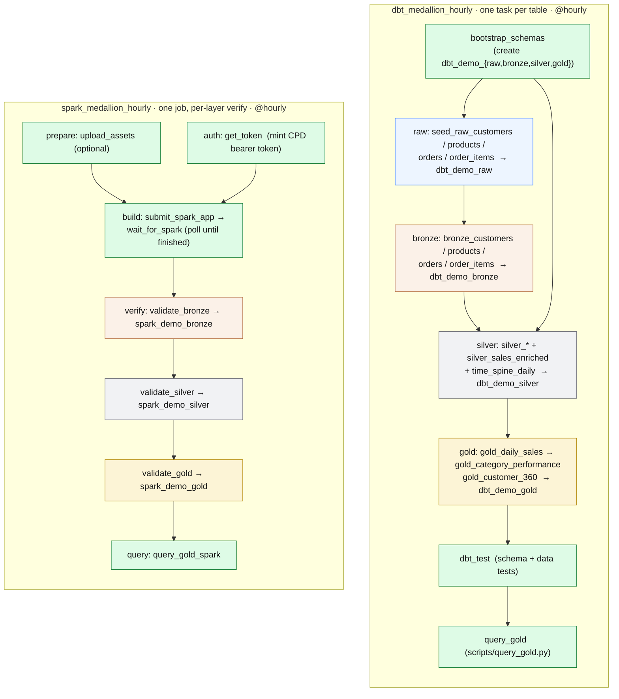

# Airflow — Schedule the Pipeline

!!! info "What is Apache Airflow? (no jargon)"
    Airflow is a **programmable scheduler** — a conductor that runs the steps of your pipeline in the right order, on a schedule, and keeps a tidy history of every run. Think of it as a *smart cron with a dashboard*: instead of you typing `dbt seed`, then `dbt run`, then `dbt test` by hand every hour, Airflow runs those steps for you on the hour, retries any step that fails, runs independent steps in parallel, and shows you a colour-coded picture of what succeeded, what failed, and how long each step took.

## What Airflow is (the technical version)

Airflow models a pipeline as a **DAG** (Directed Acyclic Graph) — a set of **tasks** wired together by dependencies so they run in a valid order with no cycles. Each task is built from an **operator** (for example a `BashOperator` that runs a shell command, or a Python `@task`). The **scheduler** decides when each DAG run starts and which tasks are ready; the **executor** (here, the `LocalExecutor`) actually runs them; and the **web UI / API server** lets you watch runs, read logs, and trigger DAGs by hand. Tasks pass small values to each other through **XCom**, and long waits use **sensors** that poll until a condition is met.

!!! warning "Airflow is OPTIONAL in this demo"
    Nothing in this workshop *requires* Airflow. The [dbt](dbt-demo.md) and [Spark](spark-demo.md) medallion pipelines run perfectly **standalone** — you can build the entire `raw → bronze → silver → gold` medallion by hand with the commands on those pages. Airflow simply *orchestrates the exact same steps* on a schedule, with retries and a run history. If you only want to learn the medallion, skip this page. If you want to see how the pipeline is operated in production, read on.

---

## The two DAGs, mapped to the medallion

Both DAGs build the **same medallion shape** (`raw → bronze → silver → gold`) — one through **dbt + Presto**, one through **watsonx.data Spark** — and both run **`@hourly`**. The graphs below are taken directly from the DAG source.



**dbt DAG** wires one Airflow task per dbt model, following the dbt `ref()` graph exactly: four independent `raw → bronze → silver` branches, then `silver_sales_enriched` (the join of all four), then the three gold marts, then `dbt_test`, then a real `query_gold.py` preview. **Spark DAG** submits the whole medallion as **one distributed job** (`spark/load_medallion_demo.py` writes bronze→silver→gold in a single application — that is how Spark works), then makes **each layer its own verification task** that counts rows via Presto, giving the same `bronze → silver → gold` shape honestly.

---

## What's in this repo

| File | Role |
| --- | --- |
| `airflow/dags/dag_dbt_medallion.py` | DAG `dbt_medallion_hourly` — `@hourly`, one `BashOperator` per dbt model, mirroring the dbt `ref()` lineage. Builds `dbt_demo_{raw,bronze,silver,gold}`. |
| `airflow/dags/dag_spark_medallion.py` | DAG `spark_medallion_hourly` — `@hourly`, submits one Spark job then verifies each layer. Builds `spark_demo_{bronze,silver,gold}`. |
| `airflow/dags/common/wxd.py` | The single place auth / TLS / Presto / Spark-REST logic lives, mirroring the standalone scripts (`get_token.py`, `submit_spark_application.py`, `bootstrap_watsonxdata.py`, `query_gold.py`) so nothing is duplicated. |
| `docker-compose-airflow.yml` | The local stack: `airflow-postgres` (metadata DB), one-shot `airflow-init`, `airflow-webserver` (api-server, UI on **8082**), `airflow-scheduler`, `airflow-dag-processor`. |
| `airflow/Dockerfile` | Pinned `apache/airflow:3.2.2` image plus the repo's dbt/Presto/boto3 dependencies. |

!!! tip "Parity with the standalone demos"
    The Airflow dbt path runs the **exact same `dbt seed / run / test`** commands as the [dbt demo](dbt-demo.md), and the Spark path submits the **exact same `load_medallion_demo.py`** as the [Spark demo](spark-demo.md). The two DAGs build the same gold tables you would build by hand — Airflow only adds scheduling, retries, parallelism, and a visual run history. Every `WXD_*` value comes from `.env`; nothing is hard-coded in the DAGs.

---

## Run it (optional)

Airflow runs entirely on your laptop in Docker. Only Presto and Spark are remote (the on-prem watsonx.data cluster). From the repo root:

```bash
cp .env.example .env                                # fill in your WXD_* values
cp profiles/profiles.example.yml profiles/profiles.yml

docker compose -f docker-compose-airflow.yml build
docker compose -f docker-compose-airflow.yml up airflow-init     # one-shot DB migrate + admin seed
docker compose -f docker-compose-airflow.yml up -d

open http://localhost:8082          # login: admin / admin
```

The same `.env` and `profiles.yml` that drive the standalone dbt/Spark demos drive Airflow — there is no separate configuration. Port **8082** is used so it never clashes with OpenMetadata's bundled Airflow on 8080.

In the UI, unpause a DAG (`dbt_medallion_hourly` or `spark_medallion_hourly`) with its toggle, then click **Trigger** to run it now. Prefer the command line? Airflow 3 exposes a REST API:

```bash
TOKEN=$(curl -s http://localhost:8082/auth/token \
  -H 'Content-Type: application/json' \
  -d '{"username":"admin","password":"admin"}' \
  | python3 -c 'import sys,json;print(json.load(sys.stdin)["access_token"])')

# Unpause, then trigger a run of the dbt DAG
curl -s -X PATCH http://localhost:8082/api/v2/dags/dbt_medallion_hourly \
  -H "Authorization: Bearer $TOKEN" -H 'Content-Type: application/json' \
  -d '{"is_paused": false}'

curl -s -X POST http://localhost:8082/api/v2/dags/dbt_medallion_hourly/dagRuns \
  -H "Authorization: Bearer $TOKEN" -H 'Content-Type: application/json' \
  -d '{"logical_date":"2026-06-19T12:00:00Z"}'
```

Tear down (keep data): `docker compose -f docker-compose-airflow.yml down`. Wipe everything: add `-v`.

!!! note "One external dependency: the engines must be awake"
    Like dbt and Spark standalone, the DAGs need the watsonx.data **Presto** (and, for the Spark DAG, **Spark**) engine running. The Spark DAG mints a fresh CPD bearer token on every run, so scheduled runs never fail on an expired token.

---

## See it in the UI

!!! note "📸 Screenshot: Airflow DAGs list"
    Capture the Airflow **DAGs** page at `http://localhost:8082` showing both `dbt_medallion_hourly` and `spark_medallion_hourly` (each `@hourly`), then save it to `docs/assets/images/screenshots/airflow-dags.png` and replace this note with the image.

!!! note "📸 Screenshot: dbt DAG graph view"
    Open `dbt_medallion_hourly` and capture its **Graph** view showing the `bootstrap_schemas → raw → bronze → silver → gold → dbt_test → query_gold` task graph (the per-model lineage), then save it to `docs/assets/images/screenshots/airflow-dbt-graph.png` and replace this note with the image.

!!! note "📸 Screenshot: a task log"
    Open any finished task (for example `gold_daily_sales` or `wait_for_spark`) and capture its **Logs** tab showing the `==> ...` breadcrumb and the step output, then save it to `docs/assets/images/screenshots/airflow-task-log.png` and replace this note with the image.

---

Next: build the same gold tables by hand in the [dbt Demo Path](dbt-demo.md) or [Spark Demo Path](spark-demo.md), then [compare them in SQL](sql-demo.md).
