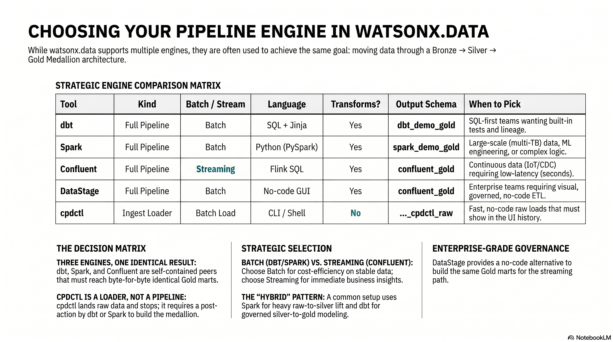
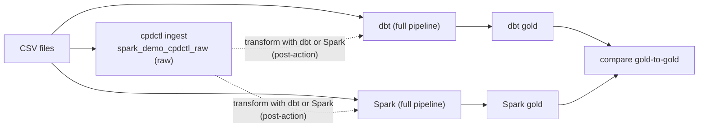

# When to Use Which — and How the Paths Combine

!!! abstract "The one idea to take away"
    **dbt, Spark, and Confluent are three interchangeable, self-contained pipelines** — each
    *ingests and transforms* the same four CSVs all the way through Bronze → Silver → Gold, and
    all three must reach the **identical Gold** marts. dbt and Spark are **batch**; Confluent
    (Kafka → Flink → Iceberg) is **streaming**. **cpdctl is an ingestion-only loader** — like
    `dbt seed`, it lands the raw CSVs in `spark_demo_cpdctl_raw` and *stops at raw*. To turn
    cpdctl data into a medallion, you run **dbt or Spark as a post-action** over the ingest schema.

    > **cpdctl (ingest) + dbt or Spark (transform) = one full pipeline.**
    > **dbt, Spark, and Confluent each = one full pipeline on their own.**

---

<figure markdown="span">
  { loading=lazy }
  <figcaption>At a glance: which path to reach for. dbt, Spark, and Confluent are interchangeable full pipelines producing identical Gold; cpdctl is ingest-only; DataStage is the no-code enterprise option.</figcaption>
</figure>

## Three engines, one loader

| | dbt | Spark | Confluent (Flink) | cpdctl |
|---|---|---|---|---|
| **Kind** | Full pipeline | Full pipeline | Full pipeline (streaming) | Ingest loader only |
| **Batch or streaming?** | Batch | Batch | **Streaming** | Batch load |
| **Does it transform?** | Yes — raw → bronze → silver → gold | Yes — bronze → silver → gold | Yes — Kafka raw → Flink silver → Spark/DataStage gold | **No** — lands raw and stops |
| **Language** | SQL | Python (PySpark) | Flink SQL (+ Spark/DataStage for gold) | CLI (no code) |
| **Builds a medallion alone?** | Yes | Yes | Yes | No — needs dbt or Spark afterward |
| **Output schema** | `dbt_demo_raw/bronze/silver/gold` | `spark_demo_bronze/silver/gold` | topics → `confluent_demo_silver` → `confluent_demo_gold` | `spark_demo_cpdctl_raw` (raw) |
| **UI ingestion history?** | No | No | No (runs as a stream) | **Yes** |
| **Analogous to** | — | — | Confluent Tableflow (Flink-on-Iceberg) | `dbt seed` / Spark's raw CSV read |

dbt, Spark, and Confluent are **peers** — pick whichever engine fits the team and workload; all
three produce the same medallion shape, and the [SQL comparison](sql-demo.md) plus
`scripts/reconcile_gold.py` prove their gold layers match exactly. cpdctl is **not** a fourth peer
engine: it is a fast, UI-tracked way to get raw data *in*, which you then hand to dbt or Spark.

!!! info "Confluent gold is built by a second engine — Spark or DataStage"
    The Confluent path always writes **Silver** with Flink, then builds **Gold** with a second
    engine chosen by `CONFLUENT_GOLD_ENGINE`: **Spark** (default, code-first) or **DataStage**
    (no-code visual ETL). Both write the same `confluent_demo_gold` marts — see the
    [DataStage page](datastage-demo.md).

---

## dbt vs Spark — at a glance

dbt and Spark are interchangeable peers in this demo, but they make different trade-offs. The
table below lays them side by side so you can match the engine to the team and the workload.

| Dimension | dbt (`models/*.sql`) | Spark (`spark/load_medallion_demo.py`) |
|---|---|---|
| Language | SQL + Jinja | Python / PySpark (Scala/Java possible) |
| Where compute runs | Pushed down to the Presto engine in watsonx.data — dbt only compiles + orchestrates, no data on your laptop | Distributed on the watsonx.data Spark engine — executors process partitions in parallel |
| Transformation style | Set-based, declarative — one `SELECT` per model | Imperative dataframe ETL — read → withColumn → join → groupBy → writeTo |
| Materialization | table / view / incremental via `{{ config }}` | Explicit `createOrReplace()`, `partitionedBy(...)` |
| Best for | Analytics modeling, governed SQL marts, dimensional models | Heavy ETL, complex logic, huge joins, semi-structured parsing, ML feature prep |
| Testing | First-class built-in (`not_null`/`unique`/`relationships`/custom in YAML), `dbt test` | DIY (PySpark asserts, Great Expectations, pytest) — no native runner |
| Docs | Auto-generated searchable site (`dbt docs`) | Manual docstrings / READMEs |
| Lineage | Automatic column-level from `ref()`/`source()`; flows into OpenMetadata | Inferred from code or a runtime OpenLineage listener; more setup |
| Governance | Strong: SQL code review + declared tests + lineage + docs-as-code | Lives in the surrounding platform/CI; general-purpose Python is harder to police |
| Learning curve | Low for SQL/analytics people | Higher — Spark APIs, lazy evaluation, partitioning, shuffles, tuning |
| Performance — small data | Excellent; no cluster spin-up | Overkill — JVM/executor startup dominates |
| Performance — big data | Scales with Presto | Built for very large multi-TB workloads |
| Streaming | Batch only | Structured Streaming / micro-batch |
| ML feature engineering | SQL-expressible only | Full Python ecosystem (pandas UDFs, MLlib) |
| When to pick | SQL-first team; logic fits a `SELECT`; want tests+docs+lineage for free | Large data, or Python/ML/streaming/custom parsing |

**When to use which.** Start with **dbt** for SQL analytics engineering on watsonx.data: the compute
runs on the same Presto engine you already query, and you get tests, docs, and column-level lineage
almost for free. Reach for **Spark** when you outgrow SQL and Presto — very large data,
billions-of-rows joins, streaming, ML feature engineering, or messy semi-structured parsing that SQL
cannot express cleanly. They are interchangeable peers here, and a common real-world pattern uses
**both**: Spark for the heavy raw → Silver lift, dbt for the governed Silver → Gold modeling. And
remember **cpdctl is ingestion-only** — it lands the raw files and stops; you still run dbt or Spark
on top to build the medallion.

---

## Choose by the job

Find the row that matches your situation, then pick the engine in the last column.

| Your situation | Pick this |
|----------------|-----------|
| "My logic is all `SELECT` statements and I want tests + lineage" | **dbt** |
| "I'm a SQL-first analytics team on watsonx.data" | **dbt** |
| "The data is huge, or I need Python / ML / messy parsing" | **Spark** |
| "I want distributed compute across many workers" | **Spark** |
| "Data arrives continuously and I want low-latency Silver/Gold" | **Confluent (Kafka → Flink → Iceberg)** |
| "I want Bronze to be a replayable event log, not a static table" | **Confluent** |
| "I want a no-code, visual, governed ETL canvas for the gold build" | **Confluent with `CONFLUENT_GOLD_ENGINE=datastage`** |
| "I just need raw data loaded fast, with no code, tracked in the UI" | **cpdctl** (then transform with dbt or Spark) |
| "Heavy raw→Silver lift, then governed Silver→Gold modeling" | **Spark for the lift, dbt for the modeling** |

=== "Use dbt"

    - Your team treats transformations as **governed SQL** — code review, tests, lineage,
      documentation-as-code.
    - You want column-level lineage in OpenMetadata.
    - The logic fits in SQL `SELECT` statements.

=== "Use Spark"

    - The data is **large** or the logic needs **Python** (ML feature prep, custom parsing,
      billions-of-rows joins).
    - You want distributed compute on the watsonx.data Spark engine.

=== "Use Confluent (streaming)"

    - Data **arrives continuously** and you want Silver/Gold updated seconds after each row,
      not on the next batch schedule.
    - You want **Bronze to be a replayable Kafka topic** — rewind and reprocess without
      re-ingesting the source.
    - You want **Schema Registry** as the streaming governance point (the contract that rejects
      malformed messages), the streaming analogue of dbt tests.
    - For Gold, choose the second engine: **Spark** (code-first, default) or **DataStage**
      (no-code visual ETL) via `CONFLUENT_GOLD_ENGINE`. See [Confluent](confluent-demo.md) and
      [DataStage](datastage-demo.md).

=== "Use cpdctl"

    - You need the load to appear in the **watsonx.data console → Data manager → Ingestion** audit
      history.
    - You want a fast, **no-code** raw load from a terminal or the console GUI.
    - Then you still run **dbt or Spark** over `spark_demo_cpdctl_raw` to build bronze/silver/gold.

---

## Seeds vs Sources — seed the lookups, source the raw

!!! tip "Seed the lookups, source the raw"
    dbt **seeds** are for small (low-thousands), static, version-controlled lookup/reference data —
    status → label maps, country/region codes, currency tables. They are **not** meant for real
    raw or production data. Real raw data should **land** in a raw zone by an ingestion process and
    be read by dbt as a `{{ source() }}` declared in a `sources.yml` (so you can also run
    `dbt source freshness` against it).

    Here is how **this repo** currently works (a teaching point, not a criticism): today the dbt
    path loads `seeds/raw_*.csv` via `dbt seed` and the bronze models read them with
    `{{ ref('raw_*') }}` — i.e. seeds used as a stand-in raw zone. The Spark path already reads the
    same CSVs from the object-storage raw zone (`s3a://.../spark_demo/raw`), and the cpdctl path
    lands them in `spark_demo_cpdctl_raw`.

    One rule of thumb:

    > *If a human curates it in git → seed it. If a pipeline lands it in the raw zone → source it.*

---

## Separate vs together

**Separate** — dbt and Spark each run end to end on their own:

```text
dbt:   seeds/ CSV → dbt_demo_raw → bronze → silver → gold
Spark: object-store CSV → spark_demo_bronze → silver → gold
```

**Together** — cpdctl ingests, then dbt or Spark transforms:

```text
cpdctl: CSV → spark_demo_cpdctl_raw (raw)
            → [post-action] dbt or Spark transform → bronze → silver → gold
```



The worked post-action examples (a dbt model and a Spark read over `spark_demo_cpdctl_raw`) are in
[What cpdctl does NOT do — and how to finish the job](ingestion.md#what-cpdctl-does-not-do-and-how-to-finish-the-job).

---

## Open source vs enterprise

Everything on this page is the **open-source** toolkit. When governance, scale, no-code authoring,
or enforced policies matter, each tool has an IBM enterprise counterpart — dbt/Spark → **DataStage**,
Kafka → **Confluent Platform on-prem**, OpenMetadata → **watsonx.data Intelligence**, Airflow →
**+ Databand observability**. For an honest, side-by-side verdict (with weaknesses), see the
[Enterprise summary](enterprise/summary.md) and [Why Upgrade](enterprise/overview.md).

---

## Next step

- New here? Start with [Architecture & Data Flow](lineage.md).
- Ready to build? Run [Path A — dbt](dbt-demo.md), [Path B — Spark](spark-demo.md), or
  [Path C — Confluent streaming](confluent-demo.md).
- Want the no-code gold engine for the streaming path? See [DataStage](datastage-demo.md).
- Want UI-tracked ingestion? Run [cpdctl](ingestion.md), then transform with dbt or Spark.
- Built multiple engines? [Compare the dbt and Spark gold layers](sql-demo.md), or run
  `scripts/reconcile_gold.py` to compare all three.
