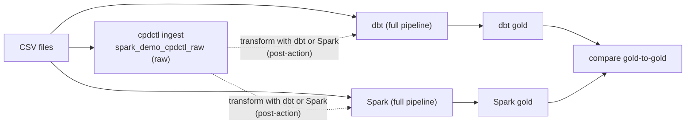

# When to Use Which — and How the Paths Combine

!!! abstract "The one idea to take away"
    **dbt and Spark are two interchangeable, self-contained pipelines** — each *ingests and
    transforms* the CSVs all the way through Bronze → Silver → Gold. **cpdctl is an ingestion-only
    loader** — like `dbt seed`, it lands the raw CSVs in `spark_demo_cpdctl_raw` and *stops at raw*.
    To turn cpdctl data into a medallion, you run **dbt or Spark as a post-action** over the ingest
    schema.

    > **cpdctl (ingest) + dbt or Spark (transform) = one full pipeline.**

---

## Two engines, one loader

| | dbt | Spark | cpdctl |
|---|---|---|---|
| **Kind** | Full pipeline | Full pipeline | Ingest loader only |
| **Does it transform?** | Yes — raw → bronze → silver → gold | Yes — bronze → silver → gold | **No** — lands raw and stops |
| **Language** | SQL | Python (PySpark) | CLI (no code) |
| **Builds a medallion alone?** | Yes | Yes | No — needs dbt or Spark afterward |
| **Output schema** | `dbt_demo_raw/bronze/silver/gold` | `spark_demo_bronze/silver/gold` | `spark_demo_cpdctl_raw` (raw) |
| **UI ingestion history?** | No | No | **Yes** |
| **Analogous to** | — | — | `dbt seed` / Spark's raw CSV read |

dbt and Spark are **peers** — pick whichever engine fits the team and workload; both produce the
same medallion shape and the [SQL comparison](sql-demo.md) proves their gold layers match exactly.
cpdctl is **not** a third peer engine: it is a fast, UI-tracked way to get raw data *in*, which you
then hand to dbt or Spark.

---

## Choose by the job

=== "Use dbt"

    - Your team treats transformations as **governed SQL** — code review, tests, lineage,
      documentation-as-code.
    - You want column-level lineage in OpenMetadata.
    - The logic fits in SQL `SELECT` statements.

=== "Use Spark"

    - The data is **large** or the logic needs **Python** (ML feature prep, custom parsing,
      billions-of-rows joins).
    - You want distributed compute on the watsonx.data Spark engine.

=== "Use cpdctl"

    - You need the load to appear in the **watsonx.data console → Data manager → Ingestion** audit
      history.
    - You want a fast, **no-code** raw load from a terminal or the console GUI.
    - Then you still run **dbt or Spark** over `spark_demo_cpdctl_raw` to build bronze/silver/gold.

---

## Separate vs together

**Separate** — dbt and Spark each run end to end on their own:

```text
dbt:   seeds/ CSV → dbt_demo_raw → bronze → silver → gold
Spark: object-store CSV → spark_demo_bronze → silver → gold
```

**Together** — cpdctl ingests, then dbt or Spark transforms:

```text
cpdctl: CSV → spark_demo_cpdctl_raw (raw)
            → [post-action] dbt or Spark transform → bronze → silver → gold
```



The worked post-action examples (a dbt model and a Spark read over `spark_demo_cpdctl_raw`) are in
[What cpdctl does NOT do — and how to finish the job](ingestion.md#what-cpdctl-does-not-do-and-how-to-finish-the-job).

---

## Next step

- New here? Start with [Architecture & Data Flow](lineage.md).
- Ready to build? Run [Path A — dbt](dbt-demo.md) or [Path B — Spark](spark-demo.md).
- Want UI-tracked ingestion? Run [cpdctl](ingestion.md), then transform with dbt or Spark.
- Built both engines? [Compare the dbt and Spark gold layers](sql-demo.md).
