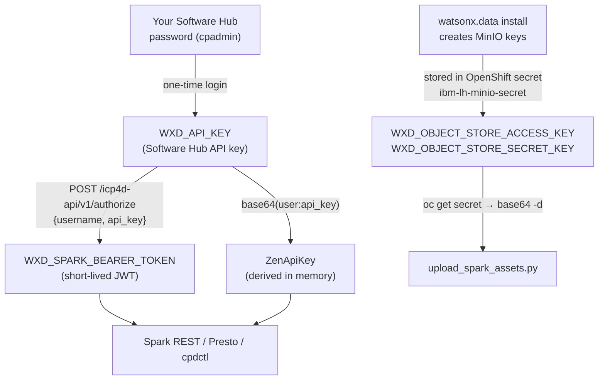

# Configuration & Files Reference

This page is the complete reference for **everything you must provide** to run the workshop: the
files to place, the credentials and URLs to obtain, every `.env` variable, and the dbt profile —
on **macOS, Linux, and Windows**. If a script fails with a "missing variable" or "file not found"
error, this is the page to check.

!!! tip "You do not set most of these by hand"
    You manually provide **two** things — your **API key** and the **connection JSON**. Running
    `python scripts/prepare_watsonx_env.py` then fills in the rest of `.env` and writes the TLS
    certificate automatically. The big tables below exist so you can verify and troubleshoot, not
    so you type every value.

---

## Files you must create or place

| File | Where it goes | How you get it | Used by |
|---|---|---|---|
| `watsonx_data/instance_details.json` | repo root, in `watsonx_data/` | Export from the watsonx.data console (**Infrastructure manager → your Presto engine → Download connection details**), or your administrator hands you a pre-exported file | `scripts/prepare_watsonx_env.py` |
| `certs/watsonxdata-ca.pem` | repo root, in `certs/` | **Auto-written** by `prepare_watsonx_env.py` from the `ssl_certificate` field in the JSON — you do not create it by hand | dbt, the Presto Python client, cpdctl (`SSL_CERT_FILE`) |
| `.env` | repo root | `cp .env.example .env`, set `WXD_API_KEY`, then `prepare_watsonx_env.py` fills in the rest | every script + the dbt profile |
| `~/.dbt/profiles.yml` | your home directory, in `.dbt/` (Windows: `%USERPROFILE%\.dbt\`) | `cp profiles/profiles.example.yml ~/.dbt/profiles.yml` | dbt |

!!! warning "Never commit secrets"
    `.env`, `certs/`, and `watsonx_data/` are git-ignored. Your API key lives only in `.env` (or your
    shell), never in source. Confirm with `git status` that none of them appear as tracked files.

---

## Credentials & URLs — where each comes from

| What | Example / form | Where to obtain it | Where it is used |
|---|---|---|---|
| **Software Hub API key** | long alphanumeric string | IBM Software Hub → your profile → **API key** (or from your administrator) | `WXD_API_KEY` — Presto/dbt auth, Spark REST auth, cpdctl |
| **Software Hub username** | `cpadmin` | Your watsonx.data / CPD login name | `WXD_CPD_USERNAME`; `WXD_USER` is derived as `ibmlhapikey_<username>` |
| **Presto host / port** | `...presto651-presto-svc.apps...:443` | Connection JSON (auto-imported) | `WXD_HOST`, `WXD_PORT` |
| **Instance ID** | `1781163689818519` | Connection JSON (auto-imported) | `WXD_INSTANCE_ID` (sent as the `LhInstanceId` header) |
| **TLS CA certificate** | PEM chain | Connection JSON `ssl_certificate` → auto-written to `certs/watsonxdata-ca.pem` | `WXD_SSL_VERIFY` |
| **OpenShift API URL** | `https://api.<cluster>:6443` | Cluster administrator | `oc login` (Spark + cpdctl paths) |
| **OpenShift login token** | `sha256~...` | OpenShift console → **Copy login command** → *Display Token* (or `kubeadmin` password from your administrator) | `oc login --token=...` |
| **MinIO access / secret keys** | two strings | Auto-read by the uploader from the `ibm-lh-minio-secret` OpenShift secret when you are logged in with `oc`; or set manually | `WXD_OBJECT_STORE_ACCESS_KEY` / `_SECRET_KEY` |

!!! info "About `oc login` and kubeadmin"
    The Spark uploader and the MinIO port-forward need an authenticated `oc` session. Either use the
    token from the OpenShift web console (**top-right user menu → Copy login command**), or log in
    with the `kubeadmin` user and password your administrator provides:

    ```bash
    oc login https://api.watson.ibmas-zocp-techcluster.org:6443 -u kubeadmin -p <kubeadmin-password>
    # or, token-based:
    oc login --token=sha256~<token> --server=https://api.watson.ibmas-zocp-techcluster.org:6443
    ```

### How the four sensitive credentials are created

Four values in `.env` are *secrets*, not just hostnames. They are created in different
ways and have very different lifetimes. The key idea: **only one of them — the API key —
actually needs to live in `.env`.** The other three are either derived on the fly or read
from the cluster at run time.



#### 1. `WXD_API_KEY` — IBM Software Hub API key (the *root* credential)

This is the one secret you genuinely provide. Everything else is built from it.

* **Created by you**, two equivalent ways:
    * **UI:** open `https://<WXD_CPD_HOST>`, log in as `cpadmin` → avatar (top-right) →
      *Profile and settings* → **API key** tab → **Regenerate API key** → copy it into
      `.env` as `WXD_API_KEY=<key>`.
    * **Script:** `python scripts/get_token.py --refresh-key` does a one-time **password**
      login, calls `POST /usermgmt/v1/user/apikey/regenerate`, and writes the new key into
      `.env` for you.
* **Used for:** Presto/dbt auth (it is the *password* for the Presto user
  `ibmlhapikey_cpadmin`), Spark REST auth (via the derived ZenApiKey below), and cpdctl.
* **Lifetime:** long-lived until you regenerate it. **Regenerating invalidates the old
  key**, so it is the cleanest thing to rotate.

#### 2. `WXD_SPARK_BEARER_TOKEN` — CPD bearer token (short-lived JWT)

A session token, not a permanent secret — it **expires**. You usually do **not** need to
store it.

* **Created from the API key:** `POST WXD_CPD_AUTH_URL` (`/icp4d-api/v1/authorize`) with
  `{username, api_key}` returns a `token`. `scripts/get_token.py` prints it;
  `scripts/get_token.py --export` writes it to `.env`.
* **Derived automatically when missing:** `scripts/submit_spark_application.py` and the
  Airflow `common/wxd.py` helper mint a fresh token (or a derived `ZenApiKey` =
  `base64("<user>:<api_key>")`) at run time, so the Spark path works **without** any
  `WXD_SPARK_BEARER_TOKEN` in `.env`.
* **Lifetime:** minutes/hours (JWT expiry). A token sitting in `.env` is almost always
  stale — prefer to leave it unset and let the scripts derive one.

#### 3 & 4. `WXD_OBJECT_STORE_ACCESS_KEY` / `_SECRET_KEY` — MinIO (S3) keys

These are **created by the watsonx.data installation** when it provisions MinIO — *you*
do not generate them. The demo reads them from the cluster.

* **Where they live:** the OpenShift secret `ibm-lh-minio-secret` (namespace
  `cpd-instance`), under keys `LH_S3_ACCESS_KEY` / `LH_S3_SECRET_KEY`.
* **How the demo gets them:** `scripts/upload_spark_assets.py` runs, in effect,
  `oc get secret ibm-lh-minio-secret -n cpd-instance -o jsonpath='{.data.LH_S3_ACCESS_KEY}'`
  and base64-decodes it — so as long as you are logged in with `oc`, you can leave both
  keys **unset** in `.env`.
* **Lifetime / rotation:** platform-managed. Rotating them is a cluster-admin task (rotate
  the MinIO secret); the scripts then pick up the new values automatically on the next run.

!!! danger "Best practice: keep secrets *out* of `.env` where you can"
    Of the four, only **`WXD_API_KEY`** needs to be in `.env`. Leave
    `WXD_SPARK_BEARER_TOKEN` unset (it is short-lived and auto-derived) and leave the two
    MinIO keys unset (they are read from `oc` at run time). If you ever pasted a real
    bearer token or MinIO key into `.env`, treat it as exposed and rotate it:

    | Credential | How to rotate |
    |---|---|
    | `WXD_API_KEY` | Regenerate in the Software Hub UI, or `python scripts/get_token.py --refresh-key`. The old key stops working. |
    | `WXD_SPARK_BEARER_TOKEN` | Just delete it from `.env` — it expires on its own and is re-minted from the API key when needed. |
    | `WXD_OBJECT_STORE_ACCESS_KEY` / `_SECRET_KEY` | Ask your cluster admin to rotate the `ibm-lh-minio-secret`; remove them from `.env` and let `upload_spark_assets.py` read the new values via `oc`. |

    `.env` is git-ignored (see `.gitignore`), so these never reach Git — but they are still
    real working credentials on disk.

---

## `.env` reference — every variable

`.env` starts as a copy of `.env.example`. Values marked **auto** are filled in by
`prepare_watsonx_env.py` from the connection JSON; **manual** values you set yourself (most already
have a sensible default in the template). Variables shown commented-out are optional overrides.

### Core Presto / dbt connection

| Variable | Source | Meaning |
|---|---|---|
| `WXD_API_KEY` | **manual (secret)** | Your Software Hub API key. **Not** in the JSON — you must paste it in. |
| `WXD_CPD_USERNAME` | manual | Your Software Hub username (e.g. `cpadmin`). |
| `WXD_USER` | manual / derived | Presto user for API-key auth, usually `ibmlhapikey_<username>`. |
| `WXD_HOST` | **auto** | Presto engine hostname. |
| `WXD_PORT` | **auto** | Presto port (usually `443`). |
| `WXD_INSTANCE_ID` | **auto** | watsonx.data tenant ID (sent as `LhInstanceId`). |
| `WXD_PRESTO_ENGINE_ID` | **auto** | Presto engine ID (e.g. `presto651`). |
| `WXD_CATALOG` | auto (default `iceberg_data`) | Iceberg catalog. |
| `WXD_SCHEMA` | auto (default `dbt_demo`) | Base dbt schema prefix. |
| `WXD_SSL_VERIFY` | **auto** | Path to the CA cert (`certs/watsonxdata-ca.pem`). |
| `WXD_GOLD_MATERIALIZED` | manual (default `view`) | Whether gold views/tables are materialized as views. |

### IBM Software Hub / OpenShift endpoints

| Variable | Source | Meaning |
|---|---|---|
| `WXD_CPD_HOST` | **auto** | Software Hub (CPD) base host. |
| `WXD_CPD_AUTH_URL` | **auto** | CPD authorize endpoint for tokens. |
| `WXD_OPENSHIFT_CONSOLE` | manual | OpenShift web console URL (reference). |
| `WXD_OPENSHIFT_API` | manual | OpenShift API URL used for `oc login`. |

### Spark path

| Variable | Source | Meaning |
|---|---|---|
| `WXD_SPARK_CATALOG` / `WXD_SPARK_SCHEMA` | manual | Catalog and base schema (`spark_demo`) for Spark outputs. |
| `WXD_SPARK_ENGINE_ID` | manual | Spark engine ID (e.g. `spark656`). |
| `WXD_SPARK_ENGINE_ENDPOINT` / `WXD_SPARK_APPLICATIONS_ENDPOINT` | manual | Spark engine + applications REST endpoints. |
| `WXD_SPARK_ASSET_BUCKET` / `WXD_SPARK_ASSET_PREFIX` | manual | MinIO bucket + prefix where the app and CSVs are uploaded. |
| `WXD_SPARK_APPLICATION` / `WXD_SPARK_INPUT_BASE` | manual | S3 paths to the uploaded PySpark app and raw CSVs. |
| `WXD_SPARK_DRY_RUN` | manual (default `true`) | `true` prints the job payload without submitting. |

### Object store (MinIO) — Spark uploads

!!! warning "MinIO is reachable only through `oc` on this cluster"
    `ibm-lh-lakehouse-minio-svc` is a **ClusterIP** service with **no Route**, so it is **not**
    reachable from your workstation directly. The Spark upload therefore needs `oc` to open a
    port-forward. Setting `WXD_OBJECT_STORE_ACCESS_KEY` / `_SECRET_KEY` by hand only skips *reading
    the secret* — it does **not** remove the tunnel. Pointing `WXD_OBJECT_STORE_ENDPOINT` at a
    non-localhost URL works only if an administrator first exposes MinIO via an OpenShift **Route**
    (which places object storage on the network — a deliberate security decision). The S3 transfer
    itself is pure Python (boto3); `oc` only provides the tunnel and reads the secret.

| Variable | Source | Meaning |
|---|---|---|
| `WXD_OBJECT_STORE_ENDPOINT` | manual | S3 endpoint the uploader writes to (on this cluster `http://127.0.0.1:19000` via port-forward). |
| `WXD_OBJECT_STORE_INTERNAL_ENDPOINT` | manual | In-cluster MinIO service URL — only resolvable inside the cluster, not from a laptop. |
| `WXD_OBJECT_STORE_ACCESS_KEY` / `_SECRET_KEY` | manual *or* auto from `oc` | MinIO credentials. If unset, the uploader reads them from the OpenShift secret. Setting them manually **still requires the `oc` port-forward** unless MinIO is exposed via a Route. |
| `WXD_OBJECT_STORE_AUTO_PORT_FORWARD` | manual (default `true`) | Auto-start `oc port-forward` when the endpoint is `127.0.0.1`. |
| `WXD_OPENSHIFT_NAMESPACE` | manual (default `cpd-instance`) | Namespace holding the MinIO service + secret. |
| `WXD_OBJECT_STORE_SERVICE` / `_SERVICE_PORT` | manual | MinIO service name + port for the port-forward. |
| `WXD_OBJECT_STORE_SECRET_NAME` / `_ACCESS_KEY_NAME` / `_SECRET_KEY_NAME` | manual | OpenShift secret + keys to read MinIO creds from. |
| `WXD_OBJECT_STORE_REGION` / `_SSL_VERIFY` | manual | S3 region and TLS verification toggle. |

### Optional — REST auth and OpenMetadata

| Variable | Source | Meaning |
|---|---|---|
| `WXD_SPARK_BEARER_TOKEN` / `WXD_ZEN_API_KEY` / `WXD_CPD_PASSWORD` | manual (optional) | Alternatives for Spark REST auth; usually derived from `WXD_CPD_USERNAME` + `WXD_API_KEY`. |
| `WXD_DBT_ARTIFACT_DIR` / `_BUCKET` / `_PREFIX` | manual | Where dbt artifacts are staged/published for OpenMetadata. |

---

## dbt profile reference

dbt reads `~/.dbt/profiles.yml` (Windows: `%USERPROFILE%\.dbt\profiles.yml`). The shipped example
pulls **every value from `.env`**, so you copy it once and never edit it:

```yaml
watsonxdata_medallion_demo:
  target: dev
  outputs:
    dev:
      type: watsonx_presto
      method: BasicAuth
      user: "{{ env_var('WXD_USER', 'ibmlhapikey_cpadmin') }}"
      password: "{{ env_var('WXD_API_KEY') }}"
      catalog: "{{ env_var('WXD_CATALOG', 'iceberg_data') }}"
      schema: "{{ env_var('WXD_SCHEMA', 'dbt_demo') }}"
      host: "{{ env_var('WXD_HOST', '...') }}"
      port: "{{ env_var('WXD_PORT', '443') | int }}"
      ssl_verify: "{{ env_var('WXD_SSL_VERIFY', 'certs/watsonxdata-ca.pem') }}"
      http_headers:
        LhInstanceId: "{{ env_var('WXD_INSTANCE_ID', '...') }}"
      threads: "{{ env_var('DBT_THREADS', '4') | int }}"
```

The wrapper `scripts/dbt_env.sh` sources `.env` before calling dbt, so these `env_var(...)` lookups
resolve. (On Windows, run dbt from a shell where `.env` is loaded — see below.)

---

## Cross-platform notes (macOS · Linux · Windows)

=== "macOS / Linux"

    - Python: `python3.11 -m venv .venv` then `source .venv/bin/activate`.
    - dbt profile: `~/.dbt/profiles.yml`.
    - Load `.env` into a shell: `set -a; source .env; set +a`.
    - CLI tools install to `~/.local/bin` (ensure it is on `PATH`).

=== "Windows (PowerShell)"

    - Python: `py -3.11 -m venv .venv` then `.venv\Scripts\Activate.ps1`.
    - dbt profile: `%USERPROFILE%\.dbt\profiles.yml` (create the `.dbt` folder if missing).
    - Load `.env` into the session:
      ```powershell
      Get-Content .env | Where-Object { $_ -notmatch '^\s*#' -and $_ -match '=' } |
        ForEach-Object { $k,$v = $_ -split '=',2; Set-Item "env:$k" $v }
      ```
    - `oc.exe` / `cpdctl.exe`: put them in a folder on your `PATH` (e.g. `%USERPROFILE%\bin`).
      Download `openshift-client-windows.zip` and the `cpdctl_windows_amd64.tar.gz` asset.
    - WSL2 (Ubuntu) is the smoothest path on Windows — if you use it, follow the Linux instructions.

See [Setup → Step 8](setup.md#step-8-install-command-line-tools-oc-cpdctl) for the per-OS `oc` and
`cpdctl` download commands.
