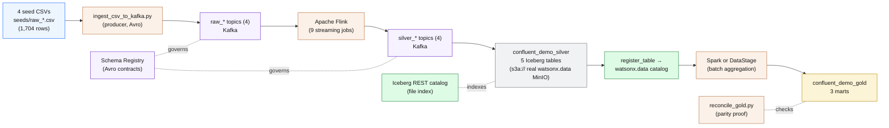
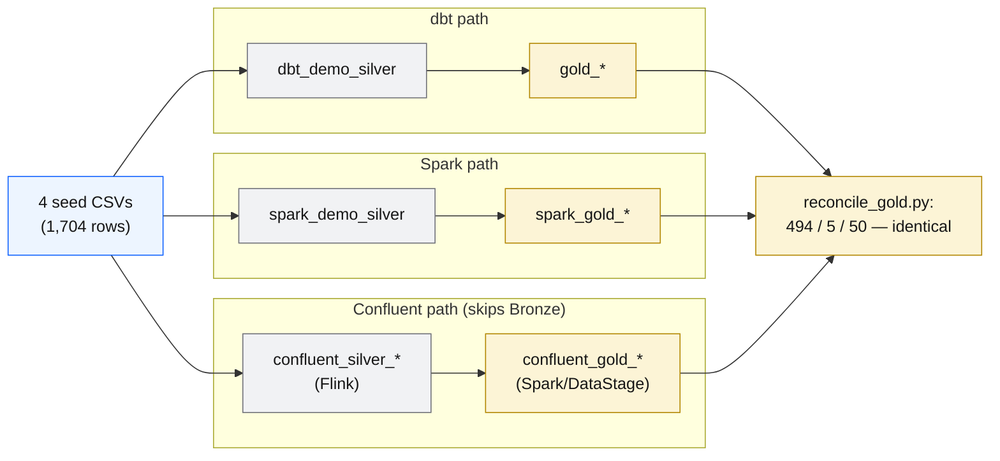

# Path C — Confluent: Streaming (Kafka → Flink → Iceberg)

!!! abstract "What you will do in this path"
    **In one breath:** the same four seed CSVs that dbt and Spark transform are streamed
    through **Kafka** topics, governed by a **Schema Registry**, cleaned in flight by **Apache
    Flink** into Silver, landed as **Iceberg** tables in the same `iceberg_data` catalog, and then
    aggregated into the *same* three Gold marts by a second engine (**Spark** by default, or
    **DataStage**). The "thinking" stack runs locally in Docker; the data is written to the
    **real** watsonx.data object store.

    - Open a door to the real MinIO and start the streaming stack with one command
    - Produce the **1,704** seed rows onto 8 Kafka topics as governed **Avro** messages
    - Let Flink run **9 streaming jobs** that clean raw → Silver and sink Silver to Iceberg
    - Register the Flink-written tables into watsonx.data so Presto/Spark can see them
    - Build Gold with Spark (or DataStage), then prove the numbers match dbt and Spark, row for row

    Estimated time: ~20 minutes (the first run is longer — the Flink image builds once).

!!! info "This is the third independent path to the same Gold"
    dbt (Path A) and Spark (Path B) are **batch** pipelines: they run, finish, and stop. Confluent
    is the **streaming** path — data flows continuously, row by row, never "finishing." All three
    start from the *same* four CSVs and must reach the *same* Gold marts. If the numbers differ,
    there is a bug. The full naming/schema map lives in
    [`confluent/NAMING.md`](https://github.ibm.com/alexander/ibmas-watsonxdata-dbt/blob/main/confluent/NAMING.md),
    and the under-the-hood deep dive (all 9 Flink jobs, the join, the upsert design) lives in
    [Confluent Internals](confluent-internals.md).

---

## The words you need first (plain English)

Streaming has its own vocabulary. Here is the whole cast in one place — each with a teen-friendly
analogy. None of this is technical; it is just naming the parts of the conveyor belt.

!!! note "Kafka — the never-forgetting conveyor belt"
    A super-fast message conveyor belt. **Producers** drop messages on one end, **consumers** pick
    them up off the other, and Kafka keeps every message **in order** so anyone can rewind and
    replay the belt from the very start later. Here it runs in "KRaft mode" (no separate ZooKeeper)
    as a single broker. *Analogy: a school PA system that also tape-records every announcement so
    you can rewind and replay it.*

!!! note "Topic — a labelled lane on the belt"
    A named lane on the conveyor belt. This demo has **8 lanes**: four `raw_*`
    (`raw_customers`, `raw_products`, `raw_orders`, `raw_order_items`) and four `silver_*`
    (`silver_customers`, `silver_products`, `silver_orders`, `silver_order_items`). Auto-create is
    turned **off** on purpose, so every lane is made up front. *Analogy: separate labelled trays in
    a mailroom — one tray per kind of letter.*

!!! note "Producer / Consumer — who puts on, who takes off"
    A **producer** puts messages onto a topic (here: the Python script `ingest_csv_to_kafka.py`).
    A **consumer** reads them off (here: Apache Flink). They never talk directly — the topic sits
    between them, so they can run at different speeds. *Analogy: a chef (producer) puts plates on a
    pass; waiters (consumers) take them when ready.*

!!! note "Schema Registry + Avro — the passport office"
    **Avro** is a strict "fill-in-the-blanks form" that says exactly what fields a message has and
    their types. The **Schema Registry** is the filing office that stores the official version of
    each form and hands every message a tiny ID pointing back to it. Because both sides look up the
    *same* form, a producer and consumer can never disagree about the data's shape — a typo or wrong
    type is caught immediately. *Analogy: a passport office — every passport follows one official
    template, and a bad forgery is rejected at the gate.*

!!! note "Apache Flink — the always-on car wash"
    The always-on transformation machine: it reads messages the instant they arrive, cleans them,
    and passes them on — forever, not in one nightly batch. *Analogy: a car-wash tunnel that washes
    each car as it rolls in, instead of waiting to wash the whole car park at midnight.*

!!! note "Streaming SQL & a Flink job"
    **Streaming SQL** is ordinary-looking SQL (`SELECT`, `WHERE`, `JOIN`) that runs *continuously*
    over a moving stream and emits results as data flows — the same `TRIM`/`LOWER`/`CAST` you'd
    write for a batch table, but it never "finishes." **A Flink job** is one running SQL statement
    (one `INSERT INTO ... SELECT`). This pipeline submits **9 jobs**, each a live task in the Flink
    Web UI. *Analogy: a recipe that keeps cooking every new ingredient that arrives on the belt;
    nine workers on the line, each doing one repeated task.*

!!! note "The Iceberg sink, REST catalog & register_table"
    The **Iceberg sink** is the "exit door" where a Flink job writes its cleaned stream out as a
    permanent Apache Iceberg table (Parquet files) instead of back onto Kafka. The **Iceberg REST
    catalog** (`apache/iceberg-rest-fixture`) is a little librarian that keeps the index of which
    files make up each table and where they live. **`register_table`** is a one-line command that
    tells the **real** watsonx.data catalog "a table already exists over here — add it to your
    index," so Presto/Spark can query the Flink tables next to the dbt and Spark ones. *Analogy: the
    library's card catalogue doesn't hold the books, it tells you which shelf each is on; the book
    is already on the shelf — `register_table` just files its card.*

!!! note "Decoupled storage / compute — local brains, shared drive"
    The "thinking" part (Kafka, Flink, Registry, the Iceberg REST catalog) runs locally on your
    laptop in Docker, but the "storage" part is the **real** watsonx.data object store (MinIO),
    reached over an OpenShift Route. Compute is cheap and disposable; the data is durable and
    shared. *Analogy: you do your homework on your own laptop, but save the final file to the shared
    school drive everyone reads from.*

---

## Architecture — CSV to Gold, one message at a time



Step by step:

1. **CSV → Kafka.** `ingest_csv_to_kafka.py` produces each row of the four CSVs as a governed
   **Avro** message onto the matching `raw_*` topic. The raw topics *are* the "Bronze" — a
   replayable log you can rewind to offset 0.
2. **Kafka → Flink → Silver topics.** Four Flink jobs trim/lower/upper/cast/filter each row and
   write clean, typed Avro to the four `silver_*` topics. Money becomes `DECIMAL` here.
3. **Silver topics → Iceberg.** Five Flink jobs read the silver topics back and **upsert** them
   into Iceberg tables in `confluent_demo_silver` — including a four-way stream-stream join into
   `confluent_silver_sales_enriched`. The warehouse uses the `s3a://` scheme so watsonx.data Spark
   reads the paths natively.
4. **register_table → watsonx.data.** The five Flink-written tables are registered into the real
   catalog so Presto and Spark see them next to `dbt_demo_silver.*` and `spark_demo_silver.*`.
5. **Silver → Gold.** A batch engine — **Spark** by default, or **DataStage** — reads
   `confluent_demo_silver` and writes `confluent_demo_gold`.
6. **Verify.** `reconcile_gold.py` proves the Gold rows match dbt and Spark exactly.

---

## "Bronze = a replayable Kafka topic"

In the dbt and Spark paths, Bronze is a *table* you can re-query. In streaming, the **raw Kafka
topic is the Bronze layer**: every original row is retained and can be **replayed** from the
earliest offset at any time.

| Batch (dbt / Spark) | Streaming (Confluent) |
|---|---|
| Bronze is a stored table | Bronze is the raw Kafka topic (replayable log) |
| Re-run the job to reprocess | Replay the topic from offset 0 to reprocess |
| Data arrives in one batch | Data arrives continuously, row by row |
| Latency = job schedule | Latency = milliseconds after a row lands |

!!! question "Why skip Bronze entirely?"
    dbt and Spark go raw → Bronze → Silver → Gold. Confluent **skips the Bronze table** because
    Flink already cleans, casts, trims, filters and enriches the stream *in flight* — the work that
    Bronze→Silver does in batch happens continuously here, so there is no separate Bronze table to
    land. The raw Kafka topic plays the "replayable Bronze" role.

!!! question "Why does Gold still need a second engine?"
    Flink is brilliant at per-row streaming transforms, but Gold is **aggregation** (group-by
    day/category, lifetime value per customer) over the *whole* Silver set. That is a batch job, so
    a second engine (Spark or DataStage) reads the finished Silver tables and builds the marts.
    **Streaming Silver + batch Gold** is the deliberate split.

---

## The technical stack (components, versions, ports)

Everything below is exact from `confluent/docker-compose.yml` and `confluent/flink/Dockerfile`.

| Component | Image / Version | Host port → container | Role (one line) |
|---|---|---|---|
| Kafka broker | `confluentinc/cp-kafka:7.7.1` | `29092` → 29092 (external); internal `confluent-kafka:9092` | KRaft-mode (no ZooKeeper) single broker — the message conveyor belt |
| Schema Registry | `confluentinc/cp-schema-registry:7.7.1` | `28081` → 8081 | Stores the Avro contract for every topic — the governance backbone |
| Kafbat UI | `ghcr.io/kafbat/kafka-ui:latest` | `28080` → 8080 | Browser dashboard for topics, messages, offsets and decoded Avro |
| Iceberg REST catalog | `apache/iceberg-rest-fixture:1.9.1` | `28181` → 8181 | SQLite-backed catalogue pointing Flink at the real `iceberg-bucket` via the Route |
| Flink JobManager | `wxd-flink:1.20` (custom) | `28085` → 8081 (Web UI) | The "foreman" — schedules and supervises the running jobs |
| Flink TaskManager | `wxd-flink:1.20` | none (internal) | The "workers" — 16 task slots, 3072m memory; actually run the SQL |
| Flink SQL Gateway | `wxd-flink:1.20` | `28083` → 8083 | Accepts submitted SQL and hands it to the JobManager |
| confluent-kafka-init | `confluentinc/cp-kafka:7.7.1` | one-shot | Creates the 8 topics (`create-topics.sh`), then exits |
| confluent-schema-prep | `python:3.12-slim` | one-shot, profile `watsonxdata` | Phase A — creates the Silver + Gold Iceberg schemas in watsonx.data via Presto |
| confluent-flink-runner | `wxd-flink:1.20` | one-shot, profile `watsonxdata` | Renders + submits `silver_jobs.sql`, then exits |
| confluent-prep | `python:3.12-slim` | one-shot, profile `watsonxdata` | Phase B — `register_table` of the 5 Silver tables into watsonx.data |

!!! info "The custom Flink image `wxd-flink:1.20`"
    Built from `flink:1.20-scala_2.12` with lib jars pinned to `FLINK_VER=1.20.5`. The extra jars
    are what make Flink speak Kafka, Avro-via-Registry, and Iceberg-on-S3 at once: the Kafka SQL
    connector `3.3.0-1.20`, the Iceberg Flink runtime `1.20` `1.9.1` (REST catalog + S3FileIO),
    `flink-s3-fs-hadoop` `1.20.5`, Hadoop `3.3.4` jars (`hadoop-common`/`hadoop-hdfs-client`/
    `hadoop-aws`), `iceberg-aws-bundle` `1.9.1`, and **`flink-sql-avro-confluent-registry` `1.20.5`**
    (without it Flink errors *"Could not find any factory for identifier 'avro-confluent'"*).

!!! tip "Runtime facts worth knowing"
    Kafka auto-topic-creation is **off**; checkpointing every **30s** in **EXACTLY_ONCE** mode;
    `parallelism.default: 2`. The runner injects the **in-container** Schema Registry URL
    `http://confluent-schema-registry:8081` — the host URL `localhost:28081` is unreachable from
    *inside* Docker.

---

## The 9 Flink jobs (the short version)

There are two stages. Every message format is **Avro governed by Schema Registry**
(`format=avro-confluent`), and money is cast to `DECIMAL` already in Stage 1 so revenue ties to the
cent and matches dbt exactly. The full rule-by-rule breakdown (and the headline four-way join) is in
[Confluent Internals](confluent-internals.md) — here is the map.

**Stage 1 — Transform** (`raw_*` topic → `silver_*` topic): four jobs named
`kafka-raw-to-silver :: ...`. They `TRIM`/`LOWER`/`UPPER`/`CAST`/filter each row exactly like the
dbt Silver models — e.g. `LOWER(email)` and drop empty emails (customers); `unit_price` →
`DECIMAL(12,2)` (products); derive a new `order_date` column (orders); keep `quantity > 0`
(order_items).

**Stage 2 — Sink** (`silver_*` topic → Iceberg table): five jobs named
`kafka-silver-to-iceberg :: ...` writing `confluent_silver_*` tables. Job 9 is the headline — a
**stream-stream INNER JOIN across all four silver topics** into `confluent_silver_sales_enriched`,
computing `gross_amount` and `net_amount` in `DECIMAL` so they tie to the cent.

!!! info "Idempotent by design"
    Every sink table has a `PRIMARY KEY ... NOT ENFORCED` plus `write.upsert.enabled='true'`,
    `format-version='2'` (Iceberg v2) and `write.format.default='parquet'`. In upsert mode a re-run
    writes an equality-delete + insert keyed by the primary key, so **re-submitting updates the same
    rows instead of appending duplicates.** Column types are 1:1 with `dbt_demo_silver` (source of
    truth: `models/silver/*.sql`).

The expected Silver row counts are **50 / 20 / 500 / 1134 / 1134** (customers / products / orders /
order_items / sales_enriched).

---

## Run it — the copy-paste walkthrough

Everything runs from the **repo root**. The single entrypoint is `confluent/start.sh`, which is
subcommand-driven and idempotent (topics and the Flink image are reused on re-runs).

### Step 0 — Prerequisites (once)

Open a door from your Docker containers to the **real** watsonx.data object store, and confirm the
hostnames resolve.

```bash
# Create an OpenShift edge-TLS Route to MinIO and write WXD_OBJECT_STORE_ENDPOINT into .env
bash confluent/scripts/expose_minio_route.sh

# Sanity-check that the watsonx.data / MinIO hostnames resolve from this machine
python scripts/check_hosts.py
```

What success looks like: `expose_minio_route.sh` curls `/minio/health/live` and reports the Route is
live, and `WXD_OBJECT_STORE_ENDPOINT` now has a value in `.env`. `check_hosts.py` prints each host as
resolvable.

!!! warning "This step is mandatory before Silver"
    `--silver` writes to the real MinIO over the Route. If `WXD_OBJECT_STORE_ENDPOINT` is empty, the
    Flink runner fails loudly on purpose. Re-run `expose_minio_route.sh` if the Route was torn down.

### Step 1 — Bring up the local stack and seed the topics

```bash
bash confluent/start.sh --all
```

This one command, in order: ensures `.venv` exists, builds `wxd-flink:1.20` (skipped if cached),
starts the **7 long-running services**, waits for Kafka, creates the **8 topics** (4 raw + 4 silver),
produces all **1,704** seed rows as Avro, and prints a status summary.

What success looks like: the status block lists every service as healthy and shows
`raw_customers=50`, `raw_products=20`, `raw_orders=500`, `raw_order_items=1134` messages.

!!! tip "Just the containers, no seeding?"
    `bash confluent/start.sh --stack` starts only the 7 services (no topics, no rows). Use
    `bash confluent/start.sh --status` anytime for a safe, read-only health + per-topic count
    check, and the UI URLs below.

| UI | URL | What you see |
|---|---|---|
| Kafbat UI (Kafka) | <http://localhost:28080> | topics, messages, offsets, decoded Avro |
| Flink Web UI | <http://localhost:28085> | the 9 running streaming jobs |
| Flink SQL Gateway | <http://localhost:28083> | SQL Gateway endpoint |
| Schema Registry | <http://localhost:28081> | registered Avro subjects |
| Iceberg REST catalog | <http://localhost:28181> | local catalog metadata |

### Step 2 — Run the Flink Silver pipeline + register the tables

```bash
bash confluent/start.sh --silver
```

This launches the three `watsonxdata`-profile one-shots: **Phase A** (`confluent-schema-prep`)
creates the `confluent_demo_silver` and `confluent_demo_gold` schemas in watsonx.data; the
**Flink runner** (`confluent-flink-runner`) submits `silver_jobs.sql` (substituting the MinIO
endpoint, in-container Registry URL, and schema name, then cancelling any prior jobs); **Phase B**
(`confluent-prep`) runs `register_table` for the five Silver tables.

What success looks like: the 9 jobs appear in the Flink Web UI, and the five
`confluent_silver_*` tables become queryable in watsonx.data with counts
**50 / 20 / 500 / 1134 / 1134** (customers / products / orders / order_items / sales_enriched).

!!! note "Want to do it by hand?"
    The same Phase B step is `python confluent/scripts/prep_iceberg_schemas.py --phase register`.
    It queries the local Iceberg REST catalog for each table's `metadata.json`, then
    `CALL iceberg_data.system.register_table(...)` via Presto — retrying up to ~60s per table, and
    skipping any already registered.

### Step 3 — Build the Gold marts (Spark by default)

```bash
python confluent/scripts/submit_confluent_gold.py --no-dry-run --wait
```

This POSTs `confluent/spark/confluent_gold.py` to the watsonx.data Spark engine, which writes the
**`confluent_gold_daily_sales` TABLE only**. After the Spark app **FINISHES**, the submitter
automatically runs `scripts/create_gold_views.py --path confluent`, which creates
`confluent_gold_category_performance` and `confluent_gold_customer_360` as Presto **VIEWS**.

What success looks like: the Spark app reaches `FINISHED` / `return_code: 0`, then the two views are
created, giving Gold counts **494 / 5 / 50** (daily_sales / category_performance / customer_360).

!!! info "Why a TABLE plus two Presto VIEWS (not three Spark tables)?"
    A Spark `CREATE VIEW` produces a **Hive view**, which watsonx PrestoDB refuses with *"Hive views
    are not supported."* So Spark owns the one physical table and **Presto owns the two views** —
    exactly the dbt-parity materialisation. `submit_confluent_gold.py` defaults to a redacted
    dry-run; add `--no-dry-run` to actually submit and `--wait` to poll to completion.

!!! tip "No-code Gold with DataStage instead"
    Set `CONFLUENT_GOLD_ENGINE=datastage` and run
    `bash confluent/start.sh --gold --engine datastage` (or
    `python confluent/scripts/create_datastage_flow.py --apply --run`) to build the *same*
    `confluent_demo_gold` marts as a visual DataStage flow in the `ibmas-ingest-demo` CP4D project.
    Needs a live CP4D cluster with the DataStage cartridge. See the
    [DataStage page](datastage-demo.md).

### Step 4 — Prove all three paths are identical

```bash
python scripts/reconcile_gold.py
```

This compares the Gold marts across **dbt, Spark, and Confluent** with a symmetric `EXCEPT` (both
directions); dbt is the reference when present. A clean run reports **zero differing rows** in all
three marts and exits `0`.

What success looks like: a PASS table with Gold parity of **494 daily_sales / 5 category_performance
/ 50 customer_360**, identical across every engine.

!!! tip "Compare a subset"
    `python scripts/reconcile_gold.py --paths spark,confluent` checks just two paths (minimum two).

---

## What just happened to your data

1. **CSV → Kafka.** 1,704 rows became governed Avro messages on the four `raw_*` topics — your
   replayable Bronze.
2. **Kafka → Flink (Stage 1).** Four jobs trimmed, lowercased, cast money to `DECIMAL`, derived
   `order_date`, and filtered junk into the four `silver_*` topics.
3. **Silver topic → Iceberg (Stage 2).** Five jobs upserted permanent Iceberg tables into
   `confluent_demo_silver`, including the four-way stream-stream join with computed
   `gross_amount`/`net_amount`. The metadata paths use `s3a://` so watsonx.data Spark reads them
   natively.
4. **register_table.** watsonx.data was told about the five Flink tables, so they sit beside
   `dbt_demo_silver.*` and `spark_demo_silver.*`.
5. **Silver → Gold.** Spark wrote `confluent_gold_daily_sales`; Presto created the two views.
6. **Verify.** `reconcile_gold.py` confirmed the marts are byte-for-byte equal to dbt and Spark.

!!! note "Decoupled compute, shared storage"
    Kafka, Flink, the Registry and the Iceberg REST catalog all ran locally in Docker — but Flink
    wrote to the **real** watsonx.data MinIO over an OpenShift Route. Local brains, shared durable
    storage.

---

## Verify parity — the whole point of the demo

The three paths fan out from one source and converge on one Gold:



!!! success "Validated end-to-end — three-way Gold parity proven"
    > **Same four CSVs → the same `daily_sales` (494), `category_performance` (5), and
    > `customer_360` (50) with identical numbers, whether the path is dbt, Spark, or Confluent
    > (Flink Silver + Spark/DataStage Gold).** On the Confluent path `confluent_gold_daily_sales` is
    > a physical **TABLE** (Spark-written) while `category_performance` and `customer_360` are
    > **Presto VIEWS** that match dbt exactly. Silver lands at **50 / 20 / 500 / 1134 / 1134**.
    > That single sentence is the entire promise of this repository.

---

## Reset the streaming stack

```bash
bash confluent/start.sh --stop                 # stop the 7 containers, keep data/volumes
bash confluent/start.sh --reset -y             # DESTRUCTIVE — remove containers/volumes/images
scripts/reset_demo.sh --warehouse              # drop the confluent_demo_* schemas + MinIO files
```

To replay from scratch without re-ingesting: drop `confluent_demo_silver`, then re-run
`bash confluent/start.sh --silver` — the raw topics still hold every original row.

---

## Next steps

- Go deeper — [Confluent Internals](confluent-internals.md): every one of the 9 Flink jobs, the
  four-way join, the upsert/idempotency design, and Schema-Registry governance in full.
- The naming contract — [`confluent/NAMING.md`](https://github.ibm.com/alexander/ibmas-watsonxdata-dbt/blob/main/confluent/NAMING.md).
- New to the path model? [When to Use Which](choosing.md).
- Want the no-code Gold engine? [DataStage — No-Code Gold](datastage-demo.md).
- Something not starting? The **Streaming** section in
  [Troubleshooting](troubleshooting.md#streaming-confluent-flink-errors).
- Need the env/hosts model? [Configuration](configuration.md).
