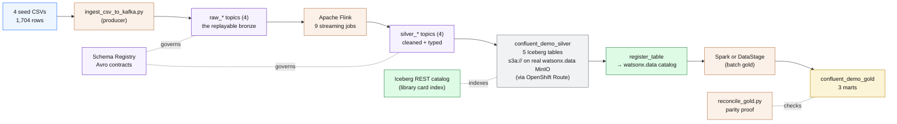
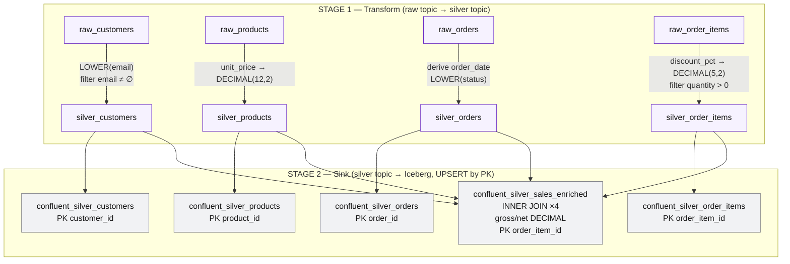
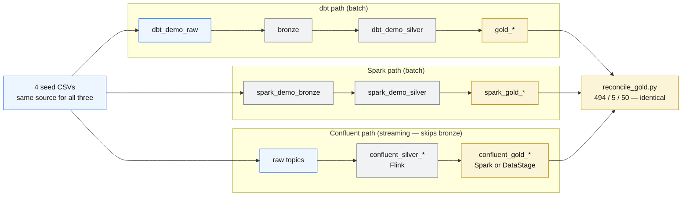

<section class="hero">
  Deep dive
  <h1>Inside the streaming path — how Kafka, Flink and Iceberg actually work</h1>
  

    The walkthrough showed you <em>what</em> to run. This page is the picture book that explains
    <em>how</em> it works. We will meet the cast of characters one at a time, follow a single row
    of data from a CSV file all the way to a finished business table, and use a lot of everyday
    analogies along the way. No command-line bravery required — just curiosity.
  

</section>

!!! abstract "The one big idea: what if data never stopped moving?"
    Most data pipelines work like doing laundry once a week: you let the dirty clothes pile up,
    then run one giant wash overnight. That is called **batch** processing — you wait for a pile,
    then process the whole pile at once. The dbt and Spark paths in this workshop work that way.

    **Streaming** is different. Imagine a washing machine that cleans each sock the instant it
    lands in the basket, forever, never stopping. Data arrives one message at a time and gets
    cleaned the moment it shows up. That is what this path does, and the tools below are the parts
    of that always-on machine.

---

## The cast of characters

Before any diagrams, let us meet the players. Each one does a single, simple job. Once you know
who they are, the big picture is easy.

!!! note "Kafka — the never-forgetting conveyor belt"
    **Kafka** is a super-fast message conveyor belt. People who have data to share (**producers**)
    drop messages on one end; people who want data (**consumers**) pick them up off the other end.
    Kafka keeps every message in order and never throws anything away, so anyone can "rewind the
    tape" and replay every message from the very beginning. In this stack Kafka runs in *KRaft
    mode* (a simpler setup with no separate helper service) as a single broker.

    *Analogy:* a school PA system that also tape-records every announcement, so you can rewind and
    replay any announcement later, exactly as it was said.

!!! note "Topic — a labelled lane on the belt"
    A **topic** is one named lane on the conveyor belt. This demo has **8 lanes**: four `raw_*`
    lanes (`raw_customers`, `raw_products`, `raw_orders`, `raw_order_items`) and four `silver_*`
    lanes (`silver_customers`, `silver_products`, `silver_orders`, `silver_order_items`).
    Auto-create is deliberately turned **off**, so every lane is made up front on purpose — nothing
    appears by accident.

    *Analogy:* labelled trays in a school mailroom — one tray for each kind of letter, so nothing
    gets mixed up.

!!! note "Producer and consumer — the two ends of the belt"
    A **producer** is anyone putting messages onto a topic (here: the Python script
    `ingest_csv_to_kafka.py`). A **consumer** is anyone reading them off (here: Apache Flink). They
    never talk to each other directly — the topic sits in the middle — so they can run at totally
    different speeds without waiting on one another.

    *Analogy:* a chef (producer) puts finished plates on the kitchen pass; waiters (consumers) grab
    them whenever they are ready. The chef never has to wait for a free waiter.

!!! note "Schema Registry + Avro — the passport office"
    **Avro** is a strict "fill-in-the-blanks form" that says exactly which fields a message has and
    what type each one is (a number, a date, some text). The **Schema Registry** is the filing
    office that stores the one official version of each form and stamps every message with a tiny
    ID pointing back to its form. Because both the producer and the consumer look up the *same*
    form, they can never disagree about the shape of the data — a typo or a wrong type is caught
    immediately.

    *Analogy:* a passport office. Every passport (message) must follow one official template, and a
    badly made forgery is rejected at the gate.

!!! note "Apache Flink — the always-on car wash"
    **Apache Flink** is the transformation machine that reads each message the instant it arrives,
    cleans it, and passes it on — forever, not in one nightly batch.

    *Analogy:* a car-wash tunnel that washes each car as it rolls in, instead of waiting until
    midnight to wash the whole car park at once.

!!! note "Streaming SQL — a recipe that never finishes"
    **Streaming SQL** is ordinary-looking SQL (`SELECT`, `WHERE`, `JOIN`) that, instead of running
    once over a finished table, runs *continuously* over a moving stream and spits out results as
    data flows. It is the same `TRIM` / `LOWER` / `CAST` you would write for a normal table — it
    just never "ends."

    *Analogy:* a recipe that keeps cooking every new ingredient the moment it lands on the belt.

!!! note "A Flink job — one worker on the line"
    A **Flink job** is one running SQL statement (one `INSERT INTO ... SELECT`). This pipeline
    submits **9 jobs**. The first four are named `kafka-raw-to-silver :: ...` and the next five
    `kafka-silver-to-iceberg :: ...`. Each one shows up as a live, running task you can watch in
    the Flink Web UI.

    *Analogy:* nine workers on an assembly line, each repeating one small task over and over.

!!! note "The Iceberg sink — the exit door to permanent storage"
    The **Iceberg sink** is the "exit door" where a Flink job writes its cleaned stream out as a
    permanent **Apache Iceberg** table (Parquet files) instead of back onto Kafka. Once written,
    SQL engines like Presto and Spark can query it like any normal table.

    *Analogy:* pouring the washed, sorted items out of the car-wash tunnel into labelled storage
    boxes that anyone can open later.

!!! note "The Iceberg REST catalog — the library card index"
    The **Iceberg REST catalog** (Docker image `apache/iceberg-rest-fixture`) is a little librarian
    service that keeps the index of which files make up each Iceberg table and where they live.
    Flink asks it "where do I write?" and "what is the latest version?"

    *Analogy:* a library's card catalogue. It does not hold the books — it tells you exactly which
    shelf each book is on.

!!! note "register_table — adding the card to the main catalogue"
    **register_table** is a one-line command (`CALL iceberg_data.system.register_table(...)`) that
    tells the **real** watsonx.data catalog "a table already exists over here — add it to your
    index." Flink physically writes the silver tables; `register_table` makes watsonx.data aware of
    them so Presto and Spark can query them next to the dbt and Spark tables.

    *Analogy:* a book is already sitting on the shelf; this just adds its card to the main
    catalogue so everyone else can find it.

!!! info "Decoupled storage and compute — laptop brains, shared drive"
    The "thinking" part of this path (Kafka, Flink, the Schema Registry, the Iceberg catalogue)
    runs locally on your laptop in Docker. But the "storage" part is the **real** watsonx.data
    object store (**MinIO**), reached over an OpenShift Route. Compute is cheap and throwaway; the
    data is durable and shared.

    *Analogy:* you do your homework on your own laptop, but you save the final file to the shared
    school drive that everyone reads from.

---

## The big picture — CSV to gold, one message at a time

Here is the whole journey on one canvas. Colours group the players: blue is **storage**, purple
is **format / governance**, orange is **engines**, green is **catalog**, grey is **silver tables**,
and amber is **gold marts**.

!!! tip "How to read this diagram"
    Follow the solid arrows left to right — that is the data flowing. The **dotted** lines are
    helpers standing on the side: the Schema Registry checks every message has the right shape, the
    Iceberg catalogue keeps the file index, and `reconcile_gold.py` double-checks the final numbers
    at the end.

---

## The technical stack — who's who in the Docker file

If you ever peek inside `confluent/docker-compose.yml`, here is every container and what it does.
You do not need to memorise this — it is a reference card.

| Component | Image / Version | Host port → container | Role (one line) |
|---|---|---|---|
| **Kafka broker** | `confluentinc/cp-kafka:7.7.1` | `29092` → 29092 (external); internal `confluent-kafka:9092` | KRaft-mode (no ZooKeeper) single broker; the message conveyor belt. |
| **Schema Registry** | `confluentinc/cp-schema-registry:7.7.1` | `28081` → 8081 | Stores the Avro contract for every topic; the governance backbone. |
| **Kafbat UI** | `ghcr.io/kafbat/kafka-ui:latest` | `28080` → 8080 | Browser dashboard to see topics, messages, offsets and decoded Avro. |
| **Iceberg REST catalog** | `apache/iceberg-rest-fixture:1.9.1` | `28181` → 8181 | SQLite-backed catalogue pointing Flink at the real `iceberg-bucket` via the Route. |
| **Flink JobManager** | `wxd-flink:1.20` (custom) | `28085` → 8081 (Flink Web UI) | The "foreman" — schedules and supervises the running streaming jobs. |
| **Flink TaskManager** | `wxd-flink:1.20` | none (internal) | The "workers" — 16 task slots, 3072m memory; actually run the SQL. |
| **Flink SQL Gateway** | `wxd-flink:1.20` | `28083` → 8083 | Accepts submitted SQL and hands it to the JobManager. |
| **confluent-kafka-init** | `confluentinc/cp-kafka:7.7.1` | one-shot, no port | Creates the 8 topics (`create-topics.sh`), then exits. |
| **confluent-schema-prep** | `python:3.12-slim` | one-shot, profile `watsonxdata` | Phase A: creates the silver + gold Iceberg schemas in watsonx.data via Presto. |
| **confluent-flink-runner** | `wxd-flink:1.20` | one-shot, profile `watsonxdata` | Renders + submits `silver_jobs.sql` (`submit-flink.sh`), then exits. |
| **confluent-prep** | `python:3.12-slim` | one-shot, profile `watsonxdata` | Phase B: `register_table` of the 5 silver tables into watsonx.data. |

!!! info "Why Flink needed a custom image (`wxd-flink:1.20`)"
    Plain Flink does not know how to talk to Kafka-with-Avro or to Iceberg-on-S3 out of the box, so
    `flink/Dockerfile` adds the missing parts (base Flink `1.20`, library jars pinned to
    `1.20.5`):

    - Kafka SQL connector `flink-sql-connector-kafka` `3.3.0-1.20` — lets Flink read/write Kafka.
    - Iceberg Flink runtime `iceberg-flink-runtime-1.20` `1.9.1` — lets Flink write Iceberg (includes the REST catalog + S3 client).
    - `flink-s3-fs-hadoop` `1.20.5` — the S3 filesystem driver, switched on from Flink's bundled `opt/`.
    - Hadoop `3.3.4` jars (`hadoop-common`, `hadoop-hdfs-client`, `hadoop-aws`) — the S3A plumbing.
    - `iceberg-aws-bundle` `1.9.1` — the AWS SDK used to talk to MinIO.
    - `flink-sql-avro-confluent-registry` `1.20.5` — provides the `avro-confluent` format. Without it Flink errors *"Could not find any factory for identifier 'avro-confluent'"*.
    - `HADOOP_CLASSPATH=/opt/flink/lib`.

!!! note "A few runtime facts worth knowing"
    Kafka **auto-topic-creation is OFF** (every lane is made on purpose). Flink takes a *checkpoint*
    (a safety snapshot) every **30 seconds** in **EXACTLY_ONCE** mode, so no message is ever lost or
    double-counted. Default parallelism is **2**. And the job runner injects the *in-container*
    Schema Registry address `http://confluent-schema-registry:8081` — the laptop address
    `localhost:28081` is invisible from inside Docker, like calling a classmate by their nickname
    that only works outside school.

---

## Inside Flink — two stages, nine little jobs

The nine Flink jobs come in two stages. **Every** message in both stages is **Avro governed by
the Schema Registry** (`format=avro-confluent`). Notice that **money is cast to `DECIMAL`** already
in Stage 1 — that is what makes the revenue tie to the exact cent and match dbt perfectly. The
jobs run forever (runtime `streaming`), and the catalog warehouse lives at
`s3a://iceberg-bucket/${CONFLUENT_SILVER_SCHEMA}/`.

### Stage 1 — Transform (raw topic → silver topic)

These four jobs read a `raw_*` topic, clean each row, and write to the matching `silver_*` topic
as Avro. The cleaning rules mirror the dbt silver models exactly.

!!! abstract "Job 1 — `kafka-raw-to-silver :: customers` (`raw_customers` → `silver_customers`)"
    - `first_name` = `TRIM(first_name)`, `last_name` = `TRIM(last_name)` (chop off stray spaces)
    - `email` = `LOWER(TRIM(email))` (tidy and lower-cased)
    - `signup_date` = cast to `DATE` and back to text (proves it is a real date)
    - `country` = `UPPER(TRIM(country))`
    - adds `transformed_at` = the current timestamp
    - **Filter:** keep only rows where `email IS NOT NULL AND TRIM(email) <> ''`

!!! abstract "Job 2 — `kafka-raw-to-silver :: products` (`raw_products` → `silver_products`)"
    - `product_name` = `TRIM(...)`, `category` = `TRIM(...)`
    - `unit_price` = `CAST(... AS DECIMAL(12,2))` — tightened from a loose DOUBLE to exact money **here**, in silver
    - adds `transformed_at`
    - **Filter:** `product_id IS NOT NULL`

!!! abstract "Job 3 — `kafka-raw-to-silver :: orders` (`raw_orders` → `silver_orders`)"
    - `order_ts` = cast text → `TIMESTAMP(6)` → text
    - **derives** `order_date` = `CAST(order_ts AS TIMESTAMP(6))` → `DATE` (a brand-new column not in the raw data)
    - `status` = `LOWER(TRIM(...))`, `payment_method` = `LOWER(TRIM(...))`
    - adds `transformed_at`
    - **Filter:** `order_id IS NOT NULL`

!!! abstract "Job 4 — `kafka-raw-to-silver :: order_items` (`raw_order_items` → `silver_order_items`)"
    - `quantity` passed through (a whole number, INT)
    - `discount_pct` = `CAST(... AS DECIMAL(5,2))` — tightened from DOUBLE **here**, in silver
    - adds `transformed_at`
    - **Filter:** `quantity > 0`

### Stage 2 — Sink (silver topic → Iceberg table in watsonx.data)

These five jobs read the silver topics back and write **permanent** Iceberg tables in
`${CONFLUENT_SILVER_SCHEMA}` (default `confluent_demo_silver`), named `confluent_silver_*`.

!!! info "The clever part: idempotent by design (no duplicates on re-run)"
    Every sink table has a `PRIMARY KEY ... NOT ENFORCED` plus `write.upsert.enabled='true'`,
    `format-version='2'` (Iceberg v2) and `write.format.default='parquet'`. In **upsert** mode, a
    re-run writes a "delete-then-insert" keyed by the primary key — so submitting the jobs again
    **updates the same rows instead of piling up duplicates**.

    *Analogy:* editing a contact in your phone. Saving "Mum" twice does not create two Mums — it
    just overwrites the one entry. The primary key (like `customer_id`) is the contact's name.

| Job | Sink table | Primary key | Notable types |
|---|---|---|---|
| **5** `:: customers` | `confluent_silver_customers` | `customer_id` | `signup_date` → DATE; `transformed_at` → `TIMESTAMP(6) WITH LOCAL TIME ZONE` |
| **6** `:: products` | `confluent_silver_products` | `product_id` | `unit_price` stays `DECIMAL(12,2)` |
| **7** `:: orders` | `confluent_silver_orders` | `order_id` | `order_ts` → `TIMESTAMP(6)` (plain, matches dbt); `order_date` → DATE |
| **8** `:: order_items` | `confluent_silver_order_items` | `order_item_id` | `discount_pct` stays `DECIMAL(5,2)` |
| **9** `:: sales_enriched [join]` | `confluent_silver_sales_enriched` | `order_item_id` | the headline four-way join (below) |

!!! abstract "Job 9 — the headline four-way stream-stream join"
    This is the showpiece. It joins **all four** silver topics together, live:

    - `order_items ⋈ orders ON order_id`, then `⋈ products ON product_id`, then
      `⋈ customers ON order.customer_id = customer.customer_id`
    - Carries along `customer_country` (from customers), `product_name` / `category` (from
      products), and `status` / `payment_method` / `order_ts` / `order_date` (from orders).
    - **Computed money** (all DECIMAL so it ties to the cent):
        - `gross_amount = CAST(quantity * unit_price AS DECIMAL(14,2))`
        - `net_amount = CAST(quantity * unit_price * (1 - discount_pct) AS DECIMAL(14,2))`
    - It is an **INNER** join, so any orphan line (an order item with no matching order, product,
      or customer) is dropped — exactly the same policy as the dbt model.

!!! note "The numbers should match exactly"
    Column types here are 1:1 with `dbt_demo_silver` (source of truth: `models/silver/*.sql`). The
    expected silver row counts are **50 / 20 / 500 / 1134 / 1134** (customers / products / orders /
    order_items / sales_enriched). If a count is off, something is wrong.

---

## The Iceberg sink and decoupled compute

So how does a fast-moving Kafka topic turn into a calm, permanent table you can query months from
now? That is the Iceberg sink's whole job.

When a Stage 2 Flink job reads a silver topic, it keeps writing the rows out as **Parquet files**
into the real watsonx.data object store. The **Iceberg REST catalog** records which files belong to
the table. Every 30 seconds Flink takes a checkpoint and commits a new, tidy version. The result is
a normal Iceberg table — no longer a moving belt, but a solid table on a shelf.

!!! info "What `s3a://` means (and why it matters)"
    The catalog warehouse uses the address scheme **`s3a://`** (the modern Hadoop way of saying "a
    file in S3-style object storage"). Writing the metadata with `s3a://` means the watsonx.data
    **Spark** engine can read those exact paths natively, with no translation step. Think of it as
    writing the shelf labels in the same language the next reader speaks.

Once the files exist, **`register_table`** adds each table's "card" to the real watsonx.data
catalogue. After that, Presto and Spark see the Flink-written silver tables sitting right next to
the dbt tables (`dbt_demo_silver.*`) and the Spark tables (`spark_demo_silver.*`) — same catalog,
same MinIO, fully interchangeable.

!!! info "Local brains, shared storage — one more time"
    This is the decoupled-compute idea made real. Kafka, Flink, the Registry and the Iceberg-REST
    catalogue all run **locally in Docker** on your laptop. But every file Flink writes lands in the
    **real** watsonx.data MinIO, reached over an OpenShift Route. Tear down the Docker stack and the
    data is still there on the shared drive — the homework was saved to the school server, not your
    laptop's desktop.

---

## Why we skip Bronze here

If you have done the dbt or Spark paths, you noticed they go **raw → bronze → silver → gold**.
This streaming path goes straight to **silver**. That is on purpose, not a shortcut.

!!! info "Why skip bronze?"
    In the batch paths, *bronze* is the step that first makes raw data queryable and lightly typed,
    before *silver* cleans and enriches it. But **Flink already cleans, casts, trims, filters and
    enriches the stream in flight** — the very work that bronze→silver does in batch happens
    *continuously* here. So there is no separate bronze table to land. The raw Kafka topic itself
    plays the "replayable bronze" role: it is the untouched, rewind-to-the-start log of everything
    that arrived.

!!! info "Then why does gold still need a second engine?"
    Flink is brilliant at *per-row* streaming transforms — clean this one message, enrich that one
    message. But **gold is aggregation**: group sales by day, total revenue per category, lifetime
    value per customer. That means looking at the *whole* silver set at once, which is a batch job.
    So a second engine — **Spark by default, or DataStage** — reads the finished silver tables and
    builds the marts. Streaming silver plus batch gold is the deliberate split, each tool doing what
    it is best at.

The hand-off looks like this: Spark writes the `confluent_gold_daily_sales` **table**, then Presto
creates the `category_performance` and `customer_360` **views** — exactly the same materialisation
choices dbt makes.

!!! note "Why Presto (not Spark) builds the two views"
    A Spark `CREATE VIEW` produces a *Hive view*, and watsonx PrestoDB refuses to read Hive views.
    So Spark writes only the gold *table*, and Presto owns the two *views* (via
    `create_gold_views.py`, run automatically after the Spark app finishes). Same result, just the
    right tool for each piece.

---

## Three paths, one gold

Here is the punchline of the whole workshop. Three completely different engines — dbt, Spark, and
this Confluent streaming path — start from the *same* four CSV files and must arrive at the *exact
same* gold numbers. If they ever disagree, there is a bug.

!!! abstract "The parity numbers — memorise these"
    - **Silver row counts:** `50 / 20 / 500 / 1134 / 1134` (customers / products / orders / order_items / sales_enriched)
    - **Gold row counts:** `494 / 5 / 50` (daily_sales / category_performance / customer_360)

    `scripts/reconcile_gold.py` runs a symmetric `EXCEPT` (both directions) across dbt, Spark, and
    Confluent and prints a PASS/FAIL table. When all three gold marts are **byte-for-byte equal**,
    you have proven that batch and streaming, three different engines, produce the identical answer.
    That is the whole point: the *path* is a choice; the *truth* is the same.

!!! tip "Want the hands-on version?"
    This page is the "how it works" companion. To actually run the stack — start the containers,
    produce the seed rows, submit the Flink jobs, build gold, and check parity — head to the
    [Confluent walkthrough](confluent-demo.md).
