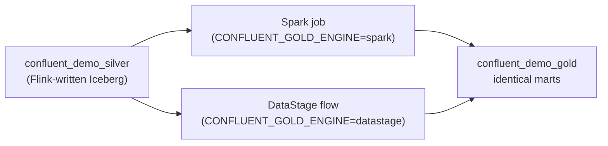

# C-alt — DataStage: No-Code Gold for the Confluent Path

!!! abstract "What this page is"
    The Confluent streaming path builds its **Silver** layer with Flink, then builds **Gold**
    with a *second* engine. By default that engine is watsonx.data **Spark** (code-first). This
    page covers the alternative: **IBM DataStage** — the same Gold logic expressed as a visual,
    no-code ETL flow. Both engines read `confluent_demo_silver` and write the *same*
    `confluent_demo_gold` marts, so the parity contract is unchanged.

    > **One Silver, two ways to build Gold — pick the engine, get identical numbers.**

---

## Spark vs DataStage — same Gold, two engines

The choice is set in `.env` with `CONFLUENT_GOLD_ENGINE`:

| `CONFLUENT_GOLD_ENGINE` | How Gold is built | Demo story | Audience |
|---|---|---|---|
| `spark` (default) | A watsonx.data Spark job runs the Gold SQL | Code-first; reuses the Spark engine you already provisioned | Data engineers comfortable with code |
| `datastage` | An IBM DataStage flow runs the same logic as visual ETL | Enterprise GUI ETL on the same lakehouse data — no code to read | Teams that standardise on DataStage |

Both paths produce the identical three marts in `confluent_demo_gold`:

- `confluent_gold_daily_sales` — one row per `order_date`
- `confluent_gold_category_performance` — one row per product category
- `confluent_gold_customer_360` — one row per customer (LEFT join, 0-filled)



!!! info "Why offer DataStage at all?"
    Many enterprises already run **DataStage** as their governed, audited ETL tool with a visual
    canvas, role-based access, and operational scheduling. Showing that DataStage lands the
    *exact same* Gold as Spark proves the lakehouse is engine-neutral: the business logic, not
    the tool, defines the result.

---

## Prerequisites

| Requirement | Detail |
|---|---|
| Silver layer built | `confluent_demo_silver` must already exist (run the [Confluent path](confluent-demo.md) with `--watsonxdata` first). |
| DataStage project | A Cloud Pak for Data project named **`ibmas-ingest-demo`** must exist. |
| Project id | `WXD_DATASTAGE_PROJECT_ID=2d2415ea-71b5-4215-a7b6-b32a4889611e` |
| Project name | `WXD_DATASTAGE_PROJECT_NAME=ibmas-ingest-demo` |
| Auth | Reuses `WXD_API_KEY` + `WXD_CPD_USERNAME` (`cpadmin`) against `WXD_CPD_HOST` — the same credentials as every other path. |
| Engine selector | Set `CONFLUENT_GOLD_ENGINE=datastage` in `.env`. |

All of these values live in `.env` (documented in [Configuration](configuration.md)); nothing is
hardcoded. If the project id or name differs in your cluster, change the env vars and the script
follows them automatically.

---

## Run it — `create_datastage_flow.py`

```bash
# 1. point the gold engine at DataStage
#    in .env:  CONFLUENT_GOLD_ENGINE=datastage

# 2. create (and run) the DataStage flow in the ibmas-ingest-demo project
python scripts/create_datastage_flow.py
```

The script authenticates to Cloud Pak for Data with your API key, targets the
`ibmas-ingest-demo` project, and creates the DataStage flow that reads
`confluent_demo_silver` and writes the three `confluent_demo_gold` marts. Because the auth and
project come entirely from `.env`, the same command works on any cluster once those values are set.

!!! tip "Preview before you build"
    Like the other scripts in this repo, prefer to inspect what will run first. Pass `--help`
    to see the available flags (project override, dry-run/preview, and confirmation options).

---

## Verify it matches everything else

The verification step is identical no matter which engine built Gold:

```bash
python scripts/reconcile_gold.py
```

A clean run reports **zero differing rows** when DataStage-built `confluent_demo_gold` is compared
against the dbt and Spark Gold marts — exactly as it does when Spark builds the Confluent Gold.
That is the proof: switching the Gold engine from Spark to DataStage changes *how* the marts are
built, never *what* they contain.

---

## Next steps

- Back to the streaming walkthrough: [Confluent — Streaming](confluent-demo.md).
- Choosing between engines and paths: [When to Use Which](choosing.md).
- Env vars and the hosts model: [Configuration](configuration.md).
- Script flags: [Scripts](scripts.md#confluent-streaming-scripts).
