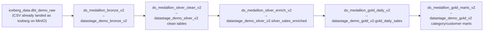
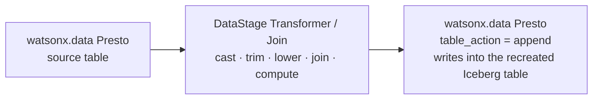

# E — DataStage: Full Medallion (bronze → silver → gold)

!!! abstract "What this page is"
    A **fourth, interchangeable way** to build the whole medallion — after dbt (SQL),
    Spark (Python), and cpdctl (raw load). Here **IBM DataStage** builds **bronze,
    silver, silver enrich, and gold** as ordered visual ETL flows, but every transformation is the *exact*
    dbt SQL **pushed down to the watsonx.data Presto engine** through **one connection**.
    DataStage orchestrates; Presto does the work; the numbers match dbt to the penny.

    > **Same medallion, a fourth engine — pick DataStage, get identical Gold.**

This is different from the [DataStage *gold-only* page](datastage-demo.md) (which swaps
the Confluent path's gold engine). This page builds the **complete** bronze→silver→gold
medallion as a standalone path, into its own `datastage_demo_*` schemas.

---

## The shape



Each flow uses the **IBM watsonx.data Presto** connection (`ibmas-presto`) for table
reads and writes, with DataStage stages making the transformation visible:



- **Bronze** (4 pairs) — raw passthrough + the 4 ingest-metadata columns.
- **Silver clean** (4 paths) — filters and type casts at source, then a Transformer performs
  `trim` / `lower` / `upper` and adds `transformed_at`.
- **Silver enrich** (1 path) — joins all four clean silver tables into `silver_sales_enriched`
  with three DataStage join stages, then a Transformer projects the enriched fact and computes
  `gross_amount`, `net_amount`, and `transformed_at`.
- **Gold daily** (1 path) — `gold_daily_sales` from the enriched silver fact.
- **Gold marts** (2 paths) — `gold_category_performance` from `gold_daily_sales` and
  `gold_customer_360` from the enriched fact plus the silver customer dimension.

---

## Why "only the Presto connection"?

The CSVs already live in the MinIO Iceberg bucket as the `dbt_demo_raw` tables. Presto
reads those Iceberg tables and writes new Iceberg tables — so a **single watsonx.data
Presto connection** covers both source and target. There is no second connector and no
file staging. Silver cleaning and enrichment are visual DataStage Transformer/Join stages;
gold aggregations remain SQL because they are aggregate `GROUP BY` marts over the already
enriched table.

!!! note "Dependency-safe flow split"
    DataStage can run independent branches in one flow concurrently, so dbt dependencies
    that read a table produced by another model are split into separate flow assets. The
    generated run order is:
    `bronze → silver_clean → silver_enrich → gold_daily → gold_marts`.

!!! note "Recreate before load"
    The `--create --run` path drops and recreates each target Iceberg table with Presto
    immediately before the corresponding DataStage job runs. The DataStage connector then
    uses append mode into an empty table, avoiding connector-side Iceberg REST replace
    failures while preserving recreate/empty-before-load semantics.

---

## Build it

```bash
source .venv/bin/activate
# 1) generate the version-controllable flow JSON
python scripts/datastage/create_medallion_flows_v2.py --build
# 2) prove the SQL equals dbt (no DataStage runtime needed — runs on live Presto)
python scripts/datastage/create_medallion_flows_v2.py --verify
# 3) create the target schemas + the ordered flows in the ibmas-ingest-demo project
python scripts/datastage/create_medallion_flows_v2.py --create
# 4) create, compile, reset/recreate targets, and run the flows in order
python scripts/datastage/create_medallion_flows_v2.py --create --run
```

Then open **Projects → ibmas-ingest-demo → Assets → DataStage flows** and you will see
`ds_medallion_bronze_v2`, `ds_medallion_silver_clean_v2`,
`ds_medallion_silver_enrich_v2`, `ds_medallion_gold_daily_v2`, and
`ds_medallion_gold_marts_v2`. Run them in that order, or let `--create --run` create
jobs and run them in order.

!!! warning "Design-time vs runtime"
    Creating the flows works today. **Compiling/running** them needs the DataStage
    **px-runtime** instance to be started — on this cluster the compile API currently
    returns `500` for *every* flow (including the pre-existing ones), meaning the runtime
    is scaled down, not that the flow is wrong. Start the DataStage instance in CPD, then
    compile and run bronze → silver clean → silver enrich → gold daily → gold marts.
    Until then, `--verify` is the proof of correctness.

---

## Parity — verified against dbt

`--verify` re-points each model's SQL at the populated `dbt_demo_*` tables and compares
to the dbt-built tables:

| Check | Result |
|---|---|
| All 13 models, row counts | match dbt exactly (50 / 500 / 1134 / 20 …) |
| `gold_daily_sales` Σ net_revenue | `$87,509.85` = dbt |
| `gold_category_performance` Σ total_revenue | `$87,509.85` = dbt |
| `gold_customer_360` Σ lifetime_value | `$87,509.85` = dbt |

---

## "Do I need a DataStage SDK? Can the MCP build the flow?"

**No SDK, and the MCP does not author ETL flows.** The
`ibm-watsonx-data-intelligence` MCP governs connections, metadata, glossary,
data-quality rules, lineage, and data products — it has no "create ETL flow" verb (it
*does* create DataStage flows as a by-product of data-quality rules, which is where the
project's 57 `DataStage flow of data rule …` assets came from). A DataStage flow is just
**pipeline-flow v3 JSON** stored as a `data_intg_flow` asset, created with the ordinary
Watson Data REST API:

```text
POST /data_intg/v3/data_intg_flows?project_id=…&data_intg_flow_name=…
body: { "pipeline_flows": <pipeline-flow v3 doc> }
```

So the only "SDK" needed is an HTTP client. See
[`scripts/datastage/README.md`](https://github.com/) for the connector-property contract
and the generator.
