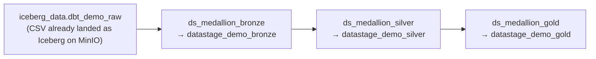
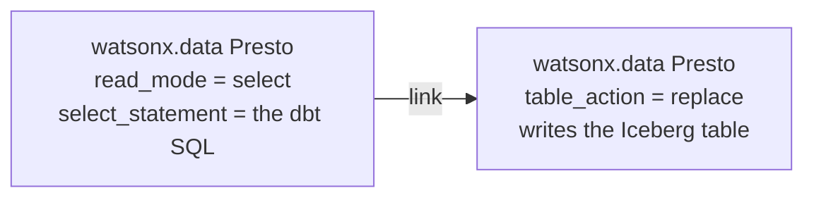

# E — DataStage: Full Medallion (bronze → silver → gold)

!!! abstract "What this page is"
    A **fourth, interchangeable way** to build the whole medallion — after dbt (SQL),
    Spark (Python), and cpdctl (raw load). Here **IBM DataStage** builds **bronze,
    silver, and gold** as three visual ETL flows, but every transformation is the *exact*
    dbt SQL **pushed down to the watsonx.data Presto engine** through **one connection**.
    DataStage orchestrates; Presto does the work; the numbers match dbt to the penny.

    > **Same medallion, a fourth engine — pick DataStage, get identical Gold.**

This is different from the [DataStage *gold-only* page](datastage-demo.md) (which swaps
the Confluent path's gold engine). This page builds the **complete** bronze→silver→gold
medallion as a standalone path, into its own `datastage_demo_*` schemas.

---

## The shape



Each dbt model becomes **one source → target connector pair**, both using the
**IBM watsonx.data Presto** connection (`ibmas-presto`):



- **Bronze** (4 pairs) — raw passthrough + the 4 ingest-metadata columns.
- **Silver** (5 pairs) — `cast` / `trim` / `lower` / `upper` / filter, plus
  `silver_sales_enriched` (the three INNER joins).
- **Gold** (3 pairs) — `gold_daily_sales`, `gold_category_performance`, `gold_customer_360`.

---

## Why "only the Presto connection"?

The CSVs already live in the MinIO Iceberg bucket as the `dbt_demo_raw` tables. Presto
reads those Iceberg tables and writes new Iceberg tables — so a **single watsonx.data
Presto connection** covers both source and target. There is no second connector and no
file staging: it is an ELT pattern where the transformation *is* SQL the Presto engine
runs. That is also why parity with dbt is exact — it is literally the same SQL on the
same engine.

!!! note "Two equivalence rewrites (so each flow runs in parallel)"
    DataStage runs all stages in a flow at once, so a stage must not read a table another
    stage in the *same* flow is still writing. Two models are rewritten to read only the
    **previous** layer, with provably identical results:

    - `silver_sales_enriched` inlines the four cleaning CTEs over **bronze** instead of
      reading the sibling silver tables.
    - `gold_category_performance` reads `silver_sales_enriched` directly instead of
      `gold_daily_sales` (each order has one `order_date`, so the per-day distinct-order
      counts sum to the per-category count).

---

## Build it

```bash
source .venv/bin/activate
# 1) generate the version-controllable flow JSON
python scripts/datastage/create_medallion_flows.py --build
# 2) prove the SQL equals dbt (no DataStage runtime needed — runs on live Presto)
python scripts/datastage/create_medallion_flows.py --verify
# 3) create the target schemas + the 3 flows in the ibmas-ingest-demo project
python scripts/datastage/create_medallion_flows.py --create
```

Then open **Projects → ibmas-ingest-demo → Assets → DataStage flows** and you will see
`ds_medallion_bronze`, `ds_medallion_silver`, `ds_medallion_gold`. Run them in order
(or wrap each in a DataStage job and chain them).

!!! warning "Design-time vs runtime"
    Creating the flows works today. **Compiling/running** them needs the DataStage
    **px-runtime** instance to be started — on this cluster the compile API currently
    returns `500` for *every* flow (including the pre-existing ones), meaning the runtime
    is scaled down, not that the flow is wrong. Start the DataStage instance in CPD, then
    compile and run bronze → silver → gold. Until then, `--verify` is the proof of
    correctness.

---

## Parity — verified against dbt

`--verify` re-points each model's SQL at the populated `dbt_demo_*` tables and compares
to the dbt-built tables:

| Check | Result |
|---|---|
| All 13 models, row counts | match dbt exactly (50 / 500 / 1134 / 20 …) |
| `gold_daily_sales` Σ net_revenue | `$87,509.85` = dbt |
| `gold_category_performance` Σ total_revenue | `$87,509.85` = dbt |
| `gold_customer_360` Σ lifetime_value | `$87,509.85` = dbt |

---

## "Do I need a DataStage SDK? Can the MCP build the flow?"

**No SDK, and the MCP does not author ETL flows.** The
`ibm-watsonx-data-intelligence` MCP governs connections, metadata, glossary,
data-quality rules, lineage, and data products — it has no "create ETL flow" verb (it
*does* create DataStage flows as a by-product of data-quality rules, which is where the
project's 57 `DataStage flow of data rule …` assets came from). A DataStage flow is just
**pipeline-flow v3 JSON** stored as a `data_intg_flow` asset, created with the ordinary
Watson Data REST API:

```text
POST /data_intg/v3/data_intg_flows?project_id=…&data_intg_flow_name=…
body: { "pipeline_flows": <pipeline-flow v3 doc> }
```

So the only "SDK" needed is an HTTP client. See
[`scripts/datastage/README.md`](https://github.com/) for the connector-property contract
and the generator.
