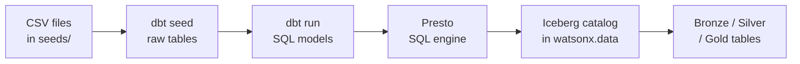

# Path A — dbt: SQL Governance

!!! abstract "What you will do in this path"
    This path walks you through the complete dbt pipeline from raw CSV files to queryable gold analytics tables.

    - Load four CSV seed files into the raw Iceberg schema in watsonx.data
    - Build Bronze, Silver, and Gold transformation models in dependency order
    - Run automated data quality tests against every model layer
    - Query the Gold marts to see final analytics results

    Estimated time: approximately 20 minutes.

---

## Why dbt for This?

!!! info "The analytics engineering approach"
    dbt turns SQL into a software project: each transformation is a versioned `.sql` file, dbt runs them in dependency order, and every model gets tested and documented automatically. This is the "analytics engineering" approach — strong governance, readable lineage, but limited to what SQL can express.

    Contrast that with Path B (Spark), which uses Python for complex ETL that SQL cannot easily express, and with Path C (cpdctl), which uses the IBM CLI to ingest data into natively tracked Iceberg tables through the watsonx.data UI.

    dbt does not store any data itself. It writes SQL and sends it to **Presto** — the SQL engine inside watsonx.data. Presto then creates and populates the tables. The chain is:



---

## What dbt Builds in This Demo

!!! info "Iceberg + Parquet: how data is stored"
    Your source data starts as plain CSV files. When dbt runs, it converts those files into **Apache Iceberg tables** stored in **Parquet format** inside watsonx.data's MinIO object storage.

    **Parquet** stores data column-by-column rather than row-by-row. Because most analytics queries touch only a few columns (for example, just `price` and `date`), Parquet lets Presto skip every column it does not need, reading far less data. Parquet is also binary-compressed, so files are smaller and faster to scan than CSV. This demo uses PARQUET exclusively — ORC is not used.

    **Apache Iceberg** sits on top of those Parquet files and adds three capabilities: full table history so every change is recorded, time travel so you can query the table as it existed at a past point, and partition pruning so queries that filter on a column like `order_date` only read the relevant date folder rather than the entire table.

**Partitioning in this demo**

Two models are partitioned by `order_date`:

- `silver_sales_enriched` — the joined fact table at order-line grain
- `gold_daily_sales` — the aggregated daily sales mart

The dbt config that enables Iceberg + Parquet + partitioning is written directly in the SQL model file:

```sql
{{ config(
    materialized='table',
    properties={
      "format": "'PARQUET'",
      "partitioning": "ARRAY['order_date']"
    }
) }}
select order_date, category, ...
from {{ ref('silver_sales_enriched') }}
```

The `properties` dict passes through to Presto's `CREATE TABLE … WITH (…)` statement, which the Iceberg connector uses to set file format and partitioning at the storage level.

**Layer overview**

`gold_daily_sales` is a physical **TABLE**. `gold_category_performance` and `gold_customer_360` are **VIEWs** that read from it. Silver is where the joins happen: `silver_sales_enriched` stitches together order items, orders, products, and customers so Gold stays simple.

| Layer | Schema | Objects | Plain meaning |
|-------|--------|---------|---------------|
| Raw | `lakehouse_demo_raw` | `raw_customers`, `raw_products`, `raw_orders`, `raw_order_items` | Exact copies of the four CSV seed files as Iceberg tables |
| Bronze | `lakehouse_demo_bronze` | `bronze_customers`, `bronze_products`, `bronze_orders`, `bronze_order_items` | Source-like tables with ingest metadata columns added |
| Silver | `lakehouse_demo_silver` | `silver_customers`, `silver_orders`, `silver_products`, `silver_order_items`, `silver_sales_enriched` | Cleaned, typed, joined fact table — the single source of truth for Gold |
| Gold | `lakehouse_demo_gold` | `gold_daily_sales` (TABLE), `gold_category_performance` (VIEW), `gold_customer_360` (VIEW) | Analytics-ready aggregates for BI consumption |

---

## Workshop Steps

### Step 1: Activate the Environment

Navigate to the project directory and activate the Python virtual environment that contains the dbt adapter and helper scripts.

```bash
cd /Users/aseelert/GitHub/ibmas-watsonxdata-dbt
source .venv/bin/activate
```

!!! note "Why a virtual environment?"
    The virtual environment isolates this project's Python packages — including the `dbt-watsonx-presto` adapter — from anything else installed on your machine. You must activate it before running any script in this demo.

---

### Step 2: Import Connection Values

Refresh the Presto authentication token from the watsonx.data connection JSON so all subsequent commands can reach the cluster.

```bash
python scripts/prepare_watsonx_env.py
```

!!! info "What this does"
    This script reads your watsonx.data connection JSON, extracts the Presto endpoint and SSL certificate, and writes the values into `.env` and the `certs/` directory. It also refreshes the bearer token, which has a limited lifetime. Run this step at the start of every session.

Expected output:

```text
Watsonx endpoint: ibm-lh-lakehouse-presto651-presto-svc.apps.watson.ibmas-zocp-techcluster.org:443
SSL certificate written to certs/lh-ssl-ts.crt
Environment file .env updated
```

---

### Step 3: Create Schemas

Bootstrap the four Iceberg schemas in the `iceberg_data` catalog so dbt has somewhere to write its tables.

```bash
python scripts/bootstrap_watsonxdata.py
```

Expected output:

```text
Creating schema iceberg_data.lakehouse_demo_raw     ... OK
Creating schema iceberg_data.lakehouse_demo_bronze  ... OK
Creating schema iceberg_data.lakehouse_demo_silver  ... OK
Creating schema iceberg_data.lakehouse_demo_gold    ... OK
4 schemas ready.
```

!!! note "Run this once per environment"
    If the schemas already exist, the script skips them safely. You only need to re-run this if you clean up with `cleanup_watsonxdata.py` or start on a fresh cluster.

---

### Step 4: Load Raw CSV Data

dbt seed reads the four CSV files from `seeds/` and loads them into `lakehouse_demo_raw` as Iceberg tables.

```bash
bash scripts/dbt_env.sh seed --full-refresh
```

!!! info "What `--full-refresh` does"
    This flag tells dbt to drop and recreate the seed tables from scratch. Use it the first time and any time you want a clean slate. Without it, dbt skips seeds that already exist.

**Source CSV files:**

```text
seeds/raw_customers.csv      →   50 rows
seeds/raw_products.csv       →   20 rows
seeds/raw_orders.csv         →  500 rows
seeds/raw_order_items.csv    →  564 rows
                                 ─────────
                         total:  1 134 rows
```

**Iceberg tables created in `lakehouse_demo_raw`:**

```text
iceberg_data.lakehouse_demo_raw.raw_customers
iceberg_data.lakehouse_demo_raw.raw_products
iceberg_data.lakehouse_demo_raw.raw_orders
iceberg_data.lakehouse_demo_raw.raw_order_items
```

Expected dbt output (abbreviated):

```text
Running with dbt=1.8.x
Found 4 seeds, 9 models, 18 tests

Concurrency: 1 threads

1 of 4 START seed file lakehouse_demo_raw.raw_customers ... [OK]
2 of 4 START seed file lakehouse_demo_raw.raw_products  ... [OK]
3 of 4 START seed file lakehouse_demo_raw.raw_orders    ... [OK]
4 of 4 START seed file lakehouse_demo_raw.raw_order_items ... [OK]

Finished running 4 seeds in X.XX seconds.
PASS=4 WARN=0 ERROR=0 SKIP=0 TOTAL=4
```

---

### Step 5: Build Models

dbt runs all SQL models in dependency order — Bronze first, then Silver, then Gold. Each model is a `.sql` file in `models/`.

```bash
bash scripts/dbt_env.sh run
```

!!! info "Dependency order"
    dbt reads every `{{ ref('...') }}` call in your SQL files and builds a directed acyclic graph (DAG). It guarantees that no model runs before its upstream dependencies are ready. You never need to specify the order manually.

**What is created:**

| Model | Layer | Materialization | What it adds |
|-------|-------|-----------------|--------------|
| `bronze_customers`, `bronze_orders`, `bronze_products`, `bronze_order_items` | Bronze | TABLE | Ingest metadata: `_ingested_at`, `_ingested_by`, `_source_file`, `_ingest_batch_id` |
| `silver_customers`, `silver_orders`, `silver_products`, `silver_order_items` | Silver | TABLE | Typed fields, cleaned nulls, business-ready column names |
| `silver_sales_enriched` | Silver | TABLE (partitioned by `order_date`) | Full join across orders, order items, products, and customers — one row per order line |
| `gold_daily_sales` | Gold | TABLE (partitioned by `order_date`) | Aggregated revenue and units by date and category — completed orders only |
| `gold_category_performance` | Gold | VIEW | Category-level performance metrics reading from `gold_daily_sales` |
| `gold_customer_360` | Gold | VIEW | Customer lifetime value and order history reading from Silver |

Expected dbt output (abbreviated):

```text
1 of 9 START table model lakehouse_demo_bronze.bronze_customers ... [OK]
2 of 9 START table model lakehouse_demo_bronze.bronze_orders    ... [OK]
...
7 of 9 START table model lakehouse_demo_gold.gold_daily_sales   ... [OK]
8 of 9 START view  model lakehouse_demo_gold.gold_category_performance ... [OK]
9 of 9 START view  model lakehouse_demo_gold.gold_customer_360  ... [OK]

Finished running 7 table models, 2 view models in X.XX seconds.
PASS=9 WARN=0 ERROR=0 SKIP=0 TOTAL=9
```

---

### Step 6: Run Data Quality Tests

dbt tests check data quality rules defined in `schema.yml` files — rules like "every `order_id` must be unique" and "every order must reference a real customer".

```bash
bash scripts/dbt_env.sh test
```

!!! info "Where the test rules live"
    Tests are declared in `models/bronze/schema.yml`, `models/silver/schema.yml`, and `models/gold/schema.yml`. They use built-in dbt tests (`not_null`, `unique`, `accepted_values`, `relationships`) that dbt compiles into SQL and runs against the tables.

**What the tests verify:**

| Test type | Example rule | Layer |
|-----------|-------------|-------|
| `not_null` | Every `order_id` must have a value | Bronze, Silver |
| `unique` | No two rows share the same `customer_id` | Bronze, Silver |
| `relationships` | Every `order_id` in order items must exist in orders | Silver |
| `accepted_values` | `status` must be one of: `pending`, `completed`, `cancelled` | Silver |

Expected output (snippet):

```text
18 of 18 PASS accepted_values silver_orders__status ... [PASS in X.XXs]

Finished running 18 tests in X.XX seconds.
PASS=18 WARN=0 ERROR=0 SKIP=0 TOTAL=18
```

!!! warning "If a test fails"
    A failing test does not break your tables — the data is already written. A failure means a data quality issue exists that your pipeline rules caught. Check the failing test name: it tells you exactly which column in which model failed, and which rule was violated.

---

### Step 7: Query the Gold Marts

Run the query script to read results from the three Gold objects and display sample rows.

```bash
python scripts/query_gold.py
```

You can also query a single mart by name:

```bash
python scripts/query_gold.py daily_sales
python scripts/query_gold.py customer_360
```

!!! example "Sample output: gold_daily_sales"
    ```text
    order_date   | category      | order_count | units_sold | net_revenue
    -------------|---------------|-------------|------------|------------
    2024-01-15   | Electronics   |           3 |          5 |    1 247.50
    2024-01-15   | Home & Garden |           2 |          4 |      312.00
    2024-01-16   | Electronics   |           1 |          2 |      899.00
    ...
    ```

!!! example "Sample output: gold_customer_360"
    ```text
    customer_id | customer_name   | total_orders | lifetime_value | last_order_date
    ------------|-----------------|--------------|----------------|----------------
    C-0001      | Alice Nguyen    |            7 |       2 341.20 | 2024-03-18
    C-0002      | Bob Stein       |            3 |         487.50 | 2024-02-01
    ...
    ```

The Presto endpoint being queried is:
`ibm-lh-lakehouse-presto651-presto-svc.apps.watson.ibmas-zocp-techcluster.org:443`

---

## Layer-by-Layer Commands

!!! tip "Presenting slowly? Build one layer at a time."
    Instead of running the full pipeline in one command, use dbt's tag selector to build each layer in sequence. This lets you pause and explain what happened before moving to the next layer.

    ```bash
    # Build only Bronze models
    bash scripts/dbt_env.sh run --select tag:bronze

    # Build only Silver models (requires Bronze to exist)
    bash scripts/dbt_env.sh run --select tag:silver

    # Build only Gold models (requires Silver to exist)
    bash scripts/dbt_env.sh run --select tag:gold
    ```

    The tags are defined in `dbt_project.yml` under the `models:` section. Each layer has its own tag, so you can rebuild any single layer without touching the others.

---

## Semantic Models

dbt semantic models describe what each column in a mart *means* to downstream BI tools — for example, declaring that `net_revenue` is a measure and `category` is a dimension. This layer sits on top of the Gold models and makes them queryable through MetricFlow without writing raw SQL.

The semantic model definitions live in `models/semantic_models.yml`. See [Semantic Models](semantic-models.md) for the full reference.

---

## What to Do Next

You have completed Path A. The Bronze, Silver, and Gold layers are built, tested, and queryable.

- **Run Path B** — [Path B — Spark: Python ETL](spark-demo.md): build the same layers using a Spark application instead of SQL. Compare the resulting tables with the dbt output.
- **Compare results now** — [SQL Demo](sql-demo.md): run cross-path queries to confirm that dbt and Spark produce identical gold metrics.
