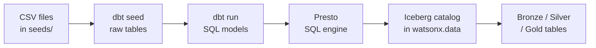

# Path A — dbt: SQL Governance

!!! abstract "What you will do in this path"
    This path walks you through the complete dbt pipeline from raw CSV files to queryable gold analytics tables.

    - Load four CSV seed files into the raw Iceberg schema in watsonx.data
    - Build Bronze, Silver, and Gold transformation models in dependency order
    - Run automated data quality tests against every model layer
    - Query the Gold marts to see final analytics results

    Estimated time: approximately 20 minutes.

---

## Why dbt for This?

!!! info "The analytics engineering approach"
    dbt turns SQL into a software project: each transformation is a versioned `.sql` file, dbt runs them in dependency order, and every model gets tested and documented automatically. This is the "analytics engineering" approach — strong governance, readable lineage, but limited to what SQL can express.

    Contrast that with Path B (Spark), which uses Python for complex ETL that SQL cannot easily express, and with Path C (cpdctl), which uses the IBM CLI to ingest data into natively tracked Iceberg tables through the watsonx.data UI.

    dbt does not store any data itself. It writes SQL and sends it to **Presto** — the SQL engine inside watsonx.data. Presto then creates and populates the tables. The chain is:



---

## What dbt Builds in This Demo

!!! info "Iceberg + Parquet: how data is stored"
    Your source data starts as plain CSV files. When dbt runs, it converts those files into **Apache Iceberg tables** stored in **Parquet format** inside watsonx.data's MinIO object storage.

    **Parquet** stores data column-by-column rather than row-by-row. Because most analytics queries touch only a few columns (for example, just `price` and `date`), Parquet lets Presto skip every column it does not need, reading far less data. Parquet is also binary-compressed, so files are smaller and faster to scan than CSV. This demo uses PARQUET exclusively — ORC is not used.

    **Apache Iceberg** sits on top of those Parquet files and adds three capabilities: full table history so every change is recorded, time travel so you can query the table as it existed at a past point, and partition pruning so queries that filter on a column like `order_date` only read the relevant date folder rather than the entire table.

**Partitioning in this demo**

Three models are partitioned by `month(order_date)`:

- `silver_orders` — typed order headers
- `silver_sales_enriched` — the joined fact table at order-line grain
- `gold_daily_sales` — the aggregated daily sales mart

The `month()` Iceberg transform groups all rows for a given calendar month into one partition folder. With 500 orders spanning 6 months (Jan–Jun 2026), this gives 6 partitions instead of 157 — well within Presto's 100 simultaneous open-writer cap.

The dbt config that enables Iceberg + Parquet + partitioning is written directly in the SQL model file:

```sql
{{ config(
    materialized='table',
    properties={
      "format": "'PARQUET'",
      "partitioning": "ARRAY['month(order_date)']"
    }
) }}
select order_date, category, ...
from {{ ref('silver_sales_enriched') }}
```

The `properties` dict passes through to Presto's `CREATE TABLE … WITH (…)` statement, which the Iceberg connector uses to set file format and partitioning at the storage level.

**Layer overview**

`gold_daily_sales` is a physical **TABLE**. `gold_category_performance` and `gold_customer_360` are **VIEWs** that read from it. Silver is where the joins happen: `silver_sales_enriched` stitches together order items, orders, products, and customers so Gold stays simple.

| Layer | Schema | Objects | Plain meaning |
|-------|--------|---------|---------------|
| Raw | `lakehouse_demo_raw` | `raw_customers`, `raw_products`, `raw_orders`, `raw_order_items` | Exact copies of the four CSV seed files as Iceberg tables |
| Bronze | `lakehouse_demo_bronze` | `bronze_customers`, `bronze_products`, `bronze_orders`, `bronze_order_items` | Source-like tables with ingest metadata columns added |
| Silver | `lakehouse_demo_silver` | `time_spine_daily`, `silver_customers`, `silver_orders`\*, `silver_products`, `silver_order_items`, `silver_sales_enriched`\* | Cleaned, typed; `silver_sales_enriched` joins all four entities as the single source for Gold |
| Gold | `lakehouse_demo_gold` | `gold_daily_sales`\* (TABLE), `gold_category_performance` (VIEW), `gold_customer_360` (VIEW) | Analytics-ready aggregates for BI consumption |

\* partitioned by `month(order_date)`

---

## Workshop Steps

### Step 1: Activate the Environment

Navigate to the project directory and activate the Python virtual environment that contains the dbt adapter and helper scripts.

```bash
cd /Users/aseelert/GitHub/ibmas-watsonxdata-dbt
source .venv/bin/activate
```

!!! note "Why a virtual environment?"
    The virtual environment isolates this project's Python packages — including the `dbt-watsonx-presto` adapter — from anything else installed on your machine. You must activate it before running any script in this demo.

---

### Step 2: Import Connection Values

Refresh the Presto authentication token from the watsonx.data connection JSON so all subsequent commands can reach the cluster.

```bash
python scripts/prepare_watsonx_env.py
```

!!! info "What this does"
    This script reads your watsonx.data connection JSON, extracts the Presto endpoint and SSL certificate, and writes the values into `.env` and the `certs/` directory. It also refreshes the bearer token, which has a limited lifetime. Run this step at the start of every session.

Expected output:

```text
Read connection details from: watsonx_data/instance_details.json
Wrote certificate chain to: certs/watsonxdata-ca.pem
Updated env file: .env

Imported values:
  WXD_INSTANCE_ID=<your-instance-id>
  WXD_HOST=ibm-lh-lakehouse-presto651-presto-svc.apps.watson.ibmas-zocp-techcluster.org
  WXD_PORT=443
  WXD_PRESTO_ENGINE_ID=presto651
  WXD_CPD_HOST=cpd-cpd-instance.apps.watson.ibmas-zocp-techcluster.org
  WXD_CPD_AUTH_URL=https://cpd-cpd-instance.apps.watson.ibmas-zocp-techcluster.org/icp4d-api/v1/authorize
  WXD_SSL_VERIFY=certs/watsonxdata-ca.pem
  WXD_CATALOG=iceberg_data
  WXD_SCHEMA=lakehouse_demo
```

---

### Step 3: Create Schemas

Bootstrap the four Iceberg schemas in the `iceberg_data` catalog so dbt has somewhere to write its tables.

```bash
python scripts/bootstrap_watsonxdata.py
```

Expected output:

```text
Connecting to ibm-lh-lakehouse-presto651-presto-svc.apps.watson.ibmas-zocp-techcluster.org:443, catalog=iceberg_data
Using schema location base: s3a://iceberg-bucket/lakehouse_demo
SQL> create schema if not exists iceberg_data.lakehouse_demo_raw with (location = 's3a://iceberg-bucket/lakehouse_demo/lakehouse_demo_raw')
ensured iceberg_data.lakehouse_demo_raw
SQL> create schema if not exists iceberg_data.lakehouse_demo_bronze with (location = 's3a://iceberg-bucket/lakehouse_demo/lakehouse_demo_bronze')
ensured iceberg_data.lakehouse_demo_bronze
SQL> create schema if not exists iceberg_data.lakehouse_demo_silver with (location = 's3a://iceberg-bucket/lakehouse_demo/lakehouse_demo_silver')
ensured iceberg_data.lakehouse_demo_silver
SQL> create schema if not exists iceberg_data.lakehouse_demo_gold with (location = 's3a://iceberg-bucket/lakehouse_demo/lakehouse_demo_gold')
ensured iceberg_data.lakehouse_demo_gold
```

!!! note "Run this once per environment"
    If the schemas already exist, the script skips them safely. You only need to re-run this if you clean up with `cleanup_watsonxdata.py` or start on a fresh cluster.

---

### Step 4: Load Raw CSV Data

dbt seed reads the four CSV files from `seeds/` and loads them into `lakehouse_demo_raw` as Iceberg tables.

```bash
bash scripts/dbt_env.sh seed --full-refresh
```

!!! info "What `--full-refresh` does"
    This flag tells dbt to drop and recreate the seed tables from scratch. Use it the first time and any time you want a clean slate. Without it, dbt skips seeds that already exist.

**Source CSV files:**

```text
seeds/raw_customers.csv      →     50 rows
seeds/raw_products.csv       →     20 rows
seeds/raw_orders.csv         →    500 rows
seeds/raw_order_items.csv    →  1 134 rows
                                 ─────────
                         total:  1 704 rows
```

**Iceberg tables created in `lakehouse_demo_raw`:**

```text
iceberg_data.lakehouse_demo_raw.raw_customers
iceberg_data.lakehouse_demo_raw.raw_products
iceberg_data.lakehouse_demo_raw.raw_orders
iceberg_data.lakehouse_demo_raw.raw_order_items
```

Expected dbt output:

```text
Running with dbt=1.11.7
Registered adapter: watsonx_presto=0.1.2
Found 13 models, 4 seeds, 34 data tests, 446 macros, 2 semantic models

Concurrency: 4 threads (target='dev')

1 of 4 START seed file lakehouse_demo_raw.raw_customers ........................ [RUN]
2 of 4 START seed file lakehouse_demo_raw.raw_order_items ...................... [RUN]
3 of 4 START seed file lakehouse_demo_raw.raw_orders ........................... [RUN]
4 of 4 START seed file lakehouse_demo_raw.raw_products ......................... [RUN]
4 of 4 OK loaded seed file lakehouse_demo_raw.raw_products ..................... [CREATE 20 in 5.02s]
1 of 4 OK loaded seed file lakehouse_demo_raw.raw_customers .................... [CREATE 50 in 6.21s]
3 of 4 OK loaded seed file lakehouse_demo_raw.raw_orders ....................... [CREATE 500 in 10.50s]
2 of 4 OK loaded seed file lakehouse_demo_raw.raw_order_items .................. [CREATE 1134 in 13.60s]

Finished running 4 seeds in 0 hours 0 minutes and 17.22 seconds (17.22s).

Completed successfully

Done. PASS=4 WARN=0 ERROR=0 SKIP=0 NO-OP=0 TOTAL=4
```

---

### Step 5: Build Models

dbt runs all SQL models in dependency order — Bronze first, then Silver, then Gold. Each model is a `.sql` file in `models/`.

```bash
bash scripts/dbt_env.sh run
```

!!! info "Dependency order"
    dbt reads every `{{ ref('...') }}` call in your SQL files and builds a directed acyclic graph (DAG). It guarantees that no model runs before its upstream dependencies are ready. You never need to specify the order manually.

**What is created:**

| Model | Layer | Materialization | What it adds |
|-------|-------|-----------------|--------------|
| `bronze_customers`, `bronze_orders`, `bronze_products`, `bronze_order_items` | Bronze | TABLE | Ingest metadata: `_ingested_at`, `_ingested_by`, `_source_file`, `_ingest_batch_id` |
| `time_spine_daily` | Silver | TABLE | Calendar spine for MetricFlow semantic models |
| `silver_customers`, `silver_products`, `silver_order_items` | Silver | TABLE | Typed fields, cleaned nulls, business-ready column names |
| `silver_orders` | Silver | TABLE (partitioned by `month(order_date)`) | Typed order headers; month partitioning keeps Presto writers within the 100-partition cap |
| `silver_sales_enriched` | Silver | TABLE (partitioned by `month(order_date)`) | Full join across orders, order items, products, and customers — one row per order line |
| `gold_daily_sales` | Gold | TABLE (partitioned by `month(order_date)`) | Aggregated revenue and units by date and category — completed orders only |
| `gold_category_performance` | Gold | VIEW | Category-level performance metrics reading from `gold_daily_sales` |
| `gold_customer_360` | Gold | VIEW | Customer lifetime value and order history reading from Silver |

Expected dbt output:

```text
Running with dbt=1.11.7
Registered adapter: watsonx_presto=0.1.2
Found 13 models, 4 seeds, 34 data tests, 446 macros, 2 semantic models

Concurrency: 4 threads (target='dev')

 1 of 13 START sql table model lakehouse_demo_bronze.bronze_customers ........... [RUN]
 2 of 13 START sql table model lakehouse_demo_bronze.bronze_order_items ......... [RUN]
 3 of 13 START sql table model lakehouse_demo_bronze.bronze_orders .............. [RUN]
 4 of 13 START sql table model lakehouse_demo_bronze.bronze_products ............ [RUN]
 1 of 13 OK created sql table model lakehouse_demo_bronze.bronze_customers ...... [SUCCESS in 7.19s]
 3 of 13 OK created sql table model lakehouse_demo_bronze.bronze_orders ......... [SUCCESS in 7.19s]
 5 of 13 START sql table model lakehouse_demo_silver.time_spine_daily ........... [RUN]
 6 of 13 START sql table model lakehouse_demo_silver.silver_customers ........... [RUN]
 4 of 13 OK created sql table model lakehouse_demo_bronze.bronze_products ....... [SUCCESS in 7.78s]
 7 of 13 START sql table model lakehouse_demo_silver.silver_orders .............. [RUN]
 2 of 13 OK created sql table model lakehouse_demo_bronze.bronze_order_items .... [SUCCESS in 8.98s]
 8 of 13 START sql table model lakehouse_demo_silver.silver_products ............ [RUN]
 5 of 13 OK created sql table model lakehouse_demo_silver.time_spine_daily ...... [SUCCESS in 6.69s]
 9 of 13 START sql table model lakehouse_demo_silver.silver_order_items ......... [RUN]
 6 of 13 OK created sql table model lakehouse_demo_silver.silver_customers ...... [SUCCESS in 7.98s]
 8 of 13 OK created sql table model lakehouse_demo_silver.silver_products ....... [SUCCESS in 7.30s]
 7 of 13 OK created sql table model lakehouse_demo_silver.silver_orders ......... [SUCCESS in 8.80s]
 9 of 13 OK created sql table model lakehouse_demo_silver.silver_order_items .... [SUCCESS in 5.65s]
10 of 13 START sql table model lakehouse_demo_silver.silver_sales_enriched ..... [RUN]
10 of 13 OK created sql table model lakehouse_demo_silver.silver_sales_enriched  [SUCCESS in 6.63s]
11 of 13 START sql view  model lakehouse_demo_gold.gold_customer_360 ............ [RUN]
12 of 13 START sql table model lakehouse_demo_gold.gold_daily_sales ............ [RUN]
11 of 13 OK created sql view  model lakehouse_demo_gold.gold_customer_360 ....... [SUCCESS in 4.31s]
12 of 13 OK created sql table model lakehouse_demo_gold.gold_daily_sales ....... [SUCCESS in 6.21s]
13 of 13 START sql view  model lakehouse_demo_gold.gold_category_performance .... [RUN]
13 of 13 OK created sql view  model lakehouse_demo_gold.gold_category_performance [SUCCESS in 1.30s]

Finished running 11 table models, 2 view models in 0 hours 0 minutes and 38.08 seconds (38.08s).

Completed successfully

Done. PASS=13 WARN=0 ERROR=0 SKIP=0 NO-OP=0 TOTAL=13
```

---

### Step 6: Run Data Quality Tests

dbt tests check data quality rules defined in `schema.yml` files — rules like "every `order_id` must be unique" and "every order must reference a real customer".

```bash
bash scripts/dbt_env.sh test
```

!!! info "Where the test rules live"
    Tests are declared in `models/bronze/schema.yml`, `models/silver/schema.yml`, and `models/gold/schema.yml`. They use built-in dbt tests (`not_null`, `unique`, `accepted_values`, `relationships`) that dbt compiles into SQL and runs against the tables.

**What the tests verify:**

| Test type | Example rule | Layer |
|-----------|-------------|-------|
| `not_null` | Every `order_id` must have a value | Bronze, Silver |
| `unique` | No two rows share the same `customer_id` | Bronze, Silver |
| `relationships` | Every `order_id` in order items must exist in orders | Silver |
| `accepted_values` | `status` must be one of: `pending`, `completed`, `cancelled` | Silver |

Expected output (abbreviated):

```text
Running with dbt=1.11.7
Registered adapter: watsonx_presto=0.1.2
Found 13 models, 4 seeds, 34 data tests, 446 macros, 2 semantic models

Concurrency: 4 threads (target='dev')

 1 of 34 START test accepted_values_silver_orders_status__completed__returned__pending__cancelled  [RUN]
 2 of 34 START test not_null_gold_category_performance_category ................. [RUN]
 ...
34 of 34 PASS unique_time_spine_daily_date_day ................................. [PASS in 2.30s]

Finished running 34 data tests in 0 hours 0 minutes and 27.95 seconds (27.95s).

Completed successfully

Done. PASS=34 WARN=0 ERROR=0 SKIP=0 NO-OP=0 TOTAL=34
```

!!! warning "If a test fails"
    A failing test does not break your tables — the data is already written. A failure means a data quality issue exists that your pipeline rules caught. Check the failing test name: it tells you exactly which column in which model failed, and which rule was violated.

---

### Step 7: Query the Gold Marts

Run the query script to read results from the three Gold objects and display sample rows.

```bash
python scripts/query_gold.py
```

You can also query a single mart by name:

```bash
python scripts/query_gold.py daily_sales
python scripts/query_gold.py customer_360
```

!!! example "Sample output: gold_daily_sales"
    ```text
    Daily Sales
    ===========
    +------------+-------------+-------------+------------+-------------+
    | ORDER_DATE | CATEGORY    | ORDER_COUNT | UNITS_SOLD | NET_REVENUE |
    +------------+-------------+-------------+------------+-------------+
    | 2026-01-03 | Electronics |           1 |          4 |      392.00 |
    | 2026-01-03 | Home        |           2 |          6 |      182.40 |
    | 2026-01-03 | Outdoor     |           1 |          2 |      102.10 |
    | 2026-01-05 | Electronics |           1 |          2 |      261.00 |
    | 2026-01-06 | Electronics |           3 |          4 |      344.80 |
    | 2026-01-06 | Home        |           2 |          3 |       64.93 |
    | 2026-01-06 | Office      |           2 |          3 |      158.25 |
    | 2026-01-06 | Outdoor     |           1 |          3 |      226.95 |
    ...
    494 rows
    ```

!!! example "Sample output: gold_customer_360"
    ```text
    Customer 360
    ============
    +-------------+------------+-----------+-----------------------------+---------+-------------+------------------+-----------------+----------------+------------------+----------------+
    | CUSTOMER_ID | FIRST_NAME | LAST_NAME | EMAIL                       | COUNTRY | SIGNUP_DATE | COMPLETED_ORDERS | RETURNED_ORDERS | PENDING_ORDERS | CANCELLED_ORDERS | LIFETIME_VALUE |
    +-------------+------------+-----------+-----------------------------+---------+-------------+------------------+-----------------+----------------+------------------+----------------+
    |       1,042 | Sora       | Yamamoto  | sora.yamamoto@example.com   | GB      | 2026-01-26  |               15 |               1 |              0 |                0 |        3485.96 |
    |       1,004 | Noah       | Smith     | noah.smith@example.com      | DE      | 2025-12-02  |               13 |               1 |              0 |                2 |        3443.59 |
    |       1,048 | Rita       | Moreau    | rita.moreau@example.com     | ES      | 2025-12-15  |               11 |               0 |              0 |                1 |        3227.60 |
    |       1,039 | Ben        | Taylor    | ben.taylor@example.com      | FR      | 2025-12-28  |               13 |               1 |              0 |                1 |        3120.76 |
    |       1,033 | Kwame      | Mensah    | kwame.mensah@example.com    | IT      | 2025-12-26  |                9 |               2 |              1 |                1 |        3099.22 |
    ...
    50 rows
    ```

The Presto endpoint being queried is:
`ibm-lh-lakehouse-presto651-presto-svc.apps.watson.ibmas-zocp-techcluster.org:443`

---

## One-command alternative: `dbt build`

`dbt build` is the modern single-command equivalent of seed + run + test. It executes everything in dependency order and runs tests right after each model is created — not as a separate step at the end.

```bash
bash scripts/dbt_env.sh build --full-refresh
```

The pipeline steps above (seed → run → test) are shown individually because they make it easier to explain what each phase does during a workshop. In day-to-day use `dbt build` is preferred.

---

## Layer-by-Layer Commands

!!! tip "Presenting slowly? Build one layer at a time."
    Instead of running the full pipeline in one command, use dbt's tag selector to build each layer in sequence. This lets you pause and explain what happened before moving to the next layer.

    ```bash
    # Build only Bronze models
    bash scripts/dbt_env.sh run --select tag:bronze

    # Build only Silver models (requires Bronze to exist)
    bash scripts/dbt_env.sh run --select tag:silver

    # Build only Gold models (requires Silver to exist)
    bash scripts/dbt_env.sh run --select tag:gold
    ```

    The tags are defined in `dbt_project.yml` under the `models:` section. Each layer has its own tag, so you can rebuild any single layer without touching the others.

---

## Demo: What happens when data quality fails?

This optional scenario shows how dbt tests catch bad data before it reaches the gold layer. It is designed to be run during a live demo.

**Step 1 — Introduce a bad row**

Open `seeds/raw_orders.csv` and add one row with a duplicate `order_id` value:

```text
9999,1001,2026-01-10 08:00:00,completed,credit_card
9999,1002,2026-01-11 09:00:00,pending,paypal
```

Save the file, then reload the seed:

```bash
bash scripts/dbt_env.sh seed --full-refresh
```

**Step 2 — Run only the tests (models already exist)**

```bash
bash scripts/dbt_env.sh test --select raw_orders
```

Expected failure output:

```text
1 of 1 START test unique_raw_orders_order_id ..................................... [RUN]
1 of 1 FAIL 1 unique_raw_orders_order_id ......................................... [FAIL 1 in X.XXs]

Completed with 1 error, 0 partial successes, and 0 warnings:

Failure in test unique_raw_orders_order_id (models/bronze/bronze_sources.yml)
  Got 1 result, configured to fail if != 0
  compiled SQL at target/compiled/.../unique_raw_orders_order_id.sql
```

**Step 3 — Examine the failing SQL**

The compiled SQL shows exactly which rows violated the rule:

```sql
select order_id, count(*) as n
from iceberg_data.lakehouse_demo_raw.raw_orders
group by order_id
having count(*) > 1
```

**Step 4 — Fix and verify**

Remove the duplicate row from `seeds/raw_orders.csv`, reload, and re-run the test:

```bash
bash scripts/dbt_env.sh seed --full-refresh
bash scripts/dbt_env.sh test --select raw_orders
```

```text
1 of 1 PASS unique_raw_orders_order_id .......................................... [PASS in X.XXs]
Done. PASS=1 WARN=0 ERROR=0 SKIP=0 NO-OP=0 TOTAL=1
```

The key point: the failing test did not break the existing tables. The data in `lakehouse_demo_bronze` still has the last good values. Tests are a safety gate — they catch problems before bad data propagates downstream to Silver and Gold.

---

## Note on dbt sources

In standard dbt, raw tables loaded from outside dbt (via cpdctl, Fivetran, etc.) are declared in a `sources:` YAML block, and bronze models reference them with `{{ source('raw', 'raw_orders') }}` instead of `{{ ref() }}`. This makes the lineage graph accurate — it shows an external source layer feeding into bronze, rather than seeds feeding directly into bronze models.

The IBM `dbt-watsonx-presto 0.1.2` adapter does not support the `sources:` YAML declaration or `{{ source() }}` in model SQL. Bronze models in this demo therefore use `{{ ref('raw_orders') }}` to reference the seed-created raw tables. When IBM updates the adapter to support standard dbt sources, switching is a two-step change: add a `sources.yml` and replace `ref('raw_*')` with `source('raw', 'raw_*')` in all bronze models.

---

## Optional: Iceberg incremental model pattern

dbt supports **incremental models** that only process new or changed rows rather than rebuilding from scratch on every run. This is the core value proposition of dbt for large datasets — instead of reprocessing all 500 orders every time, you process only orders added since the last run.

The pattern uses the `is_incremental()` macro:

```sql
{{ config(
    materialized='incremental',
    unique_key='order_id',
    properties={
      "format": "'PARQUET'",
      "partitioning": "ARRAY['month(order_date)']"
    }
) }}

select
  cast(order_id as integer)                       as order_id,
  cast(customer_id as integer)                    as customer_id,
  cast(order_ts as timestamp)                     as order_ts,
  cast(cast(order_ts as timestamp) as date)       as order_date,
  lower(trim(status))                             as status,
  lower(trim(payment_method))                     as payment_method,
  current_timestamp                               as transformed_at
from {{ source('raw', 'raw_orders') }}
where order_id is not null

  -- Only rows newer than the latest timestamp already in this table
  and order_ts > (select max(order_ts) from {{ this }})

```

- **First run** (`--full-refresh`): the `is_incremental()` block is skipped — all rows are loaded.
- **Subsequent runs**: only rows where `order_ts > max(order_ts in the existing table)` are processed.

To try it, save this as `models/silver/silver_orders_incremental.sql` and run:

```bash
# First run — full load
bash scripts/dbt_env.sh run --select silver_orders_incremental --full-refresh

# Subsequent runs — incremental (only new rows)
bash scripts/dbt_env.sh run --select silver_orders_incremental
```

!!! note "Adapter support"
    Incremental model support depends on the `dbt-watsonx-presto` adapter version. The `append` strategy is most broadly supported. Check the adapter changelog if you encounter errors.

---

## Semantic Models

dbt semantic models describe what each column in a mart *means* to downstream BI tools — for example, declaring that `net_revenue` is a measure and `category` is a dimension. This layer sits on top of the Gold models and makes them queryable through MetricFlow without writing raw SQL.

The semantic model definitions live in `models/semantic_models.yml`. See [Semantic Models](semantic-models.md) for the full reference.

---

## Optional: Iceberg time travel demo

Iceberg records every `dbt run` as an immutable snapshot. The time travel script connects directly to Presto, reads the `$snapshots`, `$history`, and `$partitions` metadata tables, and issues a `FOR VERSION AS OF` query so you can see what the table looked like at a past snapshot — without restoring a backup.

```bash
# load env then run
set -a && source .env && set +a
python scripts/demo_time_travel.py
```

Expected output:

```
------------------------------------------------------------
Step 1: Capture the current snapshot ID (our undo point)
------------------------------------------------------------
  Latest snapshot : 5531925961270514674
  Committed at    : 2026-06-15 11:32:57.622 UTC
  Operation       : append

------------------------------------------------------------
Step 2: Current state of the table
------------------------------------------------------------
  Total rows: 500

  Status breakdown:
    completed          380  ############################################################################
    returned            70  ##############
    cancelled           33  ######
    pending             17  ###

------------------------------------------------------------
Step 3: Time travel — query the previous snapshot
------------------------------------------------------------
  Querying: SELECT COUNT(*) FROM silver_orders FOR VERSION AS OF 5531925961270514674
  Row count at snapshot 5531925961270514674: 500
  Row count now                            : 500
  (Counts match — no data changes between snapshots in this session.)
  Tip: run dbt run then re-run this script to see snapshot divergence.

------------------------------------------------------------
Step 4: Inspect full snapshot history
------------------------------------------------------------
  made_current_at                  snapshot_id            is_current_ancestor
  2026-06-15 11:32:57.622 UTC      5531925961270514674    True

------------------------------------------------------------
Step 5: Inspect partition layout
------------------------------------------------------------
  month           records    files
  2026-01              85        1
  2026-02              84        1
  2026-03             109        1
  2026-04              86        1
  2026-05              97        1
  2026-06              39        1

Done. Key takeaway: Iceberg never deletes old snapshots automatically —
every dbt run, seed, or INSERT creates a new snapshot you can query back to.
```

!!! tip "See diverging snapshots"
    Run `bash scripts/dbt_env.sh run --full-refresh` then run the script again.
    Step 3 will show a different row count at the old snapshot vs. the current state,
    proving the old data is still accessible via `FOR VERSION AS OF`.

---

## What to Do Next

You have completed Path A. The Bronze, Silver, and Gold layers are built, tested, and queryable.

- **Run Path B** — [Path B — Spark: Python ETL](spark-demo.md): build the same layers using a Spark application instead of SQL. Compare the resulting tables with the dbt output.
- **Compare results now** — [SQL Demo](sql-demo.md): run cross-path queries to confirm that dbt and Spark produce identical gold metrics.
