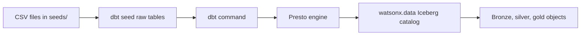

# dbt Demo Path

!!! abstract "What is dbt, in plain words?"
    **dbt (data build tool)** is a way to clean and reshape data using plain **SQL**, but organised like proper software. Instead of running SQL by hand in an editor, you save each transformation as a small file. dbt then:

    - runs all the files **in the correct order** (it works out what depends on what),
    - **tests** the results (for example: "every order must belong to a real customer"),
    - and **documents** the whole pipeline so anyone can see how a number was built.

    A useful picture: dbt is a **recipe book with version control**. The recipes are SQL; dbt makes sure they run in order and the dish comes out right every time. Crucially, **dbt does not store any data itself** — it just tells the database what to build.

In this demo, the dbt path is the easiest way to explain governed SQL transformations.

dbt does not store the data itself. It writes SQL and sends it to **Presto** (the SQL engine inside watsonx.data). Presto then creates and queries the tables. So the chain is: *your SQL files → dbt → Presto → tables in watsonx.data.*



!!! important "Why dbt has a raw schema"
    dbt normally transforms database tables with SQL. Because the source data is CSV files, `dbt seed` first loads those files into `lakehouse_demo_raw`. Those raw tables are the dbt-accessible copy of the true raw CSV files.

## What dbt Builds

| Layer | Schema | Objects |
| --- | --- | --- |
| Raw | `lakehouse_demo_raw` | `raw_customers`, `raw_products`, `raw_orders`, `raw_order_items` |
| Bronze | `lakehouse_demo_bronze` | Source-like tables plus ingest metadata |
| Silver | `lakehouse_demo_silver` | Clean typed reusable tables, plus `silver_sales_enriched` (the joined/enriched fact at order-line grain) |
| Gold | `lakehouse_demo_gold` | `gold_daily_sales` <span class="obj table">TABLE</span>, `gold_category_performance` <span class="obj view">VIEW</span>, `gold_customer_360` <span class="obj view">VIEW</span> |

`gold_daily_sales` is materialized as a physical **table**, while `gold_category_performance` and `gold_customer_360` are **views** that read from it (and from Silver). Silver is where the joins happen: `silver_sales_enriched` stitches together order items, orders, products, and customers so Gold can stay simple.

## Step 1: Activate Environment

```bash
cd /Users/aseelert/GitHub/ibmas-watsonxdata-dbt
source .venv/bin/activate
```

## Step 2: Import Connection Values

```bash
python scripts/prepare_watsonx_env.py
```

This makes sure `.env` and the SSL certificate are aligned with the latest watsonx.data connection JSON.

## Step 3: Create Schemas

```bash
python scripts/bootstrap_watsonxdata.py
```

Expected schemas:

```text
iceberg_data.lakehouse_demo_raw
iceberg_data.lakehouse_demo_bronze
iceberg_data.lakehouse_demo_silver
iceberg_data.lakehouse_demo_gold
```

## Step 4: Load Raw CSV Data

```bash
scripts/dbt_env.sh seed --full-refresh
```

This loads files from `seeds/` into `lakehouse_demo_raw`.

The source files are:

```text
seeds/raw_customers.csv
seeds/raw_products.csv
seeds/raw_orders.csv
seeds/raw_order_items.csv
```

The dbt raw tables are:

```text
iceberg_data.lakehouse_demo_raw.raw_customers
iceberg_data.lakehouse_demo_raw.raw_products
iceberg_data.lakehouse_demo_raw.raw_orders
iceberg_data.lakehouse_demo_raw.raw_order_items
```

## Step 5: Build Models

```bash
scripts/dbt_env.sh run
```

This creates:

- Bronze tables with `_ingested_at`, `_ingested_by`, `_source_file`, `_ingest_batch_id`
- Silver tables with typed fields and reusable business entities
- Gold marts for analytics

## Step 6: Run Tests

```bash
scripts/dbt_env.sh test
```

The tests check that:

- ids are present
- ids are unique
- order items connect to valid orders and products
- orders connect to valid customers
- order statuses are allowed values

## Step 7: Query Gold

```bash
python scripts/query_gold.py
```

Run one gold mart at a time:

```bash
python scripts/query_gold.py daily_sales
python scripts/query_gold.py customer_360
```

## Layer-By-Layer Commands

Use these when presenting slowly:

```bash
scripts/dbt_env.sh run --select tag:bronze
scripts/dbt_env.sh run --select tag:silver
scripts/dbt_env.sh run --select tag:gold
```

## What To Say In The Demo

!!! example "Simple explanation"
    dbt lets a team treat SQL transformations like software: versioned files, repeatable runs, tests, and clear model layers. In this demo, dbt is the governance-friendly SQL path through watsonx.data.
