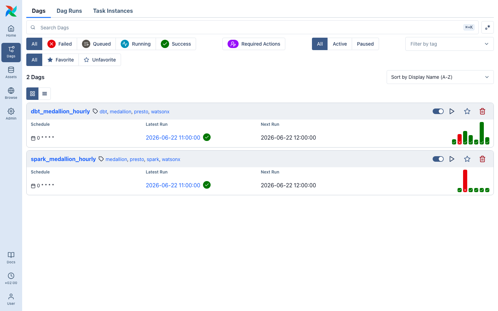

# Orchestrate with Airflow

Airflow schedules and observes work; it does not replace dbt, Spark, Kafka, or
Flink. In this demo it makes the sequence, retry policy, execution ownership,
and operational evidence visible.



## What a DAG adds

| Concern | Transformation engine | Airflow orchestration |
| --- | --- | --- |
| SQL build | dbt + Presto | Triggers and records the task |
| Spark application | watsonx.data Spark | Submits/polls the task in a delivery sequence |
| Dependencies | Model DAG / application code | Cross-system schedules and task ordering |
| Failure handling | Engine-specific error | Retries, alerts, and run history |

Use orchestration when the demo needs to show a repeatable operating sequence
rather than a presenter manually starting each component. Keep the workflow
small: a baseline load/build/test/validate sequence is clearer than one giant
DAG that tries to hide every alternative path.

Airflow schedules and observes work; it should not become the home of business
transformation logic. This workshop includes dbt and Spark DAGs that call the
same public execution paths described elsewhere.

```bash
bin/demo airflow
```


Use the DAG graph to discuss dependencies, retries, schedules, and operational
ownership. Keep dbt model dependencies in dbt and Spark transformation logic in
the submitted application. Airflow operational events can complement runtime
lineage, but they do not replace data-level lineage.
