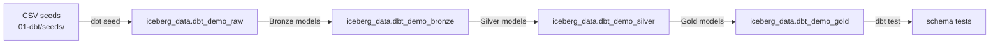
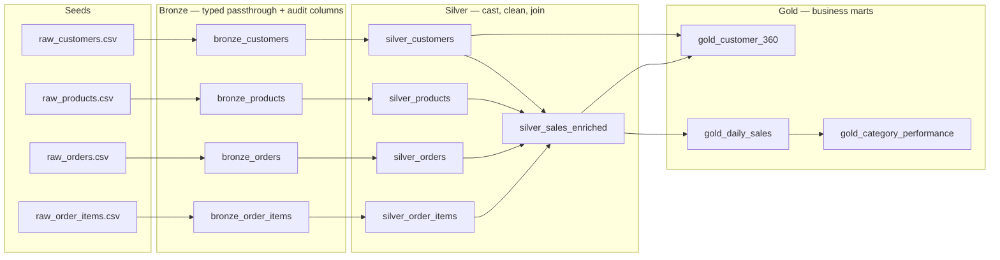

# Reference path — dbt and Presto

dbt is the workshop's reference implementation of the medallion pattern. Every
model here is an ordinary SQL `SELECT` statement — dbt's job is to resolve the
dependency graph between them, decide whether each one becomes a table or a
view, and run the tests attached to it. The engine that actually executes the
SQL is Presto, querying the same Iceberg tables on MinIO that the Spark and
Confluent paths write to. This page walks through the real model files in
`01-dbt/models/` so every claim below traces to code you can open yourself.

```bash
bin/demo dbt build
```



The four seed files are small on purpose — this is a teaching fixture, not a
scale test: `01-dbt/seeds/raw_customers.csv` (50 rows), `raw_products.csv` (20
rows), `raw_orders.csv` (500 rows), and `raw_order_items.csv` (1,134 rows).

## 1. Bronze: typed passthrough plus ingestion metadata

In this project, Bronze does **not** deduplicate or apply business rules. Each
of the four Bronze models (`01-dbt/models/bronze/bronze_customers.sql`,
`bronze_products.sql`, `bronze_orders.sql`, `bronze_order_items.sql`) is a
one-to-one `select` from its raw seed, with the same column names and no
casting, plus four extra audit columns that record how and when the row
arrived:

```sql
-- 01-dbt/models/bronze/bronze_customers.sql
select
  customer_id,
  first_name,
  last_name,
  email,
  signup_date,
  country,
  current_timestamp as _ingested_at,
  'dbt seed' as _ingested_by,
  'raw_customers.csv' as _source_file,
  '{{ env_var("WXD_INGEST_BATCH_ID", "demo_seed_batch") }}' as _ingest_batch_id
from {{ ref('raw_customers') }}
```

The reason Bronze stays this thin: it is meant to be an auditable copy of what
arrived, not the first cleaning step. If a downstream number ever looks wrong,
you can always trace it back to `_source_file` and `_ingest_batch_id` in
Bronze before assuming the source data was bad. See
[Ingest to Bronze](ingestion.md) for why loading and transforming are treated
as two separate concerns in this workshop, and why that distinction matters
for a production ingestion mechanism, not just a demo fixture. All four
models are materialized as physical `table`s (`+materialized: table` for the
Bronze folder in `01-dbt/dbt_project.yml`), landing in the `dbt_demo_bronze`
schema (schema names are derived from `WXD_BRONZE_SCHEMA`/`WXD_SCHEMA`).

## 2. Silver: typed, cleaned, and joined into one fact

Silver does two distinct things across its five models, and the difference
matters for explaining the layer to a workshop audience.

**Type casting and light cleaning** happens in the four one-per-entity models
(`silver_customers.sql`, `silver_products.sql`, `silver_orders.sql`,
`silver_order_items.sql`). Each one casts Bronze's untyped strings into real
types, trims whitespace, normalizes case, and drops rows that would break a
downstream join or aggregate. For example, `silver_customers.sql`:

```sql
select
  cast(customer_id as integer) as customer_id,
  trim(first_name) as first_name,
  trim(last_name) as last_name,
  lower(trim(email)) as email,
  cast(signup_date as date) as signup_date,
  upper(trim(country)) as country,
  current_timestamp as transformed_at
from {{ ref('bronze_customers') }}
where email is not null
```

The business reason for `lower(trim(email))`: an email with inconsistent
casing or stray whitespace would look like two different customers to any
`group by email` or lookup downstream — this line makes "the same customer" a
guaranteed string match, not a hope. `silver_orders.sql` similarly lower-cases
`status` and `payment_method` for the same reason, and derives `order_date`
from `order_ts` so Iceberg can partition on a plain date. `silver_order_items`
filters out `quantity <= 0` — a line item with zero or negative quantity is a
data-entry artifact, not a real sale, and would distort unit and revenue
totals if it survived into Gold.

**Enrichment and joining** happens in one model, `silver_sales_enriched.sql`,
which is the busiest file in the project and the one every Gold mart reads
from. It joins all four Silver entities to order-line grain and computes the
first derived business measures:

```sql
select
  oi.order_item_id,
  oi.order_id,
  o.order_date,
  ...
  cast(oi.quantity * p.unit_price as decimal(14, 2)) as gross_amount,
  cast(oi.quantity * p.unit_price * (1 - oi.discount_pct) as decimal(14, 2)) as net_amount,
  current_timestamp as transformed_at
from {{ ref('silver_order_items') }} oi
join {{ ref('silver_orders') }} o on oi.order_id = o.order_id
join {{ ref('silver_products') }} p on oi.product_id = p.product_id
join {{ ref('silver_customers') }} c on o.customer_id = c.customer_id
```

The model's own header comment spells out a deliberate design choice worth
repeating to a workshop audience: all three joins are `INNER JOIN` **on
purpose**. An order-item without a matching order or product, or an order
without a matching customer, is dropped here rather than kept with `NULL`
dimensions. In this demo the seeds are referentially complete, so nothing is
actually lost — but the policy is stated explicitly so nobody "fixes" it into
a `LEFT JOIN`, which would silently diverge from the Spark and Confluent
builds that use the same inner-join shape for parity. `net_amount` (quantity
× unit price × (1 − discount)) is the number every Gold mart's revenue column
ultimately derives from — computing it once here, instead of in three
different Gold models, is what keeps `gold_daily_sales` and
`gold_customer_360` reconcilable with each other.

A sixth Silver model, `time_spine_daily.sql`, is a gap-free calendar
generated with Presto's `sequence()` function; it exists only so the dbt
Semantic Layer's MetricFlow definitions (`01-dbt/models/semantic_models.yml`)
have a time dimension to join against. It is validated by `dbt parse` only —
MetricFlow itself is not installed in this workshop, so don't expect `dbt sl`
commands to run.

## 3. Gold: three marts answering three different questions

Gold has exactly one rule about where its numbers come from: every Gold model
reads from `silver_sales_enriched` (or, for `gold_customer_360`'s dimension
columns, `silver_customers`) — never straight from Bronze, and never by
re-joining the four Silver entities a second time. That single shared fact
table is what makes the three marts consistent with each other.

| Mart | Grain | Answers | Source |
| --- | --- | --- | --- |
| `gold_daily_sales` | one row per `order_date` × `category` | "How much did we sell, per day, per category?" | `silver_sales_enriched`, filtered to `status = 'completed'` |
| `gold_category_performance` | one row per `category` | "Which product categories perform best overall?" | rolls up `gold_daily_sales` |
| `gold_customer_360` | one row per `customer_id` | "What is this customer worth, and how are they behaving?" | `silver_customers` LEFT JOIN a per-customer metrics CTE over `silver_sales_enriched` |

`gold_daily_sales.sql` is materialized as a physical Iceberg `table`, partitioned
by `month(order_date)`, because it's the one mart every other Gold model
depends on and is worth persisting rather than recomputing on every query:

```sql
select
  order_date,
  category,
  count(distinct order_id) as order_count,
  sum(quantity) as units_sold,
  cast(sum(net_amount) as decimal(14, 2)) as net_revenue
from {{ ref('silver_sales_enriched') }}
where status = 'completed'
group by 1, 2
```

`gold_category_performance.sql` is a thin `sum()`-of-sums roll-up over that
table, pinned explicitly to `materialized='view'` rather than inheriting the
project's `WXD_GOLD_MATERIALIZED` default — a small but deliberate choice so
the mart's physical shape stays visible in the model file itself and doesn't
depend on an environment variable someone might change later.

`gold_customer_360.sql` answers a different kind of question — not "how did
the business do" but "who are our customers." Its metrics CTE counts orders
by status (`completed`, `returned`, `pending`, `cancelled`) and sums
`net_amount` for completed orders into `lifetime_value`, then `LEFT JOIN`s
that onto every row of `silver_customers` — deliberately a `LEFT JOIN`, unlike
the `INNER JOIN`s in `silver_sales_enriched`, specifically so customers with
zero orders still appear in the mart with their metrics coalesced to `0`
rather than disappearing. That is the one place in Gold where the join
direction changes, and it changes for a stated reason: adding customers with
no purchase history should never be confused with adding orders that don't
exist.

Presto's Iceberg connector does not support `CREATE MATERIALIZED VIEW`
(`NOT_SUPPORTED` at execution time), which is why both `gold_category_performance`
and `gold_customer_360` are plain `view`s rather than materialized views —
`macros/materialized_view.sql` exists only so that decision can flip
automatically if that gains support later.

!!! warning "Verify with IBM"
    Whether and when Presto's Iceberg connector on watsonx.data will add
    materialized-view support is a roadmap question, not something this repo
    can confirm — check the current watsonx.data or Presto release notes with
    IBM before promising it to a customer.

## 4. Running it

```bash
bin/demo setup          # once, to populate .env from the watsonx.data connection JSON
bin/demo dbt debug      # confirm the Presto connection and profile resolve
bin/demo dbt seed       # load the 4 CSVs into the *_raw schema
bin/demo dbt build      # run Bronze → Silver → Gold and the schema tests
```

`bin/demo dbt` is a thin passthrough to `scripts/02_dbt_env.sh`, which sources
this repo's `.env`, pins `DBT_PROFILES_DIR` to the tracked
`01-dbt/profiles/profiles.yml` (dbt's own default of `~/.dbt/profiles.yml`
would otherwise drift out of sync with the repo), and prefers the project's
`.venv/bin/dbt` over whatever `dbt` happens to be on `PATH`. `dbt build` is
the recommended single command for the workshop because it runs the models
**and** the schema tests (`not_null` / `unique` constraints declared in
`01-dbt/models/*/schema.yml`) in dependency order; `dbt run` alone skips
tests. There is no separate application test suite for this path — `dbt test`
is the tests.

If you're re-running the demo after an earlier pass, use
`bin/demo reset --dry-run` first to preview what a reset of the Iceberg
schemas would remove before actually doing it — see
[Scripts and automation](scripts.md) for the full option reference on
`scripts/02_dbt_env.sh` and `scripts/11_reset_demo.sh`.

Narrow a run or test to one layer or one model with `--select`:

```bash
bin/demo dbt run  --select bronze          # tag-based: one layer
bin/demo dbt run  --select silver_orders   # one model
bin/demo dbt test --select silver+         # one model and everything downstream
```

## 5. Bronze → Silver → Gold, this path specifically



## 6. Where dbt fits, and where it doesn't

dbt gives this workshop a transparent, version-controlled business-SQL
baseline: every transformation is a readable `SELECT`, every model has a
declared dependency, and every layer has tests attached. What it does **not**
do is replace connectors, file ingestion, Python processing, or streaming
infrastructure — that's why the Spark path (`03-spark/`) and the Confluent
streaming path (`04-confluent-streaming/`) exist alongside it, targeting the
same Gold contract from different execution engines. For the operational
tradeoffs of running dbt against an IBM-managed watsonx.data instance versus
the fully open-source composition used here, see
[Open source and IBM platform](platform-choice.md). For the underlying
wrapper scripts and their flags in full, see
[Scripts and automation](scripts.md).

References: [dbt SQL models](https://docs.getdbt.com/docs/build/sql-models),
[materializations](https://docs.getdbt.com/docs/build/materializations),
[seeds](https://docs.getdbt.com/docs/build/seeds), and
[`dbt build`](https://docs.getdbt.com/reference/commands/build).
