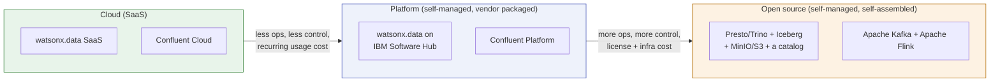

# Cloud vs. platform vs. open source

Customers usually ask "should we use watsonx.data?" as if it were one
decision. It is really three separate decisions stacked on top of each other:
who runs the software, who pays for what, and how much of the stack you are
willing to assemble yourself. This page gives that framework, then applies it
to the two stacks this workshop actually builds — the lakehouse (dbt/Spark →
Iceberg on Presto) and the streaming path (Kafka → Flink →
[04-confluent-streaming/](../streaming.md)).

## The three-way framework

- **Cloud** means someone else runs the software, patches it, scales it, and
  keeps it up at 3am — you consume it over the network and pay by usage (or by
  a subscription sized to usage). You trade control and on-prem/air-gap
  options for not having to staff the operations.
- **Platform** means you (or your infrastructure team) install and operate
  IBM's or Confluent's packaged, supported product on your own
  infrastructure — on-prem or in your own cloud account. You get the vendor's
  tooling, support contract, and enterprise features (auth, RBAC, HA
  helpers), but *you* run the upgrades, capacity planning, and outages.
- **Open source** means you take the raw upstream projects — Apache Iceberg,
  Presto/Trino, Apache Kafka, Apache Flink — and both run *and* integrate them
  yourself: choosing a catalog, a storage backend, a security model, and a
  support plan (which, unless you buy one separately, is a mailing list and
  GitHub issues). This workshop's default stack is deliberately built this
  way, on MinIO and self-managed Presto, so the composition is visible.

None of the three is "better" in the abstract — they trade the same three
things (who operates it, what it costs, how much you control) in different
directions. See [Open source and IBM platform](../platform-choice.md) for how
this workshop's own composition compares to the IBM Software Hub product
family at the capability level; this page is about the cloud/platform/open-
source axis specifically, not about which IBM service maps to which OSS tool.

## Lakehouse stack: watsonx.data vs. self-managed Trino/Iceberg

Apache Iceberg is a table-format specification maintained by the Apache
Software Foundation, not a product — it defines how table metadata and data
files are laid out, but it ships with no catalog and no storage of its own.
Anyone using Iceberg, including watsonx.data internally, still has to choose a
catalog (Hive, JDBC, Glue, Nessie, or a custom one) and an object-storage
backend (S3 or an S3-compatible system such as MinIO). That is exactly what
this workshop's dbt and Spark paths do by hand.

| Concern | Cloud — watsonx.data SaaS | Platform — watsonx.data on IBM Software Hub | Open source — this workshop's stack (Presto + Iceberg + MinIO) |
| --- | --- | --- | --- |
| Who installs/patches it | IBM | You (or a systems integrator), via Software Hub | You |
| Scaling | Elastic, managed automatically by IBM | Manual scaling via admin operations | Manual — add Presto workers, resize MinIO yourself |
| HA/DR | Built in, IBM-managed | Requires manual setup | Requires manual setup (not configured in this workshop) |
| Catalog & storage | Bundled behind the service | You still configure a metastore/catalog and storage | You explicitly choose one (this workshop uses a Hive-compatible catalog on MinIO) |
| Air-gap / offline | Not supported — "requires internet access to use" | Supported | Supported (nothing calls out) |
| Auth options | Standard IBM Cloud IAM | Adds Vault/Secret Storage, Kerberos for connectors | Whatever you build — this workshop uses a shared API key, not enterprise SSO |
| Licensing/cost model | Subscription, per-usage or per-user; Lite plan is capped (500 Resource Units, one instance, no BCDR) — non-production only | Enterprise license + infrastructure cost; full bring-your-own-license (BYOL) flexibility | No license cost; 100% of ops/integration/security is your team's time |
| Support | IBM support included in subscription | IBM support included in license | Community only (mailing lists, GitHub, Stack Overflow) unless you buy a third-party support contract |
| Premium features (e.g. governance/intelligence add-ons) | Provisioned as separate SaaS services rather than one bundled instance; at last check available in very few cloud regions | Available as on-prem software | Not applicable — you would build any equivalent yourself |

!!! warning "Verify with IBM"
    Region and edition availability for watsonx.data Premium on SaaS changes
    frequently — the "very few regions" note above is a snapshot from IBM's
    own deployment-comparison page as of 2026-08-31, not a durable fact.
    Confirm current region/edition availability with IBM before telling a
    customer what they can provision today.

## Streaming stack: Confluent Cloud vs. Confluent Platform vs. plain Apache Kafka

The same three-way split shows up on the Kafka side, and it is worth being
precise here: **Confluent is an independent company, not an IBM product or
acquisition.** IBM does not resell or own Confluent. This workshop's
[04-confluent-streaming/](../streaming.md) stack self-manages Confluent
Platform's community-licensed Kafka and Schema Registry container images
(`confluentinc/cp-kafka`, `confluentinc/cp-schema-registry`) via Docker,
plus a self-built Apache Flink image — it is not running Confluent Cloud,
Confluent's managed Flink service, or Tableflow, and it is not plain
upstream Apache Kafka either. That middle position (self-managed, using
Confluent's own images, without a Confluent license or support contract) is
itself a useful example for the "platform vs. open source" line: it shows
that even the "open source" column below is rarely 100% pure in practice.
The comparison below is useful for a customer who is choosing among all
three for a real deployment.

| Concern | Cloud — Confluent Cloud | Platform — Confluent Platform (self-managed) | Open source — plain Apache Kafka (this workshop's stack) |
| --- | --- | --- | --- |
| Who installs/patches it | Confluent (fully managed, built on their "Kora" engine) | You, via ZIP/TAR, RPM/DEB, Docker, Ansible, or Confluent for Kubernetes | You — this workshop's `04-confluent-streaming/start.sh` brings up plain Kafka + Flink in Docker |
| Scaling | Automatic, elastic (billed in "eCKUs") | Manual — you plan and resize brokers/partitions | Manual |
| Schema Registry, ksqlDB | Included | Included, under the Confluent Community License (source-available, not Apache 2.0) | Not included — core Kafka has no schema registry |
| RBAC, Tiered Storage, Cluster Linking, Control Center | Included | Included, under the separate commercial Confluent Enterprise License | Not available — you would build or buy equivalents separately |
| SLA | Up to 99.99% uptime on higher tiers; Confluent for Government is FedRAMP Moderate Authorized | Whatever you engineer and can support internally | None — community support only |
| Licensing | Consumption-based (eCKUs) — Basic tier can start near $0/month, Enterprise tiers priced per eCKU-hour | Mixed: Apache 2.0 core + Confluent Community License + commercial Confluent Enterprise License, by component | Apache License 2.0, governed by the Apache Software Foundation, on every component |
| Support | Included in subscription | Included in license | Mailing list, GitHub, Stack Overflow only |

!!! warning "Verify with IBM"
    Confluent Cloud's exact eCKU rates and tier starting prices are a live
    pricing-page snapshot, not a stable published price list — re-check
    confluent.io's pricing page before quoting a number to a customer. This
    is a Confluent pricing question, not an IBM one, but customers often ask
    it in the same conversation as watsonx.data licensing, so flag it the
    same way.

## Decision checklist

Walk a customer through these questions in order — each one narrows the
choice, and the honest answer is often "it depends on constraints you already
have," not a technology preference:

1. **Is there a hard requirement for air-gapped, on-prem, or data-residency
   deployment?** If yes, cloud/SaaS is out; choose platform or open source.
2. **Does the team have (or want to build) 24/7 operations capacity —
   patching, scaling, HA, incident response — for this system?** If no,
   lean cloud. If yes, platform or open source become viable.
3. **Do you need vendor support with an SLA, or is community support (mailing
   list, GitHub issues) acceptable for this workload's risk profile?** No SLA
   tolerance rules out plain open source for anything customer-facing.
4. **Is the workload production-critical, or is this exploration/prototyping?**
   Lite/free SaaS tiers (e.g. watsonx.data SaaS Lite's 500 Resource Unit cap,
   or Confluent Cloud's Basic tier) are explicitly not meant for production.
5. **Do you need enterprise auth/security features** (Kerberos, Vault/Secret
   Storage, custom JDBC connectors, RBAC, Tiered Storage) **that are
   platform-only or missing from plain open source?** If yes, that alone can
   rule out both cloud SaaS (some features are platform-only) and plain OSS
   (missing entirely without extra build work).
6. **What is the real cost basis — usage-based subscription, license +
   infrastructure, or engineering time?** These are different budget lines
   (opex vs. capex vs. headcount), and the cheapest-looking option on paper is
   not always the cheapest in practice once operational risk is priced in.
7. **How much of this stack do you already operate elsewhere?** A team
   already running Kubernetes and object storage at scale absorbs open source
   more cheaply than a team doing it for the first time.

None of these questions has a universally correct answer — they exist so the
decision is made against the customer's actual constraints, not against a
vendor's default recommendation. For how this maps onto this workshop's own
four ingestion paths, see
[Delivery-path decision](../delivery-options.md).

## References

- [Platform and deployment model comparison — watsonx.data](https://cloud.ibm.com/docs/watsonxdata?topic=watsonxdata-wxd_plfrm_dplmnt_cmpar)
- [Getting started with watsonx.data (Lite plan limits)](https://cloud.ibm.com/docs/watsonxdata?topic=watsonxdata-getting-started)
- [Cloud availability of IBM watsonx.data](https://cloud.ibm.com/docs/watsonxdata?topic=watsonxdata-feature_parity_wxd)
- [Compute isolation architecture — watsonx.data](https://cloud.ibm.com/docs/watsonxdata?topic=watsonxdata-compute_isolation)
- [Apache Iceberg](https://iceberg.apache.org)
- [Apache Kafka documentation](https://kafka.apache.org/documentation/)
- [Confluent Community License FAQ](https://www.confluent.io/confluent-community-license-faq/)
- [Confluent Platform overview](https://docs.confluent.io/platform/current/overview.html)
- [Confluent Cloud](https://www.confluent.io/confluent-cloud/)
- [Confluent Cloud pricing](https://www.confluent.io/confluent-cloud/pricing/)
