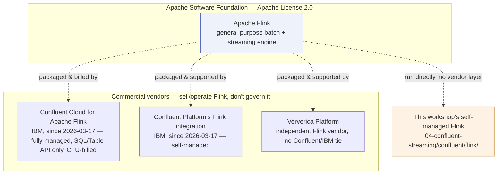

# Confluent, Flink, and the managed alternative

The [Event alternative](../streaming.md) page already runs a real, self-managed
streaming stack: Confluent Platform's community-licensed Kafka and Schema
Registry images, plus a self-built Apache Flink image this workshop starts,
checkpoints, and restarts by hand. That page is careful to say what it does
**not** run — Confluent Cloud, Confluent's own managed Flink service, or
Tableflow. This page is the deeper dive on that distinction: what Confluent
and Apache Flink actually are as separate things, how Confluent's commercial
Flink offering compares to the self-managed version this workshop uses, and
what a customer would actually be signing up for if they replaced this stack
with Confluent's platform.

## They are not the same kind of thing

**Apache Flink** is an Apache Software Foundation (ASF) open-source project —
a general-purpose, unified batch-and-streaming compute engine, licensed under
the Apache License 2.0 and governed by the ASF's own process, not by any one
company. Flink became a top-level Apache project in December 2014 and, per
its own documentation, is developed by over a hundred committers and well
over a thousand contributors. Kafka is one of many connectors Flink can read
from or write to — Flink does not require Kafka, and Kafka does not require
Flink.

**Confluent** is a company whose core product is a commercial layer built
around Apache Kafka: Confluent Platform (self-managed) and Confluent Cloud
(fully managed SaaS), plus adjacent capabilities like Schema Registry, ksqlDB,
and Tableflow (see [Event alternative](../streaming.md) for how this
workshop uses Confluent Platform's Kafka and Schema Registry images without
Tableflow or managed Flink). Since 2023, Confluent has also sold and operated
Apache Flink itself — as a
component bundled into self-managed Confluent Platform, and as a fully
managed, serverless service in Confluent Cloud. That is the one place the two
projects genuinely intersect: Confluent packages, operates, and bills for
Flink, but it does not govern the open-source project the way it partly
shapes licensing on some of its own Kafka ecosystem tools.

**Confluent is now an IBM subsidiary.** IBM announced its acquisition of
Confluent on 2025-12-08, and the deal closed on 2026-03-17 at an
approximately $11 billion valuation; Confluent delisted from Nasdaq. That
means Confluent's Flink offering — described in the table below — is, as of
this workshop's last update, an IBM-owned product, not an independent
vendor's. It does not change the ASF-governance point above: Apache Flink
itself remains a top-level Apache Software Foundation project, owned by no
company, IBM included. Confluent (and now IBM, through Confluent) packages,
operates, and bills for Flink; it still does not govern the open-source
project.

Confluent is not the only company that sells Flink expertise, either — this
is worth being precise about so "Confluent" and "Flink" don't collapse into
one brand in a customer's head. Ververica (formerly "data Artisans," a
company founded by several of Flink's original creators, later acquired by
Alibaba) is an independent commercial Flink platform vendor with no
Confluent or IBM ownership.

!!! warning "Verify with IBM"
    Whether IBM plans to keep selling Confluent Cloud for Apache Flink under
    the Confluent brand, rebrand it as an IBM/watsonx.data product, or fold
    it into watsonx.data integration's DataStage real-time flows / StreamSets
    story (see [watsonx.data integration](integration.md)) was not confirmed
    in this research pass — ibm.com/docs pages on this topic returned
    access-restricted responses, and the acquisition only closed on
    2026-03-17. Do not tell a customer how IBM plans to position this
    product without checking directly with IBM first.

## Three ways to run Flink

| Concern | Self-managed Apache Flink (this workshop) | Confluent Platform's Flink integration (self-managed, IBM/Confluent-supported) | Confluent Cloud for Apache Flink (fully managed, IBM/Confluent) |
| --- | --- | --- | --- |
| Who installs/operates it | This repository — a custom `wxd-flink:1.20` image, started, checkpointed, and restarted as ordinary containers (`04-confluent-streaming/confluent/flink/Dockerfile`) | You, packaged and supported as part of a Confluent Platform license | Confluent — described as a "fully managed, serverless" service with elastic autoscaling |
| APIs available | Full Flink SQL, Table API, and DataStream/ProcessFunction Java APIs — whatever upstream Flink ships | Broader source flexibility than the cloud offering — Confluent states Confluent Platform "enables use of Flink with a variety of sources outside Apache Kafka" | SQL and Table API (Python, Java) via browser workspaces, CLI, or a VS Code extension; the DataStream API is not exposed |
| Kafka integration | Manual — this workshop's Flink jobs declare Kafka source/sink connectors and Avro schemas by hand | Configured by the platform operator | "Zero-config" — Kafka topics become queryable Flink tables automatically |
| Schema Registry | Manual `format = 'avro-confluent'` wiring per job (see [Event alternative](../streaming.md)) | Integrated | Integrated |
| Billing/licensing | No license cost; Apache 2.0 | Included in a Confluent Platform license (component-level licensing details not independently confirmed here) | Usage-based — billed in Confluent Flink Units (CFUs) consumed per minute, pay-as-you-go, with configurable spending limits |
| Non-Kafka sources | Whatever connectors you build or find upstream | Confluent states more flexibility than the cloud tier | Kafka-centric by design |
| Support | Community only (mailing lists, GitHub, Stack Overflow) | Included in the Confluent Platform license | Included in the Confluent Cloud subscription |

!!! warning "Verify with IBM"
    The exact licensing tier that gates Confluent Platform's Flink
    integration (bundled with a base license versus a separate add-on),
    current CFU rates, and region availability for Confluent Cloud for
    Apache Flink are all live product/pricing details that change on
    Confluent's own schedule. This table reflects Confluent's own product
    and documentation pages as fetched on 2026-08-31 — re-check
    docs.confluent.io before quoting a rate or an availability claim to a
    customer. This is a Confluent question, not an IBM one, but it is
    flagged the same way because it is exactly the kind of detail a customer
    conversation gets wrong if nobody re-checks it.

The trade-off is the same shape as every other cloud/platform/open-source
comparison in this workshop (see the streaming table on
[Cloud vs. platform vs. open source](cloud-platform-opensource.md#streaming-stack-confluent-cloud-vs-confluent-platform-vs-plain-apache-kafka)):
less to operate versus less control over exactly what runs, in exchange for a
usage-based bill instead of engineering time.

## Tableflow is a different product, not a Flink alternative

It is easy to conflate Tableflow with Flink because both sit between Kafka
and a lakehouse table, but they solve different problems. Tableflow
materializes an existing Kafka topic as an Iceberg or Delta table — a
topic-to-table bridge with no custom transformation logic. Flink is a
compute engine that can filter, join, and aggregate events *before* anything
is written anywhere. This workshop's Flink SQL jobs do both jobs at once —
transform, then write Iceberg — because that is what the self-managed Flink
Iceberg sink connector does; Tableflow would replace only the "write
Iceberg" half, not the transformation logic in
`04-confluent-streaming/confluent/flink/sql/silver_jobs.sql`. See
[Event alternative](../streaming.md) for the full picture of what this
workshop's streaming path actually runs.

## What this means for a customer conversation

1. **Don't let "Confluent" and "Flink" become synonyms in the room.** Confluent
   sells and operates a Kafka platform, and now a Flink service on top of it;
   it does not own or govern Apache Flink. Also don't assume "IBM" and
   "Confluent" mean identical things yet — Confluent became an IBM subsidiary
   on 2026-03-17, but how deeply its products integrate into the rest of the
   IBM/watsonx.data portfolio is still an open question.
2. **The managed Flink tier trades API surface for operational simplicity.**
   A team relying on Flink's DataStream/ProcessFunction API for custom
   stateful logic — not just SQL — cannot move to Confluent Cloud for Apache
   Flink without rewriting that logic in SQL/Table API first, or staying on a
   self-managed tier.
3. **This workshop's choice (self-managed Flink) is deliberate, not a
   downgrade.** It keeps every transformation step, in
   `04-confluent-streaming/confluent/flink/sql/`, readable and diffable in
   Git — the same trade-off the [Cloud vs. platform vs. open source](cloud-platform-opensource.md)
   decision checklist walks through for the rest of the stack.
4. **Confirm the exact release and entitlement before quoting a customer.**
   As with every IBM- or Confluent-adjacent claim in this workshop, the
   specifics above (APIs, billing units, licensing tiers) were captured from
   currently-reachable product/docs pages on 2026-08-31 and can move.

See also [Open source and IBM platform](../platform-choice.md) for how this
same cloud/platform/open-source framing extends across both the lakehouse and
streaming sides of the workshop, and
[Delivery-path decision](../delivery-options.md) for how the streaming path
fits next to dbt, Spark, and DataStage as alternative ways to build the same
Gold contract.

## References

- [Apache Flink on Wikipedia](https://en.wikipedia.org/wiki/Apache_Flink) — governance, license, and top-level-project history
- [Apache Flink documentation](https://nightlies.apache.org/flink/flink-docs-stable/)
- [Confluent Cloud for Apache Flink product page](https://www.confluent.io/product/flink/)
- [Confluent Cloud for Apache Flink — comparison with Apache Flink](https://docs.confluent.io/cloud/current/flink/concepts/comparison-with-apache-flink.html)
- [Confluent Cloud for Apache Flink — billing (CFUs)](https://docs.confluent.io/cloud/current/flink/concepts/flink-billing.html)
- [Confluent Platform overview](https://docs.confluent.io/platform/current/overview.html)
- [Confluent Community License FAQ](https://www.confluent.io/confluent-community-license-faq/)
- [Tableflow overview](https://docs.confluent.io/cloud/current/topics/tableflow/overview.html)
