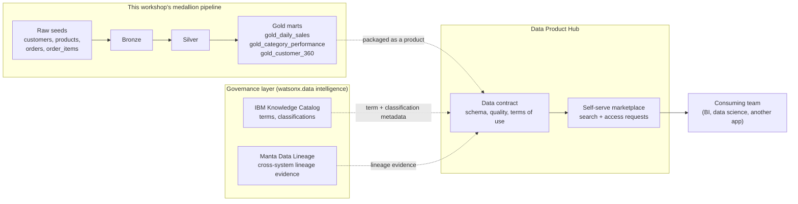

# Data Product Hub

This workshop builds three Gold marts — `gold_daily_sales`,
`gold_category_performance`, and `gold_customer_360` — and stops once they are
queryable in Presto and Metabase. IBM Data Product Hub is aimed at the step
most demos skip: once a Gold mart is trustworthy, how does anyone *outside*
the team that built it find it, understand what it means, and get access
without emailing the data engineer? This page explains what Data Product Hub
is, what it is not, and how it fits alongside IBM Knowledge Catalog (IKC) and
Manta Data Lineage, which the [lineage](../lineage.md) and
[catalog and governance](../catalog-governance.md) pages already cover.

## What is a "data product," and why would a Gold mart become one

A **data product** is a dataset that has been deliberately packaged for reuse
by people who did not build it: it has an owner, a description of what it
means and how current it is, visible lineage back to its sources, and an
explicit way to request access. The alternative — the default state of most
warehouses — is a schema full of tables that only the original author fully
understands, discoverable only by asking around.

Take `gold_customer_360` from this workshop as a concrete example. As a dbt
model it is just a view joining customers, orders, and order items behind the
scenes. As a **data product** it would additionally carry:

- An owner (who to ask when a number looks wrong)
- A plain-language description ("one row per customer, lifetime order count
  and spend, refreshed nightly from Silver")
- Lineage showing it descends from the four raw CSV seeds through Bronze and
  Silver — the same graph the [lineage page](../lineage.md) generates with
  `dbt docs`, OpenLineage, or Manta
- A **data contract**: the schema and refresh cadence a consumer can rely on,
  so a downstream team building a dashboard is not silently broken by a column
  rename
- An access-request workflow, instead of a Slack message to whoever last
  touched the model

`gold_daily_sales` and `gold_category_performance` are Gold-layer marts for
the same reason `gold_customer_360` is: they are the curated, business-ready
output of the medallion pipeline that this workshop's Bronze and Silver layers
exist to produce. Packaging them as data products is a governance step on
top of the pipeline, not a different pipeline — the medallion pattern is
covered in [Lakehouse and medallion](../foundations.md).

!!! warning "Verify with IBM"
    IBM's product marketing states Data Product Hub "is included in the IBM
    watsonx.data premium edition," which reads as bundling into a specific
    edition rather than a separately purchasable product. This workshop's
    cluster is not confirmed to be on that edition, and public marketing pages
    did not resolve a definitive standalone-vs-bundled licensing answer.
    Confirm the current SKU/edition mapping and exact availability on your
    Software Hub version with IBM directly before promising it in a customer
    demo.

## What Data Product Hub actually provides

| Concern | What Data Product Hub adds | What it is *not* |
| --- | --- | --- |
| Discovery | A self-serve marketplace where consumers browse and search published data products | Not a general-purpose data catalog by itself — that is IKC's job |
| Packaging | Groups tables/views/APIs into one described "product," optionally tagged with its lakehouse zone (Bronze/Silver/Gold) so consumers can judge maturity before use | Not a new storage format or a copy of the data — the underlying tables stay where they are |
| Governance | A **data contract** stating schema, quality, and terms of use; producers set domain-level access-control policies | Not a replacement for the access control already enforced by the lakehouse/catalog |
| Access | API-driven, self-serve access requests with configurable approval workflows | Not automatic access — approvals are still a human or policy decision |
| Scope | Described as "technology agnostic" — able to reference products across IBM and third-party lakehouses and source systems, not only watsonx.data | Not proven, in this workshop, against a non-watsonx.data source; treat as a vendor claim |

!!! warning "Verify with IBM"
    The "technology agnostic" / cross-platform claim above comes from IBM
    marketing copy, not from a hands-on test in this repository's
    environment and not from ibm.com/docs (the technical docs pages for Data
    Product Hub returned entitlement/authentication walls during this
    research and could not be read directly). Verify exactly which source
    systems and lakehouses are supported, and on which watsonx.data version,
    before citing this to a customer.

## How it relates to Intelligence, IKC, and Manta

Data Product Hub does not compete with IBM Knowledge Catalog or Manta Data
Lineage — it sits on top of them, inside the broader **watsonx.data
intelligence** umbrella that also covers governance and metadata management
(see [Open source and IBM platform](../platform-choice.md) for how that
umbrella compares to this workshop's OpenMetadata/OpenLineage stack).

- **IBM Knowledge Catalog (IKC)** is where a term, a business glossary
  category, and column-level classifications get defined and governed — the
  [catalog and governance](../catalog-governance.md) page in this workshop
  walks through the open-source analog of that with OpenMetadata. A data
  product typically *points at* assets already known to the catalog rather
  than duplicating catalog metadata.
- **Manta Data Lineage** answers "where did this column's values actually
  come from, across every hop, including outside the lakehouse" — the
  [lineage](../lineage.md) page covers this in detail, including where Manta
  is genuinely differentiated versus this workshop's OpenLineage/Marquez
  setup. A data product's lineage view is presentation of that evidence to a
  non-technical consumer, not a separate lineage engine.
- **watsonx.data intelligence** is IBM's name for the governance/metadata/
  lineage/data-product layer as a whole; Data Product Hub is one capability
  inside it, alongside a separately marketed "Agentic Data Intelligence"
  feature for creating and publishing data products via natural language.
  IBM's own materials distinguish this from "zero-copy data sharing,"
  which they attribute to watsonx.data itself rather than to the
  intelligence/Data Product Hub layer — the two are related but not
  identical capabilities.

!!! warning "Verify with IBM"
    The exact technical boundary between "Data Product Hub," IKC's own data
    marketplace-style features (if any, on your version), and Cloud Pak for
    Data's older data-sharing capabilities could not be confirmed from public
    pages in this research session. Ask IBM to draw this boundary concretely
    against the Software Hub version in your environment rather than
    inferring it from marketing pages.

## How this would sit on top of the workshop pipeline

## Where this leaves the workshop

Nothing in this repository's dbt, Spark, or streaming paths changes to
support Data Product Hub — it is a governance layer a customer would add on
the already-built Gold marts, not a fourth ingestion path alongside the ones
in [Delivery-path decision](../delivery-options.md). The honest framing for a
demo is: "your Gold layer is already the right shape to become a data
product; here is the governed marketplace IBM offers for publishing it,"
while being explicit that the exact edition, licensing, and cross-platform
scope need confirmation with IBM before a customer commits to it.

## References

- [IBM Data Product Hub product page](https://www.ibm.com/products/data-product-hub)
- [Data Product Hub: strategy for reusable data (IBM product blog)](https://www.ibm.com/new/product-blog/data-product-hub-strategy-reusable-data)
- [Streamline data access and compliance with IBM Data Product Hub (IBM product blog)](https://www.ibm.com/new/product-blog/streamline-data-access-compliance-ibm-data-product-hub)
- [IBM watsonx.data intelligence product page](https://www.ibm.com/products/watsonx-data-intelligence)
- [watsonx.data intelligence on Software Hub 5.4.x](https://www.ibm.com/docs/en/software-hub/5.4.x?topic=services-watsonxdata-intelligence)
- [IBM Knowledge Catalog on Software Hub 5.4.x](https://www.ibm.com/docs/en/software-hub/5.4.x?topic=services-knowledge-catalog)
- [Manta Data Lineage on Software Hub 5.4.x](https://www.ibm.com/docs/en/software-hub/5.4.x?topic=services-manta-data-lineage)
