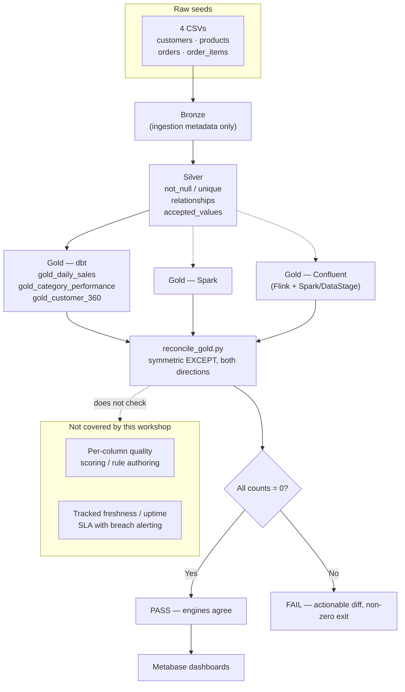

# Data quality and SLAs

Every path in this workshop ends at the same three Gold marts —
`gold_daily_sales`, `gold_category_performance`, `gold_customer_360` — and a
dashboard built on top of them in Metabase. None of that is worth anything if
the numbers cannot be trusted. This page explains what a data SLA actually is,
shows the concrete quality checks already wired into this repository, and is
honest about the gap between "dbt tests pass" and what IBM's governance
tooling adds on top.

## What is a data SLA, and why does it matter for trust in Gold data

A **data SLA** (service-level agreement) is a stated, checkable commitment
about a dataset — for example: "Gold is refreshed by 6am," "fewer than 0.1%
of rows fail a completeness check," or "every `order_id` in Gold has a
matching row in Silver." An SLA only matters if someone actually checks it and
raises an alarm on breach; a target nobody measures is just an aspiration.

A **data quality rule**, by contrast, is a single automated check —
"`customer_id` must never be null," "`status` must be one of four known
values" — that a quality *program* runs continuously and often scores (for
example, "this table is 98% complete"). SLAs are usually built out of many
quality rules plus a freshness/uptime target, not a separate mechanism.

Why this matters here specifically: a customer looking at `gold_customer_360`
in Metabase has no way to see whether a `lifetime_value` of `$0.00` means "this
customer really has spent nothing" or "a join silently dropped their orders."
Quality checks and lineage (see [Lineage methods](../lineage.md)) are what
turn "the dashboard shows a number" into "the number is defensible."

!!! warning "Verify with IBM"
    This research could not confirm that IBM ships a distinct, named "data
    SLA" feature (e.g., contractual freshness/uptime targets with automated
    breach alerting) in watsonx.data, watsonx.data intelligence, IBM
    Knowledge Catalog, or DataStage — as opposed to the quality *scoring* and
    *monitoring* capabilities described in the table below, which are better
    documented. Confirm directly with IBM whether a first-class SLA construct
    exists on your Software Hub version before promising one to a customer.

## How this workshop already demonstrates quality

This repository does not have a quality product bolted on — quality is
enforced two different ways, at two different layers, using tools already in
the stack.

### Schema tests: structural and referential integrity

Every dbt model in [01-dbt/models](https://github.com/aseelert/ibmas-watsonxdata-dbt/tree/main/01-dbt/models) declares tests in a
`schema.yml` file, and they run as part of `bin/demo dbt build` (or
`bash scripts/02_dbt_env.sh test` on its own). Concretely, in this repository
today:

| Check type | Where it is enforced | Example |
| --- | --- | --- |
| `not_null` / `unique` on every primary key | Raw seeds, Silver, and Gold (`customer_id`, `product_id`, `order_id`, `order_item_id`, and `category` in `gold_category_performance`) | `raw_customers.customer_id`, `silver_orders.order_id`, `gold_customer_360.customer_id` |
| `relationships` (referential integrity) | Silver, both order headers and order lines back to their dimensions | `silver_orders.customer_id → silver_customers.customer_id`; `silver_order_items.order_id → silver_orders.order_id`; `silver_order_items.product_id → silver_products.product_id` |
| `accepted_values` (domain constraint) | Silver order status | `silver_orders.status` must be one of `completed`, `returned`, `pending`, `cancelled` |
| `not_null` on grain columns | Gold | `gold_daily_sales.order_date`, `gold_daily_sales.category` |

These are real dbt data tests — compiled to SQL, run against Presto, and they
fail the build (non-zero exit) the moment a row violates them. That is a
legitimate, code-first analog to a quality rule: version-controlled, run on
every `dbt build`, and visible in `docs/scripts.md`-documented commands
rather than hidden in a UI. What it does *not* do: score an asset ("this
table is 97% complete"), trend that score over time, or let a non-technical
steward add a new rule without touching a YAML file and re-running dbt.

There is no source-freshness check configured in
[`01-dbt/models/bronze/bronze_sources.yml`](https://github.com/aseelert/ibmas-watsonxdata-dbt/blob/main/01-dbt/models/bronze/bronze_sources.yml)
— dbt supports a `freshness:` block on sources that would fail a build if the
raw data were older than a threshold, but this workshop does not use it,
because the seed CSVs are static demo data with no real-world arrival time.
On a real pipeline with a live source, that freshness check is the closest
native dbt equivalent to an SLA breach alert.

### Cross-engine reconciliation: proving the paths agree

[`scripts/reconcile_gold.py`](https://github.com/aseelert/ibmas-watsonxdata-dbt/blob/main/scripts/reconcile_gold.py) (invoked as
`bin/demo validate`) is a different kind of check, and it is worth being
precise about what it does and does not prove. For each of the three
canonical marts, it runs a **symmetric `EXCEPT`** in both directions between
a reference engine (dbt, when selected) and every other engine:

```sql
-- rows the reference has that the other engine is missing
SELECT <shared columns> FROM dbt.gold_daily_sales
EXCEPT
SELECT <shared columns> FROM spark.spark_gold_daily_sales
```

run again with the two tables swapped. Both counts have to be zero for a
`PASS`. The comparison always projects an explicit, shared column list
(`order_date, category, order_count, units_sold, net_revenue` for
`daily_sales`, and similar lists for the other two marts) rather than
`SELECT *`, so it is immune to column-order differences but catches any value
difference. It checks `--paths dbt,spark`, `dbt,confluent`, or all three, and
exits non-zero on any discrepancy — safe to drop into CI, and this is exactly
how [Validate and reconcile](../operations.md) uses it.

What this script proves: the same four seed CSVs, pushed through three
independent compute engines (dbt/Presto, Spark, and Confluent's
Flink+Spark/DataStage path), converge on **bit-identical** Gold output. What
it does *not* prove: that the source data itself is complete, valid, or
free of duplicates — it is a parity check on already-produced output, not a
column-level validation of raw input. A bug present in all three engines
identically would still show a clean `PASS`.



## What IBM's quality/SLA tooling adds on top

The honest framing for a demo: this workshop's tests genuinely catch broken
keys, orphaned references, and bad status values, and `reconcile_gold.py`
genuinely proves three engines agree — but neither is a substitute for a
governed quality program with scoring, trending, and a UI a non-technical
steward can use.

| Concern | This workshop | IBM tooling that would add value | Overlap or genuine gap |
| --- | --- | --- | --- |
| Structural checks (not-null, unique, referential integrity) | dbt schema tests, code-first, run on every `dbt build` | IBM Knowledge Catalog data quality rules can express the same checks | **Overlap.** This workshop's tests are a legitimate, if less discoverable, equivalent for these specific checks. |
| Quality *scoring* per column/asset, trended over time | Not present — a test either passes or fails the build | IBM Knowledge Catalog quality dimensions (completeness, validity, consistency, uniqueness) rolling up to an asset-level score on a dashboard | **Genuine gap.** Nothing in this repo produces a score or a trend line. |
| Non-technical rule authoring | Not present — every rule is YAML + SQL, requires a dbt run | IKC's rule-builder UI, aimed at data stewards rather than engineers | **Genuine gap**, and arguably the main value proposition of the IBM tooling for a non-engineering audience. |
| Heavy cleansing: standardization, matching/deduplication, "survive" merge logic | Not present — this workshop's data is already clean demo data | DataStage Enterprise Plus's QualityStage-derived stages (Investigate, Standardize, Match, Survive) plus a Data Rules stage | **Genuine gap.** This class of problem (messy real-world source data) is out of scope for this workshop by design. |
| Cross-engine output parity | `reconcile_gold.py` — symmetric `EXCEPT`, both directions, PASS/FAIL exit code | No direct IBM equivalent found for this specific check | Not something the IBM tools above are marketed to do; this script fills a gap of its own. |
| Freshness / uptime SLA with breach alerting | Not configured (dbt source `freshness:` is available but unused, since seeds are static) | Unclear — see caveat below | **Unverified**, not confirmed as a distinct IBM feature. |

!!! warning "Verify with IBM"
    IBM Knowledge Catalog / watsonx.data intelligence quality-rule mechanics
    (exact dimension names, whether scoring is per-column or per-asset, where
    the dashboard lives) are described here from IBM's historical Cloud Pak
    for Data / Watson Knowledge Catalog documentation. `ibm.com/docs` could
    not be reached live during this research session (a wholesale
    bot-detection block), so the exact current-version mechanics on your
    Software Hub release need direct confirmation with IBM before you state
    them as fact in a customer conversation. The same applies to DataStage
    Enterprise Plus's QualityStage-derived stages.

This gap is the same one described in
[Catalog, quality, and governance](../catalog-governance.md): "data quality"
in that page's comparison table is intentionally listed as "dbt tests and
separately composed profiling/validation" versus "watsonx.data intelligence
quality profiling, cleansing, and validation; DataStage Enterprise Plus
quality functions where entitled." This page exists to make the concrete
mechanics behind that one table row explicit, rather than leaving it as a
one-line comparison.

## Where this leaves the workshop

Nothing about this page changes what to run: `bin/demo dbt build` still
enforces the schema tests on every build, and `bin/demo validate` still
proves the three Gold paths agree. The honest pitch to a customer is:
"here are two real, running checks that already catch a category of real
bugs — broken keys, orphaned foreign keys, engines disagreeing — and here is
the governed rule-authoring and scoring layer IBM offers on top, for the
class of problems (messy source data, non-technical rule ownership) this
demo does not attempt to solve." See
[Open source and IBM platform](../platform-choice.md) for how this fits into
the broader open-source-versus-IBM comparison, and
[Data Product Hub](data-product-hub.md) for how a quality-checked Gold mart
becomes something a consumer outside the team can discover and trust.

## References

- [dbt data tests](https://docs.getdbt.com/docs/build/data-tests) — the `not_null`, `unique`, `relationships`, and `accepted_values` tests used in this workshop's `schema.yml` files
- [dbt source freshness](https://docs.getdbt.com/docs/build/sources#source-data-freshness) — the freshness-check mechanism this workshop does not currently use (static seed data)
- [watsonx.data intelligence on Software Hub 5.4.x](https://www.ibm.com/docs/en/software-hub/5.4.x?topic=services-watsonxdata-intelligence)
- [IBM Knowledge Catalog on Software Hub 5.4.x](https://www.ibm.com/docs/en/software-hub/5.4.x?topic=services-knowledge-catalog)
- [DataStage on Software Hub 5.4.x](https://www.ibm.com/docs/en/software-hub/5.4.x?topic=services-datastage)
- This repository: [`scripts/reconcile_gold.py`](https://github.com/aseelert/ibmas-watsonxdata-dbt/blob/main/scripts/reconcile_gold.py), [`01-dbt/models/silver/schema.yml`](https://github.com/aseelert/ibmas-watsonxdata-dbt/blob/main/01-dbt/models/silver/schema.yml), [`01-dbt/models/gold/schema.yml`](https://github.com/aseelert/ibmas-watsonxdata-dbt/blob/main/01-dbt/models/gold/schema.yml), [`01-dbt/models/bronze/bronze_sources.yml`](https://github.com/aseelert/ibmas-watsonxdata-dbt/blob/main/01-dbt/models/bronze/bronze_sources.yml)
