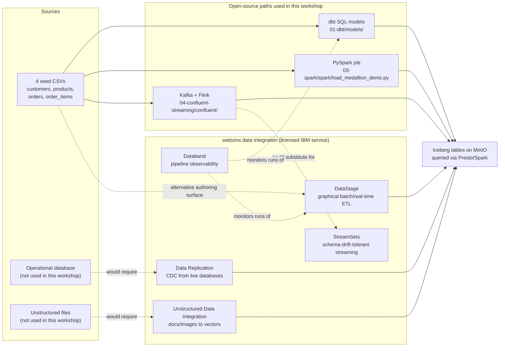

# watsonx.data Integration

This workshop moves the four seed CSVs (customers, products, orders,
order_items) through Bronze, Silver, and Gold using dbt, Spark, or a
Kafka/Flink streaming stack — all open source, all composed and operated by
whoever runs the workshop. **watsonx.data integration** is IBM's name for a
separate, licensed service family that does the same kind of job —
connecting to sources, moving and transforming data, watching pipelines run —
through a managed, mostly graphical product instead of code you write and
maintain yourself. This page explains what it is, maps its components to the
open-source tools already used here, and is explicit about what could not be
freshly verified against ibm.com/docs while writing it.

!!! warning "Verify with IBM"
    Every attempt to reach `ibm.com/docs` while researching this page
    returned an HTTP 403 or an in-page "you are not entitled to access this
    content" message — including for URLs this repository already cites
    elsewhere (see [Open source and IBM platform](../platform-choice.md)).
    The component list and descriptions below are carried over from this
    repository's own prior research and could not be re-confirmed live.
    Before quoting any of this to a customer, re-check it against a
    currently-reachable ibm.com/docs page or ask your IBM contact directly.

## What is it, in plain language

Think of watsonx.data integration as the "connect, move, and watch" layer
that would sit next to the workshop's lakehouse. Where this workshop's dbt
and Spark paths assume the CSVs are already sitting in a folder and someone
wrote SQL or PySpark by hand, watsonx.data integration is aimed at teams who
would rather point a graphical tool at a source system, drag connectors
together, and get monitoring for free — at the cost of a license and less
visibility into the exact SQL or code that runs. It is **not** the same
product as watsonx.data itself (the open lakehouse/Iceberg/Presto/Spark
service this whole workshop is built on) or **watsonx.data intelligence**
(governance, lineage, and data-product capabilities, covered on the
[Open source and IBM platform](../platform-choice.md) and
[Data Product Hub](data-product-hub.md) pages) — the three are separate,
separately-licensed service families under the same Software Hub umbrella.

## Components

| Component | What it does | Open-source equivalent used in this workshop |
| --- | --- | --- |
| DataStage | No-code/low-code graphical designer for batch and real-time ETL/ELT jobs, with prebuilt connectors to databases, files, and applications | dbt models (`01-dbt/models/`) and the PySpark job (`03-spark/spark/load_medallion_demo.py`) — hand-written SQL/code instead of a drag-and-drop canvas |
| StreamSets | Streaming and change-tolerant data movement, designed to keep pipelines running through upstream schema drift | The Kafka producers and Flink SQL jobs in `04-confluent-streaming/confluent/` — self-managed, and schema changes are the operator's problem, not an automated drift handler |
| Data Replication | Change data capture (CDC) — streams row-level inserts/updates/deletes out of an operational database as they happen | Not built in this workshop; the closest analog is the Kafka producers simulating new events, but there is no CDC connector reading a live source database |
| Unstructured Data Integration (UDI) | Turns unstructured content (documents, images, etc.) into vector embeddings for retrieval/AI use cases | Not represented in this workshop at all — every path here is structured, tabular CSV data |
| Databand (data observability) | Monitors pipeline runs — job failures, data quality drift, freshness — across orchestrators and ETL tools | dbt's own test framework (`dbt test`, `models/**/schema.yml`) for data-quality checks; Airflow's task-level success/failure UI (`05-airflow/airflow/dags/`) for run monitoring — neither is a dedicated observability product |

!!! warning "Verify with IBM"
    This component list (DataStage, StreamSets, Data Replication, UDI,
    Databand) is this repository's prior research baseline dated 2026-06-29,
    not a live read of the current Software Hub 5.4.x documentation. IBM may
    have added, renamed, or re-scoped components since then. Confirm the
    current list, and which components require a separate entitlement versus
    which ship by default, before presenting this table to a customer.

One data point worth being concrete about: this repository independently
tested Databand's open-source engine (`dbnd-airflow`, the code that plugs
observability into Airflow) against this workshop's real Airflow 3.2 stack
and it failed outright — every tracked task logged `DBND: Failed to modify
<task> for tracking`. Reading the public `databand-ai/dbnd` GitHub
repository confirms why: its Airflow integration module still documents
itself as "fully tested on airflow 1.10.X," with no mention of Airflow 2.x
or 3.x anywhere in that README, and the repository's most recent commit is
from March 2025 — over a year with no visible activity, spanning the Airflow
3.0 release. That is evidence about the open-source `dbnd` code specifically,
not a confirmed statement about IBM's commercial Databand product, which may
have shipped a fix IBM has not published on a reachable docs page. The
practical takeaway for this workshop: Databand's dbt-level test-and-report
integration is the safe thing to demo; do not promise Airflow-level Databand
observability on Airflow 2.x/3.x without IBM confirming a fixed release
first.

!!! warning "Verify with IBM"
    Whether IBM's commercial Databand product (distinct from the public
    `dbnd` GitHub code) has an Airflow 2.x/3.x-compatible release is
    unconfirmed — IBM's own release notes, the authoritative source for
    that question, were unreachable during this research. Ask IBM directly
    before claiming Databand can monitor an Airflow 3.x DAG.

## How DataStage relates to the dbt / Spark / Confluent paths already here

DataStage is best understood as a **fourth way to author the same
transformation**, not a mandatory step after the other three. The
[Delivery-path decision](../delivery-options.md) page already frames it this
way: dbt, managed Spark, Kafka+Flink, and DataStage are described there as
alternatives that all reconcile to the same dbt-defined Gold contract, not a
required chain. Concretely:

- **It is optional, not a fourth stage.** A team can run this workshop's
  Bronze → Silver → Gold pipeline entirely through dbt, entirely through
  Spark, or entirely through the streaming stack, and never touch DataStage.
  It only enters the picture as an alternative *authoring surface* for
  building the same source-to-target mappings, for teams that want a
  graphical tool and prebuilt connectors instead of writing SQL or PySpark.
- **It targets the same Iceberg tables.** Whatever builds Bronze, Silver, or
  Gold — dbt SQL, a PySpark job, or a DataStage flow — is expected to land in
  the same Iceberg catalog on the same object storage, queryable through the
  same Presto engine described in [From database to lakehouse](../lakehouse-basics.md).
  The output format doesn't change based on which tool produced it.
- **It shows up as an alternative Gold-builder for streaming, too.** The
  [Event alternative — Kafka, Flink, Confluent, Tableflow](../streaming.md)
  page notes that once Flink has built a Silver table, either managed Spark
  *or* DataStage can aggregate it into Gold — DataStage isn't limited to
  batch-only sources.
- **The trade-off is the same one covered on every path page in this
  workshop:** a visual designer with managed connectors and built-in
  monitoring, versus SQL/code you can read, diff, and version in Git. Neither
  is strictly better; which one fits depends on the team's skills, the
  connectors a source system actually needs, and whether the organization is
  already licensed for Software Hub's integration service.

## Diagram

## References

- [watsonx.data integration on Software Hub 5.4.x](https://www.ibm.com/docs/en/software-hub/5.4.x?topic=services-watsonxdata-integration)
- [DataStage on Software Hub 5.4.x](https://www.ibm.com/docs/en/software-hub/5.4.x?topic=services-datastage)
- [watsonx.data on Software Hub 5.4.x](https://www.ibm.com/docs/en/software-hub/5.4.x?topic=services-watsonxdata)
- [databand-ai/dbnd on GitHub — dbnd-airflow module](https://github.com/databand-ai/dbnd/tree/master/modules/dbnd-airflow)
- [databand-ai/dbnd on GitHub — dbnd-run orchestration module](https://github.com/databand-ai/dbnd/tree/master/orchestration/dbnd-run)
- [databand-ai/dbnd commit history on GitHub](https://github.com/databand-ai/dbnd/commits/master)

The ibm.com/docs links above match this repository's existing citations in
[Open source and IBM platform](../platform-choice.md) and
[Catalog, quality, and governance](../catalog-governance.md); they returned
access-restricted responses during this page's research and should be
re-checked when writing or updating this content.
