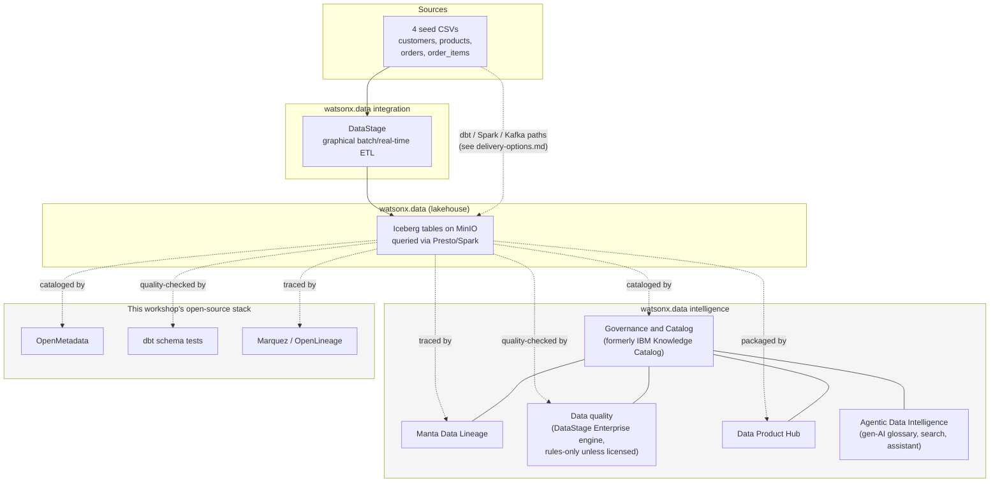

# watsonx.data Intelligence

This workshop already runs a governance-and-quality story of its own: OpenMetadata
catalogs the pipeline (see [Catalog, quality, and governance](../catalog-governance.md)),
dbt's own tests enforce data quality (see [Data quality and SLAs](data-quality-slas.md)),
and OpenLineage/Marquez record runtime lineage (see
[Lineage methods](../lineage.md)). **watsonx.data intelligence** is IBM's name for the
licensed product that does a related job — it is not something this workshop's
cluster runs, and this page is explicit about what could and could not be
verified from IBM's own documentation while writing it.

## What is it, in plain language

Think of watsonx.data intelligence as the "know what you have, trust it, and
share it" layer that IBM sells next to the lakehouse itself. Where
[watsonx.data](../lakehouse-basics.md) stores and queries the data (Iceberg
tables, Presto, Spark) and [watsonx.data integration](integration.md) moves
and transforms it (DataStage, StreamSets, and friends), watsonx.data
intelligence is aimed at the questions that come after the data already
exists somewhere: What does this column actually mean? Who owns it? Can I
trust the number in this dashboard? Can someone outside my team find and use
this dataset without emailing me?

Concretely, it is the current umbrella brand for capabilities that used to be
sold and marketed as separate IBM products. IBM's own product page for what
used to be called "IBM Knowledge Catalog" now renders under the breadcrumb
Home → Products → **watsonx.data intelligence** → Governance and Catalog —
in other words, the catalog/glossary/classification product has been folded
into the intelligence umbrella rather than sold standalone. Independent
review sites (G2, TrustRadius, Gartner Peer Insights) describe the product
the same way, consistently calling it "data governance (formerly IBM
Knowledge Catalog), data lineage (formerly IBM Manta Data Lineage), data
sharing, and data quality management" bundled together.

!!! warning "Verify with IBM"
    Whether "IBM Knowledge Catalog" still exists today as an independently
    purchasable, independently named SKU alongside watsonx.data intelligence,
    or has been fully retired as a brand name, is not settled by this
    research. The evidence points toward full absorption (the product page
    redirect, third parties uniformly saying "formerly"), but no IBM source
    found in this research explicitly announces a rebrand or an end-of-life
    date for the "IBM Knowledge Catalog" name. Confirm current SKU naming
    with IBM before quoting it to a customer.

## What it actually bundles

| Capability | What it does, in plain terms | Former/related product name | Covered elsewhere in this workshop |
| --- | --- | --- | --- |
| Governance and catalog | Business glossary, term definitions, data classification, stewardship workflow, search over technical + business metadata | IBM Knowledge Catalog (IKC) | [Catalog, quality, and governance](../catalog-governance.md) |
| Lineage | Code- and metadata-level tracing of where a value came from and what would break if it changed, across many tools, not just one pipeline | Manta Data Lineage | [Manta Data Lineage](manta-lineage.md), [Lineage methods](../lineage.md) |
| Data quality | Profiling, cleansing, validation, and quality rules against catalog assets | Built on the DataStage Enterprise engine under the hood | [Data quality and SLAs](data-quality-slas.md) |
| Data product packaging and sharing | Turning a table/view into a described, ownable, requestable "data product" with a contract | Data Product Hub | [Data Product Hub](data-product-hub.md) |
| Conversational / gen-AI layer | Gen-AI-assisted glossary generation, semantically-expanded "intelligent search," and a "Data Intelligence Assistant" for conversational metadata enrichment | Marketed as "Agentic Data Intelligence" | Not represented anywhere in this workshop |

Two things are worth being precise about rather than leaving as a clean list.
First, IBM's own docs for "Managing data quality" under the watsonx.data
intelligence product line state that enabling the data-quality feature
**automatically installs the DataStage Enterprise service** underneath it —
and that without a separate DataStage license, that installed engine is
limited to authoring and running data-quality rules, not full DataStage
ETL/ELT. So "data quality" inside intelligence is a real, enablable feature,
not a separate product to buy, but it is not a lightweight bolt-on either —
it brings a full ETL engine along for the ride, scoped down by license.

Second, IBM's Software Hub release notes stress that the intelligence
service's own version has to match the Software Hub control-plane version it
runs on (for example, intelligence 2.4.0 alongside Software Hub 5.4.0) — this
is a normal platform-versioning constraint, not something specific to this
workshop, but worth flagging to anyone planning an install.

!!! warning "Verify with IBM"
    Whether data quality (and the other capabilities in the table above) is
    included in every watsonx.data intelligence entitlement, or gated behind
    a specific Software Hub edition/tier, was not resolved by this research —
    every attempt to load a full `ibm.com/docs` page for watsonx.data
    intelligence or Software Hub 5.4.x returned an HTTP 403 or an in-page
    "you are not entitled to access this content" message, even for topic
    IDs confirmed to exist via search-engine indexing. The capability list
    above is corroborated across multiple independent sources at a
    marketing/summary level, but the exact edition-by-edition feature matrix
    needs a direct check with IBM (or a licensed login to the docs) before
    you present it as a fixed feature list to a customer.

## How this differs from the open-source composition already in this workshop

This workshop does not skip governance, lineage, or quality — it demonstrates
each with a different open-source tool, stitched together by whoever runs the
workshop rather than delivered as one licensed product with one UI:

| Concern | This workshop's open-source composition | watsonx.data intelligence | Overlap or genuine gap |
| --- | --- | --- | --- |
| Technical catalog | OpenMetadata ingests dbt artifacts and table metadata (see [Catalog, quality, and governance](../catalog-governance.md)) | Governance and Catalog capability (former IKC) | **Overlap**, at the technical-catalog level. IKC adds a business glossary, classification, and steward workflow that OpenMetadata's ingestion alone does not enforce. |
| Data quality | dbt schema tests (`not_null`, `unique`, `relationships`, `accepted_values`) plus `reconcile_gold.py`'s cross-engine parity check (see [Data quality and SLAs](data-quality-slas.md)) | Profiling, cleansing, validation rules, running on the DataStage Enterprise engine | **Partial overlap.** dbt tests genuinely catch broken keys and bad values; they do not score an asset, trend that score over time, or let a non-technical steward author a new rule without touching YAML and re-running dbt. |
| Lineage | dbt's own dependency graph plus OpenLineage events collected by Marquez — real, running evidence of what actually executed (see [Lineage methods](../lineage.md)) | Manta Data Lineage — code/metadata parsing across many tools, including ones this workshop's runtime lineage never touches, but with its own scanner-coverage gaps (see [Manta Data Lineage](manta-lineage.md)) | **Complementary, not redundant.** Marquez proves what ran; Manta (in principle) shows what the code says should happen, further upstream and across more tools — neither replaces the other. |
| Data product packaging | Not present — Gold marts are queryable tables/views with no owner metadata, contract, or self-serve access request flow | Data Product Hub (see [Data Product Hub](data-product-hub.md)) | **Genuine gap.** Nothing in this repository packages a Gold mart as a discoverable, requestable product. |
| Conversational / gen-AI metadata assistant | Not present | Data Intelligence Assistant, gen-AI-assisted glossary generation, semantic search | **Genuine gap**, and not something an open-source substitution was attempted for in this workshop. |

The honest framing for a demo: this repository proves, with running code, that
open-source tooling can catalog a pipeline, test its data, and trace its
runtime lineage — genuinely, not as a slide. What it does not attempt is the
things that specifically require a governed product: non-technical rule
authoring, quality *scoring* trended over time, a business glossary workflow
with approvals, or a self-serve marketplace for the resulting data products.
Those are the capabilities watsonx.data intelligence is sold to add on top,
and each one has its own deeper page in this workshop linked from the table
above.

## Where it sits relative to the lakehouse, Integration, and Manta

watsonx.data, watsonx.data integration, and watsonx.data intelligence are
three separate service families under the same Software Hub umbrella, not
three names for one product — see
[Open source and IBM platform](../platform-choice.md) for the full
capability-comparison table across all of them, and
[watsonx.data Integration](integration.md) for the "move and transform" layer
this page deliberately does not cover.

## References

- [IBM watsonx.data intelligence product page](https://www.ibm.com/products/watsonx-data-intelligence)
- [IBM Knowledge Catalog product page (redirects under watsonx.data intelligence)](https://www.ibm.com/products/knowledge-catalog)
- [Introducing watsonx.data intelligence (IBM announcement)](https://www.ibm.com/new/announcements/introducing-watsonx-data-intelligence-simplifying-the-delivery-of-meaningful-data-in-the-gen-ai-era)
- [watsonx.data intelligence on Software Hub 5.3.x](https://www.ibm.com/docs/en/software-hub/5.3.x?topic=services-watsonxdata-intelligence)
- [What's new in watsonx.data intelligence — Software Hub 5.4.x](https://www.ibm.com/docs/en/software-hub/5.4.x?topic=new-watsonxdata-intelligence)
- [Managing data quality — watsonx.data intelligence docs](https://www.ibm.com/docs/en/watsonx/wdi/2.4.x?topic=data-managing-quality)
- [watsonx.data intelligence on IBM Cloud catalog](https://cloud.ibm.com/catalog/services/watsonxdata-intelligence)

Several of the `ibm.com/docs` links above returned a bot-detection or
entitlement wall during this research and could only be confirmed to exist
via search-engine indexing, not a full page read — the same limitation noted
on this workshop's other [enterprise pages](manta-lineage.md), such as
[Manta Data Lineage](manta-lineage.md) and
[watsonx.data Integration](integration.md). Re-check them against a
currently-reachable page before quoting exact feature details to a customer.
