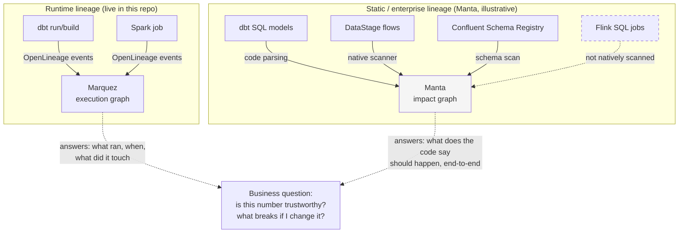

# Manta Data Lineage

This workshop already has a lineage story: dbt's own dependency graph, plus
OpenLineage events collected by Marquez, covered on the
[lineage methods](../lineage.md) page. Manta Data Lineage is IBM's separate,
enterprise-scale answer to the same underlying question — "where did this
number actually come from, and what breaks if I change it?" — but built by
parsing code and metadata across dozens of tools rather than by collecting
events at runtime. This page explains what Manta is, what it can and cannot
see if pointed at this repository's stack, and how it relates to the
OpenLineage/Marquez setup already running here.

## What "enterprise lineage" means, and why a business cares

**Lineage** is the record of where a piece of data came from and everywhere it
went. Any single dbt model already has a small lineage graph: `gold_customer_360`
descends from Silver, which descends from Bronze, which descends from the raw
CSV seeds. That is useful, but it stops at the edge of the dbt project.

A real company's data rarely lives in one tool. The same customer record might
start in a source database, land in a lakehouse via a batch ETL job, get
reshaped by a stream processor, get modeled again in a BI tool's semantic
layer, and finally show up as a number on an executive dashboard. **Enterprise
lineage** is the attempt to trace that entire chain — across every tool in the
middle — automatically, by scanning each tool's own metadata and code, instead
of asking an engineer to remember or document it by hand.

This matters to people who are not engineers for concrete reasons:

- **Audit and regulation.** A compliance officer asked "prove this regulatory
  report's revenue figure is correct" needs a traceable path back to source
  systems, not a verbal assurance from whoever last touched the pipeline.
- **Impact analysis.** Before renaming or dropping a column, "what else reads
  this?" is a question about the *whole* estate, not just the one project a
  given engineer happens to work in.
- **Trust and onboarding.** A new analyst who did not build the pipeline can
  self-serve an answer to "is this number safe to use?" instead of tracking
  down its original author.

Manta's specific pitch is doing this automatically, across a long list of
scanners for different tools, rather than requiring every team to hand-instrument
their own jobs to emit lineage events.

!!! warning "Verify with IBM"
    IBM's current Manta Data Lineage product page advertises "50+ technologies,
    programming languages, databases, and modeling tools" as scanner coverage.
    This claim comes from IBM marketing copy captured live on 2026-08-31; the
    detailed, per-technology scanner list on ibm.com/docs returned an
    entitlement wall in this research session and could not be read directly.
    Confirm the exact scanner list, and whether it covers every tool in your
    target customer's estate, with IBM before promising specific coverage.

## What Manta can and cannot see in this workshop's stack

This repository has four independent paths from the same raw seeds to Gold —
dbt/Presto, Spark, cpdctl, and the Kafka → Flink → Iceberg streaming stack —
plus DataStage flows for a fifth. If Manta were pointed at this environment,
its visibility would not be uniform across those paths:

| Path in this workshop | What Manta would likely see | Why |
| --- | --- | --- |
| dbt models (`01-dbt/models/`) | Column-level SQL lineage, Raw → Bronze → Silver → Gold | dbt/SQL parsing is a mature, long-standing category of lineage scanner |
| DataStage flows (see [DataStage docs](../../demo/foundations.md) for the medallion pattern they implement) | Column-level lineage through each DataStage stage | DataStage has a native Manta scanner and is one of its most cited integrations |
| Kafka topics and Confluent Schema Registry | The *existence* and *schema* of each topic — cluster → topic → schema → column | Manta has a Schema Registry scanner, but a schema registry only describes what a message looks like, not what transformed it |
| **Flink SQL jobs** (`04-confluent-streaming/confluent/flink/sql/`) | **Nothing** — the transformation logic itself does not appear as a lineage hop | Flink is not one of Manta's native scanners |
| Spark job (`03-spark/spark/load_medallion_demo.py`) | Uncertain without a native, currently-listed Spark scanner | Not independently confirmed in this research pass — verify before citing |

The Flink gap is the one worth being explicit about in a customer conversation,
because it is easy to accidentally imply Manta gives "full" enterprise
lineage when it has a structural blind spot for exactly the kind of
stream-processing logic this workshop's streaming path demonstrates. If a
message goes `Kafka topic → Flink SQL job → Iceberg table`, Manta can show the
Kafka topic's schema and (separately) the Iceberg table, but it will not show
the Flink job as the hop connecting them — that middle link is invisible
unless a workaround is used.

Manta does advertise a **Custom Lineage** capability that ingests any
OpenLineage-compatible source as a manual bridge for tools it does not
natively scan. In principle, this repository's OpenLineage events — the same
ones Marquez already consumes, see [Runtime lineage](../lineage.md#runtime-lineage-openlineage-and-marquez)
— could be a way to backfill the Flink gap into a Manta graph. That is a
plausible mitigation, not something demonstrated or IBM-documented in this
research pass.

!!! warning "Verify with IBM"
    Two things in the table above are carried over from an earlier research
    pass in this repository (dated 2026-06-29) rather than freshly re-confirmed
    today: the exact scope of the Kafka/Schema Registry scanner, and the claim
    that Flink is not natively scanned at all (versus, for example, partially
    supported through a generic SQL or JDBC path). ibm.com/docs pages
    describing both scanners returned 403 or an entitlement wall in every
    fetch attempted during this research session. Before telling a customer
    "Manta cannot see your Flink jobs," get IBM to confirm this against the
    current release, and ask specifically whether OpenLineage-based Custom
    Lineage is a supported way to close that gap.

!!! warning "Verify with IBM"
    Whether Manta has a native scanner for the Spark job in this workshop's
    batch path (`03-spark/spark/load_medallion_demo.py`) was not confirmed in
    this research session. Do not assume parity with the dbt/DataStage
    columns above without checking the current scanner list.

## How Manta relates to this workshop's own OpenLineage/Marquez lineage

The [lineage methods](../lineage.md) page already runs real, live lineage for
this workshop: dbt and Spark jobs can emit OpenLineage events, and Marquez
collects and visualizes them as an execution graph — which job ran, when, and
which datasets it read and wrote. That is genuine, verifiable evidence
produced by this repository, not a vendor claim.

Manta answers a different, complementary question. Where Marquez shows *what
actually ran*, Manta (when pointed at real source code and metadata across an
estate) shows *what the code says should happen*, derived by parsing SQL,
job definitions, and schemas — including systems Marquez was never wired up to
watch, and going back further in time than any runtime event log retains.
Neither one replaces the other:

The honest framing for a demo: this repository proves runtime lineage works,
today, for the dbt and Spark paths, via Marquez. Manta is not something this
repository runs — it is presented as the enterprise-scale option a customer
would evaluate for cross-system, code-level lineage at a scope beyond what any
single workshop's OpenLineage instrumentation would practically cover, with
the explicit caveat that its own scanner coverage has gaps (Flink, confirmed;
possibly others, unconfirmed) that need to be checked against the customer's
actual toolchain.

See also [Catalog, quality, and governance](../catalog-governance.md) for how
lineage evidence — from either Marquez or Manta — feeds into ownership,
definitions, and policy, and [Open source and IBM platform](../platform-choice.md)
for how the open-source stack in this workshop compares to IBM's platform
options more broadly.

## References

- [IBM Manta Data Lineage product page](https://www.ibm.com/products/manta-data-lineage)
- [Manta Data Lineage on Software Hub 5.4.x](https://www.ibm.com/docs/en/software-hub/5.4.x?topic=services-manta-data-lineage)
- [IBM watsonx.data intelligence product page](https://www.ibm.com/products/watsonx-data-intelligence)
- [OpenLineage documentation](https://openlineage.io/docs/)
- [Marquez documentation](https://marquezproject.ai/docs/)
