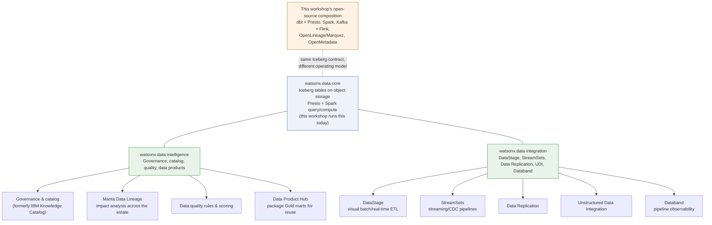

# Enterprise: what IBM's packaged products add

Everything else in this workshop is something you can run yourself: dbt and
Presto for the SQL reference path, Spark for the batch alternative, Kafka and
self-managed Flink for the streaming alternative, plus OpenLineage/Marquez
and OpenMetadata for lineage and cataloging. All of it is open source, all of
it is in this repository, and all of it is meant to be readable end to end —
see [Open source and IBM platform](../platform-choice.md) for the operating-
model comparison that runs through the whole site.

This section asks a different question: if a customer bought **watsonx.data**
and the packaged IBM products IBM sells around it, what would they get
*in addition to* what this workshop already builds by hand? The honest
answer is "some real capability, some renamed capability, and some open
questions IBM has to answer directly" — this section is organized so each
page states clearly which of those three buckets a given claim falls into,
using `!!! warning "Verify with IBM"` callouts wherever this research could
not confirm a claim against `ibm.com/docs`.

## Why this section exists

A workshop attendee who has only seen the open-source paths could walk away
thinking watsonx.data *is* Presto-plus-Iceberg-plus-MinIO. It isn't — that
combination is one deployment option (see
[Cloud vs. platform vs. open source](cloud-platform-opensource.md)), and the
lakehouse itself is only the storage-and-query layer. Around it, IBM sells
separate licensed service families for governance and lineage
(**watsonx.data intelligence**), for data movement and orchestration
(**watsonx.data integration**), and for packaging trusted data for reuse
(**Data Product Hub**). None of those are running anywhere in this
workshop's cluster. This section explains what each one is, maps it against
the open-source composition this workshop already runs, and is explicit
about where the mapping is solid versus where it is still an IBM
licensing/edition question that needs to be verified before a customer
conversation relies on it.

## Pages in this section

| Page | What it covers |
| --- | --- |
| [watsonx.data Intelligence](intelligence.md) | IBM's licensed umbrella for governance/catalog (formerly IBM Knowledge Catalog), lineage (formerly Manta), data quality, and Data Product Hub — compared honestly against this workshop's own running OpenMetadata + dbt tests + Marquez composition, with Verify-with-IBM callouts on unresolved edition-gating and brand-naming questions. |
| [watsonx.data Integration](integration.md) | IBM's watsonx.data integration service family (DataStage, StreamSets, Data Replication, Unstructured Data Integration, Databand), mapped component-by-component to the open-source equivalent this workshop already uses. Clarifies that DataStage is an optional alternative authoring surface for the same Bronze/Silver/Gold pipeline, not a mandatory fourth path — and reports a live-verified finding that Databand's open-source Airflow integration still fails on Airflow 2.x/3.x. |
| [Manta Data Lineage](manta-lineage.md) | What enterprise lineage means for a business, not just engineers. Maps exactly what IBM Manta Data Lineage can and cannot see across this workshop's dbt/DataStage/Kafka-Flink-Iceberg stack — with an explicit, flagged Flink blind spot — and clarifies how it complements, rather than replaces, this workshop's own live OpenLineage/Marquez runtime lineage. |
| [Data Product Hub](data-product-hub.md) | IBM Data Product Hub as a governance/marketplace layer for packaging trustworthy Gold marts, using this workshop's `gold_daily_sales`, `gold_category_performance`, and `gold_customer_360` as the running example. Explains how it relates to IBM Knowledge Catalog and Manta within watsonx.data intelligence, with edition/licensing and cross-platform claims flagged for verification. |
| [Data quality and SLAs](data-quality-slas.md) | What a data SLA is and why it matters for trust in Gold data. Documents the concrete dbt schema tests (`not_null`/`unique`/`relationships`/`accepted_values`) and the `reconcile_gold.py` cross-engine parity check already running in this workshop, then gives an honest comparison of where IBM Knowledge Catalog quality-rule scoring and DataStage Enterprise Plus QualityStage functions add real capability versus where they overlap with what this repo already does. |
| [Cloud vs. platform vs. open source](cloud-platform-opensource.md) | The cloud/platform/open-source operating-model framework (who runs it, who pays, how much you assemble yourself), applied with side-by-side tables to the lakehouse stack (watsonx.data SaaS vs. Software Hub vs. self-managed Presto+Iceberg+MinIO) and the streaming stack (Confluent Cloud vs. Confluent Platform vs. plain Apache Kafka), plus a decision checklist and a Mermaid diagram. |

## Using this section in a real customer conversation

!!! tip "Recommended narrative"
    Run the hands-on workshop first, not this section. A customer who has
    just watched `bin/demo dbt build` turn four CSVs into tested Gold marts,
    then queried them in Metabase, has already seen that the medallion
    pattern works and trusts that you understand their problem — that
    credibility cannot be built from a slide about licensed products. Only
    after that baseline exists does this section earn its place: walk back
    through the same pipeline and ask "which of this would you rather not
    operate yourselves?" IBM Knowledge Catalog for the governance work
    OpenMetadata is doing by hand, Manta for lineage depth beyond what
    OpenLineage instrumented, DataStage for the transformation logic a
    non-engineering team needs to author visually. Presented in the other
    order — enterprise pitch before working demo — the honest caveats in
    this section read as hedging. Presented after, they read as what they
    are: a candid map of where a paid platform buys back operational effort,
    and where it does not.

## How the enterprise pieces relate to the workshop core

Everything in the green boxes is a **separately licensed and entitled**
service family sold alongside watsonx.data, not a feature flag inside it —
see [Cloud vs. platform vs. open source](cloud-platform-opensource.md) for
how deployment model (SaaS, Software Hub, self-managed) interacts with which
of these are even available to turn on. Nothing in this diagram is running
in this workshop's own cluster; the blue and amber boxes are.

For the operating-model tradeoffs behind all of this — who runs each layer,
who pays for it, and how that changes as a customer moves from open source to
platform to cloud — start back at
[Open source and IBM platform](../platform-choice.md).

## References

- [watsonx.data on Software Hub 5.4.x](https://www.ibm.com/docs/en/software-hub/5.4.x?topic=services-watsonxdata)
- [watsonx.data integration on Software Hub 5.4.x](https://www.ibm.com/docs/en/software-hub/5.4.x?topic=services-watsonxdata-integration)
- [watsonx.data intelligence on Software Hub 5.4.x](https://www.ibm.com/docs/en/software-hub/5.4.x?topic=services-watsonxdata-intelligence)
- [DataStage on Software Hub 5.4.x](https://www.ibm.com/docs/en/software-hub/5.4.x?topic=services-datastage)
- [Manta Data Lineage on Software Hub 5.4.x](https://www.ibm.com/docs/en/software-hub/5.4.x?topic=services-manta-data-lineage)
- [IBM Knowledge Catalog on Software Hub 5.4.x](https://www.ibm.com/docs/en/software-hub/5.4.x?topic=services-knowledge-catalog)
