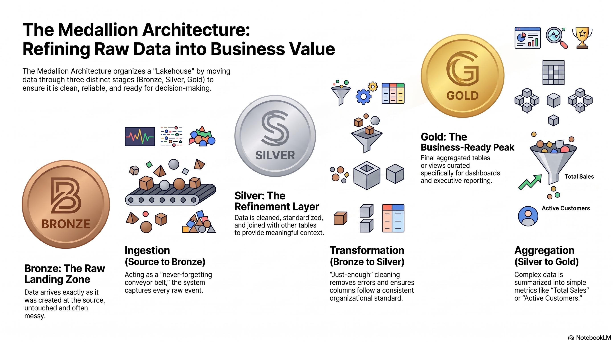

# Lakehouse and medallion

## The architecture contract

A lakehouse separates durable data from the engines that process and consume
it. In this workshop, object storage holds Apache Iceberg tables; Presto and
Spark are compute engines; dbt, Airflow, and Flink define different execution
paths. Iceberg provides table metadata, snapshots, and schema evolution. It
does not prescribe Bronze, Silver, or Gold.

## Medallion is a quality and serving convention

| Layer | Purpose | Typical control |
| --- | --- | --- |
| Raw | Land source-shaped records | Source identity and load timestamp |
| Bronze | Preserve typed, auditable copies | Technical validation and ingestion metadata |
| Silver | Standardize and join reusable entities | Keys, type rules, and quality tests |
| Gold | Serve a business grain | Metric definition, access, and semantic ownership |

The workshop has four retail sources—customers, products, orders, and order
items—and publishes three Gold marts: daily sales, category performance, and
customer 360. Every processing path must produce the same business result.

## What is deliberately separate

Storage, processing, orchestration, cataloging, and lineage are separate
concerns. That modularity is useful, but it creates operational integration
work. The [delivery-path decision](delivery-options.md) and [platform
comparison](platform-choice.md) make that trade-off explicit.
