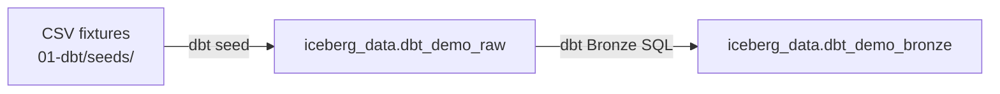
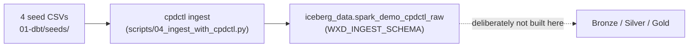

# Ingest to Bronze

## Baseline source path

The baseline starts with four CSV fixtures under `01-dbt/seeds/`. `dbt seed`
loads them into the raw Iceberg schema through Presto. Bronze models then add
typed columns and ingestion metadata. This is suitable for a controlled demo
fixture; it is not a claim that dbt is a general-purpose source-ingestion
platform.



This is deliberately the *shortest* diagram in the workshop: `dbt seed` is a
teaching fixture, not a source-ingestion mechanism, and its only job is to
hand a durable Raw table to the Bronze model. For what the platform's own
native ingestion path looks like when it is the real subject rather than a
setup step, see the next section.

## A path that stops at Raw on purpose: cpdctl native ingestion

This repository has a fourth path, next to dbt ([dbt.md](dbt.md)), Spark
([spark.md](spark.md)), and Confluent ([streaming.md](streaming.md)):
[`scripts/04_ingest_with_cpdctl.py`](https://github.com/aseelert/ibmas-watsonxdata-dbt/blob/main/scripts/04_ingest_with_cpdctl.py),
run through `bin/demo ingest`. It uses `cpdctl`, IBM Cloud Pak for Data's own
CLI, to submit the same four seed CSVs as native watsonx.data ingestion jobs —
the platform's own connector-based load mechanism, not a SQL `INSERT` or a
Spark job you authored.



This is the other side of the same distinction the table above draws: cpdctl
lands data and nothing more — there is no Bronze model, no Silver model, no
Gold mart, and it is intentionally excluded from `reconcile_gold.py` /
`bin/demo validate`, because it produces no Gold contract to reconcile.
Compare that to dbt seed, above, which is also "just ingestion" but exists
purely to feed a transformation pipeline one step later. The two diagrams look
almost identical up to the Raw table; what happens after Raw is the entire
point of this page.

```bash
bin/demo ingest --wait   # submits + polls all four jobs to a terminal state
```

## Loading is not transformation

The distinction matters when presenting the demo. A load moves source-shaped
records to a durable, queryable boundary. A transformation applies business or
technical rules to that boundary. `dbt seed` is used here because the fixture
is versioned alongside the models and gives every participant a deterministic
starting point. The Bronze models then make the first controlled changes under
version control.

| Question | Ingestion answer | Transformation answer |
| --- | --- | --- |
| What arrived? | Source file, arrival time, batch/event identity, schema version | Not applicable yet |
| Is it usable? | It is safely landed and recoverable | Types, keys, records, and joins are validated |
| Who owns the logic? | Source/integration owner | Data-product or analytics owner |
| Workshop example | `dbt seed` for the CSV fixture | dbt Bronze, Silver, and Gold models |

For an operational source, retain the original input or an immutable copy and
capture the load metadata before applying any business cleaning. It provides
the evidence needed to replay a batch, isolate a schema change, and explain a
downstream result.

## Production choice

For operational ingestion, select a mechanism based on source and latency:

| Need | Open-source composition | IBM enterprise option |
| --- | --- | --- |
| Scheduled files and databases | Custom jobs, connectors, orchestration | DataStage / watsonx.data Integration connectors and jobs |
| Continuous events | Kafka, Schema Registry, Flink | Managed integration pattern where entitled |
| Audit and recovery | Object-store conventions plus service-specific controls | Platform governance and operational controls where licensed |

Regardless of tooling, record source identity, arrival time, batch or event
identifier, and schema version before business transformation. Those fields
make Bronze an auditable boundary rather than a second Raw area.

In an IBM platform discussion, DataStage and watsonx.data integration are
appropriate options when the delivery model needs governed connectors,
graphical development, managed schedules, or enterprise operating controls.
Their availability depends on the installed services and entitlement; this
workshop does not represent them as included in every watsonx.data deployment.
