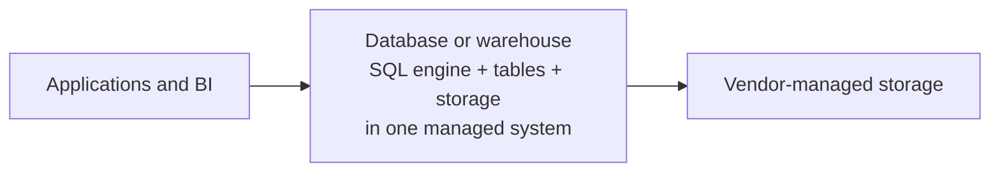
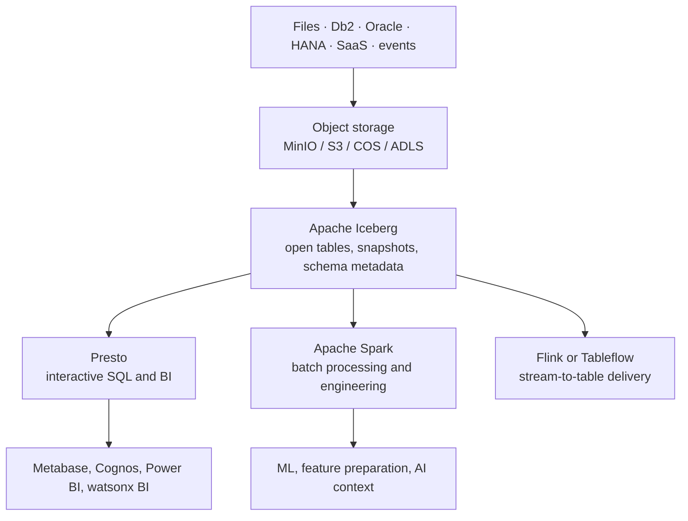

# From database to lakehouse

This page is for readers who know Db2, Oracle, SAP HANA, or a traditional data
warehouse but are new to a lakehouse. The short version is: a lakehouse keeps
data in open object storage while restoring the table semantics, SQL access,
and reliability people expect from a database.

## The familiar database model

With a conventional database, one product typically owns the storage format,
the table metadata, and the query engine. This is convenient: an application
connects to one endpoint and asks for a table. It can become expensive or
restrictive when every raw file, historical record, machine event, and AI-ready
dataset must be copied into the same proprietary storage engine.

That model is still appropriate for operational systems: transaction-heavy
applications, low-latency record updates, and tightly managed relational
workloads. A lakehouse is not a request to replace every database.

## What changes in a lakehouse

A lakehouse separates the durable data layer from the engines that use it.
Object storage holds the files. Apache Iceberg turns those files into reliable
tables. Presto, Spark, and other compatible engines read the same tables for
different purposes.

The important distinction is **shared data, separate compute**. Presto does
not need to copy a table into a Presto-only store before it can query it.
Spark does not need a separate Spark-owned copy before it can process it. Both
resolve the Iceberg table metadata, read the required Parquet files, and use
their own compute only while a query or job is running.

## Comparison in practical terms

| Question | Traditional relational database | Open lakehouse in this demo |
| --- | --- | --- |
| Where are the durable bytes? | Database-managed storage | S3-compatible object storage |
| What makes files a table? | The database catalog and storage engine | Apache Iceberg metadata and catalog registration |
| Who runs SQL? | The database’s query engine | Presto in watsonx.data |
| Who runs large code-driven ETL? | Stored procedures or external tools | Managed Spark application |
| Can several engines use the same data? | Often through exports, federation, or vendor interfaces | Yes, when they support the same Iceberg catalog, warehouse location, credentials, and table features |
| Is it automatically easier? | One system to operate | More flexible, but the catalog, access model, and operational contracts must be designed |

## The role of watsonx.data

In the workshop, watsonx.data is the lakehouse platform that provides the
Iceberg-oriented data layer and the compute endpoints used by the demo. Presto
is the SQL engine for dbt and BI-style queries. Managed Spark is used for a
submitted batch application. Object storage is the durable location for input
assets and table files.

The platform has more capability than this small workshop exercises. Depending
on installed services and entitlement, IBM environments can add governed
catalog and semantic capabilities, DataStage and other integration tooling,
observability, search, vector, or application-oriented services. Those are
separate design and licensing decisions; the core learning point remains the
open table contract.

!!! note "Federation is not ingestion"
    Presto can query some registered external sources in place. That is useful
    when moving data is unnecessary. Ingestion creates a durable lakehouse
    copy or table; federation queries a source where it lives. The two patterns
    can coexist in the same architecture.

## Why this matters to a business user

The goal is not to expose everyone to storage internals. It is to make a
trusted product—such as `gold_daily_sales`—available consistently. A dashboard,
a data scientist, a Spark job, and a governed AI workflow should start from the
same business definition rather than maintain four spreadsheets or warehouse
copies of “daily sales.”

Next, read [Open tables: Iceberg and Parquet](open-tables.md) to see why an
object-storage folder can behave like a reliable table, then return to
[Lakehouse and medallion](foundations.md) for the quality layers used by the
demo.
