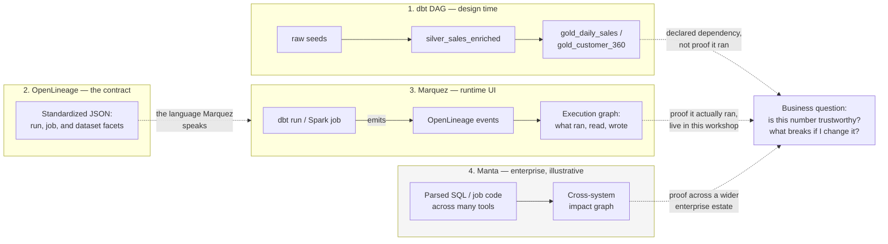
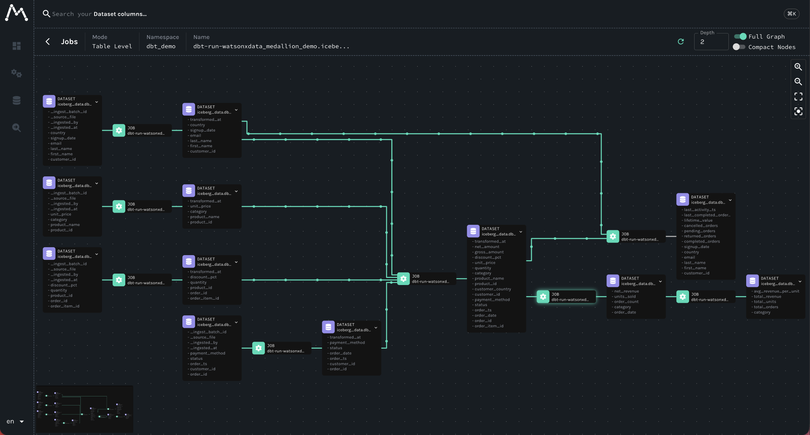
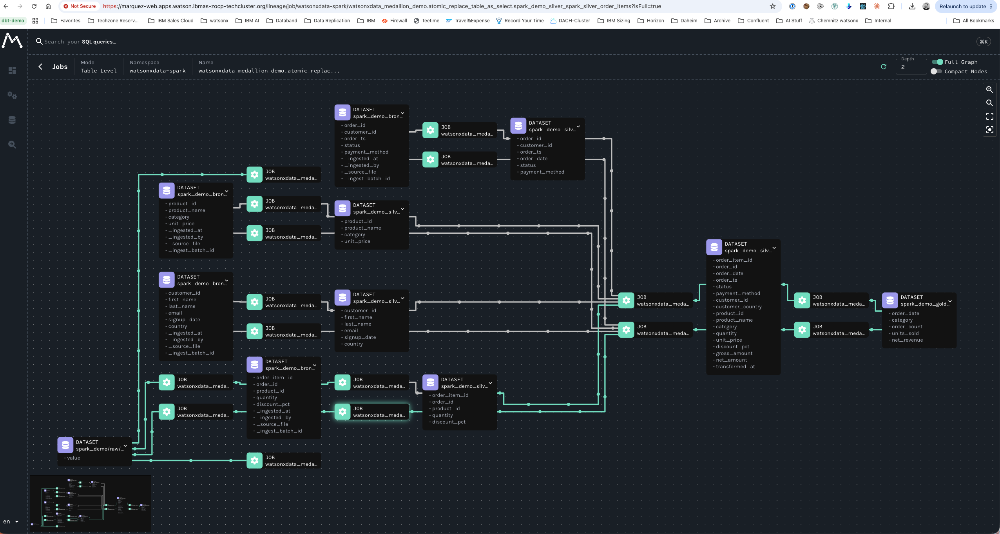
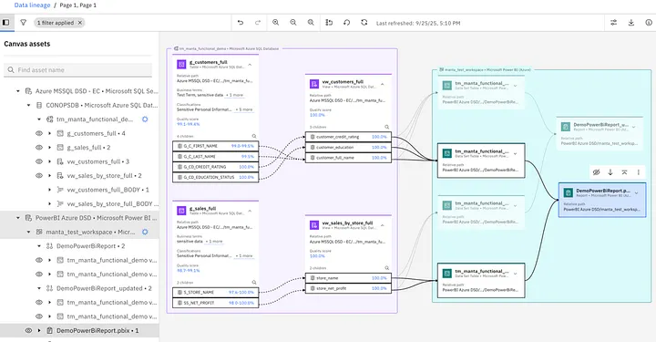

# Lineage methods — dbt, OpenLineage, Marquez, and Manta

Lineage is not one product or one graph. Each view answers a distinct question;
presenting them as substitutes creates confusion. This page covers the two
kinds of lineage that actually run inside this workshop — the dbt DAG and
OpenLineage/Marquez — and points to a separate deep dive for Manta, IBM's
enterprise product in this space.

## Why a business person cares about lineage

**Lineage** is just the record of where a number came from and everywhere it
went afterward. Nobody outside a data team asks for "a lineage graph" for its
own sake; they ask a lineage-shaped question. Three of those questions come up
constantly in this workshop's own Gold marts:

- **Compliance and audit.** Finance asks you to prove that today's figure in
  `gold_daily_sales.net_revenue` is correct. "Trust me" is not evidence.
  Lineage is: this table sums `net_amount` from `silver_sales_enriched`,
  filtered to `status = 'completed'`, which itself joins the raw `orders`,
  `order_items`, `products`, and `customers` seeds. That chain, not a verbal
  assurance, is what an auditor wants to see.
- **Debugging a bad number.** `gold_customer_360.lifetime_value` looks too low
  for a customer who insists they placed several orders. Lineage lets you walk
  backward — `gold_customer_360` → `silver_sales_enriched` → `silver_orders` —
  and notice that `lifetime_value` only counts orders where
  `status = 'completed'`; the customer's other orders are sitting in
  `pending` or `returned`. The number was never wrong — the filter just wasn't
  visible until you traced it.
- **Impact analysis before a schema change.** Someone proposes renaming
  `net_amount` in `silver_sales_enriched`, or changing what counts as
  `'completed'`. Lineage answers "what breaks?" before the change ships: both
  `gold_daily_sales` and `gold_customer_360` read `silver_sales_enriched`
  directly, and `gold_category_performance` reads `gold_daily_sales` — so one
  change to one Silver model touches all three Gold marts, not just the one
  someone happened to be looking at.

None of those three questions require reading SQL under time pressure if the
lineage evidence already exists and is trusted. That is the actual business
case for lineage — it is not simply a technology.

| Method | Evidence collected | Primary question | Workshop role |
| --- | --- | --- | --- |
| dbt DAG | Declared model dependencies and compiled SQL | What should this SQL transformation depend on? | Design-time model view |
| OpenLineage | Standardized runtime events | What execution event happened to which dataset? | Open event contract |
| Marquez | OpenLineage events, jobs, and datasets | What ran, read, and wrote at runtime? | Runtime technical lineage UI |
| Manta Data Lineage | Enterprise metadata and code parsing | What is the end-to-end impact and traceability across systems? | Enterprise technical/business lineage option — see the [deep dive](enterprise/manta-lineage.md) |

## Read the graphs as different evidence

The dbt DAG describes declared dependencies in the transformation project. It
is excellent for reviewing intended SQL flow, but it does not on its own prove
that a scheduled job ran. OpenLineage provides the event contract for runtime
evidence; Marquez receives those events and exposes jobs, runs, inputs, and
outputs. A catalog adds ownership and business definition. Manta can extend
the picture with scanning and impact analysis across a wider enterprise estate.

The result is intentionally layered, not duplicated: design-time dependency,
runtime execution, catalog context, and cross-system impact analysis answer
different operational questions.



## Runtime lineage: OpenLineage and Marquez

OpenLineage is an event specification, not a catalog or a UI. Marquez receives
and visualizes those events. In this demo, dbt can emit events after successful
artifact-producing commands, and submitted Spark applications send events to
the in-cluster collector.

```bash
bin/demo lineage
```





## Enterprise lineage: Manta Data Lineage

Manta Data Lineage is not a replacement name for Marquez. It addresses an
enterprise parsing, traceability, and impact-analysis operating model and is
complementary to governance services such as IBM Knowledge Catalog. The
following customer-provided workshop capture is illustrative; it is not a
live dependency of this repository.



This page keeps Manta at the level of "what question does it answer, and how
does that differ from Marquez." For the product-level detail — what Manta can
and cannot see across this workshop's four ingestion paths, its scanner
coverage, and the exact caveats to verify with IBM before a customer
conversation — see [Manta Data Lineage](enterprise/manta-lineage.md).

Use Marquez to show the actual dbt/Spark execution events produced by the demo.
Use Manta when the discussion is cross-system lineage, impact analysis, and
regulated evidence. Use a catalog to add ownership, definitions, policies, and
quality context.

### A concise demonstration script

1. Open the dbt DAG to explain the intended Raw-to-Gold dependency chain.
2. Run the chosen path and inspect Marquez to show an actual execution event.
3. Open the catalog view to identify an asset owner, definition, and quality
   context.
4. Introduce Manta only when the scenario requires broader system scanning or
   downstream impact analysis.

That sequence avoids presenting a screenshot as proof of every lineage claim
and keeps OpenLineage, Marquez, Manta, and the catalog in their correct roles.

See also [Catalog, quality, and governance](catalog-governance.md) for how
lineage evidence feeds into ownership and definitions, and
[Open source and IBM platform](platform-choice.md) for how this workshop's
open-source stack compares to IBM's platform options more broadly.

References: [OpenLineage](https://openlineage.io/docs/),
[Marquez](https://marquezproject.ai/docs/), and
[IBM Manta Data Lineage on Software Hub 5.4](https://www.ibm.com/docs/en/software-hub/5.4.x?topic=services-manta-data-lineage).
