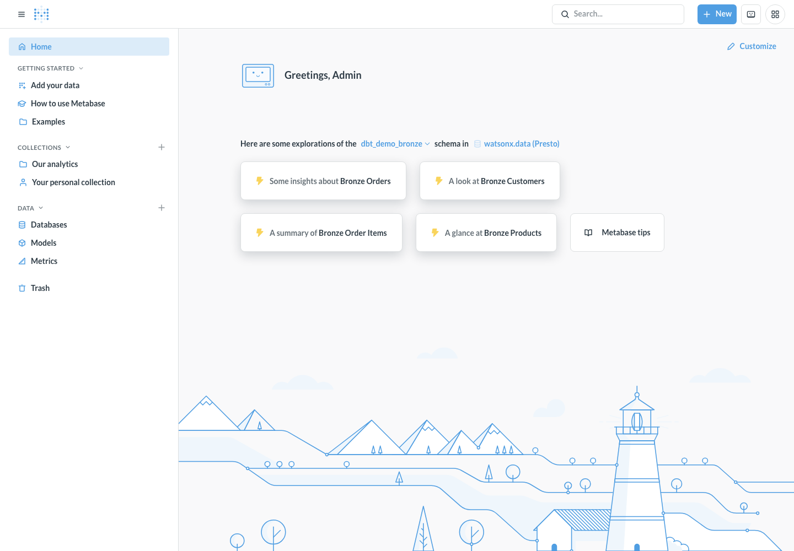

# Serve Gold in Metabase

Metabase is the primary business-facing UI in this workshop. It connects to the
same Presto catalog and provisions example queries over the Gold marts. Show it
after the dbt baseline to anchor the technical work in a business outcome.

```bash
bin/demo metabase
```



The dashboard is a consumer of Gold. It does not define the metric logic, run
the transformation, or replace catalog governance. Those responsibilities stay
with the transformation contract and governance tooling.
