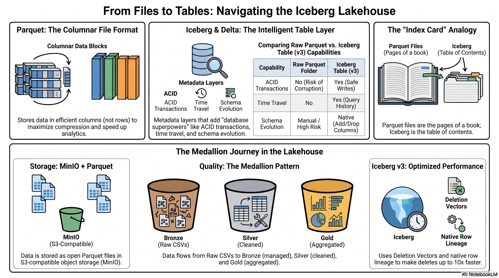
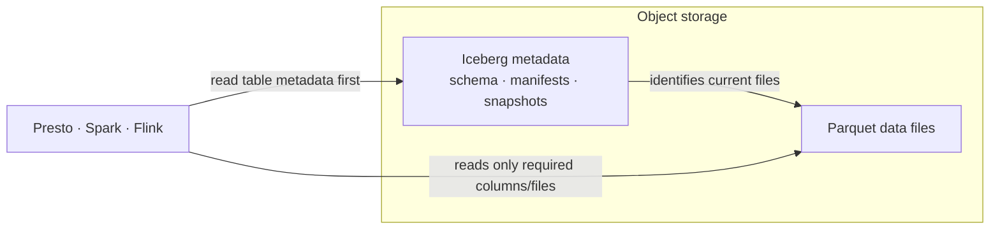

# Open tables: Iceberg and Parquet

**Parquet is a file format. Iceberg is a table format.** The distinction is
the key to understanding why several engines can safely use data in object
storage.

## From files to a dependable table

A Parquet file stores typed columns efficiently. It is excellent for analytic
reads, but a folder full of Parquet files does not by itself know which files
belong to the current table, which schema applies, or whether a write finished
successfully. Iceberg maintains table metadata—schemas, manifests, snapshots,
and references to data files—so a reader sees a complete table snapshot.

> Parquet is the pages of a book. Iceberg is the table of contents, edition
> history, and index that tells a reader which pages are currently in the book.

## What Iceberg adds

| Capability | Parquet files alone | Iceberg table on Parquet |
| --- | --- | --- |
| Current table definition | Convention and folder layout | Explicit metadata |
| Atomic table change | Application responsibility | Snapshot-based table commit |
| Schema evolution | Fragile manual coordination | Tracked table schema evolution |
| Time travel | Not inherently available | Previous snapshots can be retained and queried where supported |
| Partition management | Folder naming convention | Logical partition transforms in metadata |
| Multiple compatible engines | Must agree informally | Read/write through a common table contract |

The benefits are real, but interoperability is not magic. Engines must point to
the same catalog and warehouse location, use compatible credentials, and
support the Iceberg table features in use. A table written through a separate
catalog is not automatically visible to watsonx.data merely because the files
are Parquet.

## How the demo uses open tables

| Path | Writes the table through | Result |
| --- | --- | --- |
| dbt reference path | Presto SQL submitted by the dbt adapter | Iceberg Raw, Bronze, Silver, and Gold relations |
| Spark path | A managed Spark application | Iceberg Bronze, Silver, and Gold tables |
| Streaming path | Self-managed Flink Iceberg sink, then explicit catalog registration | Iceberg Silver tables; Spark or DataStage builds Gold |
| Confluent Tableflow option | Confluent materializes chosen Kafka topics to Iceberg/Delta | A separate product path, not executed by this repository |

## Why a business user should care

Open tables are what make “one trusted Gold outcome” credible. The business
definition is not trapped inside the engine that produced it. A consumer can
use the governed Iceberg table with the appropriate access path, while the
team still chooses SQL, Spark, or streaming processing according to the
workload.

See [Event alternative: Kafka, Flink, Confluent, Tableflow](streaming.md) for
the streaming version of this pattern and [Scripts and automation](scripts.md)
for the exact repository commands that create, validate, and clean the demo.
