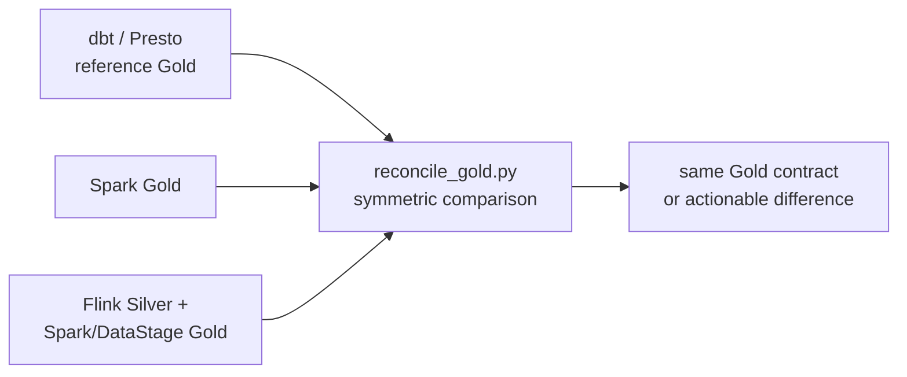

# Validate and reconcile

Validation is the point at which a “multi-tool architecture” becomes a
credible demo. Every path can be technically successful and still produce a
different business number. The reference path, expected Gold grain, and
comparison checks make drift visible.



Validation is the proof that the alternatives implement one business contract.

| Stage | Check | Expected result |
| --- | --- | --- |
| Environment | `bin/demo dbt debug` | Presto connection succeeds |
| dbt baseline | `bin/demo dbt build` | Models and tests pass |
| Spark alternative | Application status plus `--paths dbt,spark` reconciliation | Gold has zero differences |
| Event alternative | Flink jobs running plus `--paths dbt,confluent` reconciliation | Gold has zero differences |
| Documentation | `mkdocs build --strict` | Site builds without warnings treated as errors |

```bash
bin/demo validate
docker compose config -q
```

Use `bin/demo reset --dry-run` before cleanup. Each component can start from
its own Compose file; the root Compose file is the optional all-in-one entry
point.
