# Open source and IBM platform

The workshop deliberately makes the open-source composition visible. It is a
useful architecture for learning and selective adoption, but each service also
adds deployment, upgrade, identity, monitoring, metadata, and support
ownership. The IBM services are compared as an operating-model choice, not as
an assertion that one product replaces every component.

## Capability comparison

| Concern | Open-source workshop composition | IBM platform option on Software Hub 5.4.x |
| --- | --- | --- |
| Open lakehouse | Iceberg tables, object storage, Presto, Spark | watsonx.data 2.4.0 lakehouse service |
| Batch integration | dbt SQL and custom Spark applications | watsonx.data integration 2.4.0; DataStage for graphical batch/real-time flows |
| Streaming integration | Kafka, Schema Registry, self-managed Flink | watsonx.data integration capabilities; assess the required component and entitlement |
| Orchestration | Airflow | Platform or external orchestration according to the delivery design |
| Runtime lineage | OpenLineage events and Marquez | Can coexist; not a claim of feature equivalence |
| Business/impact lineage | Separately composed scanner/catalog process | Manta Data Lineage with related governance services |
| Catalog and governance | OpenMetadata plus local processes | watsonx.data intelligence 2.4.0 and IBM Knowledge Catalog capabilities |
| Data quality | dbt tests and separately composed validation | watsonx.data intelligence quality capabilities; DataStage Enterprise Plus quality functions where entitled |

## Streaming, compared the same way

The comparison above is a lakehouse comparison. The workshop's streaming path
(Kafka + Flink, see [Event alternative](streaming.md)) has its own open-source
composition and its own IBM options, and it does not map cleanly onto the
lakehouse row above — event streaming is not a lakehouse product, so it
belongs in its own table rather than forced into the "Streaming integration"
row above.

**IBM now owns Confluent.** IBM announced its acquisition of Confluent on
2025-12-08 and the deal closed on 2026-03-17 at an approximately $11 billion
valuation; Confluent delisted from Nasdaq and is now an IBM subsidiary. That
changes the shape of this comparison: Confluent Cloud, Confluent Platform,
Confluent's Flink offering, and Tableflow are no longer a competitor's
products sitting next to IBM's — they are IBM's own portfolio, alongside IBM
Event Streams, IBM's pre-acquisition managed-Kafka product on Cloud Pak for
Integration. The open question for a customer conversation is no longer
"Confluent or IBM," it is "which of IBM's two Kafka platforms."

| Concern | Open-source workshop composition | Confluent Platform / Confluent Cloud (IBM, since 2026-03-17) | IBM Event Streams (IBM's pre-acquisition Kafka product) |
| --- | --- | --- | --- |
| Event backbone | Apache Kafka, self-managed (this repo runs Confluent Platform's community-licensed images, not plain Apache Kafka — see [Event alternative](streaming.md)) | Confluent-packaged Kafka + Schema Registry + ksqlDB, self-managed (Platform) or fully managed (Cloud) | IBM-managed Kafka on IBM Cloud, or on your own infrastructure via Cloud Pak for Integration |
| Stream processing | Self-managed Apache Flink, hand-built jobs | Self-managed Flink (Platform) or fully managed, SQL/Table-API-only Flink billed by CFU (Cloud) — see [Confluent, Flink, and the managed alternative](enterprise/confluent-vs-flink.md) | Not a documented IBM capability in this research pass — see the caveat below |
| Topic-to-table materialization | Hand-built Flink Iceberg sink | Tableflow (Confluent Cloud) | Not applicable — would compose separately with watsonx.data |
| Licensing | Apache License 2.0 throughout | Mixed: Apache 2.0 core plus the Confluent Community License and the commercial Confluent Enterprise License, by component | IBM Cloud subscription (Lite/Standard/Enterprise plans) or a Cloud Pak for Integration license |
| Support | Community only | Included in the subscription or license | IBM support included, with a documented SLA on IBM Cloud |

!!! warning "Verify with IBM"
    Whether IBM plans to consolidate Event Streams customers onto Confluent,
    run both side by side for different segments, or retire Event Streams
    outright was not confirmed in this research pass — IBM's post-acquisition
    roadmap statements on this were not reachable via `ibm.com/docs` (access-
    restricted responses). Given IBM now owns a mature, widely-adopted
    commercial Kafka platform in Confluent, a customer should not assume
    Event Streams is the safer or more strategic long-term pick without
    asking IBM directly which platform it is steering new commitments toward.
    IBM Event Streams' current relationship to Cloud Pak for Integration,
    IBM Event Automation, and watsonx.data integration was likewise not
    independently confirmed. The IBM Cloud catalog page for Event Streams was
    reachable and describes a managed Kafka service with Schema Registry,
    mirroring, an Admin REST API, and IAM-based auth, but says nothing about
    an IBM-branded Flink equivalent — Confluent supplies that now.

This table intentionally does not repeat the fuller cloud/platform/open-source
breakdown already written out for both the lakehouse and Kafka layers — see
[Cloud vs. platform vs. open source](enterprise/cloud-platform-opensource.md)
for that decision checklist, and
[Confluent, Flink, and the managed alternative](enterprise/confluent-vs-flink.md)
for the Flink-specific deep dive (self-managed Flink versus Confluent's own
managed Flink service — a distinct question from "Kafka: cloud vs. platform
vs. open source," since even under IBM ownership, Confluent does not govern
the open-source Apache Flink project itself, only the commercial services
built on top of it).

## Same contract, different operating model

Whichever option a customer picks, the *contract* each layer promises does
not change — only who operates it does. The lakehouse layer always promises
"an Iceberg table, queryable through Presto/Spark, backed by object storage."
The streaming layer always promises "an ordered, replayable event log,
speaking the Kafka wire protocol." Swapping the open-source composition for
watsonx.data, or plain Kafka for Confluent/Event Streams, changes who patches,
scales, and supports the system — it does not change what a consumer of that
contract can rely on.

```mermaid
flowchart TB
    subgraph Lakehouse["Lakehouse contract: an Iceberg table on object storage, queryable via Presto/Spark"]
        L1["Open source\nPresto + Iceberg + MinIO\n(this workshop)"]
        L2["Platform\nwatsonx.data on Software Hub"]
        L3["Cloud\nwatsonx.data SaaS"]
    end
    subgraph Streaming["Streaming contract: an ordered, replayable Kafka-protocol event log"]
        S1["Open source\nApache Kafka + Apache Flink\n(what this workshop composes)"]
        S2["Platform\nConfluent Platform, or IBM Event Streams\non Cloud Pak for Integration"]
        S3["Cloud\nConfluent Cloud, or IBM Event Streams\non IBM Cloud"]
    end

    L1 -. "same Iceberg table contract" .- L2 -. "same Iceberg table contract" .- L3
    S1 -. "same Kafka wire protocol" .- S2 -. "same Kafka wire protocol" .- S3

    style L1 fill:#fdf2e3,stroke:#b26a00
    style S1 fill:#fdf2e3,stroke:#b26a00
    style L2 fill:#eef2fb,stroke:#3f51b5
    style S2 fill:#eef2fb,stroke:#3f51b5
    style L3 fill:#e8f4ea,stroke:#2e7d32
    style S3 fill:#e8f4ea,stroke:#2e7d32
```

That is the same cloud/platform/open-source axis
[Cloud vs. platform vs. open source](enterprise/cloud-platform-opensource.md)
walks through in more depth — it applies identically whether the contract in
question is a lakehouse table or a Kafka topic; only the specific products
in each box change.

## Product boundaries

watsonx.data is the open lakehouse/data layer. watsonx.data integration is a
separate service family for transformation, integration, and observability;
its documented components include DataStage, StreamSets, Data Replication,
Unstructured Data Integration, and Data Observability. watsonx.data
intelligence is a separate governance, lineage, and data-product capability
layer. Manta Data Lineage and IBM Knowledge Catalog are complementary services,
not synonyms for Marquez or OpenMetadata.

Confirm the exact Software Hub release, installed service version, licensing,
and entitlement in the target environment before committing to an architecture.
The statements above use the IBM Software Hub 5.4.x documentation baseline,
which lists watsonx.data, watsonx.data integration, and watsonx.data
intelligence at version 2.4.0.

References: [watsonx.data](https://www.ibm.com/docs/en/software-hub/5.4.x?topic=services-watsonxdata),
[watsonx.data integration](https://www.ibm.com/docs/en/software-hub/5.4.x?topic=services-watsonxdata-integration),
[watsonx.data intelligence](https://www.ibm.com/docs/en/software-hub/5.4.x?topic=services-watsonxdata-intelligence),
[DataStage](https://www.ibm.com/docs/en/software-hub/5.4.x?topic=services-datastage),
[Manta Data Lineage](https://www.ibm.com/docs/en/software-hub/5.4.x?topic=services-manta-data-lineage),
[IBM Knowledge Catalog](https://www.ibm.com/docs/en/software-hub/5.4.x?topic=services-knowledge-catalog),
[IBM Event Streams on IBM Cloud](https://cloud.ibm.com/docs/EventStreams),
and [Confluent Cloud for Apache Flink](https://www.confluent.io/product/flink/).
