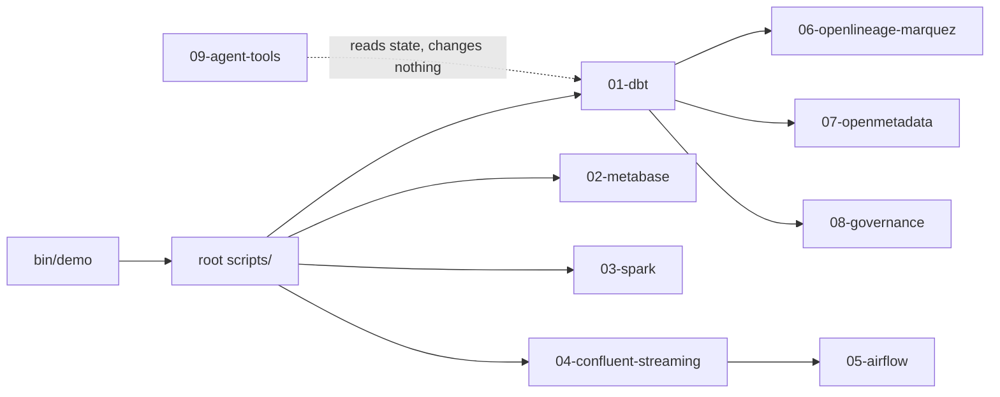
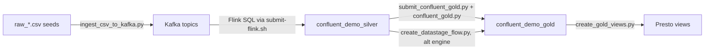

# Scripts and automation

The repository is a runnable demo, not just a slide deck. This page explains
the scripts in execution order and distinguishes safe validation commands from
operations that create or remove resources. It is organized by directory
because the demo itself is organized that way: `01-dbt/`, `02-metabase/`,
`03-spark/`, `04-confluent-streaming/`, `05-airflow/`, `06-openlineage-marquez/`,
`07-openmetadata/`, `08-governance/`, and `09-agent-tools/` each hold one
workshop path, plus a root `scripts/` folder of setup and operations helpers
that every path shares.



!!! warning "Verify with IBM"
    This page documents the workshop's own automation, not an IBM-supported
    product CLI. None of the naming, flag conventions, or script boundaries
    below should be read as an IBM product interface — verify anything you
    plan to reuse against a supported watsonx.data or Cloud Pak for Data
    release.

## The supported entry point

Use `bin/demo` for the normal workshop route. It keeps the demo commands short
and shields attendees from folder details until they need to inspect them.

| Command | What it does | Changes data or services? |
| --- | --- | --- |
| `bin/demo setup` | Prepares `.env`, certificates, endpoints, and discovery prerequisites | Yes; writes local configuration and may use `oc` |
| `bin/demo dbt build` | Runs the dbt reference transformation and tests | Yes; creates/updates Iceberg relations |
| `bin/demo metabase` | Starts the local Metabase compose stack | Yes; starts containers |
| `bin/demo spark` | Validates the Spark submission payload by default | No; dry-run unless configured otherwise |
| `bin/demo streaming` | Starts the local Kafka/Flink demonstration stack | Yes; starts containers and can seed events |
| `bin/demo airflow` | Starts the Airflow stack | Yes; starts containers |
| `bin/demo lineage` | Starts Marquez | Yes; starts containers |
| `bin/demo catalog` | Starts OpenMetadata and runs catalog ingestion | Yes; starts containers and writes metadata |
| `bin/demo validate` | Compares available Gold outputs | No; read-only queries |
| `bin/demo reset --dry-run` | Shows what a reset would remove | No |

## Environment and authentication

| Script | Purpose | When to use it |
| --- | --- | --- |
| `scripts/00a_prepare_watsonx_env.py` | Builds or refreshes the local `.env`, derives endpoints, manages certificate material, and can use `oc` for discovery | First setup and when cluster configuration changes |
| `scripts/00b_get_token.py` | Validates/refreshes the API-token path needed by services such as Spark | At the start of a working session or when a token expires |
| `scripts/check_hosts.py` | Read-only check that every required cluster hostname is in `/etc/hosts`, resolves to the expected bastion IP, and is TCP-reachable | Whenever "connection refused" errors are hard to diagnose, or right after a new laptop is set up |
| `scripts/refresh_token.py` | Fetches a fresh CPD bearer token (`WXD_SPARK_BEARER_TOKEN`, ~12-hour lifetime) using the already-stored username and API key, and writes it back to `.env`; `--check` only decodes and prints the current expiry | When a Spark submission starts failing with an auth error, or before a long working session |
| `scripts/01_bootstrap_watsonxdata.py` | Creates the demo schemas required by the lakehouse paths | Before the first full run on a clean environment |
| `scripts/02_dbt_env.sh` | Loads `.env`, selects the repo dbt profile, and calls dbt | Always use through `bin/demo dbt` or directly for advanced dbt commands |

The dbt profile is generated locally from
`01-dbt/profiles/profiles.example.yml`; it contains environment-variable
references rather than credentials. Keep `.env`, certificates, tokens, and
downloaded connection JSON files out of Git.

`check_hosts.py` and `refresh_token.py` read every host, IP, and domain from
environment variables rather than hardcoding this workshop's own cluster, so
they work unmodified against a different environment — see
[Environment setup](environment.md) for the full `.env` contract.

## Reference dbt path

```bash
bin/demo dbt debug
bin/demo dbt seed
bin/demo dbt build
bin/demo validate
```

`dbt build` is the recommended workshop command because it builds models and
runs the associated tests. The source fixtures are under `01-dbt/seeds/`; the
SQL models are organized under `01-dbt/models/bronze`, `silver`, and `gold`.
See [dbt and Presto](dbt.md) for what actually executes when that command
runs.

## Managed Spark path

| Script | Purpose | Default safety behavior |
| --- | --- | --- |
| `scripts/03a_upload_spark_assets.py` | Uploads the Spark application and source fixtures to the configured object-store location | Writes assets when run |
| `scripts/03b_submit_spark_application.py` | Builds and submits the watsonx.data Spark API request | Dry-run by default; set `WXD_SPARK_DRY_RUN=false` to submit |
| `scripts/03c_spark_application_status.py` | Polls or displays the submitted application status | Read-only |

The Python application is [load_medallion_demo.py](https://github.com/aseelert/ibmas-watsonxdata-dbt/blob/main/03-spark/spark/load_medallion_demo.py).
It is not a dbt model rendered in another form: it is a submitted distributed
application that reads assets from object storage and writes Iceberg tables.

## Ingestion, validation, and Iceberg demonstrations

| Script | Purpose | Read-only or mutates? |
| --- | --- | --- |
| `scripts/04_ingest_with_cpdctl.py` | Demonstrates native watsonx.data ingestion through `cpdctl`; this lands data and does not replace downstream transformation | Mutates; writes raw data into Iceberg |
| `scripts/05_query_gold.py` | Runs readable Gold-level verification queries | Read-only |
| `scripts/06_demo_time_travel.py` | Demonstrates Iceberg snapshot/time-travel behavior where the target engine supports the query | Read-only |
| `scripts/create_gold_views.py` | Creates the `gold_category_performance` and `gold_customer_360` marts as Presto **views** for the Spark or Confluent path, using the exact SQL from the dbt models, so all three paths agree on shape (table vs. view) as well as rows. It is idempotent: it `DROP`s whatever already exists at each name (table or view) before creating the view | Mutates; issues `DROP` and `CREATE VIEW` against the shared Iceberg catalog |
| `scripts/reconcile_gold.py` | Compares the Gold results across the dbt, Spark, and Confluent paths by running a symmetric two-directional `EXCEPT` between a reference path and each other path; a non-zero row count on either side is a real discrepancy and the script exits non-zero | Read-only; issues `SELECT`/`EXCEPT` queries only |

`create_gold_views.py` exists because a Spark-created view is a Hive view, and
watsonx.data's Presto engine refuses to read Hive views ("Hive views are not
supported"). Building the view through Presto instead keeps the three paths
byte-for-byte comparable, which is exactly what `reconcile_gold.py` then
proves.

## Governance and catalog automation

| Script | Purpose |
| --- | --- |
| `scripts/06b_provision_ikc_governance.py` | Provisions the sample governance assets when the target IBM capability is available |
| `scripts/07a_prepare_openmetadata_dbt_artifacts.py` | Prepares dbt artifacts for OpenMetadata ingestion |
| `scripts/07b_generate_lineage_docs.sh` | Generates lineage-related documentation artifacts |
| `scripts/07c_upload_dbt_artifacts.py` | Uploads prepared dbt artifacts to the configured metadata flow |
| `scripts/07d_apply_openmetadata_governance.py` | Applies the sample OpenMetadata governance enrichment |
| `scripts/seed_openmetadata_tables.py` | Offline fallback that seeds OpenMetadata with the medallion table entities (database → schema → table, with columns and types) read straight from the dbt `catalog.json`, so dbt lineage has something to attach to even when Presto is unreachable for a live metadata ingestion | Mutates the OpenMetadata catalog; every write is an idempotent PUT (create-or-update) |
| `scripts/10_configure_ikc_reporting.sh` | Configures optional IKC reporting integration |
| `scripts/10b_provision_pg_reporting.sh` and `10c_pg_reporting.py` | Provision and load the optional PostgreSQL reporting example |
| `scripts/report_dbt_to_databand.py` | Optional: reports a completed dbt run's `manifest.json`/`run_results.json` (already sitting in `target/` after a normal `dbt run`) to a Databand tenant, using Databand's Airflow-independent core tracking SDK | Read-only against this repo; sends the run report to an external Databand tenant. Run it right after `scripts/02_dbt_env.sh run`/`test` |

`report_dbt_to_databand.py` exists because the Airflow-level Databand
integration (`dbnd-airflow` and friends) hard-imports Airflow 1.x-only module
paths and is broken on Airflow 2.x/3.x. This dbt-level script uses only
Databand's core package, which has no Airflow dependency, so it works
regardless of which Airflow version the optional [Airflow stack](#airflow)
below is running.

## Reset and cleanup

Cleanup is intentionally explicit because it can remove containers, volumes,
schemas, object-store files, or data created by this demo.

```bash
bin/demo reset --dry-run
scripts/11_reset_demo.sh --all --dry-run
```

| Script | Scope |
| --- | --- |
| `scripts/08_cleanup_watsonxdata.py` | Lakehouse schemas and objects selected by its options |
| `scripts/09_cleanup_minio.py` | Demo object-store assets selected by its options |
| `scripts/11_reset_demo.sh` | Coordinated Docker, warehouse, and/or object-store reset; use `--dry-run` first |

The cleanup scripts are part of the demo story: a workshop must be repeatable
from a known starting state, but a presenter should never run a broad reset
against a shared environment without checking the resolved targets.

## Cluster operations (outside the demo lifecycle)

These two scripts do not build or clean up demo data. They manage the shared
OpenShift cluster the whole demo runs against, so treat them with more caution
than anything above — a mistake here can affect other people's sessions, not
just your own workshop run.

| Script | Purpose | Read-only or mutates? |
| --- | --- | --- |
| `scripts/cpd_maintenance.sh` | Graceful shutdown/restart of the Cloud Pak for Data services on OpenShift that back this demo (watsonx.data, IBM Knowledge Catalog, DataStage): `status`/`verify` report health, while `restart`/`shutdown`/`startup`/`prepare-upgrade`/`resume-upgrade`/`drain-node`/`uncordon-node` change cluster state | `status` and `verify` are read-only; every other action calls `oc patch`/`oc apply`/node drain commands. Always run `prepare-upgrade --dry-run` first |
| `scripts/reduce_postgres_cpu.sh` | Lowers the CPU request on five EDB PostgreSQL clusters backing IKC/lakehouse services, to free capacity on a constrained cluster | Mutates; logs into OpenShift and runs `oc patch` against each `clusters.postgresql.k8s.enterprisedb.io` resource |

!!! warning "Verify with IBM"
    `cpd_maintenance.sh`'s shutdown/restart sequencing (watsonx.data →
    DataStage → IBM Knowledge Catalog, and the reverse on startup) reflects
    dependencies observed on this specific cluster. Confirm the supported
    shutdown/startup order for your own Cloud Pak for Data topology before
    reusing this pattern.

---

## Metabase

Metabase is the BI layer the dbt, Spark, and Confluent gold marts are queried
from. See [Metabase](metabase.md) for what the dashboard shows; the scripts
below are what get it there without a manual click-through.

| Script | Purpose | Read-only or mutates? |
| --- | --- | --- |
| `02-metabase/metabase/entrypoint.sh` | Container entrypoint that imports the watsonx.data CA certificate into the JVM truststore before Metabase's Presto (Trino) driver starts, so TLS validation to Presto succeeds. Runs automatically as the container's `ENTRYPOINT`; failures here are non-fatal (they log a warning and let Metabase continue) | Mutates only the container's own Java truststore; not run by hand |
| `02-metabase/metabase/provision.py` | Creates the first Metabase admin user, adds the watsonx.data Presto data source, and creates one native-SQL demo chart per medallion path (dbt/Spark/Confluent `gold_daily_sales`) on a shared dashboard | Mutates Metabase's own configuration and content. Fully idempotent — safe to re-run after `scripts/11_reset_demo.sh --docker` |

`provision.py` is what makes OpenMetadata's Metabase-lineage ingestion (see
below) have something real to draw a line back to: without at least one demo
chart querying the real Presto tables, Metabase would only expose its own
bundled sample e-commerce dataset, and the BI-lineage story would be empty.

## Confluent streaming

The Confluent path is Kafka → Flink → Iceberg, with a Spark or DataStage job
building gold. `04-confluent-streaming/confluent/start.sh` is the entry point;
everything else in `confluent/scripts/` and `confluent/spark/` is invoked by
it or runnable standalone for teaching a single stage in isolation. See
[Streaming](streaming.md) for the conceptual walkthrough.



| Script | Purpose | Read-only or mutates? |
| --- | --- | --- |
| `confluent/start.sh` | Single argument-driven orchestrator for the whole stack: `--all` (default) brings up the virtualenv, builds the Flink image, starts the 7 containers, creates topics, and seeds the 4 CSVs into Kafka; `--stack` starts only the containers; `--silver` runs the Flink silver pipeline; `--gold` builds the gold marts (`--engine spark\|datastage`); `--status` reports health/topic counts read-only; `--reset` tears the stack down (calls `scripts/11_reset_demo.sh --confluent`); `--stop` stops containers without deleting volumes | Depends on the action: `--status` is read-only; `--all`/`--stack`/`--silver`/`--gold`/`--reset`/`--stop` all mutate containers, topics, or Iceberg tables. Supports `--dry-run` and `-y`/`--yes` on every action |
| `confluent/scripts/create-topics.sh` | Idempotently creates the 8 demo Kafka topics (4 `raw_*` + 4 `silver_*`); the broker has auto topic-creation turned off on purpose | Mutates the Kafka cluster (creates topics if missing) |
| `confluent/scripts/ingest_csv_to_kafka.py` | Reads the 4 seed CSVs and produces each row to Kafka as Avro, governed by a schema registered in Confluent Schema Registry (one `<topic>-value` subject per topic, from the `.avsc` contracts in `confluent/schemas/`) | Mutates; produces messages to Kafka and registers schemas |
| `confluent/scripts/expose_minio_route.sh` | One-time setup that creates an OpenShift Route for the watsonx.data MinIO service, registers the matching `/etc/hosts` entry, and writes `WXD_OBJECT_STORE_ENDPOINT` to `.env`, so Docker containers can read/write the real Iceberg bucket without an `oc port-forward` tunnel | Mutates; creates an OpenShift Route and edits local `/etc/hosts` and `.env` |
| `confluent/scripts/prep_iceberg_schemas.py` | Two phases selected by `--phase`: `schema` creates the Confluent silver and gold Iceberg schemas in watsonx.data via Presto before Flink starts; `register` queries the Iceberg REST catalog for each silver table's current metadata location and calls Presto's `register_table` procedure so the table becomes visible in watsonx.data | Mutates; issues `CREATE SCHEMA` and `CALL … register_table(...)` via Presto |
| `confluent/scripts/submit-flink.sh` | Renders `.env`-driven placeholders (object-store endpoint, schema registry URL, schema name) into `silver_jobs.sql`, waits for the Flink JobManager and SQL Gateway, cancels any already-running `confluent-silver-*` job, and submits the rendered SQL | Mutates; submits (and can cancel) Flink jobs |
| `confluent/scripts/submit_confluent_gold.py` | POSTs `confluent/spark/confluent_gold.py` to the watsonx.data Spark engine, using the same REST/auth pattern as `scripts/03b_submit_spark_application.py`; after the app finishes, it calls `scripts/create_gold_views.py` to add the two view marts, unless `--no-views` is passed | Dry-run capable (`--dry-run`); otherwise mutates by submitting a Spark application and creating Presto views |
| `confluent/scripts/create_datastage_flow.py` | The DataStage alternative gold engine: loads a parameterized flow template (`confluent/datastage/confluent_gold_flow.json`), substitutes `.env`-driven values, and can create/compile/run the flow via the CP4D DataStage REST API | Dry-run by default; `--apply` (and optionally `--run`) mutate the CP4D project by creating/compiling/running a DataStage flow. Requires a live DataStage service — there is no way to validate the POST offline |
| `confluent/spark/confluent_gold.py` | The PySpark job itself: reads the Flink-written `confluent_demo_silver` tables and writes the physical `confluent_gold_daily_sales` table (the two view marts are added afterward, through Presto, by `create_gold_views.py`) | Mutates Iceberg; runs on the watsonx.data Spark engine, not on a workstation |

`confluent/scripts/submit_confluent_gold.py` and
`confluent/spark/confluent_gold.py` need `create_gold_views.py` for the same
reason `03b_submit_spark_application.py` does not create views itself: a
Spark-created view is a Hive view, and watsonx.data's Presto engine cannot
read Hive views.

## Airflow

The two DAGs under `05-airflow/airflow/dags/` are not scripts you run
directly — they are Airflow DAG definitions that Airflow schedules and
executes when the [Airflow](airflow.md) stack is started with
`bin/demo airflow`.

| DAG file | Purpose | Read-only or mutates? |
| --- | --- | --- |
| `dag_dbt_medallion.py` | DAG `dbt_medallion_hourly`. Orchestrates the dbt/Presto medallion as one Airflow task per table (bootstrap schemas → raw seed → bronze → silver → gold → dbt test → query gold), mirroring the dbt `ref()` graph so dependent models run in true lineage order | Mutates; each task is a real `dbt seed`/`dbt run`/`dbt test` invocation against the shared Iceberg catalog |
| `dag_spark_medallion.py` | DAG `spark_medallion_hourly`. Submits the one Spark application that builds the whole medallion in a single distributed job, then verifies bronze/silver/gold with one Presto task per layer plus a business query on gold | Mutates; submits a Spark application and writes to Iceberg. Verification tasks are read-only queries |

Both DAGs read every connection value from `.env` (via the dbt profile for
the dbt DAG, and via a shared `airflow/dags/common/wxd.py` helper for the
Spark DAG); nothing cluster-specific is hardcoded in the DAG files themselves.

## OpenLineage / Marquez

`scripts/emit_openlineage_events.py` (root `scripts/`, documented here because
it is single-purpose plumbing for this stack) and the OCP installer below
implement the runtime-lineage view described in [Lineage methods](lineage.md).

| Script | Purpose | Read-only or mutates? |
| --- | --- | --- |
| `scripts/emit_openlineage_events.py` | Patches the `openlineage-dbt` (`dbt-ol`) library at runtime to recognize the `watsonx_presto` adapter — which it does not natively support — by extending its adapter enum, mapping it to Trino, and building a `trino://` dataset namespace, then emits the OpenLineage events for a completed dbt run to Marquez | Mutates the external Marquez instance (posts run events); called automatically by `scripts/02_dbt_env.sh` after a successful dbt run, not normally run standalone |
| `06-openlineage-marquez/openlineage-marquez/ocp/install-marquez-ocp.sh` | Deploys Marquez (the OpenLineage metadata server) onto the shared OpenShift cluster: a dedicated EDB PostgreSQL 16 cluster, the Marquez Helm chart pulled from GitHub, and OpenShift Routes for ingress. `--uninstall` reverses it; `--dry-run` previews every command | Mutates the OpenShift cluster (creates a Postgres cluster, a Helm release, and Routes in `cpd-instance`). This is cluster infrastructure, not workshop data — treat it like the [cluster operations](#cluster-operations-outside-the-demo-lifecycle) scripts above |

## OpenMetadata

OpenMetadata is the catalog/governance demonstration described in
[Catalog and governance](catalog-governance.md). It assumes the medallion
already exists — none of its scripts build data, only metadata about data
that dbt or Spark already built.

| Script | Purpose | Read-only or mutates? |
| --- | --- | --- |
| `07-openmetadata/openmetadata/ingestion/get_om_token.py` | Logs in as the OpenMetadata admin and mints a short-lived (1-hour) JWT for the built-in `ingestion-bot` service account, printing only the token to stdout (all diagnostics go to stderr) so a caller can capture it directly | Mutates OpenMetadata only in the trivial sense of issuing a new token; does not touch catalog content |
| `07-openmetadata/openmetadata/ingestion/run-ingestion.sh` | Drives the full catalog demo in up to six passes: (1) table entities via a live Presto metadata ingestion, falling back to `scripts/seed_openmetadata_tables.py` if Presto is unreachable; (2) BI lineage from Metabase; (3) profiler stats; (4) sample data + PII auto-tagging; (5) dbt lineage/tags from the dbt manifest and catalog; and a final pass tying it together | Mutates the OpenMetadata catalog throughout; passes 2-4 are skipped (non-fatally) when pass 1 fell back to the offline seed |

`scripts/seed_openmetadata_tables.py` (documented under
[Governance and catalog automation](#governance-and-catalog-automation)
above) is the offline fallback pass 1 of `run-ingestion.sh` reaches for.

## Agent tools

`09-agent-tools/mcp-server/watsonx_projects_mcp_server.py` is a standalone
[Model Context Protocol](https://modelcontextprotocol.io/) server, not a
demo-lifecycle script. It exposes tools to list, check, and inspect CPD/
watsonx.ai projects so an AI coding assistant (this repository was built with
one) can validate project state before an operation, instead of guessing.

| Tool | Purpose | Read-only or mutates? |
| --- | --- | --- |
| `list_projects` | Lists CPD/watsonx.ai projects visible to the configured credentials | Read-only |
| `check_project_exists` | Checks whether a named project exists | Read-only |
| `get_project_details` | Returns metadata for one project by name or GUID | Read-only |
| `validate_connection` | Confirms the configured CPD host/credentials can authenticate | Read-only |

Every tool in this server only reads state (it authenticates, then issues
`GET` requests against the CPD `/v2/projects` API); none of them create,
modify, or delete a project. It is the one script on this page you can run
against a shared cluster with no data-safety caveat at all.

---

Related pages: [Environment setup](environment.md) for the `.env` contract
these scripts read from, [Platform choice](platform-choice.md) for how the
open-source composition documented here compares to the IBM platform option,
and [Lineage methods](lineage.md) for how the OpenLineage/Marquez and
OpenMetadata passes fit together.
