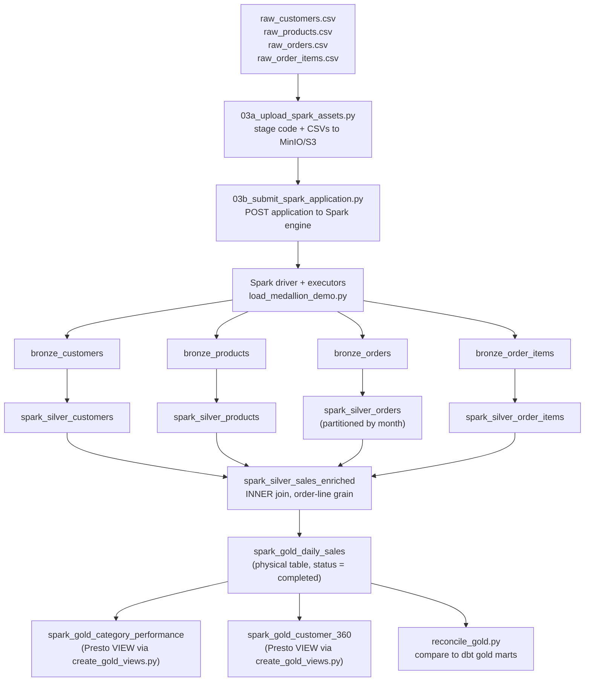

# Batch alternative — a submitted Spark application

This page walks the same medallion build as [dbt](dbt.md), but as a real
PySpark program instead of compiled SQL. The application lives at
[`03-spark/spark/load_medallion_demo.py`](https://github.com/aseelert/ibmas-watsonxdata-dbt/blob/main/03-spark/spark/load_medallion_demo.py)
and every code snippet below is quoted from that file, not paraphrased.

## dbt versus Spark: what actually executes

With dbt, you write `SELECT` statements; dbt compiles them and the Presto
adapter submits the compiled SQL to watsonx.data, where Presto's query
engine executes it. There is no separate "application" — Presto plans and
runs the query itself.

With Spark, you write an imperative Python program. That program (plus the
CSV inputs) is uploaded to object storage, then POSTed to the watsonx.data
Spark engine's REST API as an **application**. The engine starts a managed
Spark **driver** process, which plans the work and requests **executors** —
separate processes that read partitions of data in parallel and run the
DataFrame/SQL operations you wrote. The driver and executors are your code
running as a distributed job, not SQL text handed to someone else's engine.

| | dbt path | Spark path |
| --- | --- | --- |
| What you author | SQL `SELECT` models | A Python program using the DataFrame/SQL API |
| What gets submitted | Compiled SQL text | An application (code + CSV assets staged in object storage) |
| What executes it | Presto's query engine | A Spark driver + executors started for this application |
| Where logic can live | SQL functions/macros only | Full Python (and any library `pip`/the cluster provides) |
| Failure surface | One query per model | A whole running distributed job (driver, executors, shuffle) |

Both write to the same `iceberg_data` Iceberg catalog and are queryable from
the same Presto endpoint afterward — the divergence is entirely in how the
transformation runs, not in where the result lands.

### When a customer would actually choose Spark here

Choose the Spark path when the transformation needs something SQL cannot
express cleanly: custom Python/Java libraries, row-by-row or iterative logic,
machine-learning feature engineering, or processing volumes and file formats
where a distributed compute engine with its own memory management is a better
fit than a query planner. For a fixed set of business joins and aggregates
over a modest volume — which is exactly what this demo's four CSVs represent —
dbt's compiled-SQL model is usually easier for an analyst to read, review, and
operate, and it does not require standing up (or paying for) a Spark
application per run.

!!! warning "Verify with IBM"
    This demo's Spark job runs against a single watsonx.data Spark engine
    instance sized for the workshop's small seed data. Confirm with IBM what
    executor/driver sizing, autoscaling, and cost characteristics apply to a
    customer's actual Spark workload before using this page's numbers as a
    sizing reference — none are provided here beyond the demo's own defaults.

## What bronze, silver, and gold mean in this file

### Bronze — raw CSVs plus ingestion metadata

The job reads each of the four seed CSVs (customers, products, orders,
order_items — the same files dbt seeds) straight from object storage and
stamps every row with who/when/what ingested it, before writing an
`createOrReplace()` Iceberg table:

```python
df = (
    spark.read.option("header", "true").csv(source)
    .withColumn("_ingested_at", F.current_timestamp())
    .withColumn("_ingested_by", F.lit("spark job"))
    .withColumn("_source_file", F.lit(source_name))
    .withColumn("_ingest_batch_id", F.lit(os.getenv("WXD_SPARK_INGEST_BATCH_ID", "spark_demo_batch")))
)
```

Business "why": bronze is deliberately untransformed. If a customer later
asks "which file, and which run, produced this row?", the answer is a column
lookup, not an investigation. No CSV row is dropped or reshaped here — that
happens one layer up.

### Silver — typed, cleaned dimensions and one enriched fact

Silver takes each bronze table and casts types, trims whitespace, and
normalizes case — the kind of cleanup that lets four independently-authored
CSVs behave like one consistent dataset:

```python
customers.select(
    F.col("customer_id").cast("int").alias("customer_id"),
    F.trim("first_name").alias("first_name"),
    F.trim("last_name").alias("last_name"),
    F.lower(F.trim("email")).alias("email"),
    F.to_date("signup_date").alias("signup_date"),
    F.upper(F.trim("country")).alias("country"),
)
```

`spark_silver_orders` additionally splits the order timestamp into a
timestamp and a date column and is written partitioned by month of
`order_date` — a physical layout decision that keeps a query for "October's
orders" from scanning every month ever loaded.

The layer's centerpiece is `spark_silver_sales_enriched`, which joins all
four silver tables to one order-line grain and computes the money columns
every downstream mart needs:

```python
sales_enriched = (
    silver_items.alias("oi")
    .join(silver_orders.alias("o"), F.col("oi.order_id") == F.col("o.order_id"))
    .join(silver_products.alias("p"), F.col("oi.product_id") == F.col("p.product_id"))
    .join(silver_customers.alias("c"), F.col("o.customer_id") == F.col("c.customer_id"))
    .select(
        ...,
        (F.col("oi.quantity") * F.col("p.unit_price")).cast("decimal(14,2)").alias("gross_amount"),
        (F.col("oi.quantity") * F.col("p.unit_price") * (F.lit(1) - F.col("oi.discount_pct"))).cast("decimal(14,2)").alias("net_amount"),
        ...,
    )
)
```

A code comment in the file is explicit about a decision that matters for
the business result: these are **inner joins on purpose**.

> ORPHAN POLICY (mirrors dbt's silver_sales_enriched): these are INNER joins
> ON PURPOSE — an order-item survives only with a matching order, product and
> customer. Orphans are dropped, identically to the dbt path, so both engines
> share the same row universe. Do NOT switch to outer joins or the marts diverge.

Business "why": an order-item that references a product or customer that no
longer resolves is not a partial sale to report — it's ingestion garbage, and
both engines agree to discard it rather than let it silently deflate revenue
in one path and not the other.

### Gold — one physical table, two views created elsewhere

`spark_gold_daily_sales` is a physical, partitioned aggregate: only
`completed` orders count, grouped by day and category:

```python
daily_sales = (
    enriched.where(F.col("status") == "completed")
    .groupBy("order_date", "category")
    .agg(
        F.countDistinct("order_id").alias("order_count"),
        F.sum("quantity").alias("units_sold"),
        F.sum("net_amount").cast("decimal(14,2)").alias("net_revenue"),
    )
)
```

Business "why" for the `completed` filter: a cancelled or pending order is not
yet revenue, so it should not count toward a daily-sales number a sales leader
is reading. `countDistinct("order_id")` matters too — an order with three
line items must count as one order, not three.

The other two gold marts — `spark_gold_category_performance` and
`spark_gold_customer_360` — are **not** created by this Spark job at all. The
job only drops any stale object left at those names. This is a real,
load-bearing platform limitation worth explaining to a customer plainly: a
Spark `CREATE VIEW` produces a Hive-style view definition, and watsonx.data's
Presto engine refuses to read it ("Hive views are not supported"). So the two
view-shaped marts are created afterward, **through Presto**, by
`scripts/create_gold_views.py --path spark`, running the identical SQL text
used by the dbt models (`models/gold/gold_category_performance.sql` and
`models/gold/gold_customer_360.sql`). This keeps every path agreeing not just
on the rows, but on *table versus view* as the materialization.

!!! warning "Verify with IBM"
    Whether "Spark-created views are unreadable by Presto on Iceberg" is a
    permanent architectural boundary of watsonx.data, or a gap on a specific
    version that could close in a later release, was not confirmed against
    IBM documentation for this workshop. Treat the Presto-side view creation
    step as a documented workaround, not a guaranteed-permanent constraint.

## How to actually run it

Three explicit steps, mirroring the three phases of a submitted job: stage,
submit, watch. `bin/demo spark` is a fourth, narrower shortcut — read the
caveat below before relying on it as "the" run command.

**1. Stage the code and data.** `scripts/03a_upload_spark_assets.py` uploads
the Python file and the four raw CSVs into MinIO/S3, because the Spark engine
runs inside the cluster and can only see what is already in object storage:

```bash
python3 scripts/03a_upload_spark_assets.py
```

**2. Submit the application.** `scripts/03b_submit_spark_application.py`
builds the REST payload (application URI, Spark conf, sizing, auth) and POSTs
it to the watsonx.data Spark engine. It defaults to a **dry run** — it prints
the redacted payload and exits without contacting the engine:

```bash
python3 scripts/03b_submit_spark_application.py            # dry run: prints the payload only
WXD_SPARK_DRY_RUN=false python3 scripts/03b_submit_spark_application.py   # actually submits
```

**3. Watch it finish.** `scripts/03c_spark_application_status.py` polls the
application's state (`SUBMITTED` → `RUNNING` → `FINISHED`/`FAILED`) using the
application id the submit step printed:

```bash
python3 scripts/03c_spark_application_status.py <application-id>
```

**The `bin/demo spark` shortcut.** This calls
`scripts/03b_submit_spark_application.py --validate-config` — it checks that
the local application file exists and prints the payload, but it is always a
dry run regardless of `WXD_SPARK_DRY_RUN`. It's a good pre-flight check, not a
substitute for step 2 above with `WXD_SPARK_DRY_RUN=false`.

```bash
bin/demo spark        # validate-config only; never submits
```

**Check the result against dbt.** Once the application reaches `FINISHED`
(and the orchestrator has created the two Presto views), reconcile the gold
marts across paths:

```bash
bin/demo validate --paths dbt,spark
```

This runs a symmetric `EXCEPT` in both directions between the dbt and Spark
gold marts; two zero counts mean the rows are identical. See
[scripts.md](scripts.md) for the full script inventory and safety notes, and
[dbt.md](dbt.md) for the SQL these Spark transformations must match.

## Flow: bronze to silver to gold, this file specifically



## Where this leaves the customer

The Spark path proves the demo's central claim a second way: the same four
CSVs, run through a completely different execution engine and a different
author's code, produce the same Gold numbers. That parity — not either engine
individually — is the thing worth demonstrating live. If a customer's actual
workload needs Python-only logic or heavier distributed processing, this is
the pattern to point them to; if it's a fixed set of SQL joins and rollups,
point them back to [dbt.md](dbt.md) first and reserve Spark for the parts
that genuinely need it. See also [platform-choice.md](platform-choice.md)
for how this open-source composition compares to the IBM platform options.

References: [Spark SQL and DataFrames](https://spark.apache.org/docs/latest/sql-programming-guide.html),
[Spark data sources](https://spark.apache.org/docs/latest/sql-data-sources.html),
and [Iceberg Spark writes](https://iceberg.apache.org/docs/latest/spark-writes/).
