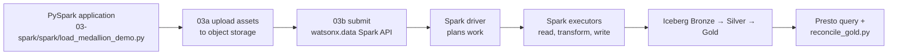

# Batch alternative — submitted Spark application

Spark uses a different execution model from dbt. A Python application and its
input assets are staged in object storage, then the watsonx.data Spark
application API starts a managed runtime. The application uses DataFrame and
Spark SQL operations to read inputs and commit Bronze, Silver, and Gold
Iceberg tables.

```text
Python application + CSV assets
  → object storage
  → watsonx.data Spark application API
  → managed driver and executors
  → Iceberg Bronze / Silver / Gold
```

## The Spark mental model

Spark is a distributed processing engine. A submitted application has a driver
that plans work and executors that process partitions in parallel. This is a
better fit than dbt when the transformation needs Python/Java/Scala libraries,
large-scale distributed processing, complex parsing, or machine-learning-adjacent
logic. It does not make SQL governance unnecessary: the same business grain,
quality checks, ownership, and Gold acceptance criteria still apply.



## What runs in order

| Step | Script or asset | Why it exists |
| --- | --- | --- |
| 1 | `03a_upload_spark_assets.py` | Stages the application and input fixtures where the managed runtime can reach them |
| 2 | `03b_submit_spark_application.py` | Builds the API payload and submits the application; dry-run is the default safety mode |
| 3 | `03c_spark_application_status.py` | Retrieves the application’s runtime status |
| 4 | `load_medallion_demo.py` | Reads source input, applies transformations, and commits Iceberg outputs |
| 5 | `reconcile_gold.py` | Checks the Spark Gold result against the dbt reference contract |

The application is stored in the repository because the code is part of the
demo’s evidence. Inspect it alongside the dbt models: the implementation
language differs, but the resulting business contract must not silently drift.

## When Spark is the better answer

Choose Spark when a SQL-only DAG would be an awkward expression of the work:
large file processing, specialized libraries, complex file formats, iterative
algorithms, ML feature preparation, or a broader data-engineering application.
For a small set of clear business transformations expressed as SQL, dbt plus
Presto is usually easier for analysts to review and operate.

```bash
python3 scripts/03a_upload_spark_assets.py
WXD_SPARK_DRY_RUN=false python3 scripts/03b_submit_spark_application.py
python3 scripts/03c_spark_application_status.py <application-id>
python3 scripts/reconcile_gold.py --paths dbt,spark
```

## Why the distinction matters

dbt expresses the business transformation as adapter-executed SQL. Spark runs a
submitted distributed application, which is useful when the workload needs
code libraries, distributed processing control, or non-SQL transformations.
Both can implement ETL; neither is intrinsically more governed. The business
definition is validated by Gold reconciliation.

References: [Spark SQL and DataFrames](https://spark.apache.org/docs/latest/sql-programming-guide.html),
[Spark data sources](https://spark.apache.org/docs/latest/sql-data-sources.html),
and [Iceberg Spark writes](https://iceberg.apache.org/docs/latest/spark-writes/).
