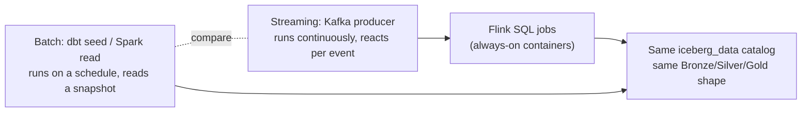
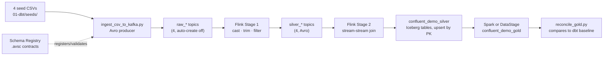
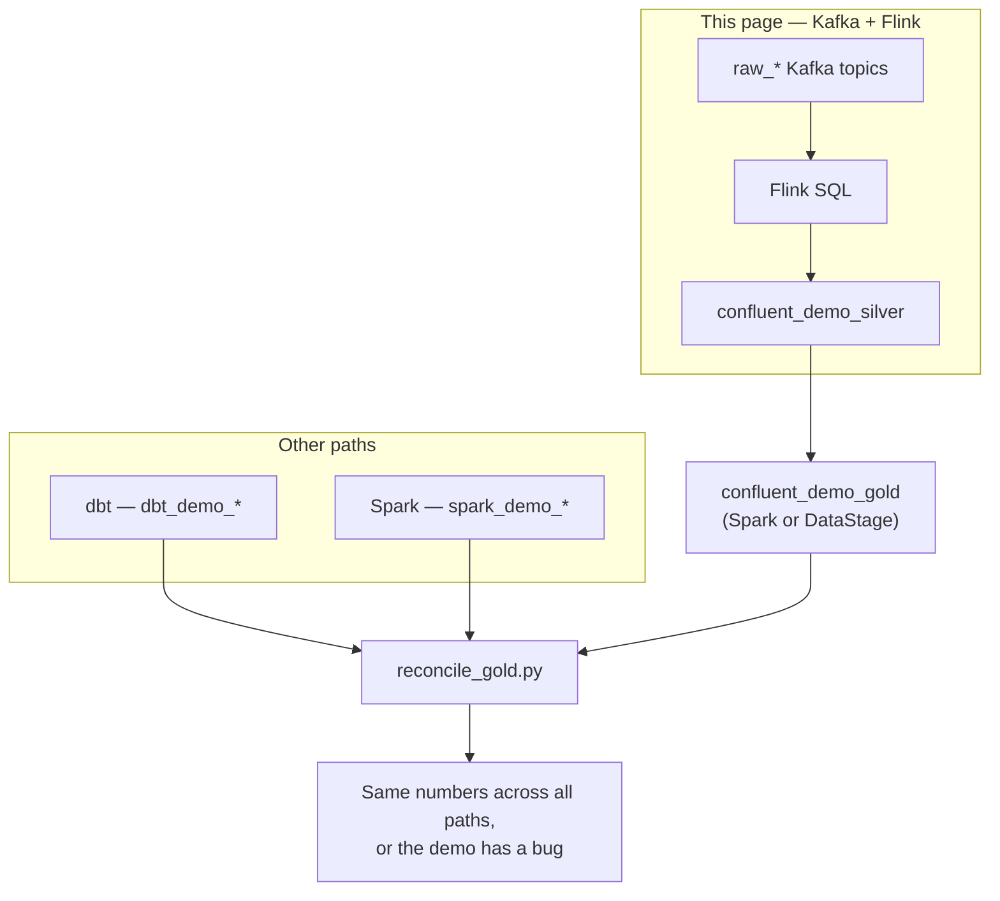

# Event alternative — Kafka, Flink, Confluent, Tableflow

Every other path in this workshop asks "what changed since the last run?"
This one asks "what should happen the instant this event arrives?" Batch
(`bin/demo dbt build`, `03-spark/spark/load_medallion_demo.py`) reads a
snapshot of files or seeds on a schedule. This path reads Kafka topics
continuously through always-on Flink jobs and lands the same medallion
shape — Bronze, Silver, Gold — in the same `iceberg_data` Iceberg catalog.
This page walks through the real containers and SQL in
`04-confluent-streaming/confluent/` so every claim traces to code you can
open yourself.


## 1. Why a stream instead of a batch, and when to pick it

| Decision factor | Batch (dbt / Spark) | This streaming path |
| --- | --- | --- |
| Trigger | A scheduled run or a manual command reads whatever is there | A Flink job reacts to each Kafka message as it arrives |
| Freshness | Minutes to a day, whatever the schedule is | Continuous, bounded mainly by the 30-second checkpoint interval below |
| What "recovery" means | Re-run from the retained raw seed/source | Replay a Kafka topic from an offset, or restore Flink from its last checkpoint |
| Always-on cost | Compute runs only while the job runs | Nine containers stay up (`bash 04-confluent-streaming/confluent/start.sh --status` lists them) whether or not new events arrive |
| Operating discipline this path adds | Tests and schedules | All of that, plus a schema contract (Avro + Schema Registry), topic retention, consumer offsets, and Flink checkpoint state |

Choose this path when the business question genuinely needs seconds-level
freshness or many independent consumers reading the same event once — fraud
scoring, an operational dashboard, a downstream service reacting to a new
order. For ordinary daily/weekly reporting, the dbt path is simpler to run,
debug, and staff; see [Delivery-path decision](delivery-options.md) for the
fuller comparison across all four authoring paths in this repository.



## 2. Bronze, Silver, and Gold when data never stops arriving

**Bronze here is the Kafka topic itself, not a table.** `raw_customers`,
`raw_products`, `raw_orders`, and `raw_order_items` are the four "raw" Kafka
topics that `04-confluent-streaming/confluent/scripts/ingest_csv_to_kafka.py`
produces the seed CSVs into, one Avro message per row. A Kafka topic already
does what a Bronze table does in the batch paths — it retains the original
event so it can be replayed — so this repository does not additionally
materialize a Bronze Iceberg table for the streaming path. `create-topics.sh`
creates these topics up front, on purpose:

```bash
# 04-confluent-streaming/confluent/scripts/create-topics.sh
RAW_TOPICS=(raw_customers raw_products raw_orders raw_order_items)
SILVER_TOPICS=(silver_customers silver_products silver_orders silver_order_items)
```

The comment above that block explains why: "the broker has AUTO topic
creation turned OFF on purpose, so every topic must be created up front."
That is a deliberate operational choice, not an oversight — an unplanned
topic silently appearing because a producer mistyped a name is exactly the
kind of surprise a real streaming platform is configured to prevent.

**Silver is where the actual streaming-specific logic lives**, in
`04-confluent-streaming/confluent/flink/sql/silver_jobs.sql`. It runs in two
stages: Stage 1 reads each `raw_*` topic, casts and cleans it, and writes a
`silver_*` topic (still Kafka, still Avro); Stage 2 reads those `silver_*`
topics back and writes Iceberg tables. Four of the Stage-1 jobs mirror the
dbt Silver models column-for-column — for example, customers:

```sql
SET 'pipeline.name' = 'kafka-raw-to-silver :: customers';
INSERT INTO kafka_silver_customers
SELECT
  customer_id,
  TRIM(first_name),
  TRIM(last_name),
  LOWER(TRIM(email)),
  CAST(CAST(signup_date AS DATE) AS STRING),
  UPPER(TRIM(country)),
  CAST(CURRENT_TIMESTAMP AS STRING)
FROM src_customers
WHERE email IS NOT NULL AND TRIM(email) <> '';
```

That is the same `TRIM`/`LOWER`/`UPPER` normalization as
[`silver_customers.sql`](dbt.md) in the dbt path, for the same business
reason: an email with stray casing or whitespace should never look like a
different customer to a downstream join. The ninth job,
`confluent_silver_sales_enriched`, is a **stream-stream join** across all four
silver topics — Flink holds each side of the join in state and matches rows
as they arrive from either side, rather than joining two finished tables the
way Presto or Spark would:

```sql
FROM      silver_src_order_items  AS oi
JOIN      silver_src_orders       AS o  ON oi.order_id   = o.order_id
JOIN      silver_src_products     AS p  ON oi.product_id = p.product_id
JOIN      silver_src_customers    AS c  ON o.customer_id = c.customer_id;
```

!!! note "This pipeline does not window or watermark"
    Read the SQL file and there is no `WATERMARK FOR`, no `TUMBLE`/`HOP`
    window, and no late-data handling — a real streaming-analytics job that
    computed "revenue per 5-minute window" would need those, but that is not
    what this pipeline does. Instead, every Iceberg sink table declares a
    `PRIMARY KEY ... NOT ENFORCED` plus `'write.upsert.enabled' = 'true'`, so
    each event **upserts** its row by key rather than appending a duplicate.
    Re-running the pipeline, or a message arriving twice, converges to the
    same row instead of double-counting it. The daily/category/customer
    roll-ups that would need windowing are pushed downstream to the Gold
    step (Spark or DataStage), which aggregates the accumulated Iceberg
    table in one pass — closer to a micro-batch than continuous windowed
    stream analytics.

Two more settings in the same file set the freshness/durability trade-off
directly:

```sql
SET 'execution.checkpointing.interval'    = '30000';   -- 30s
SET 'execution.checkpointing.mode'        = 'EXACTLY_ONCE';
SET 'table.exec.source.idle-timeout'      = '10000';   -- 10s
```

`EXACTLY_ONCE` checkpointing means Flink periodically snapshots the state of
every running job so it can resume without reprocessing or dropping
messages after a restart — the trade a business makes for that guarantee is
that a table's data can lag up to one checkpoint interval (here, 30 seconds)
behind the topic. The `idle-timeout` tells Flink not to let one quiet source
topic hold back the event-time clock of a join against three others that are
still producing — relevant to the `sales_enriched` job's four-way join.

**Gold is built by a second, separate engine** — Spark or DataStage — reading
the Flink-written `confluent_demo_silver` tables, exactly the same split
already described for [DataStage](../demo/enterprise/integration.md) as an
alternative authoring surface. `04-confluent-streaming/confluent/NAMING.md`
states the contract: "Same 4 CSVs → same 3 gold marts... whether the path is
dbt, Spark, or Confluent." `CONFLUENT_GOLD_ENGINE` picks which engine runs:

| `CONFLUENT_GOLD_ENGINE` | Script | What it does |
| --- | --- | --- |
| `spark` (default) | `04-confluent-streaming/confluent/scripts/submit_confluent_gold.py` | Submits `confluent/spark/confluent_gold.py` to the watsonx.data Spark engine |
| `datastage` | `04-confluent-streaming/confluent/scripts/create_datastage_flow.py` | POSTs a parameterized flow template to the CP4D DataStage flows API, and can compile + run it with `--apply --run` |

The DataStage script defaults to `--dry-run` — it prints the exact JSON
request instead of sending it — because, as its own docstring puts it, "the
DataStage flows API only exists on a CP4D cluster with the DataStage
cartridge installed. There is no way to validate the POST offline." Both
engines write the same `confluent_gold_daily_sales`,
`confluent_gold_category_performance`, and `confluent_gold_customer_360`
marts, so `bin/demo validate --paths dbt,confluent` can compare either one
against the dbt baseline.

## 3. Confluent's pieces versus plain open-source Kafka

The containers this repository runs are Confluent Platform's
community-licensed images (`confluentinc/cp-kafka:7.7.1`,
`confluentinc/cp-schema-registry:7.7.1` — see
`04-confluent-streaming/confluent/docker-compose.yml`), not the plain Apache
Kafka distribution, and not Confluent Cloud. The two pieces that make this
meaningfully different from a bare Apache Kafka broker:

- **Schema Registry.** `ingest_csv_to_kafka.py`'s docstring is direct about
  why: "A real streaming platform never ships 'naked' JSON — every message
  carries a CONTRACT (an Avro schema) so producers and consumers can never
  disagree about the shape of the data." Each `.avsc` file in
  `04-confluent-streaming/confluent/schemas/` is the contract for one topic;
  the first message produced to a topic auto-registers the subject
  `<topic>-value`, and every consumer — including the Flink SQL jobs, via
  `format = 'avro-confluent'` — resolves that same registered schema instead
  of guessing at field names and types.
- **A UI for the operational picture.** Kafbat UI (`ghcr.io/kafbat/kafka-ui`)
  gives a workshop attendee a place to see topics, partitions, consumer
  groups, and message counts without a CLI — this is an open-source Kafka UI
  project, not Confluent's own commercial Control Center.

What this repository does **not** run: Confluent Cloud, Confluent's managed
Flink service, or Tableflow. The Flink here is self-managed — a custom image
(`wxd-flink:1.20`, built from plain `flink:1.20-scala_2.12` plus the Kafka,
Iceberg, and S3A connector jars, see
`04-confluent-streaming/confluent/flink/Dockerfile`) running as ordinary
containers this workshop starts, checkpoints, and restarts by hand. See
[Confluent, Flink, and the managed alternative](enterprise/confluent-vs-flink.md)
for how that self-managed choice compares to Confluent's own managed Flink
service and to Tableflow specifically.



## 4. Running it

```bash
bin/demo streaming
```

That single command is `bash 04-confluent-streaming/confluent/start.sh --all`
— it creates the Python virtualenv if missing, builds the `wxd-flink:1.20`
image if it isn't already built, starts the seven long-running containers,
waits for Kafka to report healthy, creates the eight topics, and produces the
1,704 seed rows (50 + 20 + 500 + 1,134) into the four `raw_*` topics. It does
**not** build Silver or Gold — those are separate, deliberately manual steps
because they need a reachable MinIO endpoint first:

```bash
bash 04-confluent-streaming/confluent/scripts/expose_minio_route.sh   # once: exposes MinIO via an OpenShift Route
# paste the printed WXD_OBJECT_STORE_ENDPOINT into .env, then:
bin/demo streaming --silver               # Flink silver pipeline → confluent_demo_silver
bin/demo streaming --gold --engine spark  # or --engine datastage
bin/demo validate --paths dbt,confluent
```

Other actions worth knowing: `--stack` starts only the containers (no topics,
no seeding); `--status` is read-only and prints per-topic message counts plus
every UI URL; `--stop` stops the seven containers but keeps their data;
`--reset` is destructive and delegates to `scripts/11_reset_demo.sh
--confluent`. Run `bash 04-confluent-streaming/confluent/start.sh --help` for
the full option reference, or see [Access and interfaces](access.md) for the
Kafbat UI, Flink Web UI, Schema Registry, and Iceberg REST catalog URLs, and
[Scripts and automation](scripts.md) for where this fits among the other
`bin/demo` commands.

## 5. Where this fits next to the other three paths



This path exists to make one point concrete for a workshop audience: the
same four CSVs, run through a fundamentally different execution model — an
always-on event pipeline instead of a scheduled read — still land in the
same catalog with the same gold numbers. See
[Delivery-path decision](delivery-options.md) for how all four authoring
paths (dbt, Spark, this streaming stack, and DataStage) are framed as
alternatives that reconcile to one contract, and
[Confluent, Flink, and the managed alternative](enterprise/confluent-vs-flink.md)
for what a customer would actually be signing up for if they replaced this
self-managed stack with Confluent's commercial platform.

References: [Confluent Schema Registry](https://docs.confluent.io/platform/current/schema-registry/index.html),
[Flink Kafka SQL connector](https://nightlies.apache.org/flink/flink-docs-stable/docs/connectors/table/kafka/),
[Flink checkpointing](https://nightlies.apache.org/flink/flink-docs-stable/docs/concepts/stateful-stream-processing/),
and [Flink's Iceberg connector](https://iceberg.apache.org/docs/latest/flink/).
