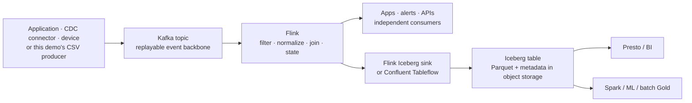
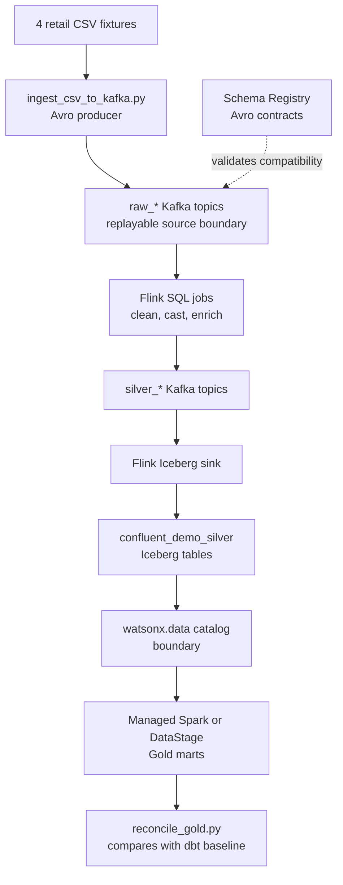
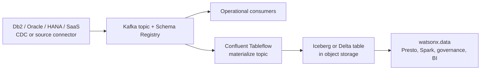

# Event alternative: Kafka, Flink, Confluent, and Tableflow

Streaming is a different clock, not a more complicated spelling of batch.
Batch asks, “what has accumulated since the last run?” Streaming asks, “what
should happen when the next event arrives?” Both can produce governed Iceberg
tables and the same business measures.


## Start with the distinction

| Name | What it is | What it is not |
| --- | --- | --- |
| **Apache Kafka** | A durable, ordered event log. Producers publish events; multiple consumers read independently and can replay them. | A lakehouse table or BI database |
| **Schema Registry** | A registry for event schemas and compatibility rules, commonly with Avro, Protobuf, or JSON Schema. | A catalog or data-quality program |
| **Apache Flink** | A stream-processing engine that transforms, joins, and maintains state over events continuously. | Kafka itself or an Iceberg catalog |
| **Confluent** | A streaming platform and product ecosystem around Kafka, connectors, governance, Flink, and services such as Tableflow. | A synonym for every Kafka deployment |
| **Tableflow** | A Confluent capability that materializes selected Kafka topics as Iceberg or Delta tables in object storage. | The self-managed Flink Iceberg sink used in this repository |
| **Apache Iceberg** | The open table format used after data is materialized in object storage. | The event transport layer |

## Event backbone to open table



An event is published once to Kafka. A customer-facing application, an alert,
a fraud model, and an analytics pipeline may consume it independently at their
own pace. The lakehouse path becomes available when a processor or Tableflow
materializes the relevant topic into an open table.

!!! note "A Kafka topic is not an Iceberg table"
    Kafka retains ordered events and consumer offsets. Iceberg represents a
    queryable table snapshot over files in object storage. Tableflow—or the
    Flink Iceberg sink in this repository—bridges those two worlds. Presto and
    Spark query the Iceberg table through a compatible catalog; they do not
    query Kafka as if it were a relational table.

## What this repository actually runs

The workshop runs a local Confluent Platform-style composition: Kafka, Schema
Registry, Kafbat UI, and self-managed Apache Flink SQL. It serializes the
retail CSV fixtures as Avro events, uses Flink to build Silver, and writes
Iceberg tables through the local pipeline. Those tables are registered into the
watsonx.data/Presto view of the catalog; managed Spark or DataStage can then
build Gold.



This is deliberately different from claiming that the repository is a
Confluent Cloud/Tableflow implementation. Tableflow belongs to Confluent’s
product portfolio and may be selected in a real architecture. The local
workshop uses Flink SQL plus an Iceberg sink because that behavior is runnable
and inspectable from source.

## Bronze, Silver, and Gold in a stream

| Medallion intent | Batch dbt/Spark example | Streaming example in this repository | Tableflow-oriented option |
| --- | --- | --- | --- |
| **Raw/Bronze** | Raw files or a source-shaped Iceberg table | `raw_*` topic retains original events and can be replayed | Materialize a source-shaped topic to an Iceberg Bronze table |
| **Silver** | Typed, cleaned, joined tables | Flink normalizes events and writes Silver topics/tables | Materialize a cleaned topic, or process before/after landing |
| **Gold** | Business mart at an explicit grain | Spark or DataStage aggregates the streaming Silver tables | Build in the lakehouse with SQL/Spark/DataStage, or stream it only where freshness requires it |

There is no universal rule that Tableflow must create Bronze or Silver. The
landing layer is an architectural decision: preserve topic-shaped records for
replay and audit, or materialize a curated stream once upstream controls are
established. The team must document the chosen data contract and ownership.

## Where Confluent Tableflow fits

Tableflow is useful when the desired contract is “a governed Kafka topic should
also be available as an open table.” It manages the topic-to-table
materialization pattern.



Tableflow, Kafka, connectors, and Confluent streaming governance are
Confluent components. watsonx.data provides the lakehouse compute and
governance services selected for that environment. They are separate platforms
with separate deployment, entitlement, sizing, identity, and operations.

### About MDS and “one endpoint” expectations

Confluent Metadata Service (MDS) is a Confluent control-plane capability that
is commonly associated with metadata, RBAC, and authorization. It is not a
generic SQL endpoint that makes Iceberg tables queryable by every application.
To read a materialized Iceberg table, a consumer needs a compatible
catalog/table access path plus authorization to the catalog and object store.
To read events, it needs Kafka connectivity and topic authorization. Keep the
stream and table access models explicit in the design.

## How to run the local demonstration

```bash
bin/demo streaming
bash 04-confluent-streaming/confluent/scripts/expose_minio_route.sh
bash 04-confluent-streaming/confluent/start.sh --silver --yes
bash 04-confluent-streaming/confluent/start.sh --gold --engine spark --yes
python3 scripts/reconcile_gold.py --paths dbt,confluent
```

The first run builds or starts local containers. Inspect the Kafka UI, Flink UI,
and Schema Registry endpoints listed in [Access and interfaces](access.md) to
make the flow visible in a workshop. The command starts services and can write
event/table data; it is not a read-only validation.

## Choosing batch or streaming

| Decision factor | dbt / Spark batch | Kafka + Flink / Confluent streaming |
| --- | --- | --- |
| Freshness | Minutes, hours, or daily | Seconds to near-real-time, depending on design |
| Input shape | Files, extracts, scheduled reads | Continuous events or CDC changes |
| Recovery | Re-run from retained Raw/source | Replay topics and restore state according to the stream design |
| Cost profile | Compute runs when jobs run | Always-on services and state management |
| Strength | Simpler delivery for most analytics workloads | Parallel event consumers and continuous processing |
| Discipline | Tests, schedules, table contracts | Contracts, compatibility, ordering, state, checkpoints, retention |

For most business reporting, begin with the dbt reference path. Use streaming
when the value of freshness or parallel event consumption clearly exceeds the
additional operating complexity.

References: [Confluent Schema Registry](https://docs.confluent.io/platform/current/schema-registry/index.html),
[Tableflow](https://docs.confluent.io/cloud/current/topics/tableflow/overview.html),
[Flink Kafka SQL connector](https://nightlies.apache.org/flink/flink-docs-stable/docs/connectors/table/kafka/),
and [Flink checkpointing](https://nightlies.apache.org/flink/flink-docs-stable/docs/concepts/stateful-stream-processing/).
