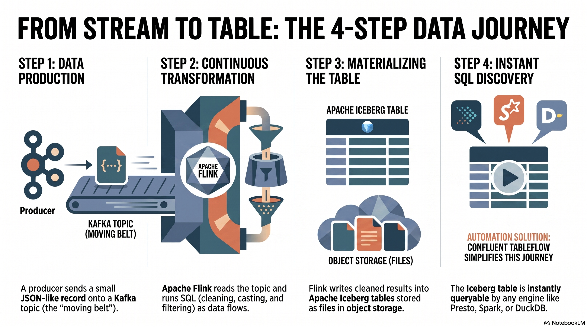

# Event alternative — Kafka, Schema Registry, and Flink

This repository runs a local Confluent Platform-style stack: Kafka, Schema
Registry, and self-managed Apache Flink SQL. It is not Confluent Cloud
Tableflow. CSV fixtures are serialized as Avro events to Kafka; Flink consumes
them continuously and materializes Silver Iceberg tables. A managed Spark or
DataStage step then builds the Gold marts.



```text
CSV producer → Kafka topics + Avro schemas → Flink SQL → Iceberg Silver
                                                    → Spark or DataStage Gold
```

```bash
bin/demo streaming
bash 04-confluent-streaming/confluent/scripts/expose_minio_route.sh
bash 04-confluent-streaming/confluent/start.sh --silver --yes
bash 04-confluent-streaming/confluent/start.sh --gold --engine spark --yes
python3 scripts/reconcile_gold.py --paths dbt,confluent
```

## Controls and limitations

Schema Registry stores schemas and compatibility policies; it does not by
itself establish data-quality rules. Flink checkpoints coordinate state and
sink commits, but delivery guarantees depend on the complete source, sink, and
runtime configuration. The local Iceberg REST catalog is registered into
watsonx.data/Presto explicitly—an integration boundary worth showing in the
workshop.

References: [Confluent Schema Registry](https://docs.confluent.io/platform/current/schema-registry/index.html),
[schema evolution](https://docs.confluent.io/platform/current/schema-registry/fundamentals/schema-evolution.html),
[Flink Kafka SQL connector](https://nightlies.apache.org/flink/flink-docs-stable/docs/connectors/table/kafka/),
and [Flink checkpoints](https://nightlies.apache.org/flink/flink-docs-stable/docs/concepts/stateful-stream-processing/).
