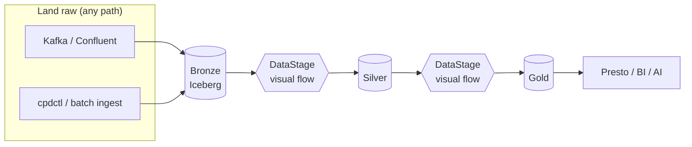
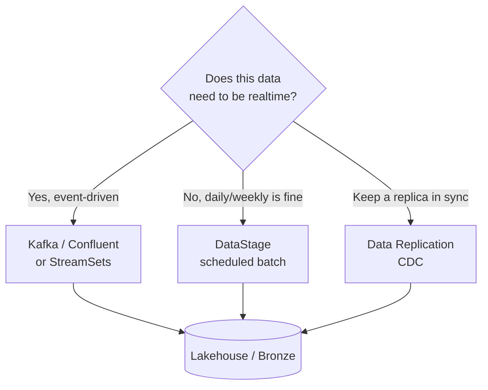

# watsonx.data Integration

!!! abstract "What this page covers"
    **[IBM watsonx.data Integration](https://www.ibm.com/products/watsonx-data-integration)** is the data-movement product in the watsonx.data family — a *separate* offering from the lakehouse engine and from [watsonx.data Intelligence](intelligence.md) (governance). It puts one control plane over **IBM DataStage** (batch ETL/ELT), **StreamSets** (real-time streaming), **IBM Data Replication** (CDC), **unstructured data processing (UDI)**, and **IBM Data Observability powered by Databand**, with built-in pipeline observability and consumption-based (RU) metering. ([service overview](https://www.ibm.com/docs/en/software-hub/5.3.x?topic=services-watsonxdata-integration), [announcement](https://www.ibm.com/new/announcements/new-innovations-from-ibm-data-integration-real-time-quality-data-and-analytics-with-next-gen-deployment-flexibility))

    For decision-makers, the headline is simple: this is the **enterprise, supported, no-code** answer to everything the open-source paths in this workshop do by hand — dbt, Spark, Flink, Airflow, Kafka. It is not the *only* way to build a medallion; it is the governed, GUI-first way. See the [Enterprise overview](overview.md) for how the tabs fit together.

---

## DataStage — the no-code medallion builder

This is the centerpiece for most enterprise teams. In this workshop the four CSVs are shaped into Bronze → Silver → Gold by **dbt SQL** ([models](../ingestion.md)), **PySpark**, or **Flink**. DataStage does the same job with a **visual canvas**: an ETL developer drags source connectors, joins, aggregations, and target stages onto a flow, and DataStage compiles and runs it on its own parallel engine. The recommended enterprise pattern is to let your *landing/ingestion* tool drop raw data into the Iceberg lakehouse, then have **DataStage build Silver → Gold on top of it** — no-code, governed, and supportable by a team that does not write SQL or Scala.

We ship a runnable proof of this. The **[DataStage gold demo](../datastage-demo.md)** (driven by `confluent/scripts/create_datastage_flow.py`) builds the Gold layer for the Confluent/Kafka path and reconciles it against the dbt and Spark Gold outputs — **same grain, same numbers**. That is the load-bearing claim for a customer: *DataStage Gold == dbt Gold == Spark Gold*, so you can adopt DataStage as the authoring tool without changing the semantics your business already trusts.

!!! note "Recommended position"
    DataStage is the **recommended enterprise medallion builder**; dbt, Spark, and Flink (the rest of this workshop) are the open-source alternatives. Pick DataStage when you need a no-code authoring surface, vendor support, and a skill set that is broadly available in ETL teams. Pick code-first when your team lives in git and prefers SQL/Python.

**Honest cons.** DataStage is **another runtime to license, install, and operate** on IBM Software Hub — more moving parts and cost than `dbt run`. And GUI flows are genuinely **harder to code-review and diff** than dbt SQL in git: a pull-request reviewer can read a `.sql` change in seconds, but comparing two versions of a visual flow is awkward, and merge conflicts in flow definitions are unpleasant. Teams with strong CI/CD and SQL fluency often find dbt cheaper to govern; teams with a dedicated ETL practice find DataStage faster to author and easier to staff. See [Choosing a path](../choosing.md).

---

## Choosing the ingestion engine — realtime vs batch (cost)

Before DataStage builds Silver → Gold, *something* has to land the raw data. The most common architecture mistake is making **everything realtime**. Streaming is the right tool for data that is genuinely event-driven, but it carries always-on infrastructure and operational cost. A large amount of enterprise data — finance closes, daily product catalogs, weekly reference data — does **not** need sub-second latency, and a scheduled **batch** extract is far cheaper to run and reason about.

| Engine | Pattern | Latency | Pick this when | Cost note |
|---|---|---|---|---|
| **Kafka / Confluent** ([demo](../confluent-demo.md)) | Realtime streaming, many sources unified | Seconds | Genuine event streams; many producers; replay/buffering needed | Highest — always-on brokers; expensive if *everything* is forced realtime |
| **DataStage** ([demo](../datastage-demo.md)) | Scheduled batch ETL/ELT | Minutes–hours (daily/weekly) | Data that does **not** need realtime; complex transforms; no-code team | **Most cost-efficient** for non-realtime; runs on a schedule, not 24/7 |
| **StreamSets** | Smart streaming + drift handling | Seconds–minutes | Streaming with messy/evolving sources; client-managed control plane | Mid — streaming runtime, but more resilient to schema change |
| **Data Replication (CDC)** | Change Data Capture | Near-realtime deltas | Keep a lakehouse replica in sync with an OLTP source, low source impact | Mid — efficient (only changes move) but a continuous process |

!!! tip "A real platform uses both"
    Use **Kafka/Confluent for the realtime streams** that justify it, and **DataStage for scheduled batch/CDC** for everything that doesn't. The cost win comes from *not* paying streaming prices for data a nightly job would serve perfectly well.

---

## StreamSets

**StreamSets** is the streaming/real-time member of the bundle: smart data pipelines that handle **schema drift** automatically (so an added or renamed source column doesn't break the flow), with monitoring built in. It supports a **client-managed control-plane option** for customers who need the orchestration plane inside their own boundary. ([announcement](https://www.ibm.com/new/announcements/new-innovations-from-ibm-data-integration-real-time-quality-data-and-analytics-with-next-gen-deployment-flexibility)) Think of it as the resilient choice when streaming sources are messy or evolving, where a rigid pipeline would constantly break.

---

## Unstructured data (UDI)

**Unstructured Data Insights (UDI)** ingests and transforms documents — PDFs, PowerPoint, scanned files — into **AI-ready data**. It is built on IBM Research's **Data Prep Kit (DPK)**, **Watson Document Understanding**, and **Docling**, and runs the pipeline that AI actually needs: **PII/HAP removal, de-duplication, chunking, and embedding** to populate a **vector database** such as Milvus for RAG and other AI workloads. ([announcement](https://www.ibm.com/new/announcements/ibm-announces-unstructured-data-capabilities-for-integration-and-governance)) This matters because most enterprise knowledge lives in documents, not tables — UDI is how that content becomes searchable, governed embeddings instead of an untracked file share.

!!! warning "Verify with IBM"
    IBM markets this capability as **"unstructured data processing / integration"**; "UDI / Unstructured Data Insights" is the working name used here. Confirm the exact product name and the precise feature deltas for your release against the official [watsonx.data Integration service docs](https://www.ibm.com/docs/en/software-hub/5.3.x?topic=services-watsonxdata-integration) before quoting them to a customer.

---

## Data Observability (Databand)

**IBM Data Observability powered by Databand** is the single dashboard that watches your pipelines run. It does **ML-powered anomaly detection** (learned baselines for row counts, durations, schema, freshness), **data-quality and SLA monitoring**, and **centralized, prioritized alerting** across tools — DataStage and StreamSets, *and* **Apache Airflow** via a dedicated integration. ([data observability](https://www.ibm.com/products/watsonx-data-integration/data-observability), [Airflow integration](https://www.ibm.com/products/databand/integrations/apache-airflow), [docs](https://www.ibm.com/docs/en/watsonx/wdi/saas?topic=integration-observing-your-data))

This directly answers a question this workshop's [Airflow](../airflow.md) path raises: *"Can we observe our Airflow DAGs?"* — **yes.** The contrast is worth being honest about: open-source Airflow already gives you **scheduling and basic alerting** (a task failed, an email fired). Databand adds **learned-baseline anomaly detection** (this run is *unusually* slow / this table is *unusually* empty — even when nothing technically "failed") and **cross-tool observability** so DataStage, StreamSets, and Airflow report into one place. If your only orchestrator is Airflow and a failed-task email is enough, you may not need it; if you run several engines and want proactive, learned alerting, that is exactly the gap Databand fills.

---

## watsonx.data Integration vs the open-source ETL in this workshop

| Capability | Open source in this workshop | watsonx.data Integration | Honest verdict |
|---|---|---|---|
| Batch ETL/ELT authoring | dbt SQL, PySpark | **DataStage** (no-code visual) | OSS is git-native and cheap; DataStage is no-code, supported, easier to staff |
| Realtime streaming | Kafka/Confluent → Flink ([demo](../confluent-demo.md)) | **StreamSets** + Kafka connectors | Both work; StreamSets adds drift handling + a managed control plane |
| Change Data Capture | Not built here | **IBM Data Replication** | Net-new capability; OSS path has no first-class CDC |
| Unstructured → vector | Not built here | **UDI** (DPK, Docling, embeddings) | Net-new; the AI-ready-document story OSS doesn't cover here |
| Orchestration | **Apache Airflow** ([path](../airflow.md)) | Pipeline scheduling + Databand | Airflow stays valid; Databand *observes* it rather than replacing it |
| Observability | Airflow alerts, dbt test results | **Databand** anomaly + SLA + DQ | OSS = basic failure alerts; Databand = learned baselines, cross-tool |
| Lineage | dbt artifacts → OpenMetadata ([E2E](lineage-e2e.md)) | Integrated lineage + [Intelligence](intelligence.md) | Both deliver lineage; the IBM stack ties it into one governance plane |

!!! warning "On-prem and RU-metered"
    watsonx.data Integration installs on **IBM Software Hub 5.3.x (self-managed)** and is billed **consumption-based via RUs**. ([install docs](https://www.ibm.com/docs/en/software-hub/5.3.x?topic=integration-installing)) Budget for the on-prem footprint and the metering model — see [Performance & editions](performance-editions.md) for how RU consumption compares across the family.

!!! warning "Be fair to the open-source path"
    The open-source stack in this workshop — **dbt + Spark + Flink + Airflow** — *already builds a working, tested medallion end to end.* watsonx.data Integration is not about being the only way to move data; it is about **no-code authoring, enterprise support, CDC/unstructured coverage, and cross-tool observability**. Choose it for those reasons, not because the OSS path can't do the job. See [Choosing a path](../choosing.md).

---

**Next:** [Intelligence (governance)](intelligence.md) · [End-to-end lineage](lineage-e2e.md) · [Performance & editions](performance-editions.md) · [Enterprise summary](summary.md)
