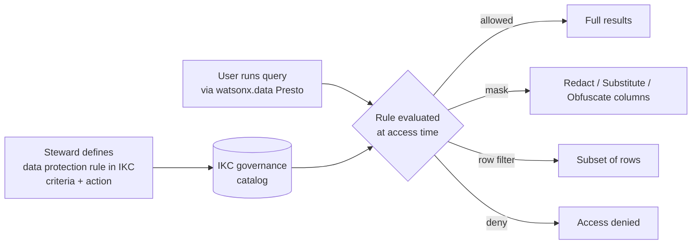

# watsonx.data Intelligence

!!! abstract "In one sentence"
    **watsonx.data Intelligence** is IBM's governance and catalog layer for the lakehouse — it bundles **IBM Knowledge Catalog (IKC)** governance (business glossary, data classification, automated data quality, profiling, SLAs), **IBM Manta Data Lineage**, and the **Data Product Hub (DPH)** into one RU-metered product that runs on **IBM Software Hub** (on-prem). It is the rebrand and superset of IKC: per IBM it "combines data governance capabilities formerly available as IBM Knowledge Catalog" with curation of structured and unstructured data, data quality, lineage, and data products ([ibm.com/solutions/data-intelligence](https://www.ibm.com/solutions/data-intelligence), [ibm.com/products/watsonx-data-intelligence](https://www.ibm.com/products/watsonx-data-intelligence)).

This page is for architects and decision-makers weighing the commercial governance product against the open-source governance stack used elsewhere in this workshop. For the broader Enterprise picture see [overview.md](overview.md); for how the pieces wire together see [integration.md](integration.md); for the full lineage story see [lineage-e2e.md](lineage-e2e.md); for RU metering and editions see [performance-editions.md](performance-editions.md); and for the executive wrap-up see [summary.md](summary.md).

!!! info "Everything here is on-prem and RU-metered"
    watsonx.data Intelligence is delivered on **IBM Software Hub** and consumed via **Resource Units (RU)**. Profiling, quality runs, lineage scans, and masking evaluation all draw capacity. Size the metering against your scan frequency and concurrency — see [performance-editions.md](performance-editions.md).

---

## Catalog & business glossary

The customer's stated primary use is **data quality + business glossary**, and this is where IKC earns its keep. IKC provides a managed business glossary with governed terms, categories, stewardship and approval workflows, and **automated data classification** that tags columns against data classes (e.g. email, national ID) so glossary terms attach to physical assets at scale rather than by hand.

The open-source alternative in this workshop, **OpenMetadata** (see [../openmetadata-governance.md](../openmetadata-governance.md)), gives you a perfectly usable free catalog and glossary, tags, and ownership. What it does **not** give you is *enforced* policy, automated classification at IKC's depth, or governance that reaches into query results. OpenMetadata documents and describes; IKC documents, classifies, **and** governs.

| | OpenMetadata (this repo) | IKC in watsonx.data Intelligence |
|---|---|---|
| Business glossary | Yes, free | Yes, with stewardship workflows |
| Automated data classification | Limited | Yes, data-class driven |
| Approval / certification workflow | Basic | Yes |
| Policy that affects query results | No | Yes (see masking, below) |

---

## Data quality, profiling & SLAs

Be fair to the open source: **dbt tests** (the `schema.yml` tests in this repo) are excellent, free, version-controlled, and run right where your SQL models are built — for structural and referential checks on the medallion models they are hard to beat. Pairing dbt tests with **Great Expectations** covers a lot of column-level expectation testing without a license.

What IKC adds is **business-rule data quality**, **automated profiling at scale** across many heterogeneous sources, and **SLA tracking** — quality dimensions (completeness, validity, uniqueness, consistency) computed and trended over time, with rules expressed against business terms rather than per-model SQL. The honest trade-off: dbt/GE quality lives with the engineers and the code; IKC quality lives with the stewards and the catalog, and applies uniformly to assets that never pass through dbt. For a shop whose main ask is "glossary + DQ across the estate," IKC's profiling and SLA dashboards are the differentiator; for "tests on my gold marts," dbt already does the job for free.

---

## Lineage (Manta)

**IBM Manta Data Lineage** is the strongest single reason enterprises reach for the commercial product. Manta ships **50+ out-of-the-box scanners** across databases, ETL, and BI, and resolves lineage at the **column level** — including **IBM DataStage** (column-level) and **IBM Cognos Analytics** ([ibm.com/products/manta-data-lineage](https://www.ibm.com/products/manta-data-lineage)). The OpenMetadata/OpenLineage lineage in this repo (see [../openlineage.md](../openlineage.md) and [lineage-e2e.md](lineage-e2e.md)) is built from **dbt artifacts** (manifest/catalog/run_results) — it covers the dbt medallion graph well but does **not** scan DataStage jobs or Cognos reports.

For the Kafka streaming stack in `confluent/`, the picture is good news with a real caveat. Manta connects to the **Confluent Platform Schema Registry** and automatically extracts topic schemas, visualizing cluster → topics → schemas → columns ([ibm.com/docs/.../kafka-integration-requirements](https://www.ibm.com/docs/en/manta-data-lineage?topic=kafka-integration-requirements)).

!!! warning "The Flink lineage gap — state this honestly"
    Manta reads the **Confluent Schema Registry** to map topics and their schemas. It does **not** natively trace **Flink** job logic. In this workshop's `confluent/` stack, the Flink SQL transformations that turn raw topics into silver topics will therefore **not** appear as transformation lineage — you get topic/schema lineage, not the Flink processing step. Treat Flink-job lineage as **unsupported until you verify it in-product** for your version.

!!! warning "Verify supported versions with IBM"
    Exact Manta-supported versions of Confluent/Kafka, IBM DataStage, and IBM Cognos Analytics could not be confirmed here (IBM docs blocked automated fetch). Confirm your specific versions against the scanner matrix: [ibm.com/docs/.../scanners](https://www.ibm.com/docs/en/manta-data-lineage?topic=scanners).

---

## Data Product Hub

The **Data Product Hub (DPH)** lets you publish governed **data products** — for this workshop, the **gold marts** (`gold_daily_sales`, `gold_category_performance`, `gold_customer_360`) — as discoverable, self-service offerings with **contracts and SLAs**. Consumers browse a marketplace, request access through a governed workflow, and receive a product whose quality and ownership are already attested. DPH is bundled in watsonx.data Intelligence and is also sold standalone ([ibm.com/solutions/data-intelligence](https://www.ibm.com/solutions/data-intelligence)). It turns the curated gold layer from "tables an engineer points you at" into a productized, contract-backed offering — the layer the open-source stack here does not provide.

---

## Policy enforcement & dynamic masking

This is the enterprise differentiator the open-source stack in this workshop **cannot** match. You import watsonx.data assets into IKC and define **data protection rules**; **dynamic column masking** then applies to **watsonx.data Presto query results**. A rule combines **criteria** (who is asking + a business term, data class, column, or tag) with an **action** (deny access, mask, or row filter), and is **evaluated at access time** — so the same physical table returns different results depending on who runs the query. Masking methods include **Redact**, **Substitute**, and **Obfuscate**, and enforcement works whether IKC is **SaaS or on Software Hub** (hybrid is supported) ([wkc-wxd-integration](https://dataplatform.cloud.ibm.com/docs/content/wsj/governance/wkc-wxd-integration.html?context=cpdaas), [masking-data](https://dataplatform.cloud.ibm.com/docs/content/wsj/governance/masking-data.html?context=cpdaas), [data-protection-rules-enforcement](https://dataplatform.cloud.ibm.com/docs/content/wsj/governance/data-protection-rules-enforcement.html)).

Define the rule **once** centrally; it is enforced on every governed query against the lakehouse without changing the SQL or the models. OpenMetadata and dbt can *document* sensitivity, but they have no runtime hook into Presto to *enforce* it.

---

## watsonx.data Intelligence vs the open-source governance in this workshop

| Capability | Open source here | watsonx.data Intelligence | Honest verdict |
|---|---|---|---|
| Business glossary | OpenMetadata (free) | IKC, with stewardship workflows | Both work; IKC adds governed workflows + classification |
| Data classification | Limited / manual | Automated, data-class driven | IKC clearly ahead at scale |
| SQL-model data quality | dbt tests (excellent, free) | IKC business rules | dbt wins for model tests; IKC wins for estate-wide DQ |
| Profiling & SLA tracking | Minimal | Automated profiling + SLA dashboards | IKC differentiator |
| Lineage — dbt graph | OpenMetadata via dbt artifacts | Manta, column-level | Both cover dbt; Manta deeper |
| Lineage — DataStage / Cognos | Not covered | Manta scanners (column-level) | Only IKC/Manta |
| Lineage — Kafka topics/schemas | Not covered | Manta via Confluent Schema Registry | IKC/Manta — schema lineage only |
| Lineage — Flink job logic | Not covered | **Not native** (see warning) | Neither today; verify in-product |
| Data products / marketplace | None | Data Product Hub (contracts, SLAs) | Only IKC |
| **Policy enforcement in query results** | **None** | **Dynamic masking / row filter in Presto** | **Only IKC — the headline differentiator** |
| Cost model | Free / OSS ops effort | RU-metered on Software Hub | Open source is cheaper; IKC buys enforcement + breadth |

!!! tip "Where this lands"
    If the requirement stops at "catalog and describe our data," the open-source stack in this repo is a credible, zero-license answer. The moment the requirement becomes "**enforce** masking and access on query results," "trace lineage through DataStage and Cognos," or "publish governed **data products** with contracts," watsonx.data Intelligence is doing things the open-source path here structurally cannot. Continue to [integration.md](integration.md) for how it plugs into the lakehouse and [lineage-e2e.md](lineage-e2e.md) for the end-to-end lineage walkthrough.
