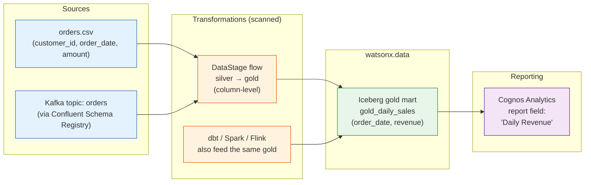

# End-to-End Lineage: Source → DataStage → Cognos

!!! abstract "The payoff"
    Imagine clicking a single number on a board-level Cognos report and seeing the
    complete story behind it: the exact source column it came from, every DataStage
    transformation and custom-SQL step it passed through, and the watsonx.data Iceberg
    mart that served it — all in one interactive, color-coded graph. That is what IBM
    Manta Data Lineage (delivered inside [watsonx.data Intelligence](intelligence.md))
    provides. Manta "can create complete end-to-end data lineage from database data
    sources through analytical models to reports in Cognos Analytics"
    ([getmanta.com](https://getmanta.com/blog/manta-3-26-ibm-datastage-erwin-and-detailed-lineage-in-edc)).
    It answers the two questions every data leader eventually asks: *"Where did this
    number come from?"* and *"If I change this column, which reports break?"*

## The unified graph for this demo's world

Manta auto-scans code, custom SQL, ETL jobs, and BI reports and stitches them into one
end-to-end map; the resulting graph is backed by Neo4j
([ibm.com](https://www.ibm.com/products/manta-data-lineage),
[neo4j.com](https://neo4j.com/customer-stories/ibm-manta-data-lineage/)). The diagram
below shows how the medallion world in this workshop would appear — column-aware in
spirit, with the DataStage flow and Cognos report as first-class, traceable nodes.

The point is not that *one* tool produces gold — in this workshop the
[dbt](../openmetadata.md), Spark, Flink, and DataStage paths all converge on the same
Iceberg gold tables. The point is that Manta can render whichever of those paths it can
scan, plus the DataStage and Cognos legs that open-source tooling does not reach, in a
single graph.

## What Manta scans

Manta ships with 50+ out-of-the-box scanners spanning databases, ETL tools, BI/reporting
platforms, modeling tools, and programming languages
([ibm.com](https://www.ibm.com/products/manta-data-lineage)). The granularity differs by
category — and it is worth being precise about it, because "lineage" means very different
things from one connector to the next.

| Category | Examples | Granularity |
| --- | --- | --- |
| Databases | Oracle, SQL Server, Teradata, Snowflake, Db2, PostgreSQL | Table / column |
| ETL tools | **IBM DataStage** (InfoSphere + Next-Gen/Cloud Pak), incl. custom SQL ([scanner guide](https://www.ibm.com/docs/en/manta-data-lineage?topic=datastage-infosphere-scanner-guide)) | **Column-level** |
| BI / reporting | **IBM Cognos Analytics** (Framework Manager models, reports incl. custom SQL, data modules), Power BI, Tableau | Report-field |
| Streaming | **Kafka via Confluent Schema Registry** (cluster → topics → schemas → columns) ([reqs](https://www.ibm.com/docs/en/manta-data-lineage?topic=kafka-integration-requirements)) | Topic / schema / column |
| Stream processing | Apache **Flink** transformation logic | **Not scanned** — see caveat below |
| Modeling & code | erwin and other modeling tools; programming languages | Varies |

!!! warning "The Flink gap — be honest about it"
    Manta scans the Confluent Schema Registry, so this workshop's Kafka **topics,
    schemas, and columns** will appear in the graph. But Manta does **not** natively
    trace Apache Flink job logic. The `raw → silver` transformations performed by the
    Flink SQL jobs in `confluent/` will therefore **not** show up as transformation
    steps — you will see topic-to-topic / schema lineage, but the column-level "this
    field was computed from those fields" logic inside Flink is invisible to Manta. If
    streaming transformation lineage is a hard requirement, plan to supplement Manta
    with [OpenLineage](../openlineage.md) instrumentation on the Flink jobs.

## Two questions enterprise lineage answers

**Impact analysis — "if I change this, what breaks?"** Before altering a source column
(say, renaming `amount` or changing its type), an architect can select that column in the
Manta map and trace forward through the DataStage flow, the Iceberg gold mart, and into
every Cognos report field that depends on it. The change-review meeting stops being
guesswork: you have a concrete, column-level list of downstream reports to test and
stakeholders to notify. This is the single biggest reason enterprises buy lineage that
spans heterogeneous tools rather than a single framework.

**Root-cause / audit — "where did this number come from?"** When a figure on an executive
dashboard looks wrong, an analyst starts at the Cognos report field and walks *backward*
through the gold mart, the DataStage transformation (including any custom SQL that
reshaped it), to the originating source column. Instead of interviewing three teams, the
trace is one path on the graph. For regulated reporting this doubles as audit evidence:
the lineage map *is* the documented data provenance.

## Versus the open-source lineage in this workshop

This workshop already produces lineage without Manta. The [OpenMetadata](../openmetadata.md)
stack builds its graph from dbt artifacts (`manifest.json`, `catalog.json`,
`run_results.json`) — which gives genuine **column-level lineage within the dbt path**,
for free, and is an excellent fit if dbt is your transformation layer. But that lineage
stops at the edges of dbt: it does **not** cover DataStage flows, and it does **not**
cover Cognos reports. Spark and Flink lineage are not captured from dbt artifacts at all
and would need separate [OpenLineage](../openlineage.md) wiring to appear.

Manta's differentiator is **breadth across heterogeneous enterprise tooling** — legacy
ETL (DataStage) and BI (Cognos) stitched into the *same* graph as databases and
warehouses — at a granularity (column-level DataStage, report-field Cognos) that
artifact-based open-source lineage does not reach in those tools.

!!! tip "Be fair about it"
    If your entire transformation stack is dbt on watsonx.data, OpenMetadata's
    dbt-artifact lineage may be all you need — and it is already running in this
    workshop at no extra license cost. Manta earns its keep when the estate is
    *heterogeneous*: legacy DataStage jobs, custom SQL nobody fully remembers, and
    Cognos reports whose field definitions live outside any dbt project. See also the
    [editions and performance](performance-editions.md) trade-offs and the
    [integration overview](integration.md).

!!! success "When end-to-end Manta lineage is worth it"
    - **Regulated industries with audit mandates** — BCBS 239 (risk data aggregation),
      GDPR / data-privacy traceability, SOX. The lineage map becomes defensible audit
      evidence of where reported figures originate.
    - **Large, heterogeneous estates** — many source systems plus **legacy DataStage**
      and **Cognos** that artifact-based open-source lineage cannot see.
    - **High change velocity** — frequent schema changes where column-level impact
      analysis prevents broken executive reports.

!!! warning "Verify supported versions with IBM"
    Exact supported versions of Confluent/Kafka, DataStage Next-Gen, and Cognos depend
    on your installed Manta release, and IBM's documentation blocked automated retrieval
    while this page was written. Confirm the scanner matrix for your release before
    committing to an architecture:
    [Manta scanners documentation](https://www.ibm.com/docs/en/manta-data-lineage?topic=scanners).

!!! note "Delivery model"
    Manta Data Lineage is delivered **within watsonx.data Intelligence** (on-premises,
    Resource-Unit–metered). See [Intelligence](intelligence.md) for what else is bundled
    and [Editions & performance](performance-editions.md) for sizing and cost.

---

**See also:** [Enterprise overview](overview.md) ·
[watsonx.data Intelligence](intelligence.md) · [Integration](integration.md) ·
[Editions & performance](performance-editions.md) · [Summary](summary.md) ·
[OpenMetadata (open source)](../openmetadata.md) ·
[OpenLineage (open source)](../openlineage.md)
