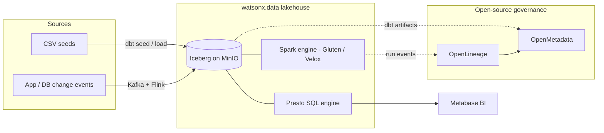
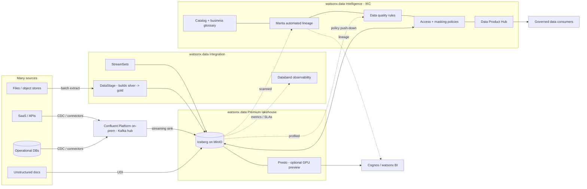

# Enterprise overview — watsonx.data Intelligence & Integration

!!! abstract "The one big idea"
    The open-source paths in this workshop — dbt, Spark, Kafka/Flink, OpenMetadata, Metabase —
    work end to end and are genuinely good enough for many teams. The **enterprise add-ons buy you
    governance, lineage, no-code ETL, observability, and performance you would otherwise hand-build
    and maintain**. You trade engineering effort and operational risk for a licensed, supported
    stack — metered by **Resource Units (RU)**.

This page is written for **enterprise architects and decision-makers**. The hands-on labs in the
rest of this workshop stay beginner-friendly; here we compare what you already have against what
IBM sells on top of it, and we try to be honest about when the upgrade is — and isn't — worth it.

!!! info "Everything here is on-premises"
    This entire tab assumes a **self-managed deployment on IBM Software Hub** (formerly Cloud Pak
    for Data). On-prem watsonx.data releases track the Software Hub version line — **5.3 ≈ December
    2025**, and **5.4** exists. There is a SaaS watsonx.data as well, but the editions, bundling,
    and RU mechanics described here are the on-prem story.

---

## The customer scenario

This tab follows one concrete customer, because abstract feature lists don't survive a real
architecture review.

**What they already run (the baseline).** A watsonx.data lakehouse with the **Spark analytics
engine** (Java plus **Apache Gluten / Velox** C++ vectorized acceleration), querying **Iceberg**
tables on MinIO through the **Presto** SQL engine. Pipelines are built with **open-source dbt**
and/or **Kafka**. Governance is **OpenMetadata / OpenLineage**, and BI is **Metabase**. This is,
more or less, the stack you build by following the open-source pages of this workshop.

**What this tab proposes (the upsell).**

1. **IBM Knowledge Catalog (IKC)** — now delivered as part of **watsonx.data Intelligence** — for
   catalog, **Manta** automated lineage, data quality, business glossary, and the **Data Product Hub**.
2. **Confluent Platform on-prem** as a unified Kafka ingestion hub fronting many source systems.
3. **watsonx.data Integration** — **IBM DataStage**, **StreamSets**, **Unstructured Data Ingestion
   (UDI)**, and **Databand** data observability.

**The customer's own goal.** Use **DataStage to build the medallion (silver → gold) after raw data
lands**; use IKC mainly for **data quality and a business glossary**; and stand up everything on
**watsonx.data Premium**, on the assumption that Premium bundles watsonx.data Intelligence,
unstructured data, observability, and watsonx BI — so a **GPU is available** and **IKC can push
access and masking policies down into the lakehouse**.

!!! warning "Verify edition entitlements with IBM"
    Exact bundling changes between releases. **Do not quote what watsonx.data Premium includes
    (watsonx BI, Data Observability, unstructured data, GPU entitlement) or how RU pooling works
    from this page.** Confirm against the IBM Software Hub 5.4 license bulletin
    (<https://www.ibm.com/support/pages/node/7275162>) and the Premium overview
    (<https://www.ibm.com/docs/en/software-hub/5.3.x?topic=services-watsonxdata-premium>).
    Treat the architecture below as a design target, not a contract.

---

## Baseline architecture (open source today)

This is the picture after the [open-source workshop](../choosing.md). dbt and Kafka/Flink feed
Iceberg; Presto and Spark read it; Metabase visualizes it; OpenMetadata catalogs it from dbt
artifacts and OpenLineage events. It is coherent and inexpensive. Its weak spots are **automated
column-level lineage across non-dbt tools, enforced data-quality SLAs, masking/policy push-down,
and any non-SQL ETL audience** — exactly the gaps the next diagram fills.

---

## Upsell architecture (enterprise add-ons)

The shape is the same lakehouse core, now wrapped in governance and fed by a broader integration
fabric. **Confluent** unifies streaming ingest from many systems; **DataStage** builds the medallion
transforms after landing; **Databand** watches pipeline health; **IKC/Manta** provide catalog,
glossary, automated lineage, quality, and **policy push-down into the lakehouse**; **Cognos /
watsonx BI** consume governed, lineage-backed data; and the **Data Product Hub** publishes curated
products on top.

---

## What each upgrade buys you

The point of this table is to be usable in a real customer conversation, so the "open-source today"
column is not a strawman.

| Capability | Open-source today | Enterprise upgrade | Why it matters |
|---|---|---|---|
| **Catalog & glossary** | OpenMetadata catalog; glossary supported but manually curated | IKC catalog with curated **business glossary**, term workflows, AI term assignment | Shared business vocabulary with approval workflows; less drift between "what the column is called" and "what the business means" |
| **Lineage** | OpenLineage + dbt manifest; strong for dbt/Spark, gaps for hand-written SQL and third-party tools | **Manta** automated, column-level lineage across DataStage, SQL, BI, and more | End-to-end, audit-grade lineage you didn't hand-instrument — the usual deciding factor for regulated customers |
| **Data quality** | dbt tests + custom checks; you build the framework | IKC **DQ rules**, profiling, scoring, and dimensions managed centrally | Quality as a governed, monitored SLA rather than scattered assertions in code |
| **No-code ETL / medallion build** | dbt (SQL) or Spark (code) — developer-centric | **DataStage** visual flows build silver → gold; StreamSets for streaming pipelines | Lets non-SQL data engineers own transforms; matches the customer's stated goal of building the medalline in DataStage after landing |
| **Streaming ingest** | Kafka + Flink (self-managed); you operate it | **Confluent Platform** on-prem: connectors, schema registry, RBAC, support | One supported hub for many sources; less Kafka operations toil |
| **Unstructured data** | Not covered by the baseline | **UDI** ingests documents into the lakehouse for search/RAG | Brings PDFs/docs into governed lakehouse assets — a genuine net-new capability |
| **Observability** | Logs + OpenLineage run status; you assemble dashboards | **Databand** pipeline observability, anomaly detection, alerting | Detects late/failed/anomalous loads proactively instead of via downstream complaints |
| **Policy / masking enforcement** | Presto-level grants; OpenMetadata describes policy but does not enforce it in-engine | IKC **data protection rules push down** into the lakehouse (access + masking) | Define once, enforce everywhere — the capability open source genuinely cannot match |
| **Performance** | Presto + Spark with Gluten/Velox vectorization (already fast, open source) | Premium options incl. **GPU-accelerated Presto (preview)** | Incremental for most workloads today; see the honest caveat below |

!!! warning "Be honest about performance"
    The baseline is **already accelerated**: Spark with Gluten/Velox is C++ vectorized execution,
    not vanilla JVM Spark. **GPU-accelerated Presto is a PREVIEW, not GA** — do not position it as a
    production differentiator. See [Performance & editions](performance-editions.md) for the full
    caveat and the RU math.

---

## When open source is enough vs when to upgrade

Resist the urge to upsell by default. For a real customer, recommending the right-sized stack earns
more trust than recommending the biggest one.

**Open source is genuinely enough when:**

- The team is **SQL-first** and comfortable owning dbt/Spark code.
- Governance needs are **modest** — a catalog and basic lineage, not audited column-level proof.
- Sources are **few and stable**, so a hand-run Kafka/Flink stack is manageable.
- Data is **not heavily regulated** and there is no masking/access-policy mandate.
- The team is small and values **low licensing cost** over reduced operational toil.

**The enterprise upgrade pays off when:**

- Data is **regulated** (PII, financial, health) and you must **enforce masking and access** in the
  engine, not just document it.
- There is an **audit or lineage mandate** that requires automated, column-level lineage across
  many tools (Manta).
- You ingest from **many heterogeneous sources** and want one supported streaming hub (Confluent).
- ETL is owned by **non-SQL data engineers** who need **no-code/visual** pipelines (DataStage,
  StreamSets).
- You need **proactive observability and SLAs** on pipelines (Databand) rather than reactive
  firefighting.
- You want to publish **governed, discoverable data products** to a broad internal audience (Data
  Product Hub).

!!! tip "Mixed estates are normal"
    These are not mutually exclusive. A common, defensible pattern is **open-source dbt for the
    SQL-savvy analytics team, DataStage for the integration team, all landing in the same Iceberg
    lakehouse, all governed by one IKC catalog.** The lakehouse is the shared substrate; the tools
    above it can differ by team.

---

## RU economics in one paragraph

The enterprise services are metered in **Resource Units (RU)** drawn from a pooled entitlement, not
per-named-feature. The practical question is rarely "which feature" but "**how many RU will my
workload burn, and is the pool shared across services**" — which is exactly where edition bundling
matters. The numbers, the pooling rules, and the GPU-preview caveat live in
[Performance & editions](performance-editions.md).

---

## How to read this tab

This overview is the map; the sibling pages are the territory.

- **[Intelligence (IKC)](intelligence.md)** — catalog, business glossary, data quality, Manta
  lineage, policy push-down, and the Data Product Hub.
- **[Integration](integration.md)** — DataStage building the medallion, StreamSets, UDI for
  unstructured data, and Databand observability.
- **[End-to-end lineage](lineage-e2e.md)** — how lineage flows from sources through DataStage and
  the lakehouse out to Cognos / watsonx BI.
- **[Performance & editions](performance-editions.md)** — Gluten/Velox vs GPU-Presto preview,
  editions (incl. Premium), and the RU economics.
- **[Summary & decision guide](summary.md)** — the one-page recommendation and a build-vs-buy
  checklist.

!!! note "Where this connects to the open-source workshop"
    Start from [Choosing your path](../choosing.md) for the three open-source ETL paths. The
    enterprise add-ons map onto familiar workshop pieces: IKC is the supported successor to
    [OpenMetadata](../openmetadata.md); Confluent extends the [Kafka → Flink demo](../confluent-demo.md);
    DataStage is previewed in the [DataStage demo](../datastage-demo.md); and orchestration parallels
    the [Airflow DAGs](../airflow.md).
