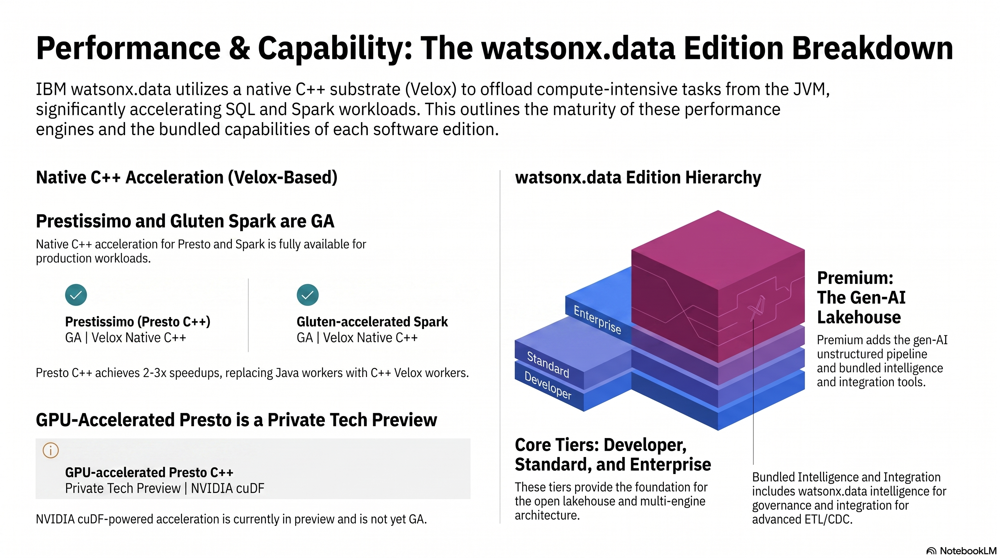
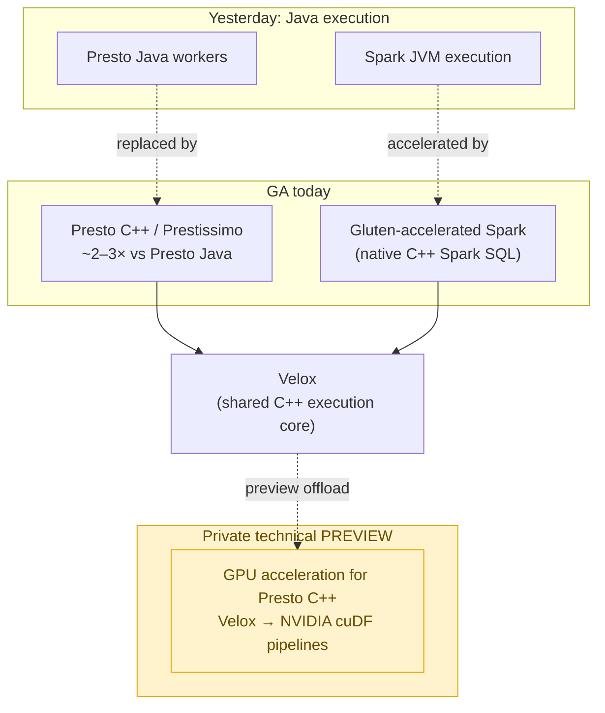
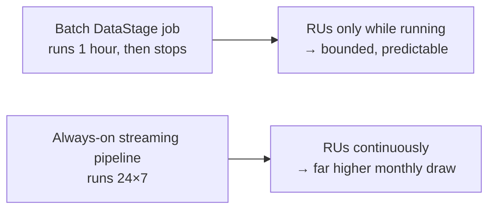

# Engine performance & editions / RU economics

!!! abstract "What this page covers"
    watsonx.data exposes **three query-engine performance tiers built on one common C++ substrate (Velox)** — and a single consumption currency for the platform's add-on capabilities.

    - **Presto C++ (Prestissimo)** — the next-generation Presto engine. **GA. ~2–3× over Presto Java.** A safe upgrade path for the SQL you run today.
    - **Apache Gluten-accelerated Spark** — Spark SQL offloaded to native C++ via Velox. **GA. This is the engine you already run.**
    - **GPU acceleration for Presto C++** — Velox + NVIDIA cuDF. **PRIVATE TECHNICAL PREVIEW — not GA, not a "Premium" SKU.** A roadmap conversation, not a deliverable.

    And **how you pay**: the **Resource Unit (RU)**, a per-second-metered currency shared across the platform's add-on capabilities.

    See also: [Enterprise overview](overview.md) · [Intelligence](intelligence.md) · [Integration](integration.md) · [Summary](summary.md) · [Spark demo](../spark-demo.md) · [Choosing a path](../choosing.md)

---

<figure markdown="span">
  { loading=lazy }
  <figcaption>One C++ substrate (Velox), three engines: Presto C++ (Prestissimo, <strong>GA</strong>), Gluten-accelerated Spark (<strong>GA</strong>), and GPU-accelerated Presto C++ (<strong>private tech preview — not GA</strong>). Plus the watsonx.data editions and what Premium adds.</figcaption>
</figure>

## The Velox story: one substrate, three engines

The thread connecting every performance story below is **[Velox](https://www.ibm.com/new/product-blog/veloxcon-2024-innovation-in-data-management)** — an open-source, vectorized C++ execution library (a Meta/Uber/Intel/IBM collaboration). Velox is *not* a query engine you run directly. It is the **shared C++ execution core** that several engines plug into in place of their slower Java workers.

That shared core matters for one practical reason: an optimization made in Velox — vectorized operators, better memory handling, and eventually GPU offload — benefits **Presto and Spark at the same time**, rather than each engine reinventing it. It also means the performance characteristics you learn on one engine carry over to the other.

The GPU work (covered below) is the **same idea taken one step further**: Velox translates a query plan into GPU pipelines executed by NVIDIA's cuDF library. Because it sits *inside* the existing Velox/Presto C++ stack, it preserves open-source Presto compatibility and the platform's governance model — but, critically, **it is not yet generally available**.

---

## What's GA vs what's preview

| Engine | Status | Typical speedup | Notes |
|---|---|---|---|
| **Presto C++ (Prestissimo)** | **GA** | **~2–3× vs Presto Java** ([source](https://prestodb.io/blog/2024/06/24/diving-into-the-presto-native-c-query-engine-presto-2-0/)) | Drop-in next-gen Presto; C++ workers replace Java workers. Best safe upgrade for existing SQL. |
| **Gluten-accelerated Spark** | **GA** | Workload-dependent; offloads Spark SQL to native C++ ([source](https://www.ibm.com/docs/en/watsonxdata/aws?topic=engine-introduction-apache-gluten-accelerated-spark)) | **The engine you already run.** Accelerates Spark SQL and reduces cost without changing your Spark code. |
| **GPU acceleration for Presto C++** | **PREVIEW (private technical preview)** | *Vendor-reported, unverified externally:* up to **25× / ~80% cost cut** (IBM internal); GTC 2026 Nestlé demo up to **5× / ~83%** ([IBM](https://www.ibm.com/new/announcements/technical-preview-of-gpu-acceleration-for-presto-c-in-watsonx-data), [NVIDIA](https://developer.nvidia.com/blog/accelerating-large-scale-data-analytics-with-gpu-native-velox-and-nvidia-cudf/)) | **Not GA. Not a named SKU.** Requires NVIDIA GPUs. Treat numbers as illustrative, not contractual. |

!!! note "How to read the GPU numbers"
    A widely cited preview data point: a **~1.159-billion-row query ran in 1.77 minutes on 4 GPUs vs ~45 minutes on CPU** ([IBM/NVIDIA, GTC 2026](https://newsroom.ibm.com/2026-03-16-ibm-and-nvidia-announce-expanded-collaboration-at-gtc-2026-to-advance-ai-for-the-enterprise)). These are **vendor-reported benchmarks on specific workloads and hardware**. They are useful for sizing the *opportunity*, not for setting an SLA. Your mileage will depend on query shape, data layout, and GPU count.

---

!!! warning "GPU acceleration is a preview, not GA"
    **Do not promise GPU-accelerated Presto in a contract, statement of work, or sizing commitment.** As of this writing it is a **private technical preview** of GPU offload *for Presto C++* — not a generally available feature and **not a "Premium" SKU**.

    A common — and incorrect — customer assumption is **"Premium edition gives me GPU to speed up Presto."** That is **not confirmed**. GPU acceleration is delivered through the Presto C++ / Velox engine roadmap, independent of edition packaging. If GPU performance is on the table, treat it as a **roadmap and early-access conversation** and confirm with IBM:

    - **Availability** — is the customer eligible for the private preview, and on which deployment (cloud / on-prem)?
    - **Hardware prerequisites** — supported NVIDIA GPUs and capacity.
    - **On-prem timing** — whether and when it lands on the Software Hub **5.4** on-prem line.

    Correct the assumption gently and honestly: *Prestissimo (GA) already gives a solid 2–3× today; GPU is a promising preview that we'd plan toward, not deliver now.*

---

## Editions

On-premises watsonx.data versions track **[IBM Software Hub](https://www.ibm.com/new/announcements/introducing-ibm-software-hub-and-software-hub-premium)** — the rebrand and superset of Cloud Pak for Data (CPD). Software Hub / CPD **5.3 lands around Dec 2025**, and **5.4 exists** (the license bulletin maps Software Hub 5.4 ↔ CPD 5.4 ↔ watsonx.ai 2.4 — [node 7275162](https://www.ibm.com/support/pages/node/7275162)). watsonx.data on-prem is actively patched on the **5.3.1** line through mid-2026.

At a high level the editions step up in capability:

| Edition | Rough framing |
|---|---|
| **Standard** | Core open lakehouse: Presto/Spark engines, Iceberg on object storage, the medallion pattern this workshop teaches. |
| **Enterprise** | Adds enterprise-grade scale, security, and governance integration. |
| **Premium** | Adds **watsonx.data Intelligence** and **unstructured data (UDI)**; **watsonx BI** integration is confirmed but **bundling is unclear**; **Data Observability** lives mainly under watsonx.data Integration and it is **ambiguous whether it is bundled in Premium**. ([Premium overview](https://www.ibm.com/docs/en/watsonxdata/premium/2.2.x?topic=overview), [watsonx BI / Premium](https://cloud.ibm.com/docs/watsonx-bi?topic=watsonx-bi-wxdpremium)) |

!!! warning "Verify edition entitlements with IBM"
    The table above is a **directional** framing, not a quote. Exact entitlements — **especially whether watsonx BI and Data Observability are included in Premium** — and the precise deltas between Standard / Enterprise / Premium **must be confirmed** against the **Software Hub 5.4 license bulletin** ([node 7275162](https://www.ibm.com/support/pages/node/7275162)) and the **[Premium overview](https://www.ibm.com/docs/en/watsonxdata/premium/2.2.x?topic=overview)**. Bundling shifts between releases; do not size or position on this page alone.

---

## RU economics

The platform's add-on capabilities are metered in **Resource Units (RUs)** — a single consumption currency that acts as the common pool across capabilities.

- **What an RU is** — list price **USD $1.00 per RU**, metered **per second with a 1-minute minimum** and tracked per minute ([pricing](https://www.ibm.com/products/watsonx-data/pricing)).
- **Common currency** — **watsonx.data Intelligence** and **watsonx.data Integration** (DataStage / StreamSets / observability) are RU-metered, for both self-managed and SaaS ([Integration metering](https://www.ibm.com/docs/en/software-hub/5.3.x?topic=services-watsonxdata-integration), [billing](https://cloud.ibm.com/docs/watsonxdata?topic=watsonxdata-manage_bill)). The RU pool is the shared unit you draw from across these capabilities.
- **On-prem metering** — measured by the **IBM License Service** (tracks VPC / RU, produces a monthly report, and trues-up against licensed capacity) ([licensing guide](https://redresscompliance.com/ibm-watsonx-licensing-guide.html)).

!!! warning "Confirm RU rates and pooling terms with IBM"
    The **per-capability RU consumption rates** and the **pooling / sharing terms** (whether one pool spans Intelligence and Integration, and how true-up works) **must be confirmed with IBM** for the specific edition and deployment. The $1/RU list price is a public anchor; effective rates depend on contract.

### A qualitative illustration (not a quote)

RU consumption tracks *how long work runs*, so the **batch-vs-realtime** distinction dominates cost — the same point made in [Integration](integration.md):

A one-hour batch transformation consumes RUs **only for that hour** (subject to the 1-minute minimum). An always-on streaming pipeline consumes RUs **continuously**, so even a "small" pipeline can outspend a much larger batch job over a month. When you choose between [paths](../choosing.md), remember that **engine speed reduces RU draw** (faster queries finish sooner) — another reason Prestissimo's 2–3× matters economically, not just for latency.

---

!!! tip "Bottom line for this customer"
    - **You already win today.** Gluten-accelerated Spark is GA and is the engine you run — native C++ Spark SQL, lower cost, no code change.
    - **Prestissimo is a safe GA upgrade.** Presto C++ gives ~2–3× over Presto Java for your existing SQL, with full open-source Presto compatibility.
    - **GPU is a roadmap conversation, not a deliverable.** It is a private technical preview, not GA and not a Premium SKU; do not commit it. Plan toward it with IBM, confirm hardware and on-prem (5.4) timing, and correct the "Premium = GPU for Presto" assumption.
    - **Price on RUs you can confirm.** Use $1/RU and per-second metering as the model, but validate per-capability rates, pooling, and edition entitlements with IBM before sizing.

    Continue: [Intelligence](intelligence.md) · [Integration](integration.md) · [Summary](summary.md)
