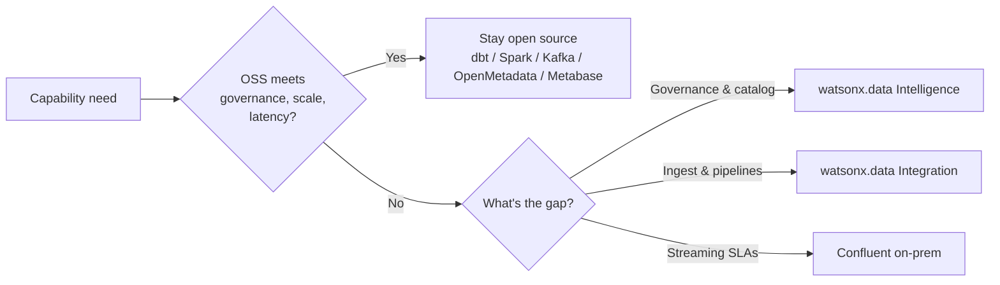

# Summary: open source vs enterprise, tool by tool

!!! abstract "How to use this page"
    This is the decision-maker's cheat sheet for the **on-premises** watsonx.data platform
    (IBM Software Hub / Cloud Pak for Data). For every capability in the medallion workshop
    there is an **open-source option you already ran** and an **enterprise option you can buy**.
    The rule is simple: **match each capability to the lightest tool that meets your
    governance, scale, and latency needs.** Enterprise here is not "the only way to do it" —
    it is about **vendor support, end-to-end breadth, no-code authoring, and *enforced*
    governance**. Open source is frequently *good enough*, free, and flexible. Read each row
    honestly: every enterprise tool carries cost (RU), complexity, or lock-in; every
    open-source tool brings real strengths. Deep dives live in the sibling pages
    [overview](overview.md), [intelligence](intelligence.md), [integration](integration.md),
    [end-to-end lineage](lineage-e2e.md), and [performance & editions](performance-editions.md).

## The big table

Read left-to-right per capability. "Choose enterprise when…" is the trigger, not a verdict.

| Capability | Open-source option | Strengths (OSS) | Weaknesses (OSS) | Enterprise option | Strengths (Ent) | Weaknesses (Ent) | Choose enterprise when… |
|---|---|---|---|---|---|---|---|
| **Batch transformation / medallion build** | [dbt](../dbt-demo.md) & [Spark](../spark-demo.md) | Free; SQL/Python; git-native; testable; huge community | You build/operate it; no GUI; needs engineers; no built-in governance | [DataStage](../datastage-demo.md) ([details](integration.md)) | No-code flows; 100+ connectors; pushdown to watsonx.data; supported | RU cost; GUI flows hard to diff in git; learning curve; lock-in | Citizen developers must build pipelines, or you need vendor SLAs |
| **Streaming ingestion** | [Kafka + Flink](../confluent-demo.md) | Free; ubiquitous; Flink SQL; full control | Self-managed brokers; ops-heavy; you own upgrades/security | Confluent Platform on-prem + StreamSets | Supported brokers; RBAC; schema registry; managed connectors | License + RU cost; another platform to run; Confluent lock-in | You need 24/7 support, enterprise security, or connector breadth |
| **Native / batch load** | [cpdctl](../ingestion.md) | Free; ships with platform; scriptable; fast bulk load | Raw-only; no transforms; CLI-only; no CDC | DataStage / StreamSets / Data Replication (CDC) | Log-based CDC; incremental; no-code; broad sources | RU cost; CDC setup complexity; per-source licensing | You need change-data-capture or incremental loads at scale |
| **Catalog & business glossary** | [OpenMetadata](../openmetadata.md) | Free; rich UI; APIs; active community | You host/patch it; no policy enforcement; lighter AI features | watsonx.data Intelligence / IKC ([details](intelligence.md)) | AI term generation; auto-classification; workflows; integrated | RU cost; heavier footprint; another service to operate | Governed glossary, auto-classification, or curation workflows are required |
| **Data lineage** | dbt artifacts + OpenLineage ([details](../openmetadata.md)) | Free; column-level for dbt; OpenLineage standard | Only covers instrumented tools; gaps across SQL/BI/legacy | Manta ([details](lineage-e2e.md)) | Parses SQL/ETL/BI for true end-to-end column lineage | RU cost; scanners to configure; **does not trace Flink job logic** | You need cross-tool, audit-grade lineage including legacy SQL/BI |
| **Data quality** | dbt tests / Great Expectations | Free; code-defined; CI-friendly; flexible | Hand-written rules; no profiling UI; no SLA dashboards | IKC data quality + profiling + SLAs | Auto-profiling; rule suggestions; dimensions; SLA tracking | RU cost; needs onboarding; opinionated model | Business users own quality, or you need profiling and SLA reporting |
| **Policy / access / masking** | *(basically none in-lakehouse)* | — (use Presto/object-store ACLs piecemeal) | No central masking/row-column policy in the lakehouse | IKC data protection rules → pushed into watsonx.data | Centralized masking/row/column rules enforced at query time | RU cost; IKC dependency; rule design effort | You need enforced masking, row/column security, or compliance audit |
| **Unstructured data for AI** | Roll-your-own (e.g. Data Prep Kit / DPK) | Free; open toolkits; full control of pipeline | You build chunking/embedding/governance yourself | Unstructured Data Integration (UDI) | Managed ingest of docs for RAG; governed; integrated | RU cost; newer product; preview-level maturity in places | You need governed, supported unstructured ingestion for genAI |
| **Orchestration** | [Apache Airflow](../airflow.md) | Free; standard; rich operators; community | You operate the scheduler; DAGs are code; no GUI authoring | Airflow + DataStage scheduler (still Airflow-compatible) | No-code scheduling; supported; integrates with flows | RU cost; overlaps with Airflow you may already run | You standardize on DataStage and want one supported scheduler |
| **Pipeline observability** | Airflow logs / alerts | Free; built-in; sufficient for small estates | Per-DAG; no cross-pipeline SLAs; manual triage | Databand ([details](integration.md)) | Cross-pipeline metrics, anomaly detection, alerting | RU cost; another service to operate; setup overhead | Many pipelines need unified SLAs and anomaly detection |
| **BI / dashboards** | [Metabase](../metabase.md) | Free; fast self-serve; easy SQL; light to run | Limited enterprise governance; basic distribution | Cognos Analytics / watsonx BI | Enterprise reporting; governance; scale; AI assist | License cost; heavier; steeper authoring | You need governed enterprise reporting and broad distribution |
| **Query performance** | Presto (Java) / Gluten Spark | Free; mature; Gluten/Velox vectorization | Java engine slower than C++; tuning is on you | Prestissimo (Presto C++) + GPU (preview) ([details](performance-editions.md)) | C++ vectorized speedups; GPU acceleration roadmap | RU cost; **GPU is preview/not GA**; edition-gated | You need top-tier latency/throughput on large interactive workloads |

## Decision shortcuts

- **Stay open source if…** your team is engineer-led and git-comfortable; pipelines are
  code you want to version and test; governance needs are light or self-administered;
  budget pressure is high; and "good enough" latency and a self-hosted catalog are
  acceptable. dbt + Spark + Airflow + OpenMetadata + Metabase already deliver a working
  medallion lakehouse — see [choosing a path](../choosing.md).
- **Add watsonx.data Intelligence if…** you need a *governed* business glossary,
  auto-classification, data quality with profiling and SLAs, **enforced** masking/access
  rules pushed into the lakehouse, end-to-end lineage via Manta, or a Data Product Hub for
  publishing curated products. See [intelligence](intelligence.md) and [lineage-e2e](lineage-e2e.md).
- **Add watsonx.data Integration if…** business users (not just engineers) must build
  pipelines no-code (DataStage), you need log-based CDC or broad connectors (StreamSets /
  Data Replication), governed unstructured ingestion for genAI (UDI), or cross-pipeline
  observability and SLAs (Databand). See [integration](integration.md).
- **Add Confluent on-prem if…** streaming is business-critical and needs vendor support,
  enterprise RBAC and schema governance, and a large managed-connector ecosystem beyond
  what self-managed Kafka + Flink can sustain. See [confluent demo](../confluent-demo.md).

!!! warning "Verify with IBM"
    RU economics and feature availability change between releases. Before you size, price,
    or commit:

    - Confirm **edition entitlements**, **RU rates and pooling**, and exactly which
      capabilities each edition includes.
    - **GPU-accelerated Presto is preview, not GA** — confirm GA status and supported
      hardware before planning on it.
    - **Manta does not trace Flink job logic** — it captures topic/schema lineage only, not
      the transformation logic inside streaming jobs.
    - Validate the precise **Software Hub 5.4 feature deltas** (vs 5.3) for every tool above,
      against the
      [Software Hub 5.4 license bulletin](https://www.ibm.com/support/pages/node/7275162).

    Treat all RU figures and entitlements in this workshop as illustrative until confirmed
    with your IBM team.
