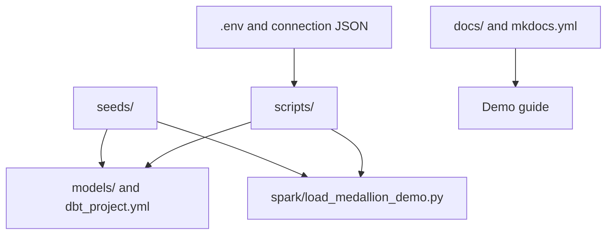

# File Guide

This page explains what each file is for. If you are new to the repo, read this once before changing anything.

## Configuration

| File | Purpose |
| --- | --- |
| `.env.example` | Safe template for local environment variables. |
| `.env` | Local secrets and environment values. Ignored by Git. |
| `watsonx_data/instance_details.json` | Local watsonx.data Presto connection JSON export. Ignored by Git. |
| `certs/watsonxdata-ca.pem` | TLS certificate chain used by dbt and Python helpers. |
| `profiles/profiles.example.yml` | dbt profile template for the watsonx.data Presto adapter. |
| `dbt_project.yml` | dbt project config, schemas, tags, and materialization defaults. |
| `mkdocs.yml` | MkDocs site configuration. |

## Scripts

| File | Purpose |
| --- | --- |
| `scripts/prepare_watsonx_env.py` | Imports Presto connection JSON values into `.env` and writes the SSL certificate. |
| `scripts/bootstrap_watsonxdata.py` | Creates raw, bronze, silver, and gold schemas in watsonx.data. |
| `scripts/dbt_env.sh` | Loads `.env` and runs dbt with the local virtual environment. |
| `scripts/prepare_openmetadata_dbt_artifacts.py` | Generates and stages dbt artifacts for OpenMetadata ingestion. |
| `scripts/upload_dbt_artifacts.py` | Uploads dbt artifacts to MinIO/S3 for OpenMetadata. |
| `scripts/query_gold.py` | Queries gold marts and prints formatted terminal tables. |
| `scripts/upload_spark_assets.py` | Uploads the Spark application and CSV files to MinIO/S3. |
| `scripts/submit_spark_application.py` | Submits the PySpark application to the watsonx.data Spark application endpoint. |
| `scripts/spark_application_status.py` | Checks a submitted Spark application status. |

## Data and Models

| Path | Purpose |
| --- | --- |
| `seeds/raw_*.csv` | Demo source CSV files. |
| `models/bronze/` | Bronze dbt models with ingestion metadata. |
| `models/silver/` | Silver dbt models with typed, cleaned data and tests. |
| `models/gold/` | Gold dbt marts for customer demos. |
| `spark/load_medallion_demo.py` | PySpark implementation of the same medallion idea. |
| `docs/watsonxdata_sql_demo.sql` | Copy/paste SQL for the watsonx.data SQL editor. |

## Generated or Local-Only Paths

| Path | Purpose |
| --- | --- |
| `.venv/` | Python virtual environment. Ignored by Git. |
| `target/` | dbt compiled artifacts. Ignored by Git. |
| `site/` | MkDocs generated site. Ignored by Git if added locally or regenerated in CI. |
| `logs/` | Port-forward and helper logs. Ignored by Git. |
| `openmetadata/dbt-artifacts/` | Local staged dbt artifacts for OpenMetadata. Ignored by Git. |

## Safe To Commit

These are intended to be committed:

- `docs/`
- `models/`
- `macros/`
- `scripts/`
- `spark/`
- `seeds/`
- `.env.example`
- `mkdocs.yml`

## Do Not Commit

These are local only:

- `.env`
- `watsonx_data/instance_details.json`
- `.venv/`
- `site/`
- `target/`
- `logs/`
- `openmetadata/dbt-artifacts/`
