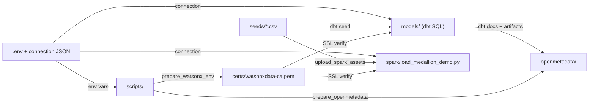
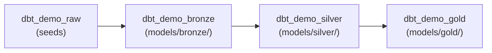

# Repository File Guide

Every script, model, and config file in this repo plays a specific role. When a workshop step tells you to run a script or edit a file, look it up here to understand what it does before you run it.

!!! info "How to use this page"
    Workshop steps reference scripts and config files by name. Find the file in this guide to read a plain-English description of its purpose, what it reads, and what it writes. Read this page once at the start, then use it as a reference throughout the day.

The diagram below shows how the files depend on each other — follow the arrows from left to right:



---

## Root directory

These files live at the top level of the repo. Most of them are read at the start of every workshop session.

| File | What it is | Plain-English purpose |
|---|---|---|
| `.env.example` | Shell variable template | The safe starting point — copy this to `.env` and fill in your credentials. Contains every variable the project needs, with comments explaining each one. Never committed with real secrets. |
| `.env` | Local environment secrets | Your actual credentials and endpoint URLs. Loaded by every Python script and by dbt via `profiles/profiles.example.yml`. Git-ignored. |
| `requirements.txt` | Python dependency list | The Python packages the helper scripts need. Install once with `pip install -r requirements.txt` inside your virtual environment. |
| `dbt_project.yml` | dbt project configuration | Tells dbt the project name, where models live, and which Iceberg schema to write each medallion layer into. Schema names are driven by environment variables so you can override them without editing SQL. |
| `packages.yml` | dbt package list | Declares the `dbt-watsonx-presto` adapter package. Run `dbt deps` to download it into `dbt_packages/`. |
| `mkdocs.yml` | MkDocs site configuration | Controls the navigation structure and theme for this documentation site. Run `mkdocs serve` to preview locally. |
| `README.md` | Quick-start guide | One-page orientation to the project — what it does, prerequisites, and the three-command path to a running demo. |

!!! tip "Copy `.env.example` first"
    ```bash
    cp .env.example .env
    ```
    Then open `.env` and replace the placeholder values with the credentials your instructor provided. Everything downstream depends on this file being correct.

!!! warning "Never commit `.env`"
    The `.gitignore` file already excludes `.env`. If you accidentally stage it, run `git reset HEAD .env` before committing.

---

## `seeds/` — Source CSV files

Seeds are static CSV files that dbt loads as raw Iceberg tables. Think of them as the starting data for the entire demo — no external database or API is needed.

dbt reads these files and runs `INSERT` statements to populate the `dbt_demo_raw` schema in watsonx.data. The Spark path also uses the same CSVs, uploading them to MinIO so the Spark engine can read them directly.

| File | Rows | What it contains |
|---|---|---|
| `seeds/raw_customers.csv` | 50 | Customer master data: ID, name, email, country, registration date |
| `seeds/raw_products.csv` | 20 | Product catalog: ID, name, category, unit price |
| `seeds/raw_orders.csv` | 500 | Order headers: ID, customer ID, order date, status, payment method |
| `seeds/raw_order_items.csv` | 1 134 | Order line items: `order_item_id`, `order_id`, `product_id`, `quantity`, `discount_pct` |

!!! note "Total seed volume"
    The four files together contain 1,704 data rows (50 customers, 20 products, 500 orders, 1,134 order items). The dataset is intentionally small so every query returns in seconds on the shared Presto cluster.

!!! tip "Browse the source CSVs"
    All four files live in the [`seeds/` folder on GitHub](https://github.com/aseelert/ibmas-watsonxdata-dbt/tree/main/seeds):
    [raw_customers.csv](https://github.com/aseelert/ibmas-watsonxdata-dbt/blob/main/seeds/raw_customers.csv) ·
    [raw_products.csv](https://github.com/aseelert/ibmas-watsonxdata-dbt/blob/main/seeds/raw_products.csv) ·
    [raw_orders.csv](https://github.com/aseelert/ibmas-watsonxdata-dbt/blob/main/seeds/raw_orders.csv) ·
    [raw_order_items.csv](https://github.com/aseelert/ibmas-watsonxdata-dbt/blob/main/seeds/raw_order_items.csv)

### Sample rows (header + first 5)

**`raw_customers.csv`** — one row per customer:

```csv
customer_id,first_name,last_name,email,signup_date,country
1001,Amina,Khan,amina.khan@example.com,2025-10-29,DE
1002,Lukas,Weber,lukas.weber@example.com,2025-10-07,DE
1003,Sofia,Rossi,sofia.rossi@example.com,2025-12-10,DE
1004,Noah,Smith,noah.smith@example.com,2025-12-02,DE
1005,Maya,Schneider,maya.schneider@example.com,2025-11-27,DE
```

**`raw_products.csv`** — one row per product:

```csv
product_id,product_name,category,unit_price
2001,Portable Solar Charger,Electronics,49.9
2002,Insulated Water Bottle,Home,24.5
2003,Trail Backpack 35L,Outdoor,89.0
2004,Noise Cancelling Earbuds,Electronics,129.0
2005,Bamboo Desk Organizer,Office,34.0
```

**`raw_orders.csv`** — one row per order header (note `order_ts`, a timestamp):

```csv
order_id,customer_id,order_ts,status,payment_method
3001,1013,2026-05-18 19:32:33,completed,card
3002,1043,2026-02-15 06:04:58,pending,card
3003,1006,2026-02-16 04:53:02,completed,card
3004,1018,2026-03-31 01:02:42,returned,card
3005,1011,2026-03-14 21:10:06,completed,card
```

**`raw_order_items.csv`** — one row per order line (links an order to a product):

```csv
order_item_id,order_id,product_id,quantity,discount_pct
1,3001,2013,2,0.00
2,3001,2005,1,0.15
3,3002,2011,2,0.00
4,3002,2005,2,0.15
5,3003,2001,1,0.05
```

To load the seeds into watsonx.data:

```bash
dbt seed
```

dbt writes the rows into `iceberg_data.dbt_demo_raw` as Parquet-backed Iceberg tables, partitioned by `month(order_date)` (partition column `order_date_month`) where applicable.

!!! example "Verify the seed loaded"
    ```sql
    SELECT COUNT(*) FROM iceberg_data.dbt_demo_raw.raw_order_items;
    -- expected: 1134
    ```

---

## `models/` — dbt SQL models

A dbt model is a single `.sql` file that becomes a table or view in watsonx.data. dbt compiles the SQL, resolves `ref()` dependencies, and runs the statements against Presto in the correct order.

The models are organized into three sub-directories that correspond to the medallion architecture layers:



### `models/bronze/`

Bronze models copy data from the raw seed tables and add ingestion metadata columns (`_ingested_at`, `_ingested_by`, `_source_file`, `_ingest_batch_id`). No business logic is applied here — the goal is a faithful, auditable record of exactly what arrived.

| Model | Source seed | What it adds |
|---|---|---|
| `bronze_customers.sql` | `raw_customers` | Ingestion timestamp and source tag |
| `bronze_products.sql` | `raw_products` | Ingestion timestamp and source tag |
| `bronze_orders.sql` | `raw_orders` | Ingestion timestamp and source tag |
| `bronze_order_items.sql` | `raw_order_items` | Ingestion timestamp and source tag |

`bronze_sources.yml` documents the seed tables (via a `seeds:` block) and defines `not_null`/`unique` tests on every primary key. Bronze models reference seeds via `{{ ref('raw_*') }}` rather than dbt sources (the adapter does not support sources). dbt runs these tests automatically when you run `dbt test`.

### `models/silver/`

Silver models clean and type-cast the bronze data, enforce referential integrity between tables, and join entities into a single enriched fact model. This is where business rules live.

| Model | What it does |
|---|---|
| `silver_customers.sql` | Typed customer dimension — casts strings to correct types, normalises country codes |
| `silver_products.sql` | Typed product dimension — casts price to DECIMAL, standardises category labels |
| `silver_orders.sql` | Typed order headers — casts order_date to DATE, validates status against an allowed-values list |
| `silver_order_items.sql` | Typed order line items — casts quantity and amount columns to correct numeric types |
| `silver_sales_enriched.sql` | Joined fact model — one row per order line item, enriched with customer, product, and order attributes; this is the single source of truth for gold mart aggregations |
| `time_spine_daily.sql` | Daily time spine — one row per calendar day for 2026; required by dbt Semantic Layer / MetricFlow for time-series metrics |

`schema.yml` in this directory declares column-level tests: `unique`, `not_null`, `accepted_values`, and `relationships` (foreign key checks between tables).

!!! note "Silver is where data quality is enforced"
    If a test fails in silver, the gold layer will not build correctly. Run `dbt test --select silver` after any data change.

### `models/gold/`

Gold models are the analytics-ready outputs — the tables and views that a BI tool or ad-hoc analyst would query. Materialization is controlled by the `WXD_GOLD_MATERIALIZED` environment variable (default: `view`).

| Model | Materialization | What it contains |
|---|---|---|
| `gold_daily_sales.sql` | TABLE | Aggregated daily sales KPIs — order count, units sold, net revenue (by date and product category) |
| `gold_category_performance.sql` | VIEW | Revenue and units rolled up to one row per product category, queried on demand from `gold_daily_sales` |
| `gold_customer_360.sql` | VIEW | Customer-level analytics — total orders, lifetime value, average order value, days since last order |

!!! warning "`gold_daily_sales` is a physical table, not a view"
    The two view models (`gold_category_performance`, `gold_customer_360`) read from `gold_daily_sales`. Run `dbt run --select gold_daily_sales` first if you rebuild only part of the gold layer.

### `models/semantic_models.yml`

The semantic layer sits on top of the gold and silver models and defines metrics in a way that BI tools can consume without writing custom SQL. This file declares two semantic models:

| Semantic model | Grain | Source model | Key measures |
|---|---|---|---|
| `daily_sales` | One row per day per category | `gold_daily_sales` | `total_orders`, `total_units_sold`, `total_net_revenue` |
| `sales_orders` | One row per order line item | `silver_sales_enriched` | `gross_revenue`, `net_revenue`, `units_sold` |

!!! info "What is a semantic model?"
    A semantic model is a named, reusable definition of a business concept (like "net revenue") that is independent of any single SQL query. dbt MetricFlow uses these definitions to generate the correct SQL automatically when a BI tool requests a metric.

---

## `macros/` — dbt macros

Macros are reusable Jinja/SQL functions that dbt calls during compilation. They let you share logic across models without copy-pasting SQL.

| File | What it does |
|---|---|
| `macros/generate_schema_name.sql` | Overrides dbt's default schema-naming behaviour so that schema names come directly from environment variables (e.g. `WXD_BRONZE_SCHEMA`) rather than being prefixed with the dbt target name. Without this macro, dbt would write to `dev_dbt_demo_bronze` instead of `dbt_demo_bronze`. |
| `macros/create_medallion_schemas.sql` | Creates all four demo schemas (`_raw`, `_bronze`, `_silver`, `_gold`) in one call. Called by `scripts/bootstrap_watsonxdata.py` via `dbt run-operation`. |
| `macros/materialized_view.sql` | Defines a custom `materialized_view` materialization for the `watsonx_presto` adapter. It issues `CREATE MATERIALIZED VIEW ... AS SELECT ...` followed by `REFRESH MATERIALIZED VIEW`. **Note:** the Presto Iceberg connector in the current watsonx.data version does not support materialized views — this macro is forward-looking and reserved for when that support lands. Use the standard `view` materialization today. |

!!! warning "Materialized views are not yet usable"
    If you set `+materialized: materialized_view` on any gold model, Presto will raise an error. The macro exists as a reference implementation for a future release.

---

## `spark/` — Spark application

The Spark directory contains a self-contained PySpark job that reproduces the entire bronze-silver-gold medallion transformation using the watsonx.data Spark engine instead of dbt.

| File | What it does |
|---|---|
| `spark/load_medallion_demo.py` | Full PySpark medallion job — reads the demo CSVs from MinIO (`s3a://iceberg-bucket/spark_demo/raw/`), applies bronze ingestion metadata, silver type-casting and joins, and writes gold aggregations into the `spark_demo_bronze/silver/gold` schemas. All output is written as Parquet-backed Iceberg tables. The job is designed to be uploaded to MinIO and submitted via the watsonx.data REST API. |

!!! info "Why run both dbt and Spark?"
    The two paths write to different schemas (`dbt_demo_*` for dbt, `spark_demo_*` for Spark) so you can query both in the same Presto session and compare the outputs side by side. The data is identical — the difference is the tooling and governance model.

To run the Spark path, use the helper scripts in order:

```bash
python scripts/upload_spark_assets.py    # upload PySpark file + CSVs to MinIO
python scripts/submit_spark_application.py  # submit to Spark engine via REST
python scripts/spark_application_status.py  # poll until FINISHED
```

---

## `scripts/` — Python helper scripts

These scripts handle everything that dbt and Spark cannot do by themselves: setting up credentials, bootstrapping schemas, uploading files to object storage, and querying results.

All scripts read environment variables from `.env` via `python-dotenv`. Run them from the repo root directory with your virtual environment active.

| Script | When to run | What it does |
|---|---|---|
| `prepare_watsonx_env.py` | Once, at setup | Reads the watsonx.data Presto connection JSON export (`watsonx_data/instance_details.json`), writes the TLS certificate to `certs/watsonxdata-ca.pem`, and populates `.env` with the host, port, catalog, and instance ID values |
| `bootstrap_watsonxdata.py` | Once, at setup | Calls `dbt run-operation create_medallion_schemas` to create the four demo schemas in the `iceberg_data` catalog on watsonx.data; safe to re-run (`CREATE SCHEMA IF NOT EXISTS`) |
| `upload_spark_assets.py` | Before Spark demo | Uploads `spark/load_medallion_demo.py` and all four seed CSVs to MinIO via the S3 API; opens an `oc port-forward` to MinIO automatically if `WXD_OBJECT_STORE_AUTO_PORT_FORWARD=true` |
| `submit_spark_application.py` | Spark demo step | Submits `load_medallion_demo.py` to the watsonx.data Spark engine REST endpoint; prints the application ID you need for the status check |
| `spark_application_status.py` | After submission | Polls the watsonx.data Spark engine REST API for the application state and prints a summary; pass the application ID printed by `submit_spark_application.py` |
| `query_gold.py` | After any demo path | Connects to Presto via the dbt adapter and queries the three gold models; prints formatted tables to the terminal so you can verify results without opening the watsonx.data UI |
| `ingest_with_cpdctl.py` | cpdctl demo path | Uses `cpdctl wx-data ingestion create` to load the seed CSVs from MinIO into Iceberg tables in the `spark_demo_cpdctl_raw` schema; each job appears in the watsonx.data console under **Data manager > Ingestion (history)**. It only LOADS raw CSV into `spark_demo_cpdctl_raw` (the analogue of `dbt seed`) and produces no bronze/silver/gold — to build a medallion you run the dbt models or the Spark job against `spark_demo_cpdctl_raw` as a post-action (cpdctl + dbt/Spark = full pipeline) |
| `prepare_openmetadata_dbt_artifacts.py` | Before OpenMetadata demo | By default runs `dbt seed --full-refresh`, `dbt run`, `dbt test`, and `dbt docs generate`, then copies `manifest.json`, `catalog.json`, and `run_results.json` from `target/` into `openmetadata/dbt-artifacts/`; those files are what OpenMetadata reads for lineage. Flags: `--skip-dbt` (copy existing `target/*.json` only), `--skip-seed` (skip the seed step), `--artifact-dir <path>` (override the staging directory), `--retries <n>` (retries per dbt command, default 1) |
| `upload_dbt_artifacts.py` | OpenMetadata (S3 path) | Uploads the staged dbt artifacts from `openmetadata/dbt-artifacts/` to MinIO so that a remote OpenMetadata instance can fetch them over S3 instead of reading local files |
| `cleanup_watsonxdata.py` | After the demo | Drops all tables and views in `dbt_demo_raw/bronze/silver/gold` and `spark_demo_bronze/silver/gold`; use this to reset the environment between runs |
| `dbt_env.sh` | Shell convenience | Sources `.env` and activates the virtual environment, then passes all remaining arguments to the `dbt` command; use this when your shell does not source `.env` automatically |

!!! example "Typical setup sequence (run once)"
    ```bash
    python scripts/prepare_watsonx_env.py
    python scripts/bootstrap_watsonxdata.py
    dbt deps
    dbt seed
    dbt run
    dbt test
    python scripts/query_gold.py
    ```

!!! tip "cpdctl prerequisite"
    `ingest_with_cpdctl.py` requires the `cpdctl` binary on your PATH. Download it from the IBM GitHub release page and configure a context for this CPD instance before running the script. The script prints the required `cpdctl config` commands if the binary is not found.

---

## `openmetadata/` — OpenMetadata integration

OpenMetadata 1.13.0 runs locally in Docker and provides a data catalog UI where you can browse the dbt model lineage, column descriptions, and test results. The files in this directory start the service and push dbt metadata into it.

| File | What it does |
|---|---|
| `openmetadata/docker-compose.yml` | Defines five Docker services: `mysql` (OpenMetadata metadata store), `elasticsearch` (search index), `execute-migrate-all` (a one-shot migration init container that runs the database migrations and then exits before the server starts), `openmetadata-server` (the application, exposed on port 8585), and `ingestion` (an embedded Airflow instance for managed ingestion pipelines). Start with `docker compose -f openmetadata/docker-compose.yml up -d`. |
| `openmetadata/ingestion/dbt-ingestion.yaml` | OpenMetadata ingestion connector configuration — tells the `metadata ingest` command where to find the local dbt artifacts and how to connect to the Presto service at `ibm-lh-lakehouse-presto651-presto-svc.apps.watson.ibmas-zocp-techcluster.org:443`. The `__JWT_TOKEN__` placeholder is replaced at runtime by `run-ingestion.sh`. |
| `openmetadata/ingestion/run-ingestion.sh` | End-to-end ingestion runner — installs `openmetadata-ingestion[dbt]==1.13.0.0`, calls `get_om_token.py` for a fresh JWT, substitutes the token into `dbt-ingestion.yaml`, creates the Presto database service in OpenMetadata via the REST API if it does not exist, and runs `metadata ingest`. |
| `openmetadata/ingestion/get_om_token.py` | Logs in to OpenMetadata as `admin`, retrieves the `ingestion-bot` user ID, generates a one-hour JWT for that bot, and prints the token to stdout. Called by `run-ingestion.sh` — not meant to be run directly. |

!!! note "OpenMetadata is local only"
    The Docker Compose stack runs entirely on your laptop. It does not connect to the OpenShift cluster; it reads the dbt artifact JSON files from disk at `openmetadata/dbt-artifacts/`. Run `prepare_openmetadata_dbt_artifacts.py` before starting ingestion to ensure the artifacts are current.

!!! example "Start OpenMetadata and run ingestion"
    ```bash
    # 1. Start the stack (first run takes 2-3 minutes to initialise)
    docker compose -f openmetadata/docker-compose.yml up -d

    # 2. Wait for the server to be healthy
    # Open http://localhost:8585 — login: admin / admin

    # 3. Stage current dbt artifacts
    python scripts/prepare_openmetadata_dbt_artifacts.py

    # 4. Run the dbt ingestion
    bash openmetadata/ingestion/run-ingestion.sh
    ```

---

## `certs/` — TLS certificate

Watsonx.data runs behind an OpenShift route with a custom CA. Python scripts and dbt need this certificate to validate the TLS connection.

| File | What it is | How it is created |
|---|---|---|
| `certs/watsonxdata-ca.pem` | PEM-encoded TLS certificate chain for the watsonx.data Presto endpoint | Generated automatically by `scripts/prepare_watsonx_env.py` from the certificate field inside `watsonx_data/instance_details.json`. You should not need to create or edit this file manually. |

!!! warning "Certificate path must match `.env`"
    The `WXD_SSL_VERIFY` variable in `.env` must point to this file. The default value is `certs/watsonxdata-ca.pem` (relative to the repo root). If you move the file, update the variable.

---

## `profiles/` — dbt connection profile template

dbt looks for a file called `profiles.yml` in `~/.dbt/` (your home directory) to find connection details. The repo ships a template so you know exactly what fields are required.

| File | What it is |
|---|---|
| `profiles/profiles.example.yml` | Template `profiles.yml` for the `dbt-watsonx-presto` adapter. Copy this to `~/.dbt/profiles.yml` and confirm the environment variable names match your `.env`. All connection values are read from environment variables at runtime — you never hardcode credentials in this file. |

The profile connects to Presto using `BasicAuth` with your IBM Software Hub API key as the password:

```yaml
watsonxdata_medallion_demo:
  target: dev
  outputs:
    dev:
      type: watsonx_presto
      method: BasicAuth
      user: "{{ env_var('WXD_USER') }}"          # ibmlhapikey_<username>
      password: "{{ env_var('WXD_API_KEY') }}"   # IBM Software Hub API key
      catalog: "{{ env_var('WXD_CATALOG') }}"    # iceberg_data
      host: "{{ env_var('WXD_HOST') }}"
      port: 443
      ssl_verify: "{{ env_var('WXD_SSL_VERIFY') }}"
      http_headers:
        LhInstanceId: "{{ env_var('WXD_INSTANCE_ID') }}"
```

!!! tip "Verify your dbt connection"
    ```bash
    dbt debug
    ```
    This prints a connection test result for every field in `profiles.yml`. A green `OK` next to "Connection test" means dbt can reach Presto.

---

## Generated and local-only paths

These paths are created at runtime and are not committed to the repository.

| Path | Created by | What it contains |
|---|---|---|
| `.venv/` | `python -m venv .venv` | Python virtual environment with all workshop dependencies |
| `target/` | `dbt run`, `dbt docs generate` | Compiled SQL, execution manifests, and documentation artifacts |
| `openmetadata/dbt-artifacts/` | `prepare_openmetadata_dbt_artifacts.py` | Staged copies of `manifest.json`, `catalog.json`, `run_results.json` for OpenMetadata ingestion |
| `site/` | `mkdocs build` | Generated HTML for this documentation site |
| `logs/` | Port-forward scripts | Output from `oc port-forward` sessions and query logs |
| `watsonx_data/instance_details.json` | Manual export from watsonx.data UI | Presto connection JSON containing the certificate and endpoint — your starting point for setup |

---

## Object storage layout

All three demo paths share one object-store bucket, `iceberg-bucket`, backed by the
`iceberg_data` catalog. `WXD_SCHEMA_LOCATION_BASE` is unset, so every schema is created with no
`location` clause and lands at the catalog's default warehouse — the **bucket root**. There is no
nesting and no `.db` suffix: each schema is a top-level prefix.

```text
s3://iceberg-bucket/
├── dbt_demo_raw/          # dbt seed (raw layer)              — Presto/dbt
├── dbt_demo_bronze/       # dbt bronze                         — Presto/dbt
├── dbt_demo_silver/       # dbt silver                         — Presto/dbt
├── dbt_demo_gold/         # dbt gold                           — Presto/dbt
├── spark_demo/
│   ├── app/load_medallion_demo.py   # PySpark app
│   └── raw/raw_*.csv                # staged source CSVs (Spark + cpdctl read these)
├── spark_demo_bronze/     # Spark bronze (no .db)              — Spark engine
├── spark_demo_silver/     # Spark silver (no .db)              — Spark engine
├── spark_demo_gold/       # Spark gold   (no .db)              — Spark engine
├── spark_demo_cpdctl_raw/ # cpdctl native-ingest raw landing  — cpdctl (Presto-created schema)
└── openmetadata/dbt-artifacts/dbt_demo/   # OpenMetadata lineage artifacts
```

The Spark schemas have no `.db` suffix because their namespaces are pre-created via Presto before
the Spark job runs. dbt and Spark stay on separate engines and separate schemas; cpdctl produces a
raw landing that Spark (or dbt) then consumes. Every prefix below is queryable through Presto via
the `iceberg_data` catalog.

| Prefix | Producer | What reads it |
|---|---|---|
| `dbt_demo_raw/` | dbt seed (Presto) | dbt bronze models |
| `dbt_demo_bronze/` `dbt_demo_silver/` `dbt_demo_gold/` | dbt run (Presto) | next dbt layer; BI / SQL clients read gold |
| `spark_demo/app/`, `spark_demo/raw/` | upload script (MinIO) | Spark engine and cpdctl read the staged CSVs and the app |
| `spark_demo_bronze/` `spark_demo_silver/` `spark_demo_gold/` | Spark engine | next Spark layer; BI / SQL clients read gold |
| `spark_demo_cpdctl_raw/` | cpdctl native ingest (Presto-created schema) | a dbt or Spark transform run as a post-action |
| `openmetadata/dbt-artifacts/dbt_demo/` | `prepare_openmetadata_dbt_artifacts.py` | OpenMetadata ingestion (lineage) |
