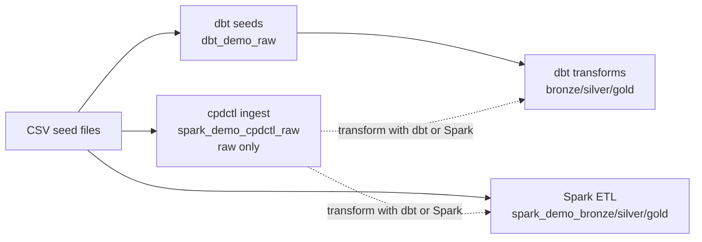
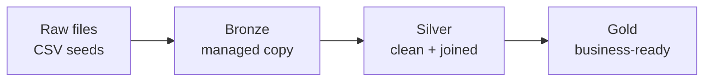
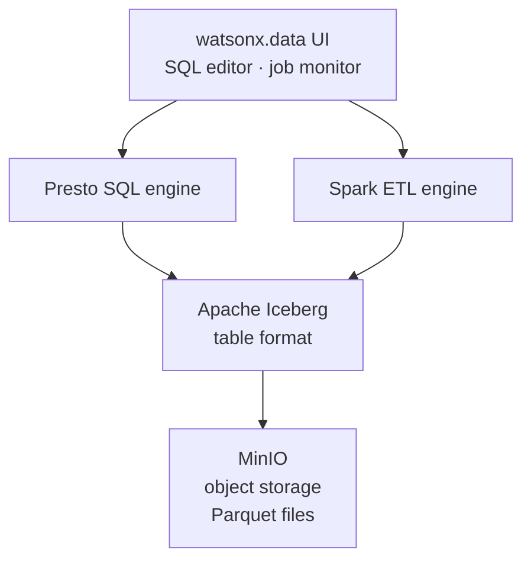

# Glossary

Short definitions for every term used in this workshop. Click any term in the nav to jump here.

---

### Bronze Layer

The first managed copy of raw data — ingested into the lakehouse with ingest metadata added, but not yet cleaned or joined.

In this demo, bronze is the first managed/transformed copy: `iceberg_data.dbt_demo_bronze` (dbt) and `iceberg_data.spark_demo_bronze` (Spark). cpdctl's `iceberg_data.spark_demo_cpdctl_raw` is **not** bronze — it is a raw ingest landing layer (like `dbt seed`) that becomes bronze only after a dbt or Spark transform. See [Raw Files Versus Raw Tables](#raw-files-versus-raw-tables).

!!! info "Plain English"
    Bronze = "we have it stored safely, with ingest metadata added — but only dbt and Spark produce it. cpdctl stops one step earlier, at raw."

---

### Catalog

A catalog is the top-level namespace that holds schemas and tables. Think of it as the name of a database server.

Every SQL query in this demo starts with `iceberg_data`, which is the Iceberg catalog registered in watsonx.data.

```sql
-- iceberg_data  = catalog
-- dbt_demo_gold = schema
-- gold_daily_sales    = table
SELECT *
FROM iceberg_data.dbt_demo_gold.gold_daily_sales;
```

!!! note
    The catalog is registered once in watsonx.data. The two full pipelines (dbt, Spark) and the cpdctl ingest loader all write into the same `iceberg_data` catalog.

---

### cpdctl

cpdctl is IBM's command-line interface for Cloud Pak for Data (CP4D). It lets you run jobs and pipelines from a terminal instead of the browser UI.

In this demo, cpdctl ingests CSV files directly into the `iceberg_data.spark_demo_cpdctl_raw` schema, bypassing dbt and Spark **for the load step only**. cpdctl is ingest-only (like `dbt seed`): it lands raw tables and stops. To build bronze/silver/gold on top, you run dbt or Spark over `spark_demo_cpdctl_raw` as a post-action (**cpdctl + dbt/Spark = one full pipeline**).

```bash
cpdctl dsjob run --job "ingest_customers" --project-id <project-id>
```

!!! tip
    cpdctl is useful when your organisation already has DataStage pipelines. You get UI-tracked lineage in CP4D without writing any extra SQL or Python.

---

### Customer 360

A Customer 360 is a single row per customer that combines all available signals — orders, returns, revenue, last activity — into one flat table or view.

In this demo, `gold_customer_360` is a VIEW in `iceberg_data.dbt_demo_gold` that aggregates completed, returned, pending, and cancelled orders together with lifetime value and last-activity timestamps.

!!! example
    One row in `gold_customer_360` looks like: customer 42, 12 completed orders, 1 return, LTV $1,240, last order 2026-03-15.

---

### dbt (data build tool)

dbt is an open-source tool that turns SQL `SELECT` statements into a full transformation pipeline — with dependency resolution, testing, and documentation built in.

In this demo, dbt connects to Presto through the `dbt-watsonx-presto` adapter and builds the `dbt_demo_raw`, `dbt_demo_bronze`, `dbt_demo_silver`, and `dbt_demo_gold` schemas from seed CSV files.

```bash
# Run all models
dbt run

# Run only silver and gold
dbt run --select silver+ gold+

# Test all models
dbt test
```

!!! info "Why dbt?"
    dbt is strong when your transformation logic is SQL. It gives you version-controlled, testable SQL that any analyst can read and modify.

---

### Gold Layer

The outermost, business-ready layer of the medallion architecture. Gold tables and views are optimised for reporting, dashboards, and downstream consumption.

In this demo, the gold layer lives in `iceberg_data.dbt_demo_gold`. `gold_daily_sales` is a physical TABLE (partitioned by `month(order_date)`; the partition metadata column is `order_date_month`); `gold_category_performance` and `gold_customer_360` are VIEWs.

| Object | Type | Purpose |
|---|---|---|
| `gold_daily_sales` | TABLE | Pre-aggregated daily revenue — fast for time-series dashboards |
| `gold_category_performance` | VIEW | Category revenue computed at query time |
| `gold_customer_360` | VIEW | Per-customer lifetime metrics computed at query time |

!!! tip
    Use a TABLE when readers query the same aggregation repeatedly. Use a VIEW when the aggregation is cheap and you want it to always reflect the latest silver data.

---

### Iceberg (Apache Iceberg)

Apache Iceberg is an open table format that adds a metadata layer on top of files in object storage, making them behave like proper database tables.

Without Iceberg, Presto and Spark would have to scan every file to answer a query. With Iceberg, they read a small metadata file first and skip irrelevant partitions. Iceberg also enables time travel, schema evolution, and safe concurrent writes.

```sql
-- Query a specific historical snapshot
SELECT *
FROM iceberg_data.dbt_demo_silver.silver_orders
FOR VERSION AS OF <snapshot_id>;
```

!!! info "Key Iceberg features used in this demo"
    - Partition pruning (Presto skips non-matching `order_date` partitions)
    - Time travel (query older snapshots)
    - Shared access (dbt, Spark, and cpdctl all read/write the same Iceberg tables safely)

---

### Ingestion

Ingestion is the act of moving raw source data into the lakehouse for the first time. After ingestion, data can be transformed by dbt or Spark.

This demo has two full pipelines (dbt, Spark) that ingest **and** transform, plus one ingest-only loader (cpdctl). dbt and Spark are each self-contained; cpdctl is an ingest front-end you pair with dbt or Spark (**cpdctl + dbt/Spark = full pipeline**). All target the same `iceberg_data` catalog:



---

### Lakehouse

A lakehouse is a data platform that combines cheap file-based storage (like a data lake) with structured SQL access and ACID guarantees (like a data warehouse).

In this demo, watsonx.data is the lakehouse. Files live in MinIO object storage, Apache Iceberg provides the table format, and Presto is the SQL engine that queries them.

!!! abstract "Lakehouse vs. Data Warehouse vs. Data Lake"

    | Trait | Data Lake | Data Warehouse | Lakehouse |
    |---|---|---|---|
    | Storage cost | Low | High | Low |
    | SQL support | Limited | Full | Full |
    | Open formats | Yes | No | Yes |
    | ACID transactions | No | Yes | Yes (Iceberg) |
    | Example | S3 + CSV | Redshift | watsonx.data |

---

### Medallion Architecture

Medallion architecture is a widely-used pattern for organising data quality layers in a lakehouse — raw files flow through bronze, silver, and gold, each layer adding more curation.



| Layer | Schema in this demo | What changes |
|---|---|---|
| Raw | `dbt_demo_raw` | Source-shaped, no transformation |
| Bronze | `dbt_demo_bronze` | Ingest metadata added, types cast |
| Silver | `dbt_demo_silver` | Joins applied, nulls handled, business keys aligned |
| Gold | `dbt_demo_gold` | Aggregated, partitioned, ready for dashboards |

!!! note
    In this demo, the Spark path skips a raw layer entirely — Spark reads CSV files directly from MinIO object storage and writes straight to `spark_demo_bronze`.

---

### MinIO

MinIO is an S3-compatible object storage system. It stores files (CSV seeds, Parquet data files, Spark application JARs) using the same API as Amazon S3.

In this demo, MinIO holds the raw CSV seed files and the Parquet data files that back every Iceberg table. The Spark engine also reads its PySpark application from a MinIO bucket.

```bash
# Example MinIO bucket path for an Iceberg data file
s3a://iceberg-bucket/dbt_demo_gold/gold_daily_sales/order_date_month=2026-03/data-00000.parquet
```

!!! info
    Because MinIO is S3-compatible, the same Spark and Iceberg code that works in AWS also works here — just swap the endpoint URL.

---

### OpenMetadata

OpenMetadata is an open-source data catalogue and lineage platform. It collects metadata from data sources and shows you what data exists, where it came from, and how it flows through your pipelines.

In this demo, OpenMetadata 1.13.0 runs locally in Docker at `http://localhost:8585`. After a `dbt run`, you push the dbt manifest to OpenMetadata to visualise column-level lineage from raw seeds through to gold models.

```bash
# Push dbt lineage to OpenMetadata
metadata ingest -c openmetadata_dbt.yaml
```

!!! tip
    Open `http://localhost:8585` in your browser after running the dbt demo to see the full lineage graph from `raw_customers` all the way to `gold_customer_360`.

---

### Parquet

Parquet is a columnar file format. Instead of storing rows left-to-right like a CSV, it stores each column together — which makes aggregation queries much faster and compresses well.

Every table in this demo is stored as Parquet. The format is enforced in `dbt_project.yml` and in the Spark ETL scripts. ORC is not used.

```yaml
# dbt_project.yml — enforcing Parquet
models:
  ibmas_watsonxdata_dbt:
    +file_format: parquet
```

!!! warning
    Do not mix Parquet and ORC within the same Iceberg table. This demo uses Parquet only. Attempting to write ORC into an existing Parquet Iceberg table will fail.

---

### Partitioning

Partitioning splits a table's files into sub-folders by a column value, so a query that filters on that column only reads the relevant files.

In this demo, `gold_daily_sales` is partitioned by `month(order_date)`. A query that filters on `order_date` lets Presto skip partition folders for months that don't match.

```sql
-- Presto uses partition pruning automatically
SELECT *
FROM iceberg_data.dbt_demo_gold.gold_daily_sales
WHERE order_date BETWEEN DATE '2026-03-01' AND DATE '2026-03-31';
-- Only reads the March 2026 partition folder
```

!!! info "File layout on MinIO"
    ```text
    gold_daily_sales/
      order_date_month=2026-01/  ← one Parquet file per month partition
      order_date_month=2026-02/
      order_date_month=2026-03/
    ```

    The `month()` Iceberg transform groups all rows for a calendar month into one folder.
    With 500 orders across 6 months (Jan–Jun 2026), there are 6 partition folders instead
    of 157 daily folders — keeping well within Presto's 100 simultaneous open-writer cap.

---

### Presto

Presto is a distributed SQL query engine that can query data in object storage (MinIO, S3) without copying it to a separate database. It is the primary SQL engine in watsonx.data.

In this demo, every dbt model runs as a Presto SQL statement. The watsonx.data SQL editor also uses Presto. The connection string is:

```text
ibm-lh-lakehouse-presto651-presto-svc.apps.watson.ibmas-zocp-techcluster.org:443
```

!!! note
    Presto is a read-and-transform engine. It does not store data itself — all data lives in MinIO as Parquet files. Iceberg is the layer that makes those files look like tables to Presto.

---

### Raw Files Versus Raw Tables

The raw files are the original CSV seed files (`seeds/raw_*.csv`). The raw tables are what dbt creates from those files in the `dbt_demo_raw` schema.

Spark does not need a raw schema because it reads CSV files directly from MinIO object storage. dbt needs raw tables because it works entirely through SQL.

| Source | Raw representation | First layer produced |
|---|---|---|
| dbt (full pipeline) | `dbt_demo_raw.raw_customers` (Iceberg table) | `dbt_demo_bronze.*` (transformed bronze) |
| Spark (full pipeline) | CSV files in MinIO bucket | `spark_demo_bronze.*` (transformed bronze) |
| cpdctl (ingest loader) | CSV files in MinIO bucket | `spark_demo_cpdctl_raw.*` (raw ingest — no transform; needs dbt/Spark to reach bronze) |

cpdctl is a loader, not a transform engine: its output (`spark_demo_cpdctl_raw`) corresponds to dbt's `dbt_demo_raw` seed layer, **not** to bronze. Only dbt and Spark continue past raw to transformed bronze/silver/gold.

---

### Schema

A schema is a namespace inside a catalog that groups related tables together. Think of it as a folder inside the catalog.

In this demo there are six schemas under `iceberg_data`:

```text
iceberg_data.dbt_demo_raw       ← dbt raw seeds
iceberg_data.dbt_demo_bronze    ← dbt bronze
iceberg_data.dbt_demo_silver    ← dbt silver
iceberg_data.dbt_demo_gold      ← dbt gold
iceberg_data.spark_demo_bronze        ← Spark bronze
iceberg_data.spark_demo_silver        ← Spark silver
iceberg_data.spark_demo_gold          ← Spark gold
iceberg_data.spark_demo_cpdctl_raw    ← cpdctl ingestion
```

---

### Semantic Model

A semantic model is a business-friendly description of data — it maps raw column names to business concepts, defines metrics, and can be consumed by BI tools without the analyst needing to know the underlying table structure.

In this demo, semantic models are defined in `models/semantic/` and describe how the gold layer tables map to business metrics like `lifetime_value` and `daily_revenue`.

!!! info
    Semantic models sit on top of the gold layer. They are the final abstraction before a dashboard or AI assistant queries your data.

---

### Silver Layer

The silver layer holds clean, joined, and deduplicated data. It is the shared foundation that gold models build on.

In this demo, silver lives in `iceberg_data.dbt_demo_silver` (dbt) and `iceberg_data.spark_demo_silver` (Spark). At this layer, orders are joined to customers, nulls are handled, and business keys are aligned.

!!! info "Silver is the most reused layer"
    Multiple gold models can read from the same silver table. Fixing a data quality issue in silver automatically improves every downstream gold model.

---

### Spark (Apache Spark)

Apache Spark is a distributed in-memory processing engine. It is strong for large-scale ETL, file-heavy transformations, and machine-learning workloads where pure SQL is not enough.

In this demo, the watsonx.data Spark engine runs a PySpark application stored in MinIO that reads CSV seeds and writes Parquet Iceberg tables into the `spark_demo_bronze/silver/gold` schemas.

```python
# Spark reading CSV and writing Iceberg
df = spark.read.option("header", True).csv("s3a://seeds-bucket/raw_orders.csv")
df.writeTo("iceberg_data.spark_demo_bronze.bronze_orders").createOrReplace()
```

!!! abstract "dbt vs. Spark — when to use which"

    | Criterion | dbt | Spark |
    |---|---|---|
    | Logic expressed as | SQL SELECT | Python / DataFrame API |
    | Best for | SQL governance, tested transforms | Large files, complex ETL, ML |
    | Runs on | Presto | watsonx.data Spark engine |
    | Lineage in OpenMetadata | Yes (dbt manifest) | Via Spark integration |

---

### Table

A table is the primary SQL object you query. In this demo, every physical table is an Apache Iceberg table stored as Parquet files in MinIO.

```sql
-- Physical table — data is pre-computed and stored on disk
SELECT order_date, category, net_revenue
FROM iceberg_data.dbt_demo_gold.gold_daily_sales
LIMIT 10;
```

!!! note
    `gold_daily_sales` is a TABLE. `gold_category_performance` and `gold_customer_360` are VIEWs. Tables are faster for repeated queries; views always reflect the latest silver data.

---

### Time Travel

Time travel is the ability to query an older snapshot of an Iceberg table — useful for auditing, debugging data pipelines, and recovering from bad writes.

Every time a dbt model or Spark job writes to an Iceberg table, Iceberg records a new snapshot. You can query any past snapshot by its ID.

```sql
-- Query the table as it was at a specific historical snapshot
SELECT *
FROM iceberg_data.dbt_demo_silver.silver_orders
FOR VERSION AS OF <snapshot_id>;

-- List all available snapshots
SELECT *
FROM iceberg_data.dbt_demo_silver."silver_orders$snapshots";
```

!!! tip
    Run `dbt run` twice with different seed data, then use time travel to compare the two versions of the table side by side.

---

### View

A view is a saved SQL query that looks like a table when you query it. It does not store its own copy of data — it re-runs the query every time you select from it.

In this demo, two gold objects are views:

```sql
-- gold_category_performance and gold_customer_360 are defined as VIEWs
-- dbt creates them with CREATE VIEW ... AS SELECT ...
SELECT *
FROM iceberg_data.dbt_demo_gold.gold_customer_360;
-- ^ this re-runs the underlying silver JOIN every time
```

!!! warning
    Views are convenient but can be slow on large datasets because they recompute on every query. For high-frequency dashboard queries, prefer a materialised TABLE like `gold_daily_sales`.

---

### watsonx.data

watsonx.data is IBM's managed lakehouse platform. It combines Presto (SQL), Apache Spark (ETL), Apache Iceberg (table format), and MinIO-compatible object storage into one governed environment running on OpenShift.

In this demo, the watsonx.data instance runs on IBM OpenShift at:

```text
ibm-lh-lakehouse-presto651-presto-svc.apps.watson.ibmas-zocp-techcluster.org:443
```



!!! info "Why watsonx.data?"
    It lets you run open-standard tools (Presto, Spark, Iceberg) with enterprise governance, unified metadata, and IBM support — all on your own OpenShift cluster, no AWS required.
