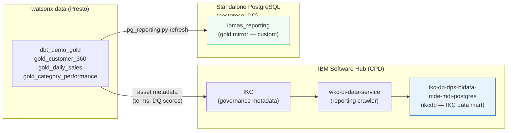

# IKC Reporting — Optional Setup

!!! abstract "What this page covers"
    **IBM Knowledge Catalog (IKC) reporting** lets CPD push asset metadata — glossary terms,
    classifications, data quality scores, profiling results — into an **external reporting database**
    so you can query them with BI tools or run custom SQL.  This is an *optional* step; the rest of
    the workshop runs fine without it.  If your CPD instance is registered as **watsonx.data
    Intelligence Enterprise**, this is the door to the `generate_reporting_sql_query` /
    `execute_reporting_select_query` MCP tools.

!!! info "IBM docs reference"
    This page implements the procedure described in
    [Configuring reporting settings for IBM Knowledge Catalog](https://www.ibm.com/docs/en/software-hub/5.3.x?topic=administering-configuring-reporting-settings).

---

## Prerequisites

| Requirement | Details |
|---|---|
| CPD / IBM Software Hub | `wkc-cr` license = `Enterprise` |
| Role | Cluster administrator **or** Instance administrator |
| `oc` CLI | Logged in (`oc login …`); current context = the CPD cluster |
| `.env` | `WXD_OPENSHIFT_NAMESPACE` set (default: `cpd-instance`) |

Verify the license and your cluster login before running anything:

```bash
oc -n cpd-instance get wkc wkc-cr \
  -o jsonpath='{.spec.license}' && echo

oc whoami --show-server
```

Expected:

```text
{"accept":true,"license":"Enterprise"}
https://api.<your-cluster>:6443
```

!!! warning "Enterprise license required"
    `generate_reporting_sql_query` and `execute_reporting_select_query` are guarded by the
    `manage_reporting` CPD permission.  If the WKC CR shows `"license":"Standard"` or
    `"license":"Base"`, the reporting data mart is not activated and both MCP tools will return
    `IKCBI2019E`.

---

## What the script does

`scripts/configure_ikc_reporting.sh` automates the full
IBM docs procedure end-to-end:

| Step | Action |
|---|---|
| 1 | Patches `ccs-features-configmap` with the chosen `enforceAuthorizeReporting` / `defaultAuthorizeReporting` values |
| 2 | Verifies `ibm-cpd-ccs-operator` is running (scales up if replicas = 0) |
| 3 | Patches `wkc-cr` with `dummyone=true` to trigger CCS reconciliation |
| 4 | Patches `wkc-cr`: `wkc_term_assignment_ta_rules_allow_regex=true` |
| 5 | Patches `wkc-cr`: `wdp_profiling_load_record_count=true` |
| 6 | Polls `ccs-cr` until `ccsStatus=Completed` (max 10 min) |
| 7 | Rolling-restarts the 7 pods required by IBM docs |
| 8 | Force-deletes `metadata-discovery` and `wkc-metadata-imports-ui` pods (stateless; their deployments recreate them immediately) |
| 9 | Waits for all rollouts to finish |
| 10 | Verifies `ENFORCE_AUTHORIZE_REPORTING` / `DEFAULT_AUTHORIZE_REPORTING` live values on `ngp-projects-api` and `catalog-api`; fixes hardcoded literals by wiring `configMapKeyRef` if needed |

---

## Reporting modes

The two flags control the **"Allow reporting on asset metadata"** toggle that appears in every
project, catalog, and category.

| `enforceAuthorizeReporting` | `defaultAuthorizeReporting` | Effect |
|---|---|---|
| `false` | `false` | Toggle is **off** by default; collaborators can switch it on (IBM default) |
| `false` | `true` | Toggle is **on** by default; collaborators can switch it off **(recommended for demos)** |
| `true` | `true` | Toggle is **on** and **locked** — collaborators cannot disable it (maximum reporting) |

---

## Running the script

### Recommended: enforce=false, default=true

New projects/catalogs report by default but collaborators can opt out.

```bash
bash scripts/configure_ikc_reporting.sh
```

### Lock all reporting on (enforce=true, default=true)

```bash
bash scripts/configure_ikc_reporting.sh --enforce
```

### Preview without changing anything

```bash
bash scripts/configure_ikc_reporting.sh --dry-run
bash scripts/configure_ikc_reporting.sh --enforce --dry-run
```

### Patch only — skip pod restarts (pods already running)

```bash
bash scripts/configure_ikc_reporting.sh --enforce --skip-restart
```

### Revert to IBM defaults (both false)

```bash
bash scripts/configure_ikc_reporting.sh --disable
```

### Full option reference

| Option | Default | Description |
|---|---|---|
| `--enforce` | off | Sets `enforceAuthorizeReporting=true` (both flags become `true`) |
| `--disable` | off | Reverts both flags to `false` |
| `--skip-restart` | off | Skips all pod restarts and pod deletions (steps 7-9) |
| `--namespace NS` | `cpd-instance` (or `WXD_OPENSHIFT_NAMESPACE`) | CPD operands namespace |
| `--operators-ns NS` | `cpd-operators` | Namespace where `ibm-cpd-ccs-operator` lives |
| `--dry-run` | off | Print what would happen; change nothing |
| `-h`, `--help` | — | Usage summary |

---

## Verifying the result

After the script completes, confirm live values directly from the running pods:

```bash
# ngp-projects-api (UPPER_CASE names)
oc set env -n cpd-instance deployment/ngp-projects-api --list | grep -i reporting
# expected:
#   DEFAULT_AUTHORIZE_REPORTING=true
#   ENFORCE_AUTHORIZE_REPORTING=true   (or false if you ran without --enforce)

# catalog-api (camelCase names)
oc set env -n cpd-instance deployment/catalog-api --list | grep -i reporting
# expected:
#   defaultAuthorizeReporting=true
#   enforceAuthorizeReporting=true

# wkc-cr extra spec fields
oc -n cpd-instance get wkc wkc-cr \
  -o jsonpath='{.spec.wkc_term_assignment_ta_rules_allow_regex}{" "}{.spec.wdp_profiling_load_record_count}' \
  && echo
# expected: true true
```

---

## Troubleshooting

### `IKCBI2008E: Tenant not registered for reporting data`

The IKC reporting data mart has never been initialised for this CPD instance.
Check the `wkc-bi-data-service` logs:

```bash
oc -n cpd-instance logs deployment/wkc-bi-data-service --since=10m \
  | grep -E "IKCBI|Tenants to Crawl"
```

If you see `Tenants to Crawl - []`, the tenant setup job has not run.
Trigger it via **CPD UI → Knowledge Catalog → Administration → Reporting → Set up**, or wait for
`wkc-bi-data-service` to fully restart after the script completes and try again.

### `IKCBI2019E: Permission check …`

The `manage_reporting` permission is not in the user's session cache.  Grant the role and restart
the service so the cache is flushed:

```bash
# Grant role (replace cpadmin with the affected user)
CPD_HOST="$(grep WXD_CPD_HOST .env | cut -d= -f2)"
TOKEN="$(.venv/bin/python scripts/get_token.py)"

curl -sk -X PUT "https://${CPD_HOST}/icp4d-api/v1/users/cpadmin" \
  -H "Authorization: Bearer ${TOKEN}" \
  -H "Content-Type: application/json" \
  -d '{"user_roles":["zen_administrator_role","wkc_reporting_administrator"]}' \
  | python3 -m json.tool | grep -E "status|message"

# Restart the service to flush its permission cache
oc -n cpd-instance rollout restart deployment/wkc-bi-data-service
oc -n cpd-instance rollout status  deployment/wkc-bi-data-service --timeout=180s
```

### `ccs-cr` stuck in `InProgress` / never `Completed`

The CCS operator reconciliation can take several minutes.  Poll manually:

```bash
watch -n 15 "oc -n cpd-instance get ccs ccs-cr"
```

If it stays `InProgress` for more than 15 minutes, check the CCS operator logs:

```bash
oc -n cpd-operators logs deployment/ibm-cpd-ccs-operator --since=20m | tail -40
```

### `ngp-projects-api` still shows `ENFORCE_AUTHORIZE_REPORTING=False` after restart

The deployment may have hardcoded literals instead of a `configMapKeyRef`.  Run the script
with `--skip-restart` to re-trigger the step-10 env-var check and patch:

```bash
bash scripts/configure_ikc_reporting.sh --enforce --skip-restart
```

### Volume warnings on `catalog-api`

```text
Warning: volume "wdp-certs" (Projected) has no sources provided
Warning: volume "wdp-certs" (Projected): overlapping paths …
```

These are pre-existing Projected volume warnings in the `catalog-api` deployment spec and are
**harmless** — the pod starts and serves requests normally.  They appear on every `rollout restart`
of `catalog-api` and are unrelated to reporting configuration.

---

## How it fits with the rest of the demo

The IKC reporting setup is **independent** of the dbt medallion pipeline.  The demo's gold marts
(`gold_customer_360`, `gold_daily_sales`, `gold_category_performance`) live in the
`dbt_demo_gold` schema in watsonx.data/Presto.  IKC reporting reads **metadata** (glossary terms,
profiling scores, classifications) — not the gold table data — and pushes it to its own internal
EDB PostgreSQL data mart (`ikcdb` in the `ikc-dp-dps-bidata-mde-mdi-postgres` EDB cluster).

The PostgreSQL reporting database provisioned by
`scripts/provision_pg_reporting.sh` and queried by
`scripts/pg_reporting.py` is a **separate, custom** reporting
schema (`ibmas_reporting`) that mirrors the gold mart data — it is not the IKC data mart.



!!! tip "Re-run is idempotent"
    The script checks the live resolved values before patching — if everything is already correct
    it skips cleanly.  Safe to run as many times as needed.
