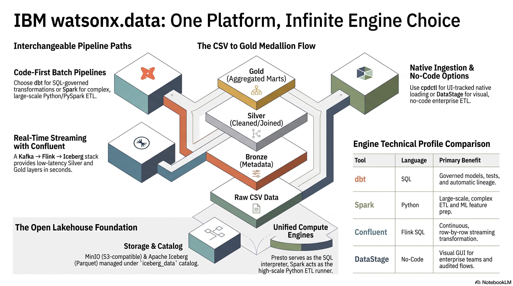
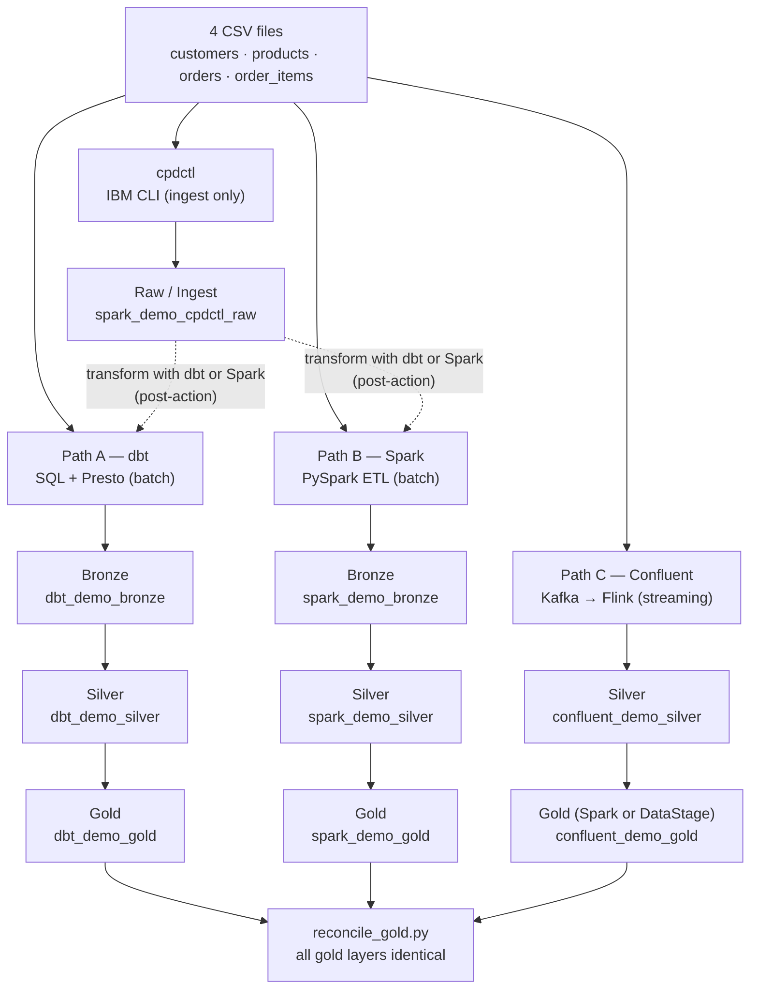
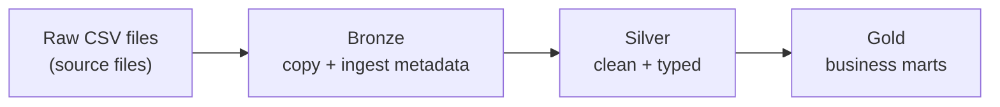

<section class="hero">
  IBM watsonx.data · Medallion Workshop
  <h1>Three full pipelines and one native loader — build a medallion with dbt, Spark, or Confluent streaming</h1>
  

    A hands-on workshop for anyone new to watsonx.data. dbt, Spark, and Confluent (Kafka → Flink →
    Iceberg) are three interchangeable, full medallion pipelines; cpdctl is an ingestion-only loader
    (like dbt seed) you pair with dbt or Spark. You load the same four CSV files and prove all three
    paths reach the identical Gold. Then an optional <strong>Enterprise</strong> track shows the IBM
    upgrades — watsonx.data Intelligence and Integration. No prior experience required.
  

  

    <a class="primary" href="setup/">Start Preparation</a>
    <a href="presentation/">View the Deck</a>
    <a href="lineage/">See Architecture</a>
    <a href="dbt-demo/">Run dbt</a>
    <a href="spark-demo/">Run Spark</a>
    <a href="confluent-demo/">Run Confluent</a>
    <a href="fast-track/">All Commands</a>
  

</section>

Built on

<figure markdown="span">
  { loading=lazy }
  <figcaption>One platform, many engines. The same CSVs flow Raw → Bronze → Silver → Gold, built by dbt, Spark, or Confluent streaming (and loaded by cpdctl or transformed no-code by DataStage) — all on the open lakehouse (MinIO · Iceberg/Parquet · Presto · Spark · <code>iceberg_data</code> catalog).</figcaption>
</figure>

## The tools at a glance

New to this stack? Here is each tool in one line — what it is, and when you reach for it.

| Tool | In one line | Reach for it when… |
|------|-------------|--------------------|
| **dbt** | SQL transforms that run on the Presto engine | Your logic fits in `SELECT` and you want tests, docs, and lineage for free |
| **Spark** | Python (PySpark) ETL that runs on the Spark engine | Data is large, or the logic needs Python/ML/streaming/custom parsing |
| **Confluent** | Streaming medallion: Kafka → Flink SQL → Iceberg | Data arrives continuously and you want Silver/Gold within seconds |
| **DataStage** | No-code visual ETL that builds the gold marts | An enterprise GUI team wants the same Gold without writing code |
| **cpdctl** | An ingestion-only loader (like `dbt seed`) | You want a fast, no-code raw load that shows up in the watsonx.data UI history |
| **Iceberg** | The open table format — i.e. the storage | Always — every table here is an Iceberg table, whichever tool wrote it |
| **watsonx.data** | The lakehouse platform that ties it all together | Always — it provides the catalog, the engines, and the object storage |

**dbt, Spark, and Confluent are three interchangeable full pipelines**; **cpdctl only loads raw
data** and is paired with one of them; **DataStage** is the no-code engine for the Confluent gold
build. **Airflow, Metabase, and OpenMetadata are optional open-source add-ons** (orchestration, BI,
lineage) — skip them on a first pass. The optional **[Enterprise](enterprise/overview.md)** tab maps
each open-source tool to its IBM upgrade (watsonx.data Intelligence & Integration). Not sure which to
run? See [When to use which](choosing.md).

## What you will learn

!!! info "Workshop learning goals"
    By the end of this workshop you will be able to:

    - Explain what watsonx.data is and how its parts (catalog, engines, object storage) fit together
    - Describe three full medallion engines (dbt, Spark, Confluent streaming) plus the cpdctl loader, and choose the right one for a given workload
    - Run a governed SQL pipeline with dbt and Presto, including tests and lineage
    - Run a distributed Python ETL job with Spark and verify its output with SQL
    - Stream data through Kafka → Flink → Iceberg and prove all three gold layers match
    - Map each open-source tool to its IBM enterprise upgrade (watsonx.data Intelligence & Integration)

## What we are building

A small online shop has four CSV files: customers, products, orders, and order items — 1,704 rows
in total (50 customers, 20 products, 500 orders, 1,134 order items). Three of the paths (dbt, Spark,
and Confluent) are full medallion engines: each takes the CSVs all the way to Bronze/Silver/Gold (in
`dbt_demo_*`, `spark_demo_*`, and `confluent_demo_*` respectively). cpdctl is an ingestion-only
loader — like `dbt seed` — that lands the raw CSVs in `spark_demo_cpdctl_raw` and stops there; you
turn that into a medallion by running dbt or Spark over it. At the end, you prove **all three gold
layers are identical** with `scripts/reconcile_gold.py`.

## The paths at a glance

Every path reads the same source files and produces Iceberg tables in Parquet format. The
difference is which tool drives the work and what governance features come with it.

| Path | Tool | Language | Batch or streaming | Best for |
|------|------|----------|--------------------|----------|
| A — dbt | dbt + Presto | SQL | Batch | Governed analytics, built-in tests, column lineage |
| B — Spark | PySpark on watsonx.data Spark engine | Python | Batch | Large files, distributed ETL, complex transformations |
| C — Confluent | Kafka + Flink SQL → Iceberg | Flink SQL (+ Spark/DataStage gold) | **Streaming** | Continuous data, low-latency Silver/Gold |
| D — DataStage | IBM DataStage flow | No-code GUI | Batch | Enterprise visual ETL for the gold build |
| cpdctl | IBM CLI (`cpdctl`) | Shell | Batch load | Native UI-tracked raw ingestion, no code |

dbt, Spark, and Confluent write full medallions to `dbt_demo_*`, `spark_demo_*`, and
`confluent_demo_*`; cpdctl writes only raw tables to `spark_demo_cpdctl_raw`. The three full paths
are proven identical at the gold layer with `scripts/reconcile_gold.py`.

!!! note "Why several paths instead of one?"
    Real teams choose different tools for different reasons — latency, file size, skill set,
    governance, or whether ingestion needs to show in the UI. dbt, Spark, and Confluent are
    complete, interchangeable pipelines; cpdctl is an ingestion loader (like `dbt seed`) you pair
    with dbt or Spark. The whole point of the demo is that **the business logic, not the tool,
    defines the result** — every engine reaches the same gold.

## The medallion pattern

The medallion pattern is a way to organize data by quality level, moving from raw files to
production-ready analytics tables in three named layers. Each layer adds something the previous
one lacked — metadata, type safety, or business logic. The dbt and Spark paths follow the full
Bronze → Silver → Gold progression. cpdctl ingests only the Raw layer (`spark_demo_cpdctl_raw`); to
carry it through Bronze → Silver → Gold you run dbt or Spark transformations on the ingested data.

| Layer | Plain-English meaning | What is added |
|-------|-----------------------|---------------|
| Raw | The original CSV files exactly as exported from the shop system | Nothing — this is the starting point |
| Bronze | A first managed copy in the lakehouse | Ingest timestamp, source file name, batch ID |
| Silver | Clean, typed, validated business entities | Proper dates, numeric types, status enums, deduplication |
| Gold | Pre-aggregated answers to business questions | Daily sales totals, category rankings, customer lifetime value |

!!! tip "Table vs. view in the gold layer"
    In the dbt path, `gold_daily_sales` is a physical **table** (data stored on disk). The other
    two gold objects — `gold_category_performance` and `gold_customer_360` — are **views** (saved
    queries that re-run on demand). The Spark path writes all gold outputs as physical Iceberg
    tables. Both approaches are valid; the dbt mix shows how you choose per use case.

## Workshop flow

Work through the pages in this order. Each step builds on the last.

1. **Prepare** ([setup.md](setup.md)) — ~15 min
   Install Python dependencies, configure the watsonx.data connection, and verify access to the
   Presto endpoint at `ibm-lh-lakehouse-presto651-presto-svc.apps.watson.ibmas-zocp-techcluster.org:443`.

2. **Understand the architecture** ([lineage.md](lineage.md)) — read only
   See the full column-by-column lineage and how schemas relate. Then skim
   [Table Formats](table-formats.md) (Iceberg vs Parquet vs Delta) and, for the streaming path,
   [Streaming Medallion Explained](streaming-medallion.md).

3. **Run Path A: dbt** ([dbt-demo.md](dbt-demo.md)) — ~20 min
   Create schemas, load seeds into `dbt_demo_raw`, build Bronze/Silver/Gold models, run dbt
   tests, and query the gold layer.

4. **Run Path B: Spark** ([spark-demo.md](spark-demo.md)) — ~15 min
   Upload the PySpark job and CSV files to MinIO, submit the job to the watsonx.data Spark engine,
   and verify the `spark_demo_*` schemas.

5. **Run Path C: Confluent streaming** ([confluent-demo.md](confluent-demo.md)) — ~20 min
   Bring up the Kafka + Flink + Iceberg stack, stream the CSVs through raw → silver topics, sink to
   Iceberg, and build gold with Spark (or [DataStage](datastage-demo.md), Path D).

6. **(Optional) Run cpdctl** ([ingestion.md](ingestion.md)) — ~10 min
   Use the IBM CLI to ingest the CSV files via the native watsonx.data ingestion API (raw load only),
   then check the ingestion history in the UI. Build a medallion by running dbt or Spark over
   `spark_demo_cpdctl_raw` afterward.

7. **Compare results with SQL** ([sql-demo.md](sql-demo.md))
   Run side-by-side queries across the dbt, Spark, and Confluent gold schemas — or run
   `scripts/reconcile_gold.py` to prove all three are identical.

8. **(Optional) Explore lineage in OpenMetadata** ([openmetadata.md](openmetadata.md))
   Visualize the dbt lineage graph from seed tables through to gold marts.

9. **(Optional) See the enterprise upgrades** ([enterprise/overview.md](enterprise/overview.md))
   How watsonx.data Intelligence (catalog, Manta lineage, data quality, masking) and Integration
   (DataStage, StreamSets, Databand) extend what you just built — with an honest comparison.

!!! tip "In a hurry?"
    Every command in the workshop, in order, lives on one page: [Fast Track](fast-track.md).

!!! warning "Complete the setup page before running any path"
    Paths A, B, and C all require a working connection profile and Python environment. Skipping
    the setup page is the most common reason commands fail.

## The words you will keep seeing

  

    <h3>watsonx.data</h3>
    
IBM's lakehouse platform — the environment where this workshop runs. It provides the catalog (index of all tables), query engines, and object storage access in one place.

  

  

    <h3>Iceberg</h3>
    
The open table format used for every table in this workshop. It gives plain Parquet files database features: safe updates, snapshot history, and partition management.

  

  

    <h3>Presto</h3>
    
The SQL query engine built into watsonx.data. dbt sends SQL to Presto, Presto executes it against the Iceberg catalog, and results come back as a result set.

  

  

    <h3>dbt</h3>
    
A tool that turns SQL SELECT statements into managed data pipelines. You write each transformation as a <code>.sql</code> file; dbt runs them in the right order, tests them, and tracks lineage.

  

  

    <h3>Spark</h3>
    
A distributed processing engine that runs Python (PySpark) jobs across multiple workers. Used in Path B to read CSV files from MinIO and write Iceberg tables.

  

  

    <h3>cpdctl</h3>
    
The IBM Cloud Pak for Data CLI. In Path C it calls the watsonx.data ingestion API directly, producing an ingestion job that appears in the platform UI history.

  

